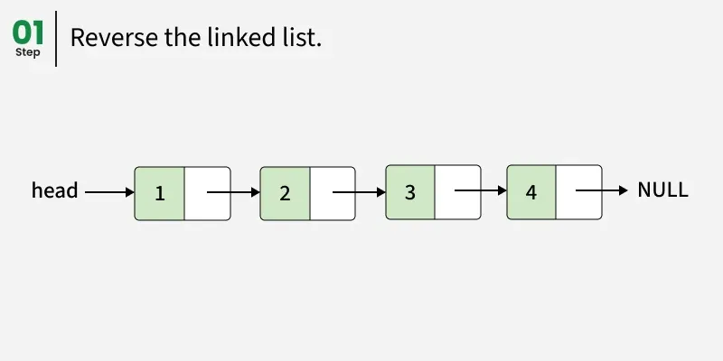
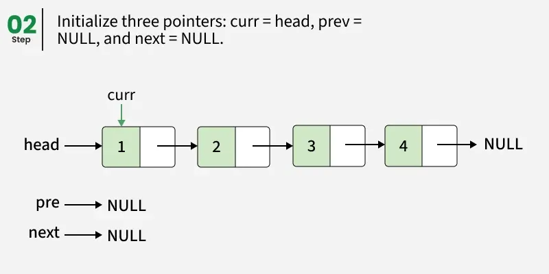
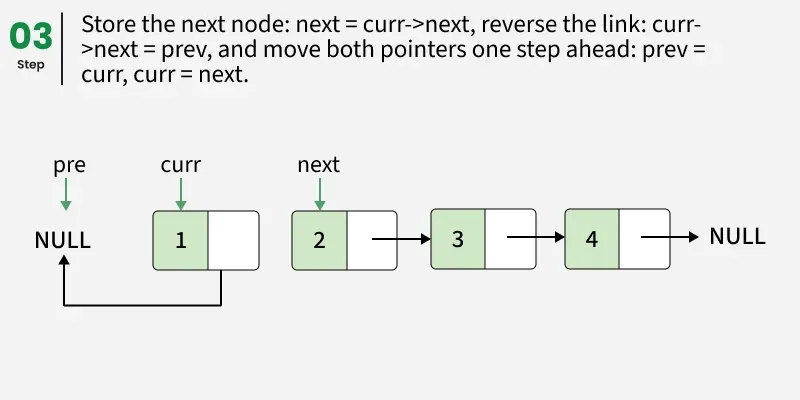
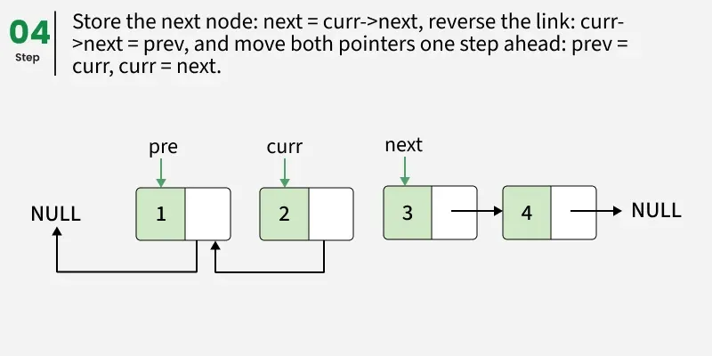
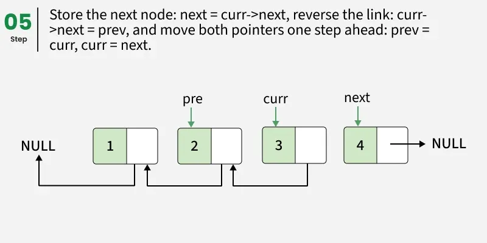
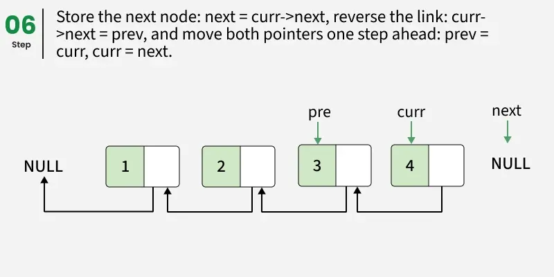
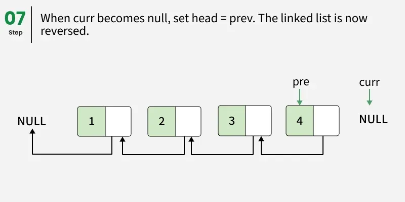
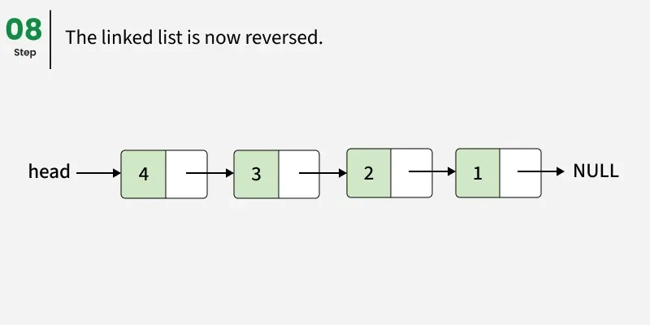
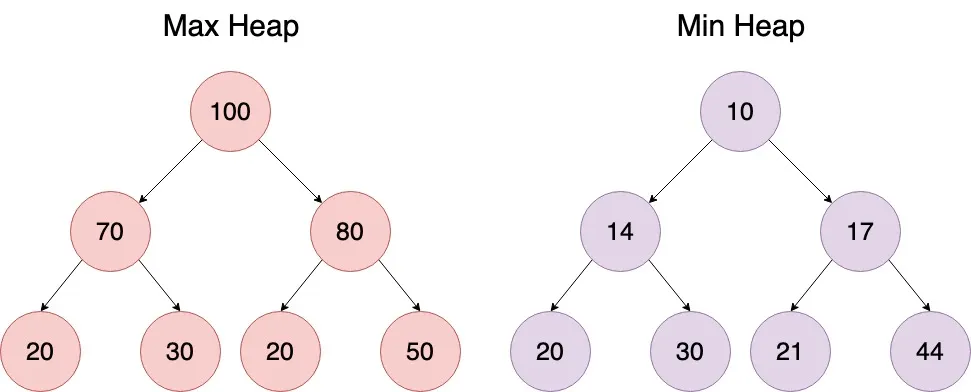

# Leetcode problems

This module should contain leetcode problems, solutions, and tests.

## Solutions
1. [Two pointers](#1-two-pointers)
2. [Fast and slow pointers](#2-fast-and-slow-pointers)
3. [Sliding Window](#3-sliding-window)
4. [Intervals](#4-intervals)
5. [In-Place Reversal of a Linked List](#5-in-place-reversal-of-a-linked-list)
6. [Two Heaps](#6-two-heaps)

---
### 1. Two pointers

The Two-Pointers Technique is a simple yet powerful strategy where you use two indices (pointers) that traverse a data structure - such as an array, list, or string - either toward each other or in the same direction to solve problems more efficiently.

#### 1.1. Idea
The idea of this technique is to begin with two corners of the given array. We use two index variables <b>left</b> and <b>right</b> to traverse from both corners.

Initialize: left = 0, right = n - 1

Run a loop while <b>left</b> < <b>right</b>, do the following inside the loop

* Compute current sum, <b>sum</b> = arr[left] + arr[right]
* If the <b>sum</b> equals the <b>target</b>, we’ve found the pair.
* If the <b>sum</b> is less than the <b>target</b>, move the <b>left</b> pointer to the right to increase the <b>sum</b>.
* If the <b>sum</b> is greater than the <b>target</b>, move the <b>right</b> pointer to the left to decrease the <b>sum</b>.

#### 1.2. Illustration


#### 1.3. Complexity

Time: O(n)<br/>
Space: O(1)

#### 1.4. When to Use Two Pointers:
* <b>Sorted Input</b> : If the array or list is already sorted (or can be sorted), two pointers can efficiently find pairs or ranges. Example: Find two numbers in a sorted array that add up to a target.
* <b>Pairs or Subarrays</b> : When the problem asks about two elements, subarrays, or ranges instead of working with single elements. Example: Longest substring without repeating characters, maximum consecutive ones, checking if a string is palindrome.
* <b>Sliding Window Problems</b> : When you need to maintain a window of elements that grows/shrinks based on conditions. Example: Find smallest subarray with sum ≥ K, move all zeros to end while maintaining order.
* <b>Linked Lists (Slow–Fast pointers)</b> : Detecting cycles, finding the middle node, or checking palindrome property. Example: Floyd’s Cycle Detection Algorithm (Tortoise and Hare).

#### 1.5. How to detect it should be used

* <b>The input is sorted</b> : A sorted array or list is the clearest signal — opposite-end traversal can find pairs or validate ranges in one pass. Example: merge sorted array (#88), search insert position (#35).
* <b>"Find a pair / two elements"</b> : Any problem asking for two indices or values that satisfy a condition (sum, difference, product) is a direct match. Example: two sum (#1).
* <b>"In-place" or "O(1) extra space"</b> : When the problem forbids auxiliary data structures, two pointers let you shift, overwrite, or partition the array without allocating memory. Example: remove duplicates (#26), remove element (#27).
* <b>Comparing from both ends</b> : Problems that check symmetry or mirroring — palindromes, balanced strings — are solved by converging left and right pointers. Example: valid palindrome (#125).
* <b>Merging two sorted sequences</b> : When two sorted arrays or lists need to be combined in-place or in a single traversal, one pointer per sequence keeps the merge linear. Example: merge sorted array (#88).
* <b>Keywords to watch for</b> : "sorted", "in-place", "without extra space", "pair that sums to", "palindrome", "merge two sorted", "remove duplicates", "partition".

---
### 2. Fast and slow pointers
<sub>[Back to solutions](#Solutions)</sub>

Similar to the two pointers pattern, the fast and slow pointers pattern uses two pointers to traverse an iterable data structure, but at different speeds, often to identify cycles or find a specific target. The speeds of the pointers can be adjusted according to the problem statement. The two pointers pattern focuses on comparing data values, whereas the fast and slow pointers method is typically used to analyze the structure or properties of the data.

#### 2.1. Idea

The key idea is that the pointers start at the same location and then start moving at different speeds. The slow pointer moves one step at a time, while the fast pointer moves by two steps. Due to the different speeds of the pointers, this pattern is also commonly known as the <b>Hare and Tortoise algorithm</b>, where the Hare is the fast pointer while Tortoise is the slow pointer. If a cycle exists, the two pointers will eventually meet during traversal. This approach enables the algorithm to detect specific properties within the data structure, such as cycles, midpoints, or intersections.

#### 2.2. Illustration


#### 2.3. Complexity
Time: O(n)<br/>
Space: O(1)

##### 2.3.1. Why O(n) time:

* No cycle — the fast pointer hits null after traversing at most n nodes (it skips every other node, so at most n/2 steps, still O(n))<br/>
* Cycle exists — once both pointers are inside the cycle, the fast pointer gains one step on the slow pointer per iteration. The cycle length is at most n, so they meet within n more steps → still O(n) total<br/>
* Finding the middle — fast reaches the end after n/2 steps → O(n)<br/>
* Intersection of two lists — each pointer walks at most m + n nodes before meeting → O(m + n)

##### 2.3.2. Why O(1) space:

Only two pointer variables (slow, fast) are maintained regardless of list size. No auxiliary data structure (array, set, map) is ever allocated. This is the key advantage over the hash-set alternative — for example, hasCycle2 in LinkedListCycle.java solves the same problem in O(n) space by storing visited nodes in a HashSet.

#### 2.4. How to detect it should be used

* <b>Input is a linked list</b> : Fast/slow pointers are the primary tool for linked-list structural problems because you can't index directly into a list and often must use O(1) space. Example: linked list cycle (#141), intersection of two linked lists (#160).
* <b>"Cycle" or "loop" in the problem title or constraints</b> : Detecting whether a cycle exists, and finding where it starts, is the textbook use case for Floyd's Tortoise and Hare algorithm. Example: linked list cycle (#141).
* <b>Finding the middle without knowing the length</b> : When the slow pointer reaches the end, the fast pointer is at the midpoint — useful before reversing the second half for a palindrome check.
* <b>Two lists of different lengths need to meet</b> : If both pointers swap to the other list's head on reaching null, they meet after exactly m + n steps regardless of individual lengths. Example: intersection of two linked lists (#160).
* <b>"Nth node from the end" or "remove kth from end"</b> : Advance the fast pointer N steps first, then move both together — when fast hits null, slow is exactly at the target.
* <b>O(1) space required on a linked list</b> : Hash-set alternatives work but use O(n) space; fast/slow pointers solve the same problems in constant space. Example: `hasCycle2` in linked list cycle (#141) shows the hash-set contrast.
* <b>Keywords to watch for</b> : "linked list", "cycle", "loop", "circular", "middle node", "intersection", "nth from end", "detect", "Floyd".

---

### 3. Sliding Window
<sub>[Back to solutions](#Solutions)</sub>

Imagine you have a tray of 10 cookies and want to find the most chocolate chips in any 3 cookies next to each other. Using a naive approach, you’d stand at each cookie and count its chocolate chips along with those of its immediate left and right neighbors to form every possible group of 3. This means repeating the counting process for each cookie, which quickly becomes inefficient as the number of cookies grows.

#### 3.1. Idea

We can avoid this hassle by using a smarter approach. Instead of recounting the chips for each group from scratch, you start by counting the chips in the first 3 cookies. Then, as you move to the next group, you simply subtract the chips from the cookie you leave behind and add the chips from the new cookie you include.

Consider the following steps:

1. Count the chips in the first three cookies. This is your starting total—and your initial “best so far.”
2. Slide the window one cookie to the right:
    1. Subtract the chips from the cookie that just slipped out of the window.
    2. Add the chips from the fresh cookie that slid into view.
3. If this new sum tops your current record, replace it with the initial “best so far”.
4. Repeat the above steps for each group of three cookies, all the way to the last one.

By updating the total in constant time with each slide, you find the group of neighboring cookies with maximum chocolate chips without ever recounting the entire window—a perfect illustration of the sliding-window technique.

#### 3.2. Illustration


#### 3.3. Complexity

Time: O(n)<br/>
Space: O(1) or O(k)

##### 3.3.1. Why O(n) time:

Each element is touched at most twice — once when the right pointer expands the window over it, and once when the left pointer shrinks past it. Despite looking like a nested loop, the total pointer movements across the entire run is bounded by 2n → O(n).

##### 3.3.2. Why the space depends on window type:

There are two variants:

* Fixed-size window (like the cookie example in the README) — only a running sum and a max variable are needed → O(1) space
* Dynamic/variable window — the window grows and shrinks based on a condition (e.g. "longest substring without repeating characters"), which typically requires a HashMap or HashSet to track what's currently inside the window → O(k) space, where k is the number of distinct elements in the window (≤ alphabet size, so often treated as O(1) for fixed alphabets, or O(n) worst case for arbitrary inputs)

#### 3.4. How to detect it should be used

* <b>"k consecutive elements" or "subarray of size k"</b> : Any mention of a fixed-length contiguous segment is the clearest signal for a fixed window — slide it one step at a time and update the aggregate in O(1). Classic example: maximum average subarray of size k (#643), best time to buy and sell stock (#121).
* <b>"Longest / shortest subarray or substring"</b> : When the problem asks for the optimal-length contiguous segment under a constraint (sum ≥ target, no repeating characters, at most k distinct elements), use a variable window: expand right to grow toward the constraint, shrink left once it is satisfied. Classic example: longest substring without repeating characters (#3), minimum size subarray sum (#209).
* <b>You can see an O(n²) brute force with two nested loops</b> : If the naive solution tries every (start, end) pair, sliding window is the O(n) upgrade — it avoids recomputing the inner loop by maintaining a running aggregate that is updated in constant time with each slide.
* <b>The condition is monotone as the window grows</b> : Sliding window works when making the window larger always pushes the aggregate in one direction (adding elements only increases the sum, only increases distinct count, etc.), so you know exactly when to stop growing and start shrinking.
* <b>Elements must be contiguous</b> : This is the key differentiator from two pointers — sliding window only applies when the answer involves adjacent elements. If the problem lets you pick any two elements regardless of position, two pointers is the right pattern instead.
* <b>Keywords to watch for</b> : "subarray", "substring", "contiguous", "consecutive", "window of size k", "longest", "shortest", "minimum length", "maximum sum", "at most k distinct", "no repeating".

---

### 4. Intervals
<sub>[Back to solutions](#Solutions)</sub>

The Interval pattern is a powerful way to reason about problems involving ranges of values, whether time spans, numeric ranges, or geometric spans. Each interval is defined by a start and an end; for example, [10,20] represents everything from 10 through 20.

> [!NOTE]
> Two intervals overlap if the start of one is less than or equal to the end of the other.

#### 4.1. Idea
Interval questions are a subset of array questions where you are given an array of two-element arrays (an interval) and the two values represent a start and an end value. Interval questions are considered part of the array family but they involve some common techniques hence they are extracted out to this special section of their own.

An example interval array: [[1, 2], [4, 7]].

Interval questions can be tricky to those who have not tried them before because of the sheer number of cases to consider when they overlap.

Corner cases:
* No intervals
* Single interval
* Two intervals
* Non-overlapping intervals
* An interval totally consumed within another interval
* Duplicate intervals (exactly the same start and end)
* Intervals which start right where another interval ends - [[1, 2], [2, 3]]

#### 4.2. Illustration


#### 4.3. Complexity

Time: O(N * log N) where N is the total number of intervals. In the beginning, since we sort the intervals, our algorithm will take O(N * log N) to run.<br/>
Space: O(N), as we need to return a list containing all the merged intervals.

#### 4.4. How to detect it should be used

This approach is quite useful when dealing with intervals, overlapping items or merging intervals.

---

### 5. In-Place Reversal of a Linked List
<sub>[Back to solutions](#Solutions)</sub>

In-place refers to an algorithm that processes or modifies a data structure using only the existing memory space, without requiring additional memory proportional to the input size.

#### 5.1. Idea

The in-place reversal algorithm for a singly linked list follows these key steps:

1. Initialize three pointers: prev as NULL, current as the head of the list, and next as NULL.
2. Iterate through the list until current becomes NULL:
3. Store the next node: next = current.next
4. Reverse the current node’s pointer: current.next = prev
5. Move prev and current one step forward:
   * prev = current
   * current = next
6. Set the new head of the reversed list to prev.

This algorithm effectively reverses the direction of each link in the list, thereby reversing the entire list.

#### 5.2. Illustration










#### 5.3. Complexity

Time: O(n)<br/>
Space: O(1)

##### 5.3.1. Why O(n) time:
The time complexity of this algorithm is O(n), where n is the number of nodes in the linked list. This is because we traverse the list exactly once, performing a constant number of operations for each node.

##### 5.3.1. Why O(1) space:
The space complexity is O(1), or constant space. We only use a fixed number of pointers (prev, current, and next) regardless of the size of the input list. This is what makes the algorithm “in-place” – it doesn’t require additional space proportional to the input size.

This combination of linear time complexity and constant space complexity makes the in-place reversal algorithm highly efficient and desirable in many scenarios, especially when dealing with large lists or in memory-constrained environments.

#### 5.4. How to detect it should be used

https://leetcode.com/problems/reverse-linked-list/description/

#### 5.5. Code

```java
import java.util.ArrayList;
import java.util.List;

class ListNode {
    int val;
    ListNode next;

    ListNode(int val) {
        this.val = val;
    }
}

public class ReverseLinkedListExample {

    static ListNode reverseLinkedList(ListNode head) {
        ListNode prev = null;
        ListNode current = head;

        while (current != null) {
            ListNode next = current.next;
            current.next = prev;
            prev = current;
            current = next;
        }

        return prev; // prev is now the new head
    }

    static ListNode createLinkedList(int[] values) {
        ListNode dummy = new ListNode(0);
        ListNode current = dummy;
        for (int value : values) {
            current.next = new ListNode(value);
            current = current.next;
        }
        return dummy.next;
    }

    static List<Integer> linkedListToList(ListNode head) {
        List<Integer> result = new ArrayList<>();
        ListNode current = head;
        while (current != null) {
            result.add(current.val);
            current = current.next;
        }
        return result;
    }

    public static void main(String[] args) {
        ListNode originalList = createLinkedList(new int[]{1, 2, 3, 4, 5});
        ListNode reversedList = reverseLinkedList(originalList);

        System.out.println("Reversed list: " + linkedListToList(reversedList));
    }
}
```

---
### 6. Two Heaps
<sub>[Back to solutions](#Solutions)</sub>

Imagine you’re managing a busy airport. Flights are constantly landing and taking off, and you need to quickly find the next most important flight—an emergency landing or a VIP departure. At the same time, new flights must be integrated into the schedule. How do you track all this while finding the highest-priority flight quickly? Without an efficient data structure, you’d have to scan the entire schedule every time a decision is needed, which can be slow and error-prone as the number of flights grows. The time complexity of this inefficient system will be O(n) for each decision, where n is the number of flights because it requires scanning the entire schedule to find the highest-priority flight.

The solution is heaps. 

<b>Heap</b> is a special data structure that helps you efficiently manage priorities. With a min heap, you can always find the flight with the earliest priority, and with a max heap, you can focus on flights that have been waiting for the longest—all while making updates quickly when new flights are added.

A heap is a specialized binary tree that satisfies the heap property:

* <b>Min heap</b>: The value of each node is smaller than or equal to the values of its children. The root node holds the minimum value. A min heap always prioritizes the minimum value.

* <b>Max heap</b>: The value of each node is greater than or equal to the values of its children. The root node holds the maximum value. A max heap always prioritizes the maximum value.

* <b>Priority queue</b>: A priority queue is an abstract data type retrieves elements based on their custom priority. It is often implemented using a heap for efficiency.

A heap is a specific data structure with a fixed ordering (min or max), while a priority queue is an abstract data type that handles custom priority requirements for elements.

> [!NOTE]
> A heap is a specific data structure with a fixed ordering (min or max), while a priority queue is an abstract data type that handles custom priority requirements for elements.

#### 6.1. Idea

In many problems, where we are given a set of elements such that we can divide them into two parts. To solve the problem, we are interested in knowing the smallest element in one part and the biggest element in the other part. This pattern is an efficient approach to solve such problems.

This pattern uses two Heaps to solve these problems; A <b>Min Heap</b> to find the smallest element and a <b>Max Heap</b> to find the biggest element.

Let’s assume that x is the median of the list. This means that, half of the items in the list are smaller than (or equal to) x and other half is greater than (or equal to) x.

1. We can store the smaller part of the list in a <b>Max Heap</b>. We are using <b>Max Heap</b> because we are only interested in knowing the largest number in the first half of the list.
2. We can store the larger part of the list in a <b>Min Heap</b>. We are using <b>Min Heap</b> because we are only interested in knowing the smallest number in the second half of the list.
3. Inserting a number in a heap will take O(log N) (better than the brute force approach)
4. The median of the current list of numbers can be calculated from the top element of the two heaps.

#### 6.2. Illustration



#### 6.3. Complexity

Time: O (log N) for insertions, O(1) - to find median<br/>
Space: O(N)

#### 6.4. How to detect it should be used

This approach is quite useful when dealing with the problems where we are given a set of elements such that we can divide them into two parts.

To be able to solve these kinds of problems, we want to know the smallest element in one part and the biggest element in the other part. Two Heaps pattern uses two Heap data structure to solve these problems; a <b>Min Heap</b> to find the smallest element and a <b>Max Heap</b> to find the biggest element.

LeetCode problems:
* LeetCode 480 - Sliding Window Median [hard]
* LeetCode 502 - IPO [hard]


---
