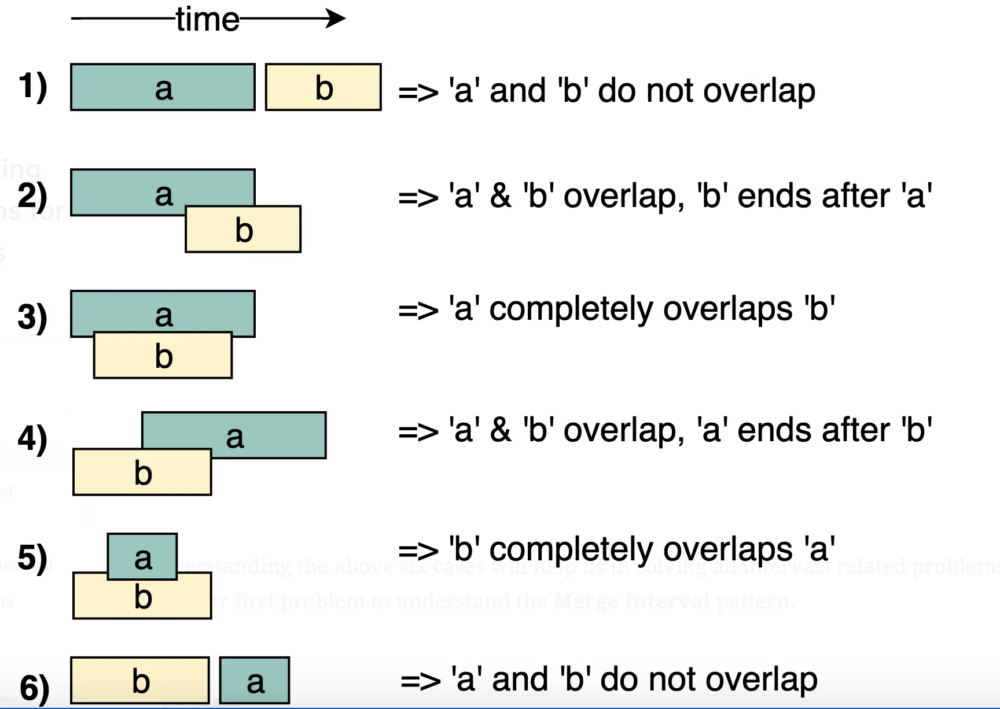

### 4. Intervals
[Back to solutions](../README.md#solutions)

The Interval pattern is a powerful way to reason about problems involving ranges of values, whether time spans, numeric ranges, or geometric spans. Each interval is defined by a start and an end; for example, [10,20] represents everything from 10 through 20.

> [!NOTE]
> Two intervals overlap if the start of one is less than or equal to the end of the other.

#### 4.1. Idea
Interval questions are a subset of array questions where you are given an array of two-element arrays (an interval) and the two values represent a start and an end value. Interval questions are considered part of the array family but they involve some common techniques hence they are extracted out to this special section of their own.

An example interval array: [[1, 2], [4, 7]].

Interval questions can be tricky to those who have not tried them before because of the sheer number of cases to consider when they overlap.

Corner cases:
* No intervals
* Single interval
* Two intervals
* Non-overlapping intervals
* An interval totally consumed within another interval
* Duplicate intervals (exactly the same start and end)
* Intervals which start right where another interval ends - [[1, 2], [2, 3]]

#### 4.2. Illustration

#### 4.3. Complexity

Time: O(N * log N) where N is the total number of intervals. In the beginning, since we sort the intervals, our algorithm will take O(N * log N) to run. 
Space: O(N), as we need to return a list containing all the merged intervals.

#### 4.4. How to detect it should be used

This approach is quite useful when dealing with intervals, overlapping items or merging intervals.

---

### 6. Two Heaps
[Back to solutions](../README.md#solutions)

Imagine you’re managing a busy airport. Flights are constantly landing and taking off, and you need to quickly find the next most important flight—an emergency landing or a VIP departure. At the same time, new flights must be integrated into the schedule. How do you track all this while finding the highest-priority flight quickly? Without an efficient data structure, you’d have to scan the entire schedule every time a decision is needed, which can be slow and error-prone as the number of flights grows. The time complexity of this inefficient system will be O(n) for each decision, where n is the number of flights because it requires scanning the entire schedule to find the highest-priority flight.

The solution is heaps.

<b>Heap</b> is a special data structure that helps you efficiently manage priorities. With a min heap, you can always find the flight with the earliest priority, and with a max heap, you can focus on flights that have been waiting for the longest—all while making updates quickly when new flights are added.

A heap is a specialized binary tree that satisfies the heap property:

* <b>Min heap</b>: The value of each node is smaller than or equal to the values of its children. The root node holds the minimum value. A min heap always prioritizes the minimum value.

* <b>Max heap</b>: The value of each node is greater than or equal to the values of its children. The root node holds the maximum value. A max heap always prioritizes the maximum value.

* <b>Priority queue</b>: A priority queue is an abstract data type retrieves elements based on their custom priority. It is often implemented using a heap for efficiency.

A heap is a specific data structure with a fixed ordering (min or max), while a priority queue is an abstract data type that handles custom priority requirements for elements.

> [!NOTE]
> A heap is a specific data structure with a fixed ordering (min or max), while a priority queue is an abstract data type that handles custom priority requirements for elements.

#### 6.1. Idea

In many problems, where we are given a set of elements such that we can divide them into two parts. To solve the problem, we are interested in knowing the smallest element in one part and the biggest element in the other part. This pattern is an efficient approach to solve such problems.

This pattern uses two Heaps to solve these problems; A <b>Min Heap</b> to find the smallest element and a <b>Max Heap</b> to find the biggest element.

Let’s assume that x is the median of the list. This means that, half of the items in the list are smaller than (or equal to) x and other half is greater than (or equal to) x.

1. We can store the smaller part of the list in a <b>Max Heap</b>. We are using <b>Max Heap</b> because we are only interested in knowing the largest number in the first half of the list.
2. We can store the larger part of the list in a <b>Min Heap</b>. We are using <b>Min Heap</b> because we are only interested in knowing the smallest number in the second half of the list.
3. Inserting a number in a heap will take O(log N) (better than the brute force approach)
4. The median of the current list of numbers can be calculated from the top element of the two heaps.

#### 6.2. Illustration

#### 6.3. Complexity

Time: O (log N) for insertions, O(1) - to find median 
Space: O(N)

#### 6.4. How to detect it should be used

This approach is quite useful when dealing with the problems where we are given a set of elements such that we can divide them into two parts.

To be able to solve these kinds of problems, we want to know the smallest element in one part and the biggest element in the other part. Two Heaps pattern uses two Heap data structure to solve these problems; a <b>Min Heap</b> to find the smallest element and a <b>Max Heap</b> to find the biggest element.

LeetCode problems:
* LeetCode 480 - Sliding Window Median [hard]
* LeetCode 502 - IPO [hard]

---
