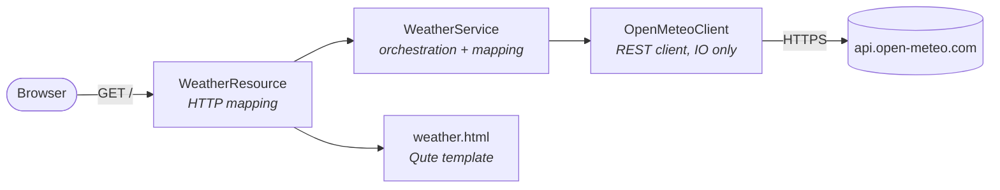
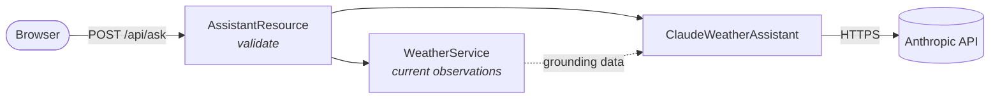

# quarkus-weather
<sub>[Back to Blueprints](../README.md#blueprints)</sub>

A single-page weather dashboard for Glasgow, Samara and Nha Trang, built on Quarkus and served
from live [Open-Meteo](https://open-meteo.com/) data.

The point of the module is the framework contrast: every other web module in this repo runs on
Spring Boot, which wires dependency injection by reflection at startup. Quarkus resolves the same
graph at **build time** and bakes it into bytecode, which is why this module needs the
`quarkus-maven-plugin` and starts in about half a second.

**Stack:** Java, Quarkus, Qute, MicroProfile REST Client, Open-Meteo, Anthropic Java SDK

## Contents
1. [Quick Start](#1-quick-start)
2. [Architecture](#2-architecture)
3. [Weather Data](#3-weather-data)
4. [Failure Handling](#4-failure-handling)
5. [Ask Claude](#5-ask-claude)
6. [What Quarkus Does Differently](#6-what-quarkus-does-differently)
7. [Tests](#7-tests)

---

## 1. Quick Start

**Prerequisites:** Java 25, Maven, outbound HTTPS to `api.open-meteo.com`. Open-Meteo is free and
unauthenticated, so the weather dashboard needs no key.

The optional "Ask Claude" panel does need one. Without it the page still works — the toggle
renders greyed out with an explanation.

### Configure `ANTHROPIC_API_KEY` with direnv

The recommended setup uses the repository-root `.envrc`. An exported variable is then available
whether Quarkus is launched through Maven, as a packaged JAR, or from a subdirectory.

1. Install direnv:

   ```bash
   brew install direnv
   ```

2. Add the direnv hook to `~/.zshrc` so every new zsh session can load `.envrc` files:

   ```bash
   eval "$(direnv hook zsh)"
   ```

   Run the same command directly in an already-open terminal to activate the hook there without
   restarting the shell.

3. From the repository root, create the local configuration:

   ```bash
   cd /path/to/JavaCraft
   cp .envrc.example .envrc
   ```

4. Edit `.envrc` and replace the empty value with the key:

   ```bash
   export ANTHROPIC_API_KEY="your-key"
   ```

   Keep `export`: a plain shell assignment is not inherited by the Maven/Java child process.
   Prefer one of the secret-manager commands documented in `.envrc.example` instead of storing a
   plaintext key when one is available.

5. Review the file, authorize its current contents, and reload the environment:

   ```bash
   direnv allow
   direnv reload
   ```

   Changing `.envrc` invalidates the previous authorization, so run `direnv allow` again after
   every edit.

6. Verify presence without printing the secret:

   ```bash
   test -n "${ANTHROPIC_API_KEY:-}" \
     && echo "ANTHROPIC_API_KEY is available" \
     || echo "ANTHROPIC_API_KEY is missing"
   ```

Never print the value or put it in `application.properties`. That committed file only contains a
`${ANTHROPIC_API_KEY:}` reference. Both `.envrc` and `.env` are gitignored.

### Troubleshooting direnv

| Symptom | What to check |
|---|---|
| Entering the repository produces no direnv message | The shell hook is probably not active. Run `eval "$(direnv hook zsh)"`, add that exact line to `~/.zshrc`, and run `direnv reload`. |
| `direnv status` says no `.envrc` was found | Confirm that `.envrc` exists at the JavaCraft repository root, not only `.envrc.example`, and that the current directory is the root or one of its descendants. |
| direnv reports that `.envrc` is blocked | Review the file and run `direnv allow`. This is expected after its contents change. |
| The safe variable check reports `missing` | Confirm `.envrc` contains a non-empty `export ANTHROPIC_API_KEY=...`, then run `direnv allow` and `direnv reload`. |
| direnv can load the key but the current shell cannot see it | Run `direnv exec . sh -c 'if test -n "$ANTHROPIC_API_KEY"; then echo available; else echo missing; fi'`. If that prints `available`, the `.envrc` is valid and the current shell is missing its direnv hook. |
| A terminal launch works but an IDE launch does not | The IDE process did not inherit the direnv environment. Start the IDE from a terminal where the safe variable check succeeds, use IDE direnv integration, or set the variable in the run configuration. |

For repository-wide background and security guidance, see
[Secrets and local environment](../../README.md#secrets-and-local-environment).

<details>
<summary>Alternatives, and why the working directory matters</summary>

Quarkus reads `.env` from the **process working directory**, not from the module directory or the
classpath — so where you run the command from decides whether a module-local `.env` is seen:

| Command | Working directory | Reads `blueprints/quarkus-weather/.env`? |
|---|---|---|
| `mvn -pl blueprints/quarkus-weather quarkus:dev` (from repo root) | module dir — Maven sets it | ✅ |
| `cd blueprints/quarkus-weather && java -jar target/quarkus-app/quarkus-run.jar` | module dir | ✅ |
| `java -jar blueprints/quarkus-weather/target/…` **from the repo root** | repo root | ❌ — looks for `<repo>/.env` |

No single `.env` location covers both dev mode and a root-launched jar, which is why an exported
variable is the recommendation. A one-off also works: `ANTHROPIC_API_KEY=… java -jar …`.

If you do use a module `.env`, copy it from `.env.example` and `chmod 600` it. The `.example`
files are committed, while the files containing real values are ignored.

</details>

### Build it

```bash
mvn -pl blueprints/quarkus-weather -am package -DskipTests
```

### Run it

```bash
java -jar blueprints/quarkus-weather/target/quarkus-app/quarkus-run.jar
```

Then open <http://localhost:8095/>. With the recommended `.envrc`, the key is already inherited
from the shell. The `cd` also lets Quarkus find a module-local `.env` when that alternative is
used. Without a key the weather cards still render; only the Claude panel is disabled.

### Live-reload development

```bash
mvn -pl blueprints/quarkus-weather -am quarkus:dev
```

Edit a Java file or `weather.html` and refresh the browser — Quarkus recompiles on the next
request, with no restart.

---

## 2. Architecture
<sub>[Back to top](#quarkus-weather)</sub>



Layering follows the repo's standard split:

| Package | Responsibility |
|---|---|
| `domain` | `City`, `WeatherSnapshot`, `CityWeather`, `WeatherCondition` — immutable records and an enum, with **no framework imports** |
| `client` | `OpenMeteoClient` and its response DTO — IO only |
| `service` | `WeatherService` — fetches each city, maps payloads into the domain |
| `web` | `WeatherResource`, `Templates`, `WeatherTemplateExtensions` — HTTP and presentation |

`WeatherService` takes its client through the constructor, so its tests instantiate it directly
with a Mockito mock and need no CDI container at all.

---

## 3. Weather Data
<sub>[Back to top](#quarkus-weather)</sub>

Cities are pinned to WGS84 coordinates rather than looked up by name, which avoids a geocoding
round trip and keeps results deterministic:

| City | Country | Latitude | Longitude |
|---|---|---:|---:|
| Glasgow | United Kingdom | 55.8642 | -4.2518 |
| Samara | Russia | 53.2001 | 50.1500 |
| Nha Trang | Vietnam | 12.2388 | 109.1967 |

Each request asks for `temperature_2m`, `relative_humidity_2m`, `wind_speed_10m` and
`weather_code`, with `timezone=auto` so every card reports its **own** local time rather than the
server's — the three timestamps are normally hours apart.

`weather_code` is a [WMO 4677](https://open-meteo.com/en/docs) interpretation code. The full table
is finer-grained than three cards can usefully show, so `WeatherCondition` collapses neighbouring
codes into buckets (`61`, `63`, `65` all become `RAIN`). Unmapped or absent codes become `UNKNOWN`
rather than failing the card.

---

## 4. Failure Handling
<sub>[Back to top](#quarkus-weather)</sub>

`CityWeather` is a result type, not a bare snapshot: it holds either an observation or the reason
one is missing. A city that times out, returns an error, or sends an incomplete payload degrades
to its own "unavailable" card while the other two render normally.

The connect and read timeouts are explicit in `application.properties` (2s / 5s). Without them a
stalled upstream would hold the request thread indefinitely.

Failures log at WARN with the exception message only — no stack trace for a routine upstream
timeout, and the request URL is left out because it carries the city's coordinates.

---

## 5. Ask Claude
<sub>[Back to top](#quarkus-weather)</sub>

A toggle below the cards opens a question box backed by
[`claude-sonnet-5`](https://platform.claude.com/docs/en/about-claude/models/overview) through the
official `anthropic-java` SDK.

**Claude is not asked what the weather is.** It has no live data and would answer fluently and
wrongly. Every request carries the observations the page just fetched, and the system prompt
confines the answer to them — Claude interprets and phrases, Open-Meteo supplies the facts. Ask
about a fourth city and it says it cannot, rather than inventing a reading.



### States the panel can be in

| Condition | What the page shows |
|---|---|
| No `ANTHROPIC_API_KEY` | Toggle greyed out and disabled, with an explanation. The question form is not rendered at all. |
| Key present, toggle off | Just the toggle — no request is made until it is switched on. |
| Claude answered | The answer, in plain prose. |
| Claude declined | A "declined to answer" note. A refusal is an HTTP 200 with `stop_reason: refusal`, so it is checked before the response body is read. |
| Timeout, rate limit, bad key | A neutral "temporarily unavailable" line. The endpoint still returns 200 so the page renders it inline instead of surfacing a browser error. |

### Configuration

| Property | Default | Notes |
|---|---|---|
| `anthropic.api-key` | `${ANTHROPIC_API_KEY:}` | Empty is a supported state, not a startup failure |
| `anthropic.model` | `claude-sonnet-5` | Adaptive thinking is on by default, same as the Opus tier; swap in `claude-opus-5` for harder questions |
| `anthropic.max-tokens` | `16000` | Thinking is on by default on this model and counts against the same ceiling, so this covers reasoning **plus** the answer |
| `anthropic.effort` | `medium` | `low`–`max`; an unknown value fails at startup rather than as a 400 mid-request |

Questions are capped at 500 characters, and failures log the exception message only — never the
key, and never the user's question.

---

## 6. What Quarkus Does Differently
<sub>[Back to top](#quarkus-weather)</sub>

Next to the Spring Boot modules in this repo, three things stand out:

- **Build-time DI.** The `quarkus-maven-plugin` `build` goal runs an augmentation step that
  resolves injection, indexes annotations, and writes the wiring into bytecode. Startup measured
  **0.537s** on JVM, with no classpath scanning.
- **Build-time template checking.** `@CheckedTemplate` validates every expression in
  `weather.html` against the declared parameter types *during the build*. Writing
  `{...temperatureCelsius.format("%.1f")}` fails the build with
  `Property/method [format("%.1f")] not found on class [double]` rather than rendering a broken
  page. That is why formatting lives in `WeatherTemplateExtensions` instead.
- **Declarative REST client.** `OpenMeteoClient` is an interface; the implementation is generated
  at build time from the annotations.

Two integration details this module had to solve, both worth knowing before adding more Quarkus:

- **`-parameters` is required.** `@CheckedTemplate` binds template parameters by name, so the
  module sets `maven.compiler.parameters`. Without it the build fails with
  `Parameter names not recorded`.
- **The Quarkus BOM is imported here, not in the root pom.** Quarkus manages Jackson, Netty and
  JUnit, so a global import would fight the root pom's deliberate JUnit → Netty → Spring Boot
  ordering. Importing it in this module's `dependencyManagement` keeps the blast radius local.

---

## 7. Tests
<sub>[Back to top](#quarkus-weather)</sub>

```bash
mvn -pl blueprints/quarkus-weather test
```

136 plain unit tests plus 14 `@QuarkusTest` cases that boot the application against a WireMock
stand-in for Open-Meteo, so no test touches the network. The stub deliberately fails Nha Trang,
which exercises both template branches and proves one unreachable city does not take the page
down.

### Coverage summary

| Module | Tests | Line coverage |
|--------|------:|--------------:|
| blueprints/quarkus-weather | 150 | 100.0% (204/204) |

> [!NOTE]
> This module deliberately does **not** use the `quarkus-jacoco` extension. It records coverage
> only for `@QuarkusTest` classes, so the 136 unit tests contributed nothing and the report read
> 87.3% when the real figure was 100%. The root pom's standard JaCoCo agent sees both kinds of
> test, because Quarkus runs `@QuarkusTest` in the same JVM.

> [!TIP]
> `wiremock-standalone` is used rather than the thin `wiremock` artifact. The latter expects
> Jetty 11 on the classpath, which Quarkus does not provide, and fails at startup with
> `Jetty 11 is not present`.
