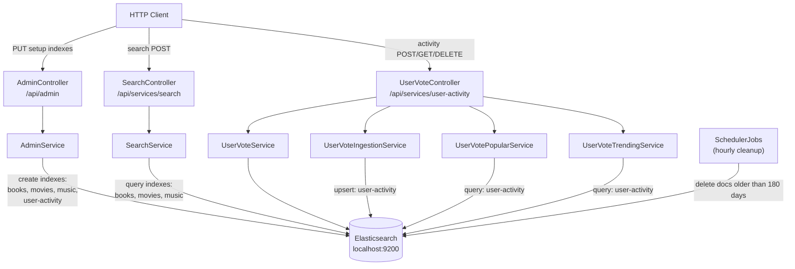
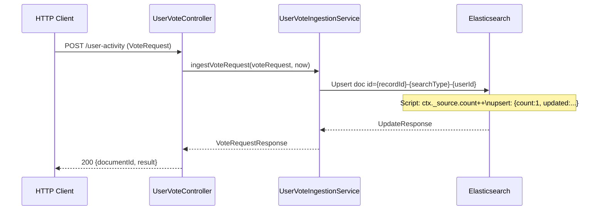

# Elasticsearch

An Elasticsearch-backed search and user-activity service. Exposes multiple query strategies
via REST, ingests user click events into user-activity index, and returns popular/trending search activity.

> **First time setup:** call the `AdminController` endpoints once to create all required
> indexes and their field mappings before using `SearchController` or `UserVoteController`.

**Stack:** Spring Boot, Spring Data Elasticsearch, Swagger/OpenAPI, Cucumber (BDD)

## Contents
1. [Quick Start](#1-quick-start)
2. [Architecture](#2-architecture)
3. [API Reference](#3-api-reference)
4. [Data Model](#4-data-model)
5. [User Activity Lifecycle](#5-user-activity-lifecycle)
6. [Configuration](#6-configuration)
7. [Scheduler](#7-scheduler)
8. [Query Types](#8-query-types)
9. [Validation](#9-validation)
10. [Error Handling](#10-error-handling)
11. [CORS — Swagger "Failed to fetch"](#11-cors--swagger-failed-to-fetch)
12. [Dev Console Queries](#12-dev-console-queries)
13. [Tests](#13-tests)

---

## 1. Quick Start

**Prerequisites:**
- Elasticsearch running on `localhost:9200` (HTTPS, Basic auth) [Docker installation](https://www.elastic.co/docs/deploy-manage/deploy/self-managed/local-development-installation-quickstart)
- *(If SSL enabled) CA certificate placed at `src/main/resources/cert/http_ca.crt`

```bash
mvn -pl elastic spring-boot:run
```

| URL | Description |
|-----|-------------|
| http://localhost:8001/swagger-ui/index.html | Swagger UI |
| http://localhost:8001/v3/api-docs | OpenAPI JSON |

---

## 2. Architecture
<sub>[Back to top](#elasticsearch)</sub>



---

## 3. API Reference
<sub>[Back to top](#elasticsearch)</sub>

### Admin — `/api/admin`

One-time setup endpoints. Call these **before** using `SearchController` or
`UserVoteController`. Each endpoint creates a specific index with a fixed, pre-defined
schema — no request body or path variables are accepted.

| Method | Path | Creates index | Used by |
|--------|------|---------------|---------|
| `PUT` | `/api/admin/indexes/user-activity` | `user-activity` | `UserVoteController` |
| `PUT` | `/api/admin/indexes/books` | `books` | `SearchController` |
| `PUT` | `/api/admin/indexes/movies` | `movies` | `SearchController` |
| `PUT` | `/api/admin/indexes/music` | `music` | `SearchController` |

**Response — `CreateIndexResponse`:**

```json
{
  "index": "user-activity",
  "acknowledged": true,
  "shards_acknowledged": true
}
```

Calling an endpoint when the index already exists returns `500` with an ES
`resource_already_exists_exception` message.

#### Index field mappings

**`user-activity`** — field types are chosen to match the exact queries used at runtime:

| Field | ES type | Rationale |
|-------|---------|-----------|
| `count` | `long` | incremented by the Painless upsert script |
| `updated` | `date` (`strict_date_optional_time`) | used in range queries by `UserVoteTrendingService` |
| `userId` | `keyword` | exact-match term query in `UserVotePopularService` |
| `recordId` | `keyword` | used in aggregations in `UserVoteTrendingService` |
| `searchType` | `keyword` | exact-match term query |
| `elasticId` | `keyword` | composite document ID, not queried |
| `searchValue` | `text` | stored only, not queried directly |

**`books`** — `name`, `author`, `synopsis` — all `text` (full-text search)

**`movies`** — `name`, `director`, `synopsis` — all `text` (full-text search)

**`music`** — `band`, `album`, `name`, `lyrics` — all `text` (full-text search)

Fields match exactly what is configured in `metadata.json` and queried by `SearchService`.

---

### Search — `/api/services/search`

All search endpoints accept `POST` with `application/json` and return `application/json`.

| Method | Path | Query strategy |
|--------|------|----------------|
| `POST` | `/api/services/search` | Multi-index search (msearch across configured fields) |
| `POST` | `/api/services/search/wildcard` | Wildcard + SimpleQueryString |
| `POST` | `/api/services/search/fuzzy` | MatchQuery with fuzziness=2 |
| `POST` | `/api/services/search/interval` | IntervalsQuery (maxGaps=3, ordered=true) |
| `POST` | `/api/services/search/span` | SpanNearQuery (slop=3, inOrder=true) |

**Request body — `ContentSearchRequest`:**

```json
{
  "type": "ALL",
  "pattern": "imprisoned",
  "client": "WEB"
}
```

| Field | Type | Allowed values |
|-------|------|----------------|
| `type` | String | `ALL`, `BOOKS`, `COMPANIES`, `MUSIC`, `MOVIES`, `PEOPLE` |
| `pattern` | String | Search string (wildcards `*`/`?` allowed for wildcard endpoint) |
| `client` | String | `MOBILE`, `WEB` |

Both `type` and `client` are validated with `@ValueOfEnum` — case-insensitive, 400 on invalid value.

---

### User Activity — `/api/services/user-activity`

#### Ingest a user click

```
POST /api/services/user-activity
```

Request body — `VoteRequest`:

```json
{
  "userId": "nl84439",
  "recordId": "did-1",
  "searchType": "People",
  "searchPattern": "John"
}
```

All fields are required (`@NotEmpty` / `@NotBlank`). On each call the service upserts a document
into the `user-activity` index — it creates the document on first occurrence and increments
`count` on subsequent calls for the same `(recordId, searchType, userId)` combination.

Response — `VoteRequestResponse`:

```json
{
  "documentId": "did-1-People-nl84439",
  "result": "Updated"
}
```

---

#### Retrieve activity

| Method | Path | Description |
|--------|------|-------------|
| `GET` | `/api/services/user-activity/documents/{documentId}` | Get a single document by ES document ID |
| `GET` | `/api/services/user-activity/users/{userId}?size=10` | Popular searches for a specific user (sorted by count DESC) |
| `GET` | `/api/services/user-activity/users?size=10` | Global trending searches in the last 7 days |

#### Delete

| Method | Path | Description |
|--------|------|-------------|
| `DELETE` | `/api/services/user-activity/indexes/{index}` | Delete an entire index |
| `DELETE` | `/api/services/user-activity/indexes/{index}/documents/{documentId}` | Delete a single document |

---

## 4. Data Model
<sub>[Back to top](#elasticsearch)</sub>

### `UserVote` (Elasticsearch document, index: `user-activity`)

| Field | Type | Description |
|-------|------|-------------|
| `elasticId` | String | Composite key: `{recordId}-{searchType}-{userId}` |
| `userId` | String | User identifier |
| `recordId` | String | Identifier of the record that was clicked |
| `searchType` | String | Category of the search (e.g. `People`, `Books`) |
| `searchValue` | String | The search pattern used |
| `count` | Long | Number of times this record was clicked |
| `updated` | String | ISO 8601 timestamp of last update |

### `VoteRequest` (inbound event)

| Field | Constraint | Description |
|-------|-----------|-------------|
| `userId` | `@NotEmpty` | User identifier |
| `recordId` | `@NotBlank` | Record being clicked |
| `searchType` | `@NotBlank` | Search category |
| `searchPattern` | `@NotBlank` | Search pattern |

---

## 5. User Activity Lifecycle
<sub>[Back to top](#elasticsearch)</sub>



---

## 6. Configuration
<sub>[Back to top](#elasticsearch)</sub>

`elastic/src/main/resources/application.yaml`:

```yaml
scheduler:
  enabled: true          # set false to disable hourly cleanup job

server:
  port: "8001"

spring:
  elastic:
    cluster:
      host: "localhost"
      port: "9200"
      user: "elastic"
      pass: "elastic"
      schema: "https"    # use "http" for unsecured local instances
      ssl:
        enabled: false
        path: "cert/http_ca.crt"  # CA cert used by Kibana to connect to ES

springdoc:
  swagger-ui:
    tagsSorter: alpha
```

The SSL certificate is loaded from the classpath. Place the `.crt` file in
`src/main/resources/cert/` before starting the application.

### Docker security enabled check

Next command allows you to check HTTP SSL status & password in ES docker image  (local running)
```bash
docker inspect es-local-dev --format '{{range .Config.Env}}{{println .}}{{end}}' \
| grep -E 'xpack.security.enabled|xpack.security.http.ssl.enabled|ELASTIC_PASSWORD'
```
Output:
```bash
xpack.security.enabled=true
xpack.security.http.ssl.enabled=false
ELASTIC_PASSWORD=FverGoe0
```

---

## 7. Scheduler
<sub>[Back to top](#elasticsearch)</sub>

`SchedulerJobs` runs a cleanup task every hour (`0 0 * * * *`) when `scheduler.enabled=true`.
It deletes all documents from the `user-activity` index where `updated` is older than 180 days.

Disable for local development:

```yaml
scheduler:
  enabled: false
```

---

## 8. Query Types
<sub>[Back to top](#elasticsearch)</sub>

### Default (multi-search)

Executes an Elasticsearch `_msearch` request across all index fields configured for the
given `ContentCategory` in `metadata.json`. Returns raw Elasticsearch `Document` objects.

### Wildcard

Wildcard queries match words with missing characters, prefixes, or suffixes. Supports:
- `*` — zero or more characters
- `?` — exactly one character

Example: `god*ather` matches `godfather`, `godmother`, etc.

```json
{
  "query": {
    "wildcard": {
      "synopsis": { "value": "imprisoned*" }
    }
  }
}
```

### Fuzzy

Fuzzy queries find terms similar to the search term using
[Levenshtein edit distance](https://en.wikipedia.org/wiki/Levenshtein_distance).
An edit distance counts single-character changes (insert, delete, substitute, transpose).

Example: `imprtdoned` (fuzziness=2) still matches `imprisoned`.

```json
{
  "query": {
    "fuzzy": {
      "synopsis": { "value": "imprtdoned", "fuzziness": 2 }
    }
  }
}
```

### Interval

Interval queries give fine-grained control over the proximity and order of matching terms.
The service uses `maxGaps=3, ordered=true` — matched terms must appear within 3 tokens of each
other in the specified order.

### Span

Span queries are low-level positional queries suited for legal or patent documents where
exact term ordering and proximity matter. The service uses `slop=3, inOrder=true`.

```json
{
  "query": {
    "span_near": {
      "clauses": [
        { "span_term": { "synopsis": "imprisoned" } },
        { "span_term": { "synopsis": "over" } }
      ],
      "slop": 3,
      "in_order": true
    }
  }
}
```

---

## 9. Validation
<sub>[Back to top](#elasticsearch)</sub>

### Bean Validation on request bodies

Endpoints annotated with `@Valid` trigger Jakarta Bean Validation. Invalid requests return `400`.

| Annotation | Applied to | Meaning |
|-----------|-----------|---------|
| `@NotEmpty` | `userId` | Must not be null or empty |
| `@NotBlank` | `recordId`, `searchType`, `searchPattern` | Must not be blank |
| `@ValueOfEnum` | `type`, `client` in `ContentSearchRequest` | Must match a known enum constant (case-insensitive) |

### `@ValueOfEnum` — Custom enum validator

Validates that a `String` field matches one of the constants of a given enum class.
Case-insensitive comparison is applied, `null` values are allowed (treated as valid).

Usage:

```java
@ValueOfEnum(enumClass = ContentCategory.class)
String type;
```

---

## 10. Error Handling
<sub>[Back to top](#elasticsearch)</sub>

`ErrorExceptionHandler` (`@ControllerAdvice`) catches all `Throwable` exceptions and returns:

```
HTTP 500 Internal Server Error
Content-Type: application/json
Body: <exception message>
```

The full stack trace is logged at `ERROR` level.

---

## 11. CORS — Swagger "Failed to fetch"
<sub>[Back to top](#elasticsearch)</sub>

If Swagger UI returns a CORS error:

```
Failed to fetch.
Possible Reasons: CORS / Network Failure / URL scheme must be "http" or "https"
```

This is typically caused by an ad-blocking browser extension intercepting the request.

**Fix:**
1. Disable or remove the ad-blocking extension for `localhost`.
2. Restart the application, refresh the browser, and clear browser cache.
3. Retry the request from Swagger UI.

---

## 12. Dev Console Queries
<sub>[Back to top](#elasticsearch)</sub>

Use the Kibana Dev Console (or any Elasticsearch REST client) to interact with the
`user-activity` index directly.

### Create the index

```json
PUT user-activity
```

### Add a date mapping for the `updated` field

```json
PUT /user-activity/_mapping
{
  "properties": {
    "updated": { "type": "date" }
  }
}
```

### Upsert a document (increment count on existing)

```json
POST /user-activity/_update/did-1-People-nl84439
{
  "script": {
    "source": "ctx._source.count++; ctx._source.updated = params['updated'];",
    "params": { "updated": "2024-01-08T18:16:41.531Z" }
  },
  "upsert": {
    "searchType": "People",
    "count": 1,
    "searchPattern": "John",
    "userId": "nl84439",
    "recordId": "did-1",
    "updated": "2024-01-08T18:16:41.531Z"
  }
}
```

### Get a document by ID

```json
GET /user-activity/_doc/did-1-People-nl84439
```

### Find top 10 documents for a user, sorted by count descending

```json
GET /user-activity/_search
{
  "query": {
    "match": { "userId": "nl84439" }
  },
  "size": 10,
  "sort": { "count": { "order": "desc" } }
}
```

### Inspect field mappings

```json
GET /user-activity/_mapping
```

### Delete a document

```json
DELETE /user-activity/_doc/did-1-People-nl84439
```

---

## 13. Tests
<sub>[Back to top](#elasticsearch)</sub>

Run all tests for this module:

```bash
mvn -pl elastic test
```

### Coverage summary

| Module | Tests | Line coverage |
|--------|------:|--------------:|
| elastic (unit) | 30 | 38.0% |
| elastic (BDD) | — | requires live ES |

> [!TIP]
> Coverage is measured on unit tests only. BDD/Cucumber integration tests require a live Elasticsearch instance and are not included in the coverage run. Controllers, scheduler, and validation packages reach 100 %; services that call Elasticsearch directly show low coverage because their execution paths are only reachable via BDD tests.

### Per-package line coverage (unit tests only)

| Package | Line coverage |
|---------|-------------:|
| `config` | 6.1% |
| `model` | 83.3% |
| `rest` | 100.0% ✅ |
| `scheduler` | 100.0% ✅ |
| `service` | 22.4% |
| `validation` | 100.0% ✅ |

### BDD integration tests _(require live Elasticsearch)_

| Test class | Type | Covers                                                          |
|------------|------|-----------------------------------------------------------------|
| Cucumber feature files | Integration (BDD) | Search, ingestion, activity, and scheduler scenarios end-to-end |

> [!WARNING]
> We need to have cucumber.properties to avoid java.lang.NoClassDefFoundError: com/sun/jna/platform/win32/Win32Exception
> that because WARNING: Failed to load methods of class 'net.bytebuddy.agent.VirtualMachine$ForOpenJ9$Dispatcher$ForJnaWindowsEnvironment'.
By default Cucumber scans the entire classpath for step definitions.
You can restrict this by configuring the glue path.