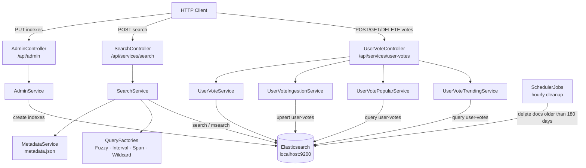

# Elasticsearch

An Elasticsearch-backed search and user-votes service. Exposes multiple full-text query
strategies via REST, ingests user click events, and surfaces popular and trending activity.

**Stack:** Spring Boot, Elasticsearch 8.x, Spring Security, Swagger/OpenAPI, Cucumber (BDD)

> **First-time setup:** call the `AdminController` endpoints once to create all required
> indexes before using `SearchController` or `UserVoteController`.
> See [elastic-app → Quick Start](elastic-app/README.md#1-quick-start).

---

**Sub-modules:** [elastic-api](elastic-api/README.md) · [elastic-app](elastic-app/README.md) · [elastic-testing](elastic-testing/README.md)

| Sub-module | Responsibility |
|---|---|
| [elastic-api](elastic-api/README.md) | Shared request/response models, enums, validation annotations, constants |
| [elastic-app](elastic-app/README.md) | Spring Boot application — search, votes, admin APIs, configuration |
| [elastic-testing](elastic-testing/README.md) | Cucumber integration tests + dataset downloaders |

---

## Contents
1. [Quick Start](#1-quick-start)
2. [Architecture](#2-architecture)
3. [Scheduler](#3-scheduler)
4. [Error Handling](#4-error-handling)
5. [CORS — Swagger "Failed to fetch"](#5-cors--swagger-failed-to-fetch)
6. [Dev Console Queries](#6-dev-console-queries)
7. [Tests](#7-tests)

---

## 1. Quick Start
<sub>[Back to top](#elasticsearch)</sub>

**Prerequisites:** Elasticsearch running on `localhost:9200`
([Docker quickstart](https://www.elastic.co/docs/deploy-manage/deploy/self-managed/local-development-installation-quickstart))

```bash
mvn -pl elastic/elastic-app spring-boot:run
```

| URL | Description |
|-----|-------------|
| http://localhost:8001/swagger-ui/index.html | Swagger UI |
| http://localhost:8001/v3/api-docs | OpenAPI JSON |

For index creation commands and full configuration see
[elastic-app → Quick Start](elastic-app/README.md#1-quick-start).

### Docker — verify security settings

```bash
docker inspect es-local-dev --format '{{range .Config.Env}}{{println .}}{{end}}' \
  | grep -E 'xpack.security.enabled|xpack.security.http.ssl.enabled|ELASTIC_PASSWORD'
```

Expected output:

```
xpack.security.enabled=true
xpack.security.http.ssl.enabled=false
ELASTIC_PASSWORD=FverGoe0
```

---

## 2. Architecture
<sub>[Back to top](#elasticsearch)</sub>



Full API reference and index mappings: [elastic-app → API Reference](elastic-app/README.md#3-api-reference).

---

## 3. Scheduler
<sub>[Back to top](#elasticsearch)</sub>

`SchedulerJobs` runs a cleanup task every hour (`0 0 * * * *`) when `scheduler.enabled=true`.
It deletes all documents from the `user-votes` index where `updated` is older than 180 days.

Disable for local development:

```yaml
scheduler:
  enabled: false
```

---

## 4. Error Handling
<sub>[Back to top](#elasticsearch)</sub>

`ErrorExceptionHandler` (`@ControllerAdvice`) catches all `Throwable` exceptions and returns
`HTTP 500` with the exception message as a JSON body. The full stack trace is logged at `ERROR`
level. Invalid request bodies (`@Valid` failures) return `400` before reaching the handler.

---

## 5. CORS — Swagger "Failed to fetch"
<sub>[Back to top](#elasticsearch)</sub>

If Swagger UI returns:

```
Failed to fetch.
Possible Reasons: CORS / Network Failure / URL scheme must be "http" or "https"
```

This is typically caused by an ad-blocking browser extension intercepting the request.

**Fix:**
1. Disable the ad-blocking extension for `localhost`.
2. Restart the application, refresh the browser, and clear the cache.
3. Retry from Swagger UI.

---

## 6. Dev Console Queries
<sub>[Back to top](#elasticsearch)</sub>

Useful Kibana Dev Console (or any ES REST client) snippets for the `user-votes` index.

### Upsert a document

```json
POST /user-votes/_update/did-1-People-nl84439
{
  "script": {
    "source": "ctx._source.count++; ctx._source.updated = params['updated'];",
    "params": { "updated": "2024-01-08T18:16:41.531Z" }
  },
  "upsert": {
    "searchType": "People",
    "count": 1,
    "searchPattern": "John",
    "userId": "nl84439",
    "recordId": "did-1",
    "updated": "2024-01-08T18:16:41.531Z"
  }
}
```

### Get a document by ID

```json
GET /user-votes/_doc/did-1-People-nl84439
```

### Top 10 documents for a user, sorted by count

```json
GET /user-votes/_search
{
  "query": { "match": { "userId": "nl84439" } },
  "size": 10,
  "sort": { "count": { "order": "desc" } }
}
```

### Inspect field mappings

```json
GET /user-votes/_mapping
```

### Delete a document

```json
DELETE /user-votes/_doc/did-1-People-nl84439
```

---

## 7. Tests
<sub>[Back to top](#elasticsearch)</sub>

```bash
# unit tests only (no Docker required)
mvn -pl elastic/elastic-api test
mvn -pl elastic/elastic-app test

# integration tests (Docker required for Testcontainers)
mvn -pl elastic/elastic-testing test
```

See each sub-module for detailed coverage:
- [elastic-api → (no runtime tests)](elastic-api/README.md)
- [elastic-app → Tests](elastic-app/README.md#9-tests)
- [elastic-testing → Tests](elastic-testing/README.md#5-tests)
