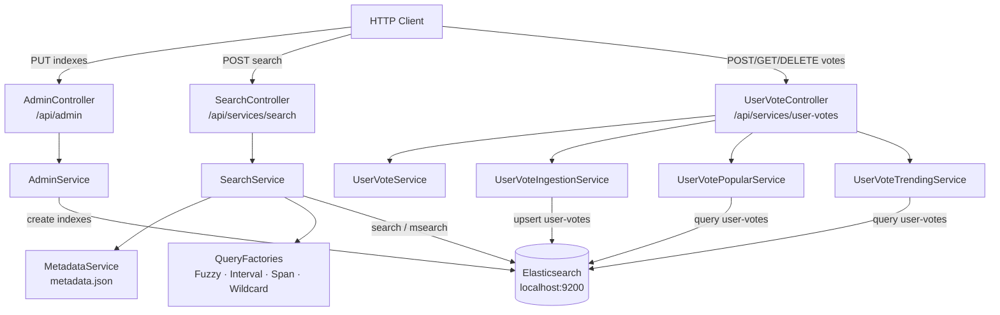
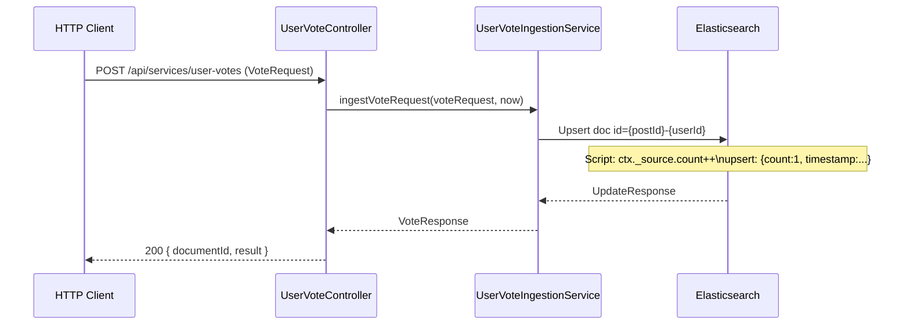

# elastic-app

<sub>[Back to elastic](../README.md)</sub>

Spring Boot application that provides full-text search over five content categories
(Books, Companies, Movies, Music, People) and a vote/ranking system for posts,
all backed by Elasticsearch 8.x.

**Stack:** Spring Boot, Elasticsearch 8.x, Spring Security, Swagger/OpenAPI

## Contents
1. [Quick Start](#1-quick-start)
2. [Architecture](#2-architecture)
3. [API Reference](#3-api-reference)
4. [Query Types](#4-query-types)
5. [Index Mappings](#5-index-mappings)
6. [Data Model](#6-data-model)
7. [User Activity Lifecycle](#7-user-activity-lifecycle)
8. [Configuration](#8-configuration)
9. [Tests](#9-tests)

---

## 1. Quick Start
<sub>[Back to top](#elastic-app)</sub>

**Prerequisites:** Elasticsearch running on `localhost:9200`

```bash
mvn -pl elastic/elastic-app spring-boot:run
```

| URL | Description |
|-----|-------------|
| http://localhost:8001/swagger-ui/index.html | Swagger UI |
| http://localhost:8001/v3/api-docs | OpenAPI JSON |

**Create indexes before ingesting data** (one-time setup, idempotent):

```bash
curl -X PUT http://localhost:8001/api/admin/indexes/books
curl -X PUT http://localhost:8001/api/admin/indexes/companies
curl -X PUT http://localhost:8001/api/admin/indexes/movies
curl -X PUT http://localhost:8001/api/admin/indexes/music
curl -X PUT http://localhost:8001/api/admin/indexes/people
curl -X PUT http://localhost:8001/api/admin/indexes/posts
curl -X PUT http://localhost:8001/api/admin/indexes/user-votes
```

---

## 2. Architecture
<sub>[Back to top](#elastic-app)</sub>



`MetadataService` loads `metadata.json` at startup and provides the list of searchable
text fields per category. `SearchService` uses these fields to fan out queries across
all relevant fields via a `bool/should` clause.

---

## 3. API Reference
<sub>[Back to top](#elastic-app)</sub>

### Admin — `/api/admin`

One-time setup. Each endpoint creates a specific index with a fixed schema. Calling an
endpoint when the index already exists returns `200` and leaves the index unchanged.

| Method | Path | Creates index | `201` fields |
|--------|------|---------------|-------------|
| `PUT` | `/api/admin/indexes/books` | `books` | author, name, synopsis (text) |
| `PUT` | `/api/admin/indexes/companies` | `companies` | ceo, country, description, headquarters, industry, name, sector, website (text); capitalization, employees (long); founded, rank (integer) |
| `PUT` | `/api/admin/indexes/movies` | `movies` | director, name, synopsis (text) |
| `PUT` | `/api/admin/indexes/music` | `music` | album, band, lyrics, name (text) |
| `PUT` | `/api/admin/indexes/people` | `people` | name, reasons_for_being_famous, surname (text); age, ranking (integer); date_of_birth, date_of_death (date) |
| `PUT` | `/api/admin/indexes/posts` | `posts` | postId, author (keyword); createdAt (date); karma, upvotes (long); hotScore, risingScore, bestScore (double) |
| `PUT` | `/api/admin/indexes/user-votes` | `user-votes` | timestamp (date); userId, postId, action (keyword) |

**Response — `CreateIndexResponse`:**

```json
{ "index": "books", "acknowledged": true, "shards_acknowledged": true }
```

---

### Search — `/api/services/search`

All endpoints accept `POST` with `Content-Type: application/json`.

**Request body (`ContentSearchRequest`):**

```json
{ "type": "MOVIES", "pattern": "imprisoned", "client": "WEB" }
```

`type` accepts any `ContentCategory` value; `ALL` fans out via `msearch`.

| Method | Path | Query strategy | Response |
|--------|------|----------------|----------|
| `POST` | `/api/services/search/wildcard` | Wildcard + `simple_query_string` across all metadata fields | `List<Object>` |
| `POST` | `/api/services/search/fuzzy` | `match` with `fuzziness=2` on `synopsis` | `List<Object>` |
| `POST` | `/api/services/search/interval` | `intervals` (`maxGaps=3`, ordered) on `synopsis` | `List<Object>` |
| `POST` | `/api/services/search/span` | `span_near` (`slop=3`, in-order) on `synopsis` | `List<Object>` |
| `POST` | `/api/services/search` | Multi-search wildcard across all categories | `List<Document>` |

---

### User Activity — `/api/services/user-votes`

#### Ingest a vote

```
POST /api/services/user-votes
```

**Request body (`VoteRequest`):**

```json
{ "userId": "nl84439", "postId": "did-1", "action": "UPVOTE" }
```

Each call upserts a document into `user-votes` — created on first occurrence, updated
on subsequent calls for the same `(userId, postId)` pair.

**Response (`VoteResponse`):**

```json
{ "documentId": "did-1-nl84439", "result": "Updated" }
```

`result` values: `Created`, `Updated`, `NoOp`, `Deleted`, `NotFound`.

#### Retrieve activity

| Method | Path | Description |
|--------|------|-------------|
| `GET` | `/api/services/user-votes/documents/{documentId}` | Single document by ES document ID |
| `GET` | `/api/services/user-votes/users/{userId}?size=10` | Popular votes for a user (sorted by count DESC) |
| `GET` | `/api/services/user-votes/users?size=10` | Global trending votes in the last 7 days |

#### Delete

| Method | Path | Description |
|--------|------|-------------|
| `DELETE` | `/api/services/user-votes/indexes/{index}` | Delete an entire index |
| `DELETE` | `/api/services/user-votes/indexes/{index}/documents/{documentId}` | Delete a single document |

---

## 4. Query Types
<sub>[Back to top](#elastic-app)</sub>

| Factory | ES query | Field scope | Best for |
|---------|----------|-------------|----------|
| `WildcardFactory` | `bool/should` of `wildcard` + `simple_query_string` | All metadata fields | Partial matches, flexible input |
| `FuzzyFactory` | `match` with `fuzziness=2`, `operator=AND` | `synopsis` | Typos, misspellings — e.g. `uxoricyde` → `uxoricide` |
| `IntervalFactory` | `intervals` with `max_gaps=3`, `ordered=true` | `synopsis` | Phrase proximity, word order |
| `SpanFactory` | `span_near` with `slop=3`, `in_order=true` | `synopsis` | Exact token positions |

> **SpanFactory note:** `SpanTermQuery` does **not** analyse the input — submit queries
> in lowercase to match the lowercased tokens stored by the standard analyser.
> e.g. use `hopeful compassion`, not `Hopeful Compassion`.

---

## 5. Index Mappings
<sub>[Back to top](#elastic-app)</sub>

`metadata.json` defines the searchable text fields per category — only these are passed
to query factories. Numeric and date fields are mapped correctly for range queries but
are not wired to any full-text factory.

| Category | `metadata.json` searchFields | Non-searchable fields |
|----------|-----------------------------|-----------------------|
| `books` | author, name, synopsis | — |
| `companies` | ceo, country, description, headquarters, industry, name, sector, website | capitalization, employees, founded, rank |
| `movies` | director, name, synopsis | — |
| `music` | album, band, lyrics, name | — |
| `people` | name, reasons_for_being_famous, surname | age, ranking, date_of_birth, date_of_death |

---

## 6. Data Model
<sub>[Back to top](#elastic-app)</sub>

### `UserVote` — Elasticsearch document, index: `user-votes`

| Field | ES type | Description |
|-------|---------|-------------|
| `postId` | keyword | Post being voted on |
| `userId` | keyword | User casting the vote |
| `action` | keyword | `UPVOTE`, `DOWNVOTE`, or `NOVOTE` (stored upper-cased) |
| `timestamp` | date | ISO-8601 UTC timestamp of last update |

### `Post` — Elasticsearch document, index: `posts`

| Field | ES type | Description |
|-------|---------|-------------|
| `postId` | keyword | Post identifier |
| `author` | keyword | Author user ID |
| `createdAt` | date | Creation timestamp (ISO-8601 UTC) |
| `karma` | long | Net vote score |
| `upvotes` | long | Total upvote count |
| `hotScore` | double | Decay-weighted trending score |
| `risingScore` | double | Velocity-based rising score |
| `bestScore` | double | Wilson score confidence interval |

---

## 7. User Activity Lifecycle
<sub>[Back to top](#elastic-app)</sub>



The document ID is a deterministic composite key `{postId}-{userId}` — one document
per `(post, user)` pair regardless of how many times the endpoint is called.

---

## 8. Configuration
<sub>[Back to top](#elastic-app)</sub>

`elastic-app/src/main/resources/application.yaml`:

```yaml
scheduler:
  enabled: true           # set false to disable hourly cleanup job

server:
  port: "8001"

spring:
  elastic:
    cluster:
      host: "localhost"
      port: "9200"
      user: "elastic"
      pass: "FverGoe0"
      ssl:
        enabled: false
        path: "cert/http_ca.crt"   # CA cert, place in src/main/resources/cert/
      timeout:
        connect-ms: 3000
        socket-ms: 10000
        request-ms: 2000
      retry:
        max-attempts: 3
        initial-backoff-ms: 200
        max-backoff-ms: 2000
```

---

## 9. Tests
<sub>[Back to top](#elastic-app)</sub>

```bash
mvn -pl elastic/elastic-app test
```

### Coverage summary

| Test class | Tests | What it covers |
|------------|------:|----------------|
| `AdminControllerTest` | 7 | One test per index-creation endpoint |
| `SearchControllerTest` | 5 | Mocked `SearchService` — routing and HTTP response shape |
| `MetadataServiceTest` | 2 | Loads `metadata.json`, asserts all 5 categories present |
| `SearchServiceTest` | 4 | Mocked ES client — query construction per factory type |

Unit tests mock both `ElasticsearchClient` and `SearchService`; no running Elasticsearch
instance is required. Full end-to-end coverage lives in
[elastic-testing](../elastic-testing/README.md).
