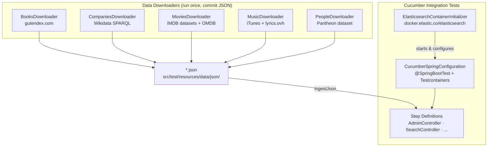
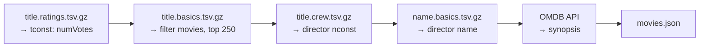

# elastic-testing

<sub>[Back to elastic](../README.md)</sub>

End-to-end integration tests for `elastic-app` plus a set of standalone data downloaders
that populate the Elasticsearch indexes with real-world datasets (books, companies, movies,
music, people).

**Stack:** Cucumber, JUnit 5, Testcontainers (Elasticsearch), Spring Boot Test

## Contents
1. [Quick Start](#1-quick-start)
2. [Architecture](#2-architecture)
3. [Data Downloaders](#3-data-downloaders)
4. [Cucumber Scenarios](#4-cucumber-scenarios)
5. [Tests](#5-tests)

---

## 1. Quick Start
<sub>[Back to top](#elastic-testing)</sub>

**Prerequisites:** Docker (or a compatible runtime such as Podman / OrbStack)

Testcontainers starts a real Elasticsearch container automatically — no manual ES setup needed.

```bash
# run all Cucumber integration tests
mvn -pl elastic/elastic-testing test
```

To regenerate a dataset JSON file, run the corresponding downloader as a `main` class:

```bash
# example: regenerate movies.json
mvn -pl elastic/elastic-testing compile exec:java \
  -Dexec.mainClass=my.javacraft.elastic.data.json.MoviesDownloader

# optional: write to a custom path
mvn -pl elastic/elastic-testing exec:java \
  -Dexec.mainClass=my.javacraft.elastic.data.json.MoviesDownloader \
  -Dexec.args="/tmp/movies.json"
```

Default output path for each downloader:
`elastic/elastic-testing/src/test/resources/data/json/<dataset>.json`

---

## 2. Architecture
<sub>[Back to top](#elastic-testing)</sub>



**Flow:** downloaded JSON files are committed to the repository and ingested into the
Testcontainers ES instance at the start of each Cucumber test run via
`prepareSearchDatasetOnce()`, which is guarded by a static `AtomicBoolean` so the
setup runs exactly once per JVM, regardless of how many scenarios execute.

---

## 3. Data Downloaders
<sub>[Back to top](#elastic-testing)</sub>

All downloaders implement `JsonDownloader<T>` and write a pretty-printed JSON array to
`src/test/resources/data/json/<dataset>.json`.

### BooksDownloader

| Detail | Value |
|--------|-------|
| Source | [gutendex.com](https://gutendex.com/books) — Gutenberg catalogue |
| Output | `books.json` — 1 000 books |
| Record fields | author, genres, name, ranking, release_year, synopsis |
| Notes | Paginates through the API until `TARGET_BOOKS_COUNT` is reached |

### CompaniesDownloader

| Detail | Value |
|--------|-------|
| Source | [Wikidata SPARQL](https://query.wikidata.org/sparql) via `curl` |
| Output | `companies.json` — 100 companies |
| Record fields | capitalization, ceo, country, description, employees, founded, headquarters, industry, name, rank, sector, website |
| Notes | Two-step SPARQL: first fetches top companies by market cap, then enriches each with details; retries with exponential backoff (up to 3 attempts) |

### MoviesDownloader

| Detail | Value |
|--------|-------|
| Source | [IMDB datasets](https://datasets.imdbws.com/) (4 gzipped TSV files) + [OMDB API](http://www.omdbapi.com/) for synopses |
| Output | `movies.json` — top 250 movies by vote count |
| Record fields | director, genres, name, ranking, release_year, synopsis |
| Notes | Streams gzipped TSVs directly (no temp files); minimum 50 000 votes pre-filter; 500 ms pause between OMDB requests |



### MusicDownloader

| Detail | Value |
|--------|-------|
| Source | [iTunes Search API](https://itunes.apple.com/search) + [lyrics.ovh](https://api.lyrics.ovh/v1/) |
| Output | `music.json` — 80 tracks × 3 bands = up to 240 songs |
| Bands | ABBA, Powerwolf, Sabaton |
| Record fields | album, band, lyrics, name, release_year, track_number |

### PeopleDownloader

| Detail | Value |
|--------|-------|
| Source | [Pantheon dataset](https://storage.googleapis.com/pantheon-public-data/person_2025_update.csv.bz2) (BZIP2-compressed CSV) |
| Output | `people.json` — 100 most historically significant people |
| Record fields | age, date_of_birth, date_of_death, name, ranking, reasons_for_being_famous, surname |
| Notes | Streams the BZIP2 CSV; name splitting handles single-word names (e.g. "Muhammad", "Aristotle"); age calculated from birth/death dates using a `Clock` |

---

## 4. Cucumber Scenarios
<sub>[Back to top](#elastic-testing)</sub>

Feature files live in `src/test/resources/features/`. Each scenario exercises a real
HTTP endpoint against the Testcontainers ES instance.

| Feature file | Scenarios | What it tests |
|---|---|---|
| `AdminController.feature` | Index creation for all 7 indexes | `PUT /api/admin/indexes/{index}` — idempotent, acknowledges `true` |
| `SearchController.feature` | Wildcard, Fuzzy, Interval, Span, Search per dataset | Full round-trip: ingest JSON → query → assert exact field values |
| `VoteController.feature` | Vote creation, update, idempotency | Vote endpoints and `VoteResult` outcomes |
| `PostRankingController.feature` | Post ranking scores | Karma, hotScore, risingScore, bestScore calculations |
| `SchedulerJobs.feature` | Scheduled job execution | Background scheduler runs and side effects |

### SearchController scenarios

| Rule | Search type | Pattern | Expected result |
|------|------------|---------|----------------|
| Books | Fuzzy | `embitered` | Frankenstein (ranking 1) |
| Books | Interval | `victor frankenstein` | Frankenstein (ranking 1) |
| Books | Span | `victor frankenstein` | Frankenstein (ranking 1) |
| Books | Wildcard | `Pequod` | Moby Dick (ranking 4) |
| Books | Search | `Pequod` | Moby Dick (ranking 4) |
| Companies | Wildcard | `Cupertino` | Apple Inc. (rank 3) |
| Companies | Search | `Dhahran` | Saudi Aramco (rank 1) |
| Movies | Fuzzy | `uxoricyde` | The Shawshank Redemption (ranking 1) |
| Movies | Interval | `hopeful compassion` | The Shawshank Redemption (ranking 1) |
| Movies | Span | `hopeful compassion` | The Shawshank Redemption (ranking 1) |
| Movies | Wildcard | `Scottish` | Braveheart (ranking 66) |
| Movies | Search | `imprisoned` | Oldboy (ranking 203), Thor: Ragnarok (ranking 122) |
| Music | Wildcard | `Enola` | Nuclear Attack — Sabaton |
| Music | Search | `Versailles` | Rise of Evil — Sabaton |
| People | Wildcard | `Lumbini` | Gautama Buddha (ranking 2) |
| People | Search | `Woolsthorpe` | Isaac Newton (ranking 3) |

> Elasticsearch is eventually consistent — `assertWithWait` polls up to 2 000 ms
> (in 200 ms intervals) before asserting the expected result count.

---

## 5. Tests
<sub>[Back to top](#elastic-testing)</sub>

Run all integration tests (requires Docker):

```bash
mvn -pl elastic/elastic-testing test
```

Run a specific feature by tag:

```bash
mvn -pl elastic/elastic-testing test -Dcucumber.filter.tags="@Fuzzy"
mvn -pl elastic/elastic-testing test -Dcucumber.filter.tags="@Wildcard"
mvn -pl elastic/elastic-testing test -Dcucumber.filter.tags="@Span"
mvn -pl elastic/elastic-testing test -Dcucumber.filter.tags="@Interval"
mvn -pl elastic/elastic-testing test -Dcucumber.filter.tags="@All"
```

Run unit tests for the downloaders only (no Docker needed):

```bash
mvn -pl elastic/elastic-testing test -Dtest="*DownloaderTest"
```

### Downloader unit test coverage

| Test class | Tests | What it covers |
|------------|------:|----------------|
| `BooksDownloaderTest` | 1 | `BookRecord` fields are alphabetically ordered |
| `CompaniesDownloaderTest` | 1 | `CompanyRecord` fields are alphabetically ordered |
| `MoviesDownloaderTest` | 10 | TSV parsers: ratings filter, basics join+sort, crew extraction, name lookup |
| `MusicDownloaderTest` | 1 | `MusicRecord` fields are alphabetically ordered |
| `PeopleDownloaderTest` | 6 | Name splitting, date normalisation, age calculation, biography resolution |

> Testcontainers pulls `docker.elastic.co/elasticsearch/elasticsearch` on the first run.
> Subsequent runs reuse the cached image. No manual Elasticsearch installation is needed.
