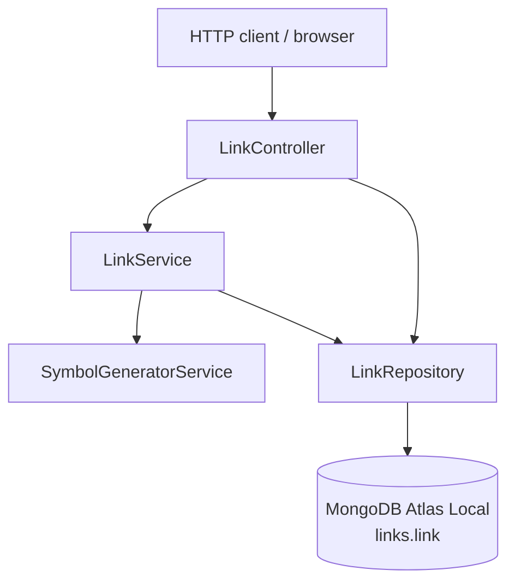
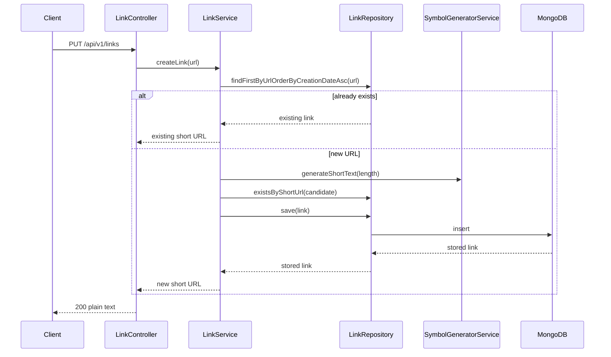
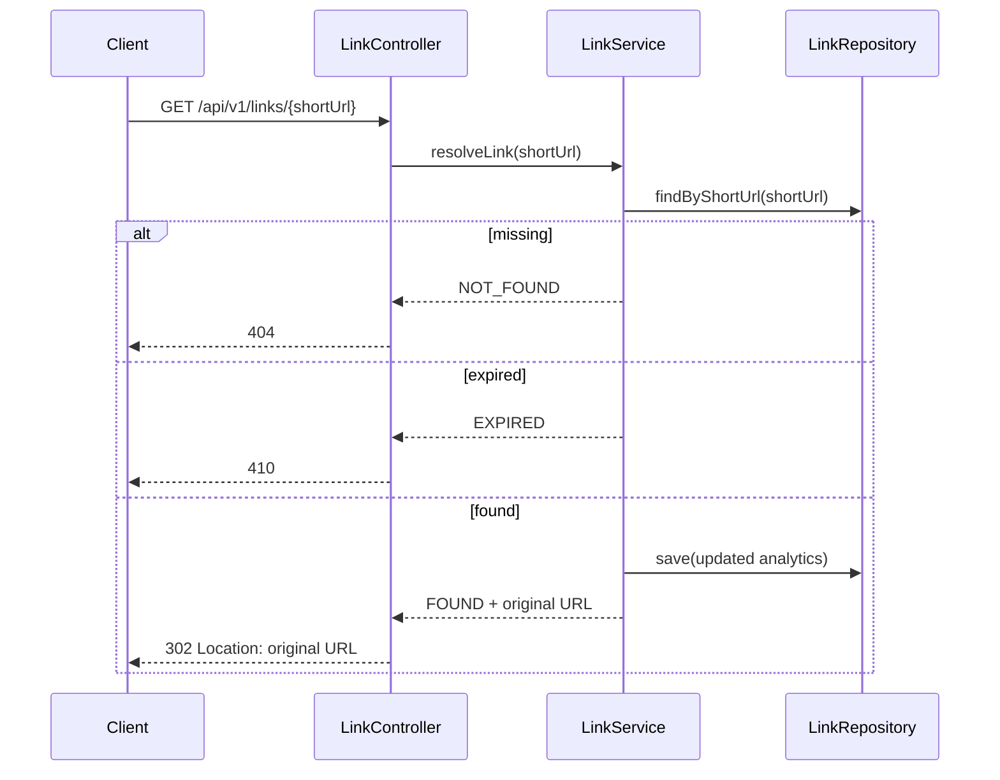
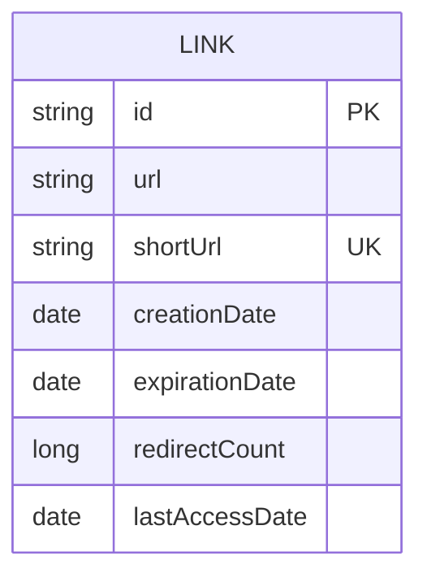

# Linker Architecture

[Back to Linker](README.md)

## Contents
1. [Goal](#1-goal)
2. [Runtime Topology](#2-runtime-topology)
3. [Module Structure](#3-module-structure)
4. [Request Flows](#4-request-flows)
5. [Persistence Model](#5-persistence-model)
6. [Local Infrastructure](#6-local-infrastructure)
7. [Testing Strategy](#7-testing-strategy)
8. [Current Tradeoffs](#8-current-tradeoffs)

## 1. Goal
[Back to top](#linker-architecture)

`linker` is a single Spring Boot application that shortens long URLs, redirects incoming short links,
and exposes redirect analytics.

The architecture is intentionally small:

- controller layer for HTTP mapping
- service layer for URL-shortening and redirect logic
- repository layer for MongoDB persistence

One small pragmatic exception exists: the list-all endpoint reads directly from `LinkRepository`
inside the controller because it is a simple pass-through read and does not require extra business logic.

## 2. Runtime Topology
[Back to top](#linker-architecture)

Runtime notes:

- `LinkController` handles HTTP endpoints under `/api/v1/links`
- `LinkService` owns creation, resolution, expiration checks, and analytics updates
- `LinkRepository` is the only persistence integration point
- `SymbolGeneratorService` generates random alphanumeric short IDs
- the local runtime database is MongoDB Atlas Local, but the application still talks to it through the normal MongoDB protocol

## 3. Module Structure
[Back to top](#linker-architecture)

| Package | Responsibility |
|---|---|
| `dev.nklip.javacraft.linker.controller` | HTTP endpoints |
| `dev.nklip.javacraft.linker.service` | business logic and short-code generation |
| `dev.nklip.javacraft.linker.persistence.entity` | MongoDB document model |
| `dev.nklip.javacraft.linker.persistence.repository` | Spring Data Mongo repository |

Key classes:

| Class | Purpose |
|---|---|
| `LinkController` | create, redirect, analytics, and list endpoints |
| `LinkService` | idempotent URL creation, redirect resolution, analytics updates |
| `SymbolGeneratorService` | random short-code generation |
| `Link` | MongoDB document stored in collection `link` |
| `LinkRepository` | lookup and persistence operations |

## 4. Request Flows
[Back to top](#linker-architecture)

### Create short link

### Redirect

### Analytics

- `GET /api/v1/links/{shortUrl}/analytics`
- reads the stored link by short code
- returns a computed `expired` flag based on the current time and `expirationDate`

### List all links

- `GET /api/v1/links`
- reads all `Link` documents directly through `LinkRepository`
- returns the raw stored documents without additional transformation

## 5. Persistence Model
[Back to top](#linker-architecture)

`Link` is stored as a MongoDB document in collection `link`.

Field notes:

- `shortUrl` has a unique index and is the critical database-level collision guard
- `url` is not unique in the database, but the service reuses the earliest existing document for the same URL
- `redirectCount` and `lastAccessDate` are updated on successful redirects only
- `expirationDate` controls `410 Gone` behavior

## 6. Local Infrastructure
[Back to top](#linker-architecture)

The repo-local Docker stack is defined in [compose.yaml](/Users/nikita.lipatov/projects/GitHub/JavaCraft/linker/compose.yaml).

It uses:

- image: `mongodb/mongodb-atlas-local:8`
- port: `127.0.0.1:27017`
- Mongo data directories:
  - `/data/db`
  - `/data/configdb`
- built-in healthcheck:
  - `/usr/local/bin/runner healthcheck`

The compose file uses stable named volumes and default container name `linker-mongodb`.

This keeps the local developer setup reproducible without depending on an ad-hoc Docker Desktop
container definition.

## 7. Testing Strategy
[Back to top](#linker-architecture)

The module test suite intentionally does not require the local Docker MongoDB container.

Testing split:

- controller tests cover HTTP behavior and response codes
- service tests cover idempotent creation, expiration handling, and redirect analytics updates
- repository tests cover Mongo persistence behavior
- symbol generator tests cover short-code generation rules

Mongo persistence tests use `mongo-java-server` / in-memory Mongo infrastructure so they stay fast
and isolated from Docker state.

## 8. Current Tradeoffs
[Back to top](#linker-architecture)

- the application is small and intentionally keeps both redirect and analytics logic in a single service
- analytics updates are simple document rewrites, not a separate event pipeline
- the service relies on random short-code generation plus unique-index enforcement instead of a sequence-based ID scheme
- local runtime uses MongoDB Atlas Local in Docker, while tests use in-memory Mongo infrastructure for speed and isolation
