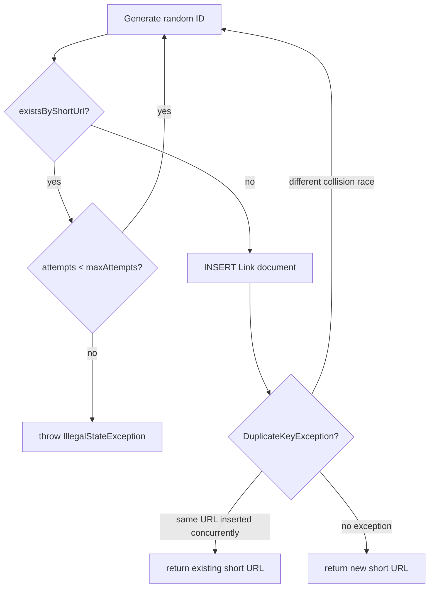

# Linker

A URL shortening service built with Spring Boot and MongoDB Atlas Local. It stores long URLs,
generates collision-safe short IDs, redirects users, and tracks redirect analytics.

**Stack:** Java 25, Spring Boot, Spring Data MongoDB, MongoDB Atlas Local, Swagger/OpenAPI, JUnit 5, Mockito

## Contents
1. [Quick Start](#1-quick-start)
2. [Runtime Overview](#2-runtime-overview)
3. [API Reference](#3-api-reference)
4. [Data Model](#4-data-model)
5. [Collision-safe ID Strategy](#5-collision-safe-id-strategy)
6. [Configuration](#6-configuration)
7. [Tests](#7-tests)

---

## 1. Quick Start
<sub>[Back to top](#linker)</sub>

### 1.1 Local MongoDB

The module now includes a Docker Compose file for the local MongoDB Atlas Local runtime.

Start local MongoDB with:

```bash
docker compose -f linker/compose.yaml up -d
```

Stop it with:

```bash
docker compose -f linker/compose.yaml down
```

If you want to clear the persisted local MongoDB data too:

```bash
docker compose -f linker/compose.yaml down -v
```

This stack exposes MongoDB Atlas Local on `localhost:27017` and uses container name
`linker-mongodb` by default.

Local Docker details:

| Setting | Value |
|---|---|
| Image | `mongodb/mongodb-atlas-local:8` |
| Host port | `127.0.0.1:27017` |
| Volumes | `linker_mongodb_data`, `linker_mongodb_config` |
| Healthcheck | `/usr/local/bin/runner healthcheck` |

### 1.2 Start the application

```bash
mvn -pl linker spring-boot:run
```

| URL | Description |
|-----|-------------|
| http://localhost:8100/swagger-ui/index.html | Swagger UI |
| http://localhost:8100/v3/api-docs | OpenAPI JSON |

For the detailed runtime/data-flow view, see [ARCHITECTURE.md](/Users/nikita.lipatov/projects/GitHub/JavaCraft/linker/ARCHITECTURE.md).

---

## 2. Runtime Overview
<sub>[Back to top](#linker)</sub>

`linker` is a single Spring Boot module with three main runtime layers:

- `LinkController`
  exposes the short-link, redirect, analytics, and list endpoints.
- `LinkService`
  owns short-code creation, idempotent URL reuse, expiration checks, and redirect-count updates.
- `LinkRepository`
  provides MongoDB persistence for `Link` documents.

The redirect flow is:

1. look up the short URL
2. return `404` if missing
3. return `410` if expired
4. increment analytics fields
5. respond with `302 Found` and a `Location` header

The create flow is intentionally idempotent:

1. look up the earliest stored link for the incoming full URL
2. return that short URL immediately if it already exists
3. otherwise generate a candidate short code
4. retry on collisions or concurrent duplicate-key races
5. persist and return the final short URL

---

## 3. API Reference
<sub>[Back to top](#linker)</sub>

Base path: `/api/v1/links`

| Method | Path | Description | Success response |
|--------|------|-------------|------------------|
| `PUT` | `/` | Create or retrieve a short link | `200` plain-text short URL |
| `GET` | `/{shortUrl}` | Redirect to original URL | `302 Found` + `Location` header |
| `GET` | `/{shortUrl}/analytics` | Get redirect analytics | `200` `LinkAnalytics` JSON |
| `GET` | `/` | List all stored links | `200` `List<Link>` JSON |

### PUT /api/v1/links — Create Short Link

Request body: raw URL string (plain text or JSON string in Swagger).

```
https://example.org/very/long/path?with=params
```

Response: full short URL as plain text.

```
http://localhost:8100/api/v1/links/Ab12Cd
```

**Idempotent:** submitting the same URL a second time returns the existing short link. No duplicate
document is created for that URL.

Implementation note:
- `LinkController` accepts both plain text and JSON-string request bodies and normalizes wrapped quotes before delegating to `LinkService`.

### GET /api/v1/links/{shortUrl} — Redirect

| Condition | Status |
|-----------|--------|
| Link found and not expired | `302 Found` + `Location` header pointing to original URL |
| Unknown short code | `404 Not Found` |
| Link past its expiration date | `410 Gone` |

### GET /api/v1/links/{shortUrl}/analytics — Analytics

Returns `404 Not Found` for an unknown short code, otherwise:

```json
{
  "shortUrl": "Ab12Cd",
  "url": "https://example.org/page",
  "creationDate": "2026-03-11T11:12:00.000+00:00",
  "expirationDate": "2026-04-10T11:12:00.000+00:00",
  "redirectCount": 3,
  "lastAccessDate": "2026-03-11T11:14:21.000+00:00",
  "expired": false
}
```

### GET /api/v1/links — List all links

Returns the raw stored `Link` documents from MongoDB as JSON.

---

## 4. Data Model
<sub>[Back to top](#linker)</sub>

**`Link`** — MongoDB document stored in collection `link`.

| Field | Type | Description |
|-------|------|-------------|
| `id` | String | MongoDB ObjectId |
| `url` | String | Original long URL |
| `shortUrl` | String | Unique short code (unique index) |
| `creationDate` | Date | Creation timestamp |
| `expirationDate` | Date | Expiration timestamp |
| `redirectCount` | long | Number of successful redirects |
| `lastAccessDate` | Date | Timestamp of the most recent redirect |

---

## 5. Collision-safe ID Strategy
<sub>[Back to top](#linker)</sub>

Short codes are random alphanumeric strings (default: 6 characters, charset A-Z a-z 0-9).
The service handles both pre-insert collisions and concurrent-insert races:



- **Pre-insert check:** `existsByShortUrl()` detects known collisions before the write.
- **Unique index on `shortUrl`:** prevents duplicates at the database level.
- **Post-insert guard:** catches `DuplicateKeyException` for concurrent insert races.

---

## 6. Configuration
<sub>[Back to top](#linker)</sub>

[application.yaml](/Users/nikita.lipatov/projects/GitHub/JavaCraft/linker/src/main/resources/application.yaml):

```yaml
host: http://localhost:8100/api/v1/links

linker:
  short-url:
    length: 6
    max-attempts: 64
  expiration-days: 30

spring:
  data:
    mongodb:
      database: links
      uri: mongodb://localhost:27017/?directConnection=true/links
```

The local Docker setup in [compose.yaml](/Users/nikita.lipatov/projects/GitHub/JavaCraft/linker/compose.yaml)
matches that default local MongoDB port.

The key runtime properties are:

| Property | Meaning |
|---|---|
| `host` | base URL prefix used when building the returned short URL |
| `linker.short-url.length` | generated short-code length |
| `linker.short-url.max-attempts` | maximum retry count before failing URL creation |
| `linker.expiration-days` | default lifetime of a created link |
| `spring.data.mongodb.uri` | MongoDB connection string |

---

## 7. Tests
<sub>[Back to top](#linker)</sub>

Run the full test suite for this module:

```bash
mvn -pl linker test
```

In-memory MongoDB for tests is provided by `mongo-java-server`, so the module tests do not require
the local Docker MongoDB container.

The test mix covers:

- controller behavior
- link creation and redirect logic
- repository integration
- short-code generation rules
