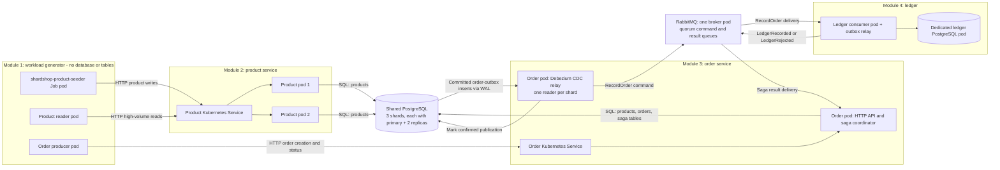
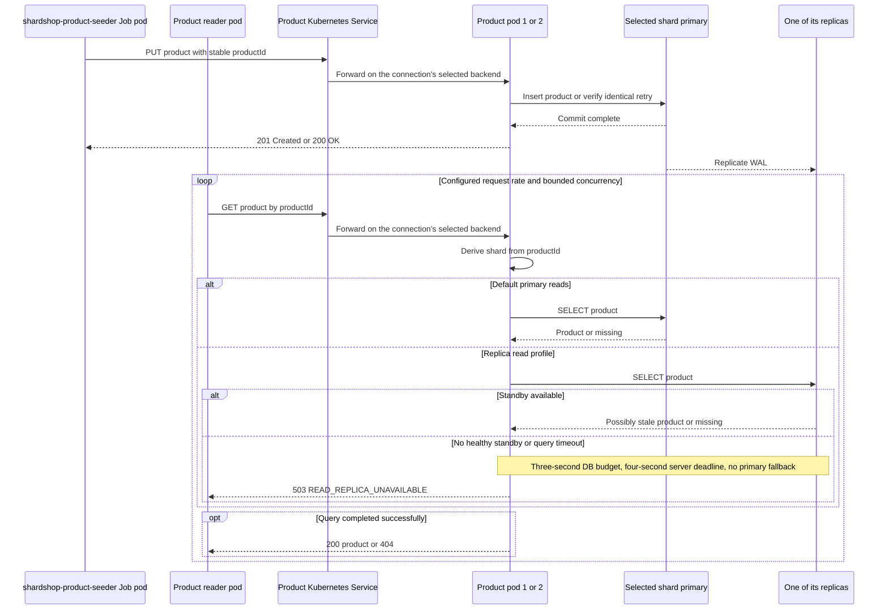
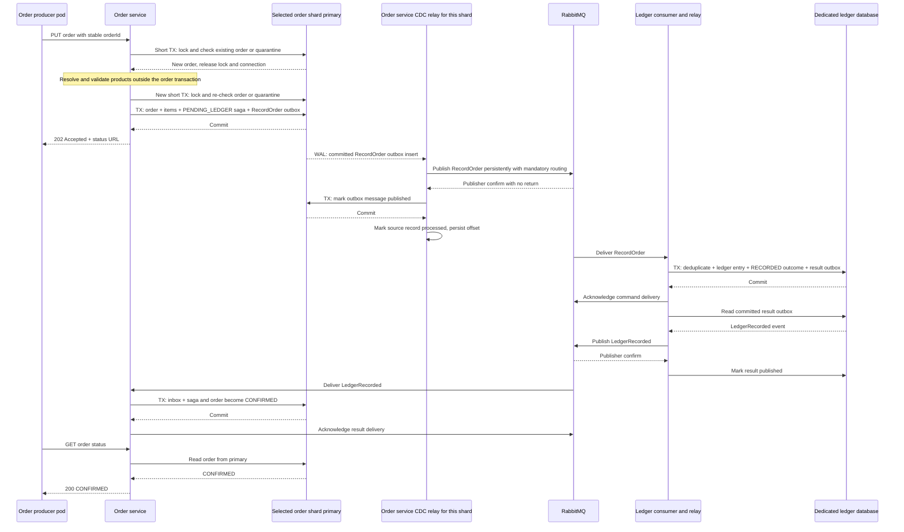
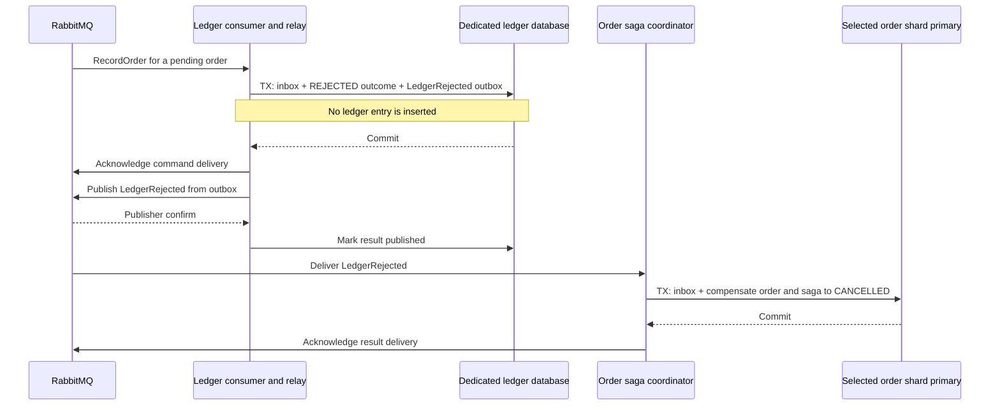
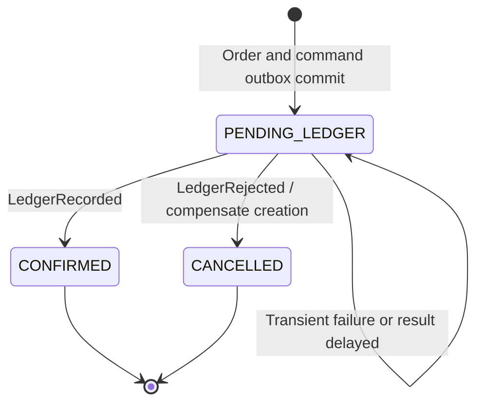
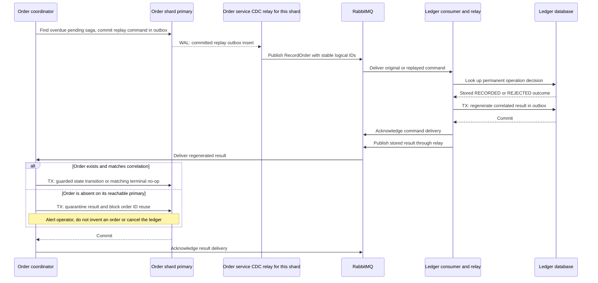

# ShardShop Architecture

Status: target architecture.

ShardShop combines product and order workloads, three replicated PostgreSQL
shards, and an asynchronous order ledger. This document defines its contracts and
boundaries; [PLAN.md](PLAN.md) describes implementation milestones and infrastructure.
All runtimes, libraries, build plugins, and images follow [VERSIONS.md](VERSIONS.md):
LTS where available, otherwise maintained stable GA releases with explicit upgrade
deadlines, plus the named support-policy exception for the requested
`de.mkammerer.snowflake-id:snowflake-id` library. The version gate also includes
repository-inherited dependency overrides.

Build and test with JDK 25 or newer (bytecode targets release 25), and run the
applications on OpenJDK 25. The Maven toolchain uses the installation selected by
`JAVA_HOME`, without a vendor or exact-patch restriction; preview features remain
disabled. Container bases are the verified
Canonical OpenJDK 25 JDK/JRE images on Ubuntu 26.04 in the version lock. The JRE
is shell-free; implement the startup allocator launcher as a Java/native executable
and explicitly configure a non-root container user. Final application images
retain the deployment qualification gates in the version policy.

## 1. Goal and module boundaries

Build a Kubernetes lab that generates product writes, heavy product reads, and
orders against sharded, replicated PostgreSQL. Capture committed order writes
using change data capture (CDC) and pass their immutable order information through
RabbitMQ to `shardshop-ledger`, which records it in a separate ledger database as
part of the saga.

RabbitMQ supports this pipeline as the message transport: Debezium performs the
database capture, and its official RabbitMQ sink demonstrates the supported
integration. RabbitMQ itself does not read PostgreSQL's write-ahead log (WAL).
See [Debezium Server's RabbitMQ sink](https://debezium.io/documentation/reference/stable/operations/debezium-server.html#debezium-server-rabbitmq-stream-sink-configuration).
This design embeds Debezium Engine in the existing order relay so it can retain
the publication bookkeeping and mandatory-routing protocol defined below;
Kafka and a separate Debezium Server deployment are not required.

There are five top-level Maven modules and six deployable applications. The
workload module is a POM aggregator containing three applications; product, order,
and ledger are the other three applications; `shardshop-sharding` is a library used
only by product and order. PostgreSQL and RabbitMQ are supporting infrastructure.

| # | Proposed module | Responsibility | Initial deployment | Data ownership |
|---|---|---|---|---|
| 1 | `shardshop-workload` | Aggregate the three workload applications below | No aggregator pod; one seeder Job and two load Deployments | No database, tables, migrations, or database credentials |
| 2 | `shardshop-product` | Accept product creation and product reader HTTP requests | Two identical product service pods behind one Kubernetes Service | `catalog.products` in the shared sharded PostgreSQL deployment |
| 3 | `shardshop-order` | Accept order HTTP requests, coordinate the saga, and relay captured order-outbox inserts to RabbitMQ | One stateless order service pod initially | Orders, items, saga state, inbox, outbox, and CDC offsets in the same shared deployment |
| 4 | `shardshop-ledger` | Consume ledger commands and persist order ledger records | One ledger consumer pod plus a separate PostgreSQL pod initially | A dedicated ledger database, inbox, and outbox |
| 5 | `shardshop-sharding` | Route product and order IDs to shards (section 3) | None; a library inside the product and order services | None |

Module 1 contains exactly three independently runnable submodules:

| Submodule | Workload | Deployment |
|---|---|---|
| `shardshop-product-seeder` | Seed a fixed product dataset through module 2 over HTTP | Its own Job pod; exits when seeding completes |
| `shardshop-product-reader` | Generate many concurrent product reads through module 2 to load the database | Its own Deployment with one pod |
| `shardshop-order-producer` | Generate orders, submit them to module 3 over HTTP, and observe their status | Its own Deployment with one pod |

Each workload app uses configuration, deterministic fixture IDs, and bounded
in-memory business state. The order producer's startup launcher also reserves a
generator ID in the Kubernetes allocator described in section 3. Workload apps
have no direct SQL connections or persistent tables,
including inbox/outbox tables. Each has its own request rate, concurrency limit,
and resource budget. All three derive the same fixed product dataset from their
own configuration; no manifest file is shared between modules. Dataset size
chooses a deterministic subset; a retry never generates new product IDs. Dataset
derivation and live identifier allocation follow section 3.

### Workload lifecycle

1. Start the infrastructure and product, order, and ledger services. Keep reader
   and order producer Deployments at zero replicas.
2. Run `shardshop-product-seeder` as a Job with `restartPolicy: Never`,
   `backoffLimit: 3`, and `activeDeadlineSeconds: 300`. Its idempotent PUTs seed
   immutable products. It exits successfully only after all products have been
   acknowledged and verified through primary reads. A retry uses the same IDs.
3. The startup script waits for that run's Job `Complete` condition with a
   300-second deadline. A failed Job or deadline stops startup; it never starts
   load against a partially seeded dataset. Only after success does it scale the
   reader and order producer to one replica each. Their startup checks verify the
   same dataset configuration; replica-profile reads may still observe lag.
4. The baseline performs **no continuous product writes after seeding**. The Job
   stays completed rather than being restarted as a Deployment. Reader and order
   producer run until the scenario controller scales them to zero. Each new run
   has a new run ID and a fresh seeding gate; a previous Job cannot satisfy it.

For deterministic saga rejection, seed separate USD and EUR product fixtures.
The order API accepts any valid single currency matching its products; the ledger
allowlist is USD in the rejection scenario. Configure `rejected-order-percent=10`.
Using exactly the SHA-256 input and unsigned big-endian digest interpretation
specified in section 3, compute `currencyBucket = digestInteger % 100`. Select
EUR-only items when `currencyBucket < rejected-order-percent`, otherwise USD-only
items. The percentage must be an integer from 0 through 100; the default selects
approximately 10% of uniformly generated IDs. The order producer's tests fix the
boundaries with IDs `880803840000004605` (bucket 0), `880803840000004432` (9),
`880803840000004254` (10), and `880803840000004299` (99), computed independently
of the implementation. A retry preserves its items and currency. This
exercises a ledger business rejection rather than an HTTP validation failure.

Module 2 also handles product creation so the product seeder can populate the
shared database through an application API. Module 4 includes a consumer process:
the ledger database itself does not consume RabbitMQ messages.

### Shared shard routing, nothing else

`shardshop-sharding` is the only shared ShardShop Java module. It holds the
version-2 routing rule from section 3 and its golden-vector tests, whose expected
shards were computed independently of the implementation; never regenerate them
with the code under test. Only product and order depend on it; the ledger and the
workload apps never see shard routing. Nothing else is shared: each module owns its
HTTP API, DTO/model classes, JSON handling, validation, persistence types, and test
data, which keeps release cycles and domain models decoupled. The order service's
read access to catalog data remains an explicit schema dependency.

Proposed source layout:

```text
shardshop/
  pom.xml                         # parent aggregator, no runtime process
  shardshop-sharding/             # shard routing, used only by product and order
  shardshop-workload/
    shardshop-product-seeder/
    shardshop-product-reader/
    shardshop-order-producer/
  shardshop-product/
  shardshop-order/
  shardshop-ledger/
  infra/                          # Kubernetes, PostgreSQL, RabbitMQ configuration
```

## 2. Runtime topology



After seeding, six application pods run: one reader, one order producer, two
product pods, one order pod, and one ledger consumer pod. The product seeder's
completed Job pod is separate and consumes no ongoing application CPU. The diagram
shows both lifecycle phases. The nine shared PostgreSQL pods, one ledger PostgreSQL
pod, **one RabbitMQ broker pod**, and operator/system pods are additional. The
order CDC relay runs inside the order service process; the ledger's result-outbox
relay continues to poll its own database. The order pod stays stateless: each
shard's CDC offsets live in that shard's database.

Both product pods are stateless and interchangeable. They use the same shard
mapping and database constraints; pod-local state must not determine correctness.
Clients connect through Kubernetes Services, and applications connect through
database role Services rather than pod addresses.

## 3. Shared PostgreSQL: sharding and replication

Modules 2 and 3 share one **logical database deployment**, implemented as three
independent PostgreSQL shards. They connect to the same `shardshop` database on
each shard but own separate schemas: `catalog` for products and `ordering` for
orders and sagas. This is an intentional shared-database boundary for the lab.


Each shard has the same catalog/ordering schema definitions but different rows.
A replica copies its own primary; replication does not distribute rows between
A, B, and C. Use three CloudNativePG clusters with three instances each, one per
worker node, as described in [PLAN.md](PLAN.md). Each is a replication quorum: a
commit is acknowledged once any one of its two standbys has durably flushed it
(`ANY 1`), so a shard tolerates losing one instance without losing acknowledged
commits or blocking writes. Quorum-based failover (`failoverQuorum`) promotes a
standby only when the operator can confirm it holds every synchronously committed
transaction; otherwise the shard waits for an operator decision. Primary and
replica roles can change during failover. See
[CNPG synchronous replication](https://cloudnative-pg.io/docs/1.30/replication/)
and [quorum-based failover](https://cloudnative-pg.io/docs/1.30/failover/).

### Identifier generation and representation

Generate new application IDs with the explicitly pinned dependency
`de.mkammerer.snowflake-id:snowflake-id:0.0.2`. Use it for `productId`, `orderId`,
`sagaId`, logical `commandId`, and transport `messageId` wherever a new ID is
required. Reuse existing correlation/business IDs on retries and generate a fresh
transport ID only when a new outbox envelope is committed. Item positions can
remain order-local integers rather than requiring another global ID.

Use an injected, process-scoped `SnowflakeIdGenerator` configured explicitly with
`createCustom`, a checked wrapper around `MonotonicTimeSource`, `Structure(41, 10, 12)`, and
`Options.SequenceOverflowStrategy.THROW_EXCEPTION`. The common epoch is
**2026-01-01T00:00:00Z**. The sign bit stays zero; the remaining bits are a
41-bit millisecond offset, 10-bit generator ID, and 12-bit sequence. Treat epoch,
layout, and generation contract as immutable for the lifetime of retained data.
The overflow option avoids the default unbounded spin-wait. The library's lock
serializes concurrent callers; never create a generator per request or thread.
See the [upstream implementation](https://github.com/phxql/snowflake-id/tree/v0.0.2).
The wrapper implements the library's `TimeSource` and validates the exact tick it
returns on every call: `0 <= ticks < 2^41`. Check before the library masks the
timestamp bits; the library alone cannot detect wrap on a fresh process. With
this epoch, generation expires at **2095-09-07T15:47:35.552Z**. The wrapper retains
millisecond tick duration and the configured epoch. An out-of-range source must
throw immediately, never clamp or wrap.

Java models use `long`/`Long`, and PostgreSQL identifier/correlation columns use
`BIGINT` with positive-value constraints and their existing uniqueness/foreign-key
rules. HTTP paths use canonical decimal text. All ID fields in JSON requests,
responses, broker envelopes, fixture files, and OpenAPI/JSON Schema contracts are
**strings**, for example `"1006632960004096"`, never JSON numbers. This preserves
values above JavaScript's exact-integer range. Require a whole-string match of
ASCII `[1-9][0-9]{0,18}` using Java `Matcher.matches()` or Python `re.fullmatch`,
followed by a checked range validation from 1 through 9223372036854775807.
Anchors alone do not replace whole-string matching; never use `find()` or
`re.match` for this check. Reject zero, signs, padding, whitespace (including
trailing LF/CRLF and leading TAB), fractions, exponents, overflow, and numeric
JSON tokens before conversion or hashing; do not coerce them. HTTP validation
returns `400 INVALID_REQUEST`, not an uncaught conversion error. Hash the accepted text
without modification. IDs are identifiers, not secrets or authorization tokens,
and generation time/worker bits are not a public business-time ordering contract.

The order producer generates each order ID once before its first PUT and retains
it with the exact creation payload through bounded retries/status polling. Order
and ledger services create new saga/command/message IDs with their own generators.
Product pods and the product reader need no live generator merely to accept/read
supplied IDs. Do not allocate separate Snowflake IDs for a ledger entry that is
already uniquely identified by its order ID.

### Generator identity across processes and restarts

Reserve generator **0** for offline deterministic fixtures. For this finite local
lab, a named `shardshop-snowflake-generators` ConfigMap keeps a monotonically
increasing allocation counter for live IDs **1-1023**. A startup launcher reserves
one fresh ID with a Kubernetes resource-version compare-and-set before **every
ID-producing JVM start**, including a container restart in the same pod. This
must not run only in an init container. Use the pinned kubectl/tooling and narrow
RBAC for this one precreated ConfigMap; workload apps still have no SQL credentials
or database tables. Concurrent starts retry CAS conflicts with a bounded deadline.
An uncertain reservation burns that slot and obtains another; it never guesses
or reuses one. The live generator receives its allocation only after success.

Never reuse a slot while any data from that lab can be restored/replayed. This
allows at most 1,023 ID-producing process starts, including burned reservations,
per retained lab dataset. Exhaustion, allocation failure, or missing/stale registry
state fails startup visibly. Preserve the allocation high-water independently of
older database backups, and never roll it back on restore. A destructive fresh-lab
reset can reset the registry only after all old emitters and associated data,
broker deliveries, backups, and replay inputs have been retired. Scaling beyond
this bound needs a separately designed persistent timestamp-fencing/reuse scheme.

The monotonic time source protects an active generator from wall-clock steps but
does not persist a high-water mark across JVM restarts; distinct incarnation IDs
provide the restart safety here. Invalid epoch/time range, clock-source failure,
or sequence overflow must fail without emitting an ID. Return a bounded
`503 ID_GENERATION_UNAVAILABLE` if a service needs a new ID and cannot allocate
one; rollback its transaction and retain any consumed broker delivery for the
existing retry/DLQ path. Workload generation backs off with a bounded budget.
Once an ID has been assigned to a logical request, transient failures never
replace it with another ID.

### Reproducible product dataset and routing

Derive the fixed product dataset with this same library and layout, generator 0,
and an injected deterministic millisecond `TimeSource` whose first timestamp is
above zero. A versioned dataset configuration fixes the timestamp/sequence
schedule, product count, USD/EUR split, and payload rules; reserve disjoint
timestamp ranges for future dataset versions. The seeder, reader, and order
producer each derive the dataset from that configuration instead of generating
wall-clock IDs or sharing a manifest file, and each app's tests pin the IDs it
derives. Dataset changes may select subsets but must never assign a different
product payload to an existing ID. Live generators never use generator 0.

Products and orders use the same routing rule with their own Snowflake IDs,
implemented once in `shardshop-sharding`:

```text
digestInteger(id) = unsignedBigEndian(SHA-256(UTF-8(canonical decimal Snowflake ID)))
shard(id) = digestInteger(id) % 3
0 -> shard-a; 1 -> shard-b; 2 -> shard-c
```

Use the validated canonical decimal ID text, with no newline or leading zeros,
before UTF-8 encoding. Interpret all 32 SHA-256 digest bytes as one unsigned
256-bit **big-endian** integer: byte 0 is most significant, byte 31 least
significant. Do not use a signed integer, truncate the digest, or use Java
`hashCode()`. Currency selection uses this same integer modulo 100, independently
of the modulo-3 shard result; the order producer implements it with its own code
and does not depend on `shardshop-sharding`. This is identifier/routing contract **version 2**,
replacing the previous unreleased draft and its vectors. Keep it immutable once
implemented. Existing persisted data using another ID/routing contract would
require an explicit migration; do not silently accept two formats or probe all
shards as a fallback. Generator IDs are independent of database shard IDs.

| Data | Routing key | Writer / owner |
|---|---|---|
| `catalog.products` | `product_id` | Product service; order service has read-only access |
| `ordering.orders`, `ordering.order_items` | `order_id` | Order service |
| `ordering.order_sagas`, `ordering.order_outbox`, `ordering.order_inbox` | `order_id` | Order service; colocated with the order |
| `ordering.orphan_results` | `order_id` | Order service; quarantine for a result whose order is missing |
| `ordering.conflicting_results` | `order_id` | Order service; quarantine for a result that conflicts with saved identity or outcome |
| `ledger.ledger_entries`, `ledger.ledger_operations`, `ledger.ledger_inbox`, `ledger.ledger_outbox` | No sharding initially | Ledger service, in its separate database |
| `ledger.conflicting_commands` | No sharding initially | Ledger service; quarantine for a command that conflicts with a permanent decision |

Order items remain on their order's shard even when referenced products live on
other shards. Resolve product IDs against their primaries before creating the
order and persist server-derived product/price snapshots in its items. The first
version treats products as immutable after creation and has no stock reservation,
payment, or cross-shard transaction. Cross-shard product references have no SQL
foreign key; the order-to-items foreign key is local to one shard.

All writes, order validation, order status reads, and saga processing use `-rw`.
Product reads also use `-rw` by default. An optional load-test profile uses `-ro`
to demonstrate replica read scaling; it explicitly permits stale or temporarily
missing products. Standby replay can lag behind committed primary writes. See
[PostgreSQL standby replication](https://www.postgresql.org/docs/current/warm-standby.html).

The replica read profile is strict: it **does not fall back to `-rw`**. CNPG's
`-ro` Service selects standbys only; with three instances it has no endpoints only
when neither standby is ready, such as when one is down and the other is
promoted. Fail affected reads with
`503 READ_REPLICA_UNAVAILABLE` within a four-second server request deadline,
never `404`. Bound the complete database phase, including pool acquisition,
connection setup, SQL execution, and any retry, to three seconds in total; every
individual timeout must fit the remaining budget. Reserve the final server
second for cancellation/error mapping and sending the response. The reader's
five-second overall deadline leaves a one-second response margin in the local lab.
Discard broken connections and reconnect to `-ro` when a standby becomes ready.
Record these failures separately from stale/missing products and continue requests
to unaffected shards. This keeps the measured primary and replica workloads
distinct. See [CNPG Service roles](https://cloudnative-pg.io/docs/1.30/service_management/).

Select the shard before opening a transaction, and keep it fixed until commit.
Order creation, saga state, and its outgoing command commit together on one
primary. The order CDC relay captures committed outbox inserts from every shard's
WAL, rather than polling for unpublished rows. Freeze the hash and
three-shard mapping: changing the divisor requires a data migration strategy.
Public APIs expose decimal-string Snowflake business IDs, never shard selectors.

### CDC from shard writes to the ledger

Use the **transactional outbox with log-based CDC** pattern. Each accepted order
write inserts one `RecordOrder` envelope into `ordering.order_outbox` in the same
transaction as the order, item snapshots, and saga. That committed insert is the
captured change. Rollbacks emit no command, and the HTTP handler never publishes
to RabbitMQ. Capture only this table for the ledger command flow: product seeding,
raw order/item changes, and saga status updates are not separate ledger commands.
The outbox supplies a complete business snapshot without downstream joins or
cross-shard transaction assembly.

- Run one Debezium PostgreSQL connector per shard against its `-rw` Service,
  using `pgoutput`, `wal_level=logical`, a dedicated publication for
  `ordering.order_outbox`, and distinct connector, slot, and offset identities.
  Size replication slots and WAL senders for both physical replication and CDC.
  Provision publications administratively and disable connector auto-creation.
  The CDC login has replication permission and only the SQL privileges needed
  to connect and snapshot that table; it is separate from `order_app` and has
  no business-table DML or DDL privileges. The relay uses `order_app` for its
  publication-status update and its offset writes.
- Embed the connectors through [Debezium Engine](https://debezium.io/documentation/reference/stable/development/engine.html)
  in the order service's IO layer, with bounded buffers and a batch consumer
  that explicitly controls record completion. Keep one active reader per shard:
  PostgreSQL allows only one active consumer per replication slot, and the
  initial single order pod uses a non-overlapping replacement strategy. Scaling
  order pods requires explicit per-shard ownership, such as a Kubernetes Lease;
  the offsets are already shared through each shard's database.
- On first start, take a consistent snapshot of retained outbox rows and then
  stream WAL; on restart, resume the saved offsets. Handle snapshot (`r`) and
  insert (`c`) records as commands, skipping snapshot rows already marked
  published. Ignore publication-status updates, cleanup deletes, tombstones,
  and connector control records as business messages. Keep the outbox envelope
  immutable; only publication metadata may change. Reconciliation inserts a
  new envelope rather than updating the original payload.
- Extract the stored envelope, preserving `messageId`, logical IDs, fingerprint,
  schema version, and all ID fields as canonical decimal JSON strings. Publish
  it persistently to `ledger.commands` with routing key `ledger.record-order`.
  Do not send the raw Debezium row-change envelope to the ledger consumer.
  Preserve source order within each shard; there is no global order across
  shards, and redelivery still requires the existing idempotency checks.
- After a publisher confirm with no mandatory return, mark that outbox row
  published in its shard using the existing service role. Only after that local
  transaction commits may the batch consumer mark the source record processed
  and allow its offset to be flushed. Never advance past a failed publication
  or status update. Use finite publish/SQL timeouts and bounded backoff; on
  exhaustion, fail that reader. A per-shard supervisor restarts it from its
  durable position with capped exponential backoff, indefinitely, without
  affecting other shards or the pod's liveness; alert when a reader stays down
  or lags past a threshold. A crash before the durable offset checkpoint can
  redeliver the same `messageId`; it must never generate a new logical command.

Retain the logical slots on shutdown. Store each reader's offsets with
Debezium's JDBC offset store in a table of its own shard database, so offsets
replicate, fail over, and are backed up with that shard. Configure and verify
failover-capable logical slots and their synchronization to both standbys before
promotion; reconnecting to `-rw` alone does not preserve CDC progress. In both
durability profiles, logical decoding must not advance beyond WAL the standbys
have flushed (`synchronized_standby_slots`, which CloudNativePG manages once
slot synchronization is enabled), so no command is published for a change a
promoted standby could lack. CloudNativePG lists every standby's slot there, so
CDC pauses while either standby is unavailable, even though quorum writes
continue; alert on its lag. See the
[PostgreSQL connector](https://debezium.io/documentation/reference/stable/connectors/postgresql.html)
and [PostgreSQL logical-slot failover requirements](https://www.postgresql.org/docs/current/logicaldecoding-explanation.html#LOGICALDECODING-REPLICATION-SLOTS-SYNCHRONIZATION).
If a slot, offset, or required WAL is lost, stop and reconcile retained outbox
and permanent saga/ledger state before an explicit resnapshot; never silently
start at the current WAL position. Detect this by failing on a slot/offset
mismatch (Debezium's `offset.mismatch.strategy=trust_offset`, never
`trust_slot`) and on a slot without offsets; the supervisor never restarts a
reader stopped this way. Pin and qualify Debezium with PostgreSQL,
the application runtime, and RabbitMQ under [VERSIONS.md](VERSIONS.md) before
implementation.

### Migration ownership and database privileges

| Owner | Flyway `schemas` and `defaultSchema` | Qualified history table | Migration location |
|---|---|---|---|
| Product | `catalog` | `catalog.flyway_schema_history` | Product module's `db/migration/catalog` |
| Order | `ordering` | `ordering.flyway_schema_history` | Order module's `db/migration/ordering` |
| Ledger | `ledger`, in its separate database | `ledger.flyway_schema_history` | Ledger module's `db/migration/ledger` |

Each Flyway instance scans only its owner's location and schema, with
`table=flyway_schema_history`. Both owners can independently have `V1` because
their histories are separate; neither uses `public.flyway_schema_history`.
Flyway places history in its configured default schema. See
[Flyway default schema](https://documentation.red-gate.com/flyway/reference/configuration/flyway-namespace/flyway-default-schema-setting).

Bootstrap schemas with separate owner/migration roles. Run migration Jobs once
per owner per primary; disable application-startup migration. Apply catalog
migrations before order migrations that depend on them, verify each owner's
version on all shards, and stop rollout on a failure. Owner versions need not
match each other. Schema changes reach standbys through physical replication.

Runtime roles are not schema owners, superusers, or members of migration roles.
Give `product_app` only the required catalog DML and `order_app` ordering DML.
The catalog migration owner grants cross-schema reads explicitly on each shard:

```sql
GRANT USAGE ON SCHEMA catalog TO order_app;
GRANT SELECT ON TABLE catalog.products TO order_app;
```

Grant no catalog writes, DDL, or migration-history access to `order_app`, and no
ordering access to `product_app`. Revoke inherited/public privileges that would
bypass those limits. Use qualified SQL names and repeat explicit grants for any
new catalog read surface. This enforces read-only product access at the database.
Use bounded connection pools per service, pod, and endpoint; account for both
product pods when budgeting PostgreSQL connections.

The ordering migration owner also provisions CDC access on each shard. It owns
`ordering.order_outbox` and, with `CREATE` on the database, creates the
dedicated publication for it. It also creates the offsets table that Debezium's
JDBC store would otherwise try to create, and grants `order_app` DML on it. The
separate CDC login gets its replication attribute from a privileged bootstrap
role, such as a CloudNativePG managed role, plus `CONNECT`, `USAGE` on
`ordering`, and `SELECT` on `ordering.order_outbox` only.

## 4. Product generation and read load

Proposed HTTP contract:

- `PUT /api/v1/products/{productId}` creates an immutable product. Return `201`
  on creation, `200` for an identical retry, and `409` for conflicting ID reuse.
- `GET /api/v1/products/{productId}` returns product information or `404`.

Both endpoints validate the canonical positive decimal ID contract before IO;
invalid path/body IDs return `400 INVALID_REQUEST`. Product JSON uses string IDs
and storage uses `BIGINT`, including any product references in order items.

### HTTP connection policy

Use HTTP/1.1 for the load profile, with 16 connections per reader pod to the
product Service, at least 16 concurrent workers, a maximum connection lifetime
of 30 seconds with up to three seconds of jitter, and a 10-second idle timeout.
Warm up the pool with concurrent requests. Retire aged connections after their
current request and discard failed connections immediately. Use a two-second
connect timeout and five-second overall request deadline; retries stay inside
that deadline. Configure the Service with `sessionAffinity: None`.

Kubernetes selects a backend for a TCP connection; repeated HTTP requests on
that connection stay on that backend. Pool size and connection rotation create
new selection opportunities, including after a pod restart, but do not guarantee
an exact 50/50 split. See [Kubernetes Service proxies](https://kubernetes.io/docs/reference/networking/virtual-ips/).
Expose request counters by pod identity. Under sustained load, verify positive
counter deltas for both ready product pods within a 120-second observation window,
and repeat after replacing one pod. Fail the check with per-pod counts and pool
metrics if either receives no traffic; do not assume that replica count proves
traffic distribution.



The diagram illustrates replica visibility. The default synchronous durability
profile waits for a durable WAL acknowledgement from any one of the shard's two
standbys before reporting commit; replica query visibility still waits for WAL
replay, so a read can reach the standby that has not yet replayed it. The
separate asynchronous profile omits that commit acknowledgement requirement.
The product service queries PostgreSQL for every load-test read; caching is
disabled so the reader exercises the database. Measure request rate, latency,
errors, pool saturation, shard distribution, and replica lag. Configure finite
HTTP/SQL timeouts, bounded concurrency, and bounded retries with backoff.

## 5. Order creation and ledger saga

Module 3 is the saga coordinator. The workflow uses local database transactions
and asynchronous commands/results; there is no transaction spanning PostgreSQL,
RabbitMQ, and the ledger database.

Use `PUT /api/v1/orders/{orderId}` with a stable client-generated Snowflake ID and immutable
creation payload. The first valid request commits a `PENDING_LEDGER` order and
returns `202 Accepted`, its ID, and a status URL. An identical retry returns `202`
while pending or `200` with the existing terminal status; conflicting ID reuse
returns `409`. Compare a persisted normalized request fingerprint. A retry never
starts another saga. `GET /api/v1/orders/{orderId}` returns the current status or
`404`; accepting a request does not yet mean the ledger has recorded it.

### Validation and HTTP errors

| Condition | Response | Retry behavior |
|---|---|---|
| Noncanonical/out-of-range Snowflake ID, numeric JSON ID, malformed body, empty items, non-positive quantity, invalid currency code | `400 INVALID_REQUEST` | Correct the request |
| A product is absent on its reachable primary | `422 PRODUCT_NOT_FOUND` | Seed or correct the product ID |
| Items use different currencies | `422 MIXED_CURRENCIES` | Submit an order in one currency |
| Order currency differs from an item's product currency | `422 CURRENCY_MISMATCH` | Correct the order currency; no currency conversion |
| Any required product shard is unavailable or its query times out | `503 CATALOG_UNAVAILABLE` | Bounded backoff with the same order ID and payload |
| The order shard cannot be reached, including an unknown commit result | `503 ORDER_STORE_UNAVAILABLE` | Retry the same ID and payload; the existing order may already have committed |
| A new saga/command/message ID cannot be generated after successful validation/state checks | `503 ID_GENERATION_UNAVAILABLE` | Retry the same order ID and payload; no partial saga/outbox commit |
| Existing order ID has a different normalized creation payload | `409 ORDER_ID_CONFLICT` | Do not reuse that ID for different data |
| Order ID is quarantined after detected data loss | `409 ORDER_RECONCILIATION_REQUIRED` | Operator reconciliation must resolve it |

Apply this precedence and transaction boundary, independent of lookup completion
order:

1. Validate canonical decimal ID strings/ranges, body syntax, and local field
   constraints. Any failure returns `400 INVALID_REQUEST` before database access.
2. Open a short transaction on the order primary, take the per-order advisory
   lock, and check unresolved orphan quarantine first: return
   `409 ORDER_RECONCILIATION_REQUIRED` if ID reuse is blocked. Otherwise check
   the existing order: a different fingerprint returns `409 ORDER_ID_CONFLICT`,
   and an identical fingerprint returns its saved status without catalog access.
   Failure to perform this check returns `503 ORDER_STORE_UNAVAILABLE`. For a
   new order, release the transaction, lock, and connection before catalog IO.
3. Resolve all distinct product IDs through their primaries, with bounded
   concurrency and a shared lookup deadline. No order-shard transaction, advisory
   lock, or borrowed order connection may be held during these queries. Collect
   outcomes rather than returning whichever lookup finishes first. Within catalog
   validation, any unavailable shard/timeout wins as `503 CATALOG_UNAVAILABLE`,
   then any missing product wins as `422 PRODUCT_NOT_FOUND`, then multiple product
   currencies win as `422 MIXED_CURRENCIES`, then a single product currency that
   differs from the order currency gives `422 CURRENCY_MISMATCH`. Thus a USD order
   with USD and EUR items is mixed, and a missing product plus an unavailable
   catalog shard is unavailable. Sort any reported product IDs canonically.
4. After catalog IO completes, open a new short order transaction, reacquire the
   same lock, and repeat step 2's quarantine/existing-order checks before acting
   on the catalog outcome. A concurrent creation or quarantine wins over the
   preliminary catalog result. Order-store failure here returns
   `503 ORDER_STORE_UNAVAILABLE`. If still new and validation failed, return the
   selected catalog error without writing state. If valid, atomically insert the
   order, snapshots, saga, and outbox. Generate the new saga/command/message IDs
   only in this new-order path; failure gives `503 ID_GENERATION_UNAVAILABLE`
   without a partial commit. Existing-order retries do not need new IDs. Unique
   constraints remain the final guard.

Products are immutable in this version, so validated snapshots can be used after
reacquiring the order lock. No catalog query occurs inside either order
transaction. Bound advisory-lock acquisition and the write transaction as well.
Derive amounts from catalog prices and requested quantities; never trust client
totals. Ledger currency support is a later business decision, allowing the
deterministic EUR rejection scenario after successful HTTP validation.

### Successful order



The ledger app inserts one `ledger_entries` row per successfully recorded order,
with a unique `order_id`, amount, currency, and recorded timestamp. It receives
the required immutable order snapshot in the command and never queries the shared
database. Module 3 never writes directly to the ledger database.

### Business rejection and compensation

A definitive ledger business rejection, such as an unsupported currency, records
a durable `REJECTED` operation outcome without inserting a ledger entry. The
coordinator compensates the already committed order creation by marking the order
and saga `CANCELLED`, retaining their audit history.





An infrastructure timeout is an unknown outcome, never proof of rejection. Retry
transient failures; leave the order pending while its outcome is unresolved.
Persist one immutable ledger operation outcome per order, so replay cannot turn
a rejected operation into a recorded one. Terminal saga transitions are guarded
against duplicates and conflicting results. Cancelling an already confirmed
order is outside this workflow; it would require a separate compensating ledger
entry and saga, not deletion of the original ledger row.

### Reconciliation and replayed outcomes

Persist `reconciliation_attempts` and `next_reconciliation_at` on
`ordering.order_sagas`, initialized to zero and creation time plus 60 seconds.
The coordinator scans each primary every 30 seconds for eligible `PENDING_LEDGER`
sagas. Under the saga lock, re-check the state, schedule, and five-attempt limit.
If there is already an unpublished command, its CDC reader resumes/retries that
captured insert without incrementing the reconciliation counter; a reader stopped
by slot, offset, or WAL loss must be recovered first. Otherwise atomically enqueue another
`RecordOrder` with a new transport `messageId` but the same logical `commandId`,
`sagaId`, `orderId`, fingerprint, and immutable snapshot, increment the saga's
counter, and persist its next eligible time in the same transaction.

The five waits before attempts are 60, 120, 240, 300, and 300 seconds, giving
approximately 17 minutes from creation through attempt five, plus scan/IO delay.
An unpublished outbox row can extend this schedule. After attempt five, disable
further automatic enqueueing and alert if the saga remains pending; operator
replay is explicit. Transport cleanup, restarts, or duplicate deliveries never
reset the saga's counter or schedule. Keep this state even after outbox rows are
deleted, and retain it with the saga through terminal-state retention and backups.

The ledger looks up the permanent operation decision before short-circuiting on
an inbox duplicate. For an identical command that already has a decision, it
**enqueues the stored `LedgerRecorded` or `LedgerRejected` outcome again** in a
local transaction, with a fresh result `messageId` and the original correlation
IDs. It does this even if the command's transport `messageId` was seen before.
It never reevaluates ledger policy or inserts another entry. Persist a conflicting
command snapshot/identity in `ledger.conflicting_commands`, commit, then
acknowledge and alert. Preserve the original decision, without emitting a business
rejection that could cancel an order already recorded. This regeneration recovers results
even when the original result outbox row has been cleaned up.



Normal publishers in this diagram follow the confirm/mark-published protocol in
the success flow; the CDC publisher also checkpoints its source position only
after that protocol succeeds. Result consumers validate the command, saga, and
fingerprint; matching terminal outcomes are harmless. Persist conflicting
identities or outcomes in `ordering.conflicting_results` on the expected order shard, commit, then
acknowledge and alert while preserving the order and saga's saved state.

Both conflict tables store the received envelope, transport/logical IDs,
fingerprint, expected and received identities/outcomes, reason, and audit
timestamps. Deduplicate repeated quarantine deliveries by message identity and
payload fingerprint without hiding different conflicting payloads. Unresolved
records survive transport cleanup and backups. If quarantine persistence fails,
do not acknowledge: use the bounded retry/DLQ path in section 6. Malformed
unrouteable envelopes use the source queue's DLQ instead.

### Orders lost by asynchronous failover or restore

A result for an order absent on a **reachable primary** is different from a
temporarily unavailable shard. Persist its envelope, logical IDs, fingerprint,
outcome, and audit metadata in `ordering.orphan_results` on the expected shard,
then acknowledge and alert. The quarantine has no foreign key to `orders` and
blocks new HTTP creation with that order ID. If the shard is unavailable, use
bounded broker retries, then DLQ parking and saga reconciliation as specified in
section 6, instead of declaring the order missing. A long failover can exceed
the transport retry window, especially if both standbys are lost and synchronous
writes block until one returns. For a surviving pending saga with attempts remaining,
reconciliation regenerates a result after recovery while the old delivery may
remain parked. A lost order/saga or exhausted budget requires the operator audit
and explicit replay/restore path below; replaying an old delivery remains safe.
Serialize order creation, result application, and quarantine changes by order ID
even before an order row exists, using a transaction-scoped advisory lock; check
quarantine while holding that lock so concurrent creation cannot bypass it.
Catalog lookups occur before the final creation transaction and lock, followed by
the re-check described in the validation sequence above.

Missing orders cannot be discovered by scanning pending sagas alone. After every
asynchronous-loss drill or shard restore, pause order writes and run an operator
audit comparing an exported snapshot of permanent ledger decisions with orders
on all primaries by ID and fingerprint. After a restore from an older backup, the
audit also finds ledger entries whose results were acknowledged before the order
was lost. After an asynchronous-loss drill it should find none: CDC publishes no
command for WAL the standbys lack (section 3), so a lost order leaves no ledger
entry. It persists missing or mismatched pairs in the same quarantine and reports
them; it is privileged operational tooling, not cross-database access in either
service's runtime.

Restore the order and original saga identity from a verified backup or retained
creation record, then replay the command/result and clear quarantine only after
the identities and outcome agree. If the original order cannot be recovered,
retain the ledger entry and unresolved incident for an explicit business decision.
Never silently delete a ledger row, fabricate a confirmed order, or treat absence
as cancellation. Automatic reconciliation repairs missing messages; it cannot
recover lost database history. These limitations belong to shard restores and
the deliberate asynchronous-loss profile, not the synchronous durability
acceptance criteria.

## 6. RabbitMQ and delivery reliability

| Message | Route / destination queue | Consumer |
|---|---|---|
| `RecordOrder` | `ledger.commands` exchange, `ledger.record-order` queue | Ledger module |
| `LedgerRecorded`, `LedgerRejected` | `order.saga-results` exchange, `order.ledger-results` queue | Order module |

Declare `ledger.commands` as a durable direct exchange and bind
`ledger.record-order` with the routing key `ledger.record-order` before CDC starts.

Messages carry `messageId`, logical `commandId`, `sagaId`, `orderId`, type, schema
version, fingerprint, and immutable business data. Results retain command/saga
correlation and the stored outcome. All four ID fields use the same canonical
decimal-string Snowflake contract. The order ID routes results to its shard.

The reviewed community baseline is RabbitMQ **4.3.6**, with a pinned image digest
and the compatible bundled **Erlang/OTP 27.3.4.17** runtime, for native quorum delayed
retry. This is a rolling-support component, not a multi-year LTS release. Recheck
the maintained GA release and runtime matrix under [VERSIONS.md](VERSIONS.md)
before pinning; earlier broker versions need a separately specified retry design. See
[RabbitMQ release information](https://www.rabbitmq.com/release-information).
RabbitMQ 4.3.x community support ends **30 November 2026**. By 15 November 2026,
select and pin a supported successor release with native delayed retry (4.3 or
later), verify its upgrade path and policies, and rerun scenarios 6 and 7 before
cutover once they are implemented. Recheck the support schedule when implementing; 4.3.6 is a dated lab
baseline, not an indefinite deployment target.

Declare both processing queues as durable quorum queues. Install one complete
policy per source queue so each has its own dead-letter routing key; do not rely
on merging overlapping regular policies. The following provisioning specification
uses delays in milliseconds and local capacity budgets of 1,000 messages or
16 MiB of message bodies per queue, whichever admission limit is reached first.
Enable the `stream_queue` feature flag required for at-least-once dead-lettering
and verify the effective policies and queue arguments at startup:

```yaml
policies:
  - name: ledger-command-delivery
    pattern: '^ledger\.record-order$'
    apply-to: queues
    definition:
      delivery-limit: 5
      delayed-retry-type: failed
      delayed-retry-min: 1000
      delayed-retry-max: 5000
      dead-letter-strategy: at-least-once
      overflow: reject-publish
      max-length: 1000
      max-length-bytes: 16777216
      dead-letter-exchange: shardshop.dlx
      dead-letter-routing-key: ledger.record-order.dlq
  - name: order-result-delivery
    pattern: '^order\.ledger-results$'
    apply-to: queues
    definition:
      delivery-limit: 5
      delayed-retry-type: failed
      delayed-retry-min: 1000
      delayed-retry-max: 5000
      dead-letter-strategy: at-least-once
      overflow: reject-publish
      max-length: 1000
      max-length-bytes: 16777216
      dead-letter-exchange: shardshop.dlx
      dead-letter-routing-key: order.ledger-results.dlq
  - name: parking-capacity
    pattern: '^(ledger\.record-order|order\.ledger-results)\.dlq$'
    apply-to: queues
    definition:
      overflow: reject-publish
      max-length: 1000
      max-length-bytes: 16777216
```

Bind each durable quorum parking queue to the durable direct exchange
`shardshop.dlx` using its own name as routing key: `ledger.record-order.dlq` or
`order.ledger-results.dlq`. Declare
parking queues with `x-delivery-limit=-1`, no TTL/expiry, no automatic consumer,
and no onward DLX. Their capacity policy above rejects new arrivals when full,
so the source retains unconfirmed dead letters. Repeated failures of a manual
replay tool must not discard the parked message. Processing queues keep the
bounded delivery limit above.
Declare `x-quorum-initial-group-size=1` explicitly for this one-broker lab and use
a PVC; quorum queue type alone does not give a single broker high availability.

The documented retry formula is `min(delayed-retry-min * delivery_count,
delayed-retry-max)`: counts 1-5 imply delays of 1-5 seconds, approximately 15
seconds of delay plus processing time. The documentation's worked example is
inconsistent with that formula; scenario 7 must measure rejection counts,
redelivery timestamps, and the exact delivery-limit boundary on the pinned broker.
This is a short transient-retry budget. Longer outages, including primary
failover and a synchronous wait while both standbys are down, are expected to
park messages in a DLQ. Pending-saga reconciliation then regenerates commands and
stored results after recovery, subject to its durable five-attempt budget; after
exhaustion, recovery requires operator replay. Old parked deliveries can remain
until audited manual replay or resolution. Retry exhaustion never cancels an order.

- Store outgoing messages in an outbox in the same transaction as their business
  change. Use durable exchanges/queues, persistent messages, publisher confirms,
  and mandatory routing; returned or unconfirmed messages remain unpublished.
  The order CDC adapter must handle mandatory returns before marking a source
  record processed: a confirm alone can acknowledge an unroutable message.
  This is an explicit adapter requirement, not an assumed guarantee of the
  Debezium Server sink's default settings.
- Acknowledge consumed messages only after the local transaction commits. A
  publisher confirm means broker acceptance, not completed ledger processing.
  See [RabbitMQ acknowledgements and confirms](https://www.rabbitmq.com/docs/confirms).
- Expect at-least-once delivery. Persist inbox deduplication by `messageId` and
  business uniqueness by `orderId`. Serialize each ledger operation. An identical
  duplicate must regenerate its stored result through the outbox, even on an
  inbox hit; it never adds a ledger row or silently drops the result. A crash
  after publish but before marking an outbox row or checkpointing the CDC offset
  can produce another delivery.
- For a transient processing failure, use `basic.reject(requeue=true)` so the
  quorum queue increments its failure count and delays redelivery in that same
  queue. RabbitMQ 4.3 `basic.nack` does not increment that count. Do not cycle
  messages through TTL retry queues or republish them to reset the delivery limit.
  A malformed message uses `basic.reject(requeue=false)` for immediate quarantine.
- On delivery-limit exhaustion, at-least-once dead-lettering retains the source
  message until its DLQ accepts it. A missing/unavailable destination causes
  retention; retained dead letters consume the source's capacity. Once its finite
  limits are reached, negative publisher confirms make relays retain their
  database outbox rows as unpublished and back off; order CDC offsets must not
  advance past those failed publishes. Provision/bind the DLQs first
  and monitor capacity; never downgrade to drop-head or classic dead-lettering.
  See [quorum retry and dead-letter semantics](https://www.rabbitmq.com/docs/quorum-queues).
- For manual replay, publish the original payload and logical IDs persistently
  with mandatory routing and publisher confirms. Acknowledge the DLQ delivery
  only after confirmation with no return. A crash in that gap may duplicate it.
  Retry exhaustion leaves the saga pending; reconciliation follows section 5.

Resume the CDC readers for all order shards and the ledger result relay after
restart. Monitor CDC lag, reader restarts, offset checkpoints, replication-slot retained WAL,
outbox age, queue depth, dead letters, pending saga age, and conflicting results.
Broker outages can retain WAL as well as outbox rows; set disk/lag alerts and a
finite WAL retention budget. If that budget invalidates a slot, require the
explicit recovery procedure in section 3 rather than skipping missing changes.
Use bounded consumer prefetch and database timeouts. The queue delivery limit
bounds one transport message's attempts; the coordinator's separate persisted
limit bounds automatic logical-command reconciliation. Manual replay is explicit.
Queue admission limits are not exact process-memory or disk ceilings: in-flight
publishes can overshoot quorum limits, and byte limits exclude broker overhead.
Bound consumer prefetch and publisher concurrency, monitor broker resource alarms
and database outbox growth, and size the lab limits with headroom. Scenario 7
must demonstrate queue-level rejection while broker-wide alarms remain clear.
See [RabbitMQ queue length limits](https://www.rabbitmq.com/docs/maxlength).

### Retention

Retain `ledger.ledger_operations` **permanently**, including rejected decisions,
logical IDs, request fingerprint, immutable snapshot, and result data sufficient
to regenerate the exact outcome. Ledger entries are also permanent. Retain order
and saga terminal identities/states, and unresolved quarantine records; never
recycle order IDs. An old rejected operation cannot become recorded merely because
the ledger's currency allowlist changed.

Transport inbox rows and confirmed-published outbox rows may be cleaned after a
configured operational window. For order outboxes, cleanup also requires a durable
CDC checkpoint past the captured insert; publication time alone is insufficient.
Keep cleanup deletes out of the command stream. Reconciliation counters and
timestamps belong to `ordering.order_sagas` and are unaffected by that cleanup.
Never remove unpublished outbox rows, unresolved `ordering.orphan_results`,
`ordering.conflicting_results`, or `ledger.conflicting_commands`, or the permanent
business decisions. An arbitrarily old manual DLQ replay remains safe after
transport cleanup because operation identity and outcome
checks still apply. Backups and restores must preserve those permanent decisions.

## 7. Consistency, tradeoffs, and verification

Sharding distributes data; replication provides two standbys for each shard. The
product service's two pods scale HTTP handling independently of these database
roles. The catalog read contract couples product/order schema changes, while the
ledger has independent storage and eventual consistency with orders.

Asynchronous PostgreSQL replication may lose acknowledged commits on failover,
so an accepted order can disappear; outbox/idempotency logic does not repair that
loss. Because CDC waits for WAL the standbys have flushed, such an order's command
never reached the ledger. A shard restored from an older backup, however, can lack
orders whose ledger commands were already delivered. Use the asynchronous profile
for explicit loss demonstrations. The default saga durability profile requires
a durable acknowledgement from any one of the shard's two standbys and promotes
only a standby confirmed to hold every such commit. One lost instance neither
blocks writes nor loses acknowledged commits; writes block only while both
standbys are unavailable. See
[PostgreSQL replication tradeoffs](https://www.postgresql.org/docs/current/warm-standby.html).
The initial single-instance ledger database and one-broker RabbitMQ deployment
are availability limits. Durable quorum queues with one member cannot tolerate
loss of that member's storage. Persistent volumes and backups remain necessary;
broker high availability needs three brokers and three-member quorum queues, and
ledger high availability requires its own replication design.

Acceptance scenarios for implementation:

1. Verify the seeder Job succeeds before either load Deployment starts; failed or
   partially completed seeding must block startup. Keep workloads free of SQL
   credentials/tables. With 16 connections and bounded connection lifetimes,
   observe positive request-counter deltas on both ready product pods within
   120 seconds, then repeat after one pod restarts.
2. Verify deterministic product/order routing across all three shards and physical
   replication only within each shard. Independently migrate catalog and ordering
   from `V1` without history collisions on all primaries. Assert `order_app` can
   select products but cannot write catalog data or run DDL, and `product_app`
   cannot access ordering tables. Run the version-2 routing vectors in
   `shardshop-sharding`, including values above 2^53 and signed-long boundary
   checks, and verify that both services route through it.
3. Exercise heavy product reads, primary read-after-write behavior, and explicitly
   stale replica reads under controlled lag.
4. Verify an accepted order reaches `CONFIRMED` with exactly one ledger row;
   duplicate HTTP requests and duplicate messages create no additional records.
5. Use fixed order IDs and EUR-only products selected by the configured rejection
   share. Verify `202` becomes `CANCELLED` with no ledger entry. Change the ledger
   allowlist to include EUR, clean transport inbox/outbox rows, and replay the
   old command: the permanent rejected decision must still win. Test conflicting
   payloads separately from identical retries.
6. Inject crashes before/after database commit, broker confirmation, and consumer
   acknowledgement; verify replay completes the saga without duplicate effects.
   On each shard, verify a committed order/outbox insert reaches the ledger through
   WAL capture while a rollback emits nothing. Restart CDC before/after publication
   marking and offset flush; verify the same message identity and one ledger entry.
   Cover snapshot-to-stream handoff, ignored metadata updates/deletes, missing
   command bindings (mandatory return without offset advancement), and failover
   with synchronized logical slots. Slot/offset/WAL loss must stop capture for
   explicit recovery; ordinary reconnects must resume without losing a command.
7. Measure same-queue rejection counts and redelivery timestamps on the pinned
   broker, assert its effective delayed-retry/delivery-limit behavior, and record
   total time to DLQ parking. Hold a shard unavailable beyond that window, for
   example with both standbys down so synchronous writes block, and verify DLQ
   plus reconciliation is the recovery path. In separate capacity drills, temporarily unbind a DLQ
   and then test a full DLQ: verify retained source messages reach its limits,
   negative publisher confirms leave outboxes unpublished, and broker-wide alarms
   remain clear. Keep the broker/source running; a single-broker shutdown cannot
   isolate the DLQ. Restore the binding or drain parking safely and verify progress.
   Drop a result and verify replay regenerates the immutable outcome. Delete each
   confirmed-published and CDC-checkpointed replay outbox row between reconciliation
   attempts, restart the coordinator, and use an injected clock to prove no sixth
   automatic attempt is enqueued. Recover through explicit manual replay without duplicate ledger
   effects or changes to terminal decisions. Verify conflicting command/result
   quarantine commits precede acknowledgements and survive transport cleanup.
8. Remove one standby: replica-profile reads continue through the other, writes
   continue, and CDC pauses until it returns. Remove both: replica-profile reads
   must return the documented `503` within the four-second server budget and
   observed before the reader's five-second deadline, without primary fallback,
   while unaffected shards continue. Restore the standbys and verify reads resume
   through `-ro`. Test a hung standby query as well as absent endpoints; bound the
   complete database phase to three seconds and assert an HTTP response rather
   than a client timeout. Test primary promotion separately, including any
   interval with no `-ro` endpoints.
   In an asynchronous-loss drill, verify that lost acknowledged orders leave no
   ledger records and that the audit finds none. After restoring a shard from an
   older backup, verify both late results and the operator audit detect orphan
   ledger records and block ID reuse; restoring the original order must allow
   reconciliation. Under the default synchronous profile, verify that writes
   continue with one standby unavailable and block when both are, that promotion
   preserves acknowledged saga commits, and that losing the primary together with
   one standby triggers no automatic promotion when the survivor cannot be
   confirmed current.
9. Assert the HTTP validation table: malformed input, missing products, mixed or
   mismatched currencies, unavailable catalog shards, ID conflicts, and unknown
   commit outcomes. Validation failures create no saga/outbox rows; identical
   retries of an existing order still work with its product shard unavailable.
   Combine failures and reverse lookup completion order: mixed currencies beat
   order/product mismatch, and catalog unavailability beats a missing product.
   Hang catalog IO and prove no order-shard transaction, advisory lock, or borrowed
   order connection spans it. Race that lookup with order creation or quarantine
   and verify the final locked re-check takes precedence over its catalog result.
10. Verify library generation under concurrent callers, sequence exhaustion, clock
    failure, and epoch/timestamp boundaries using a controlled `TimeSource`.
    Concurrent JVM starts, rolling replacements, and container restarts must obtain
    distinct generator allocations. Test lost CAS responses, stale/missing registry,
    and allocation exhaustion without emitting duplicates. Verify registry retention
    during backup/restore. Rerun seeding with the same dataset configuration and
    assert identical product IDs/payloads; retries preserve order and correlation
    IDs. Round-trip large IDs exactly through HTTP, messages, JDBC, and the routing
    vectors;
    reject numeric JSON IDs, noncanonical text including LF/CRLF/TAB, and
    out-of-range values before conversion or hashing, with HTTP 400 for invalid IDs.

Use unit and contract tests for routing, validation, duplicate handling, stored
outcome replay, and injected-clock reconciliation schedules. Use PostgreSQL and
RabbitMQ integration tests for transaction boundaries, privileges, CDC capture
and checkpoint recovery, and delivery policies, and bounded Kubernetes drills
for seeding, traffic, and failover.
Module-scoped build and drill commands are maintained in [PLAN.md](PLAN.md).
