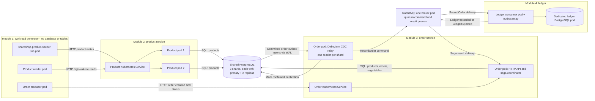
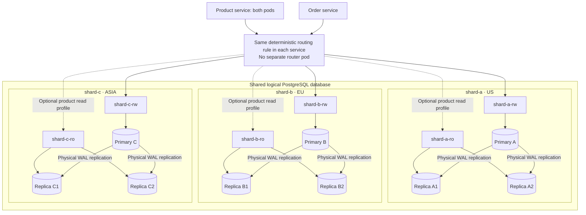
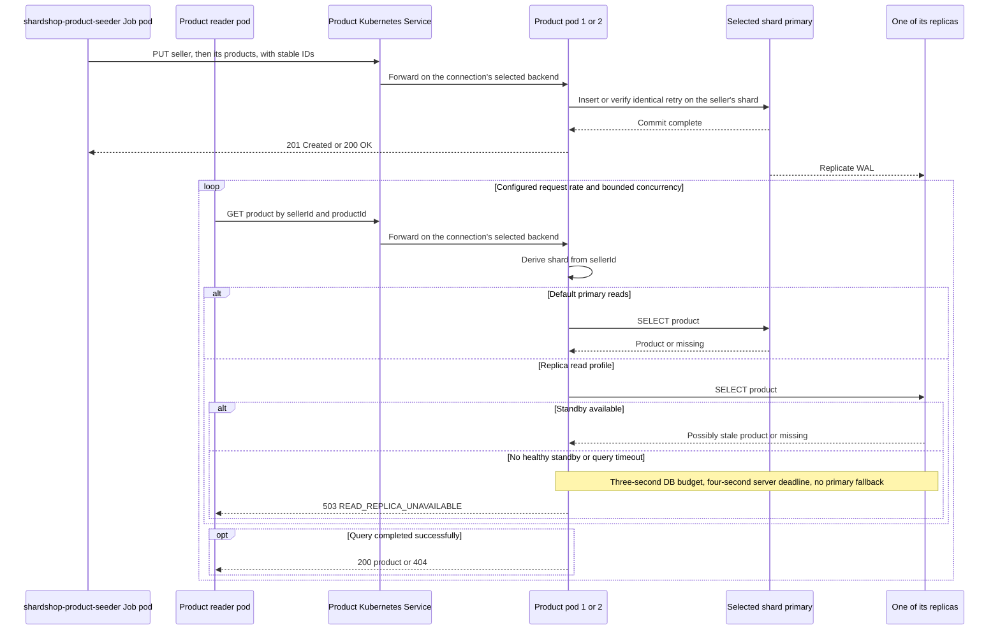
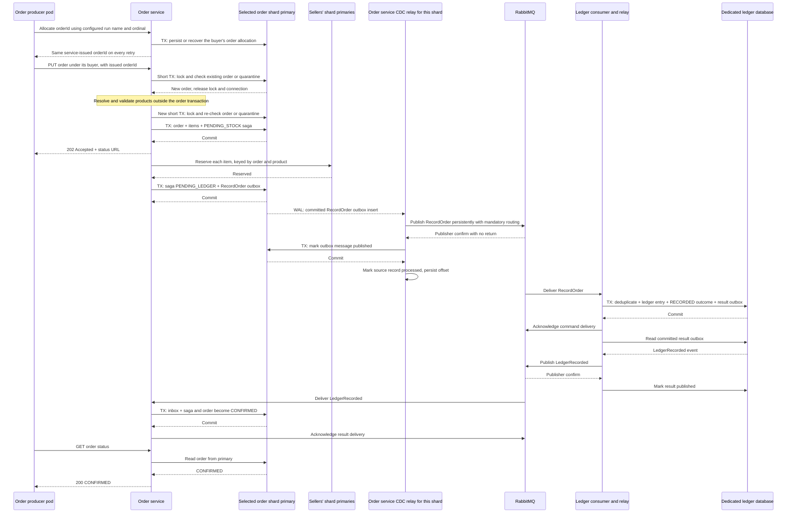
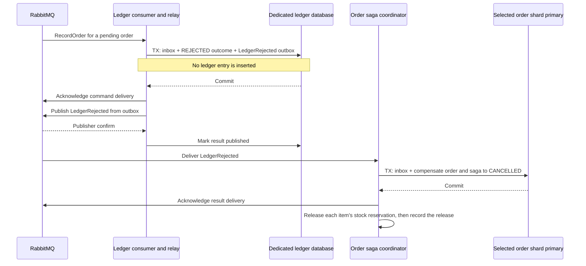
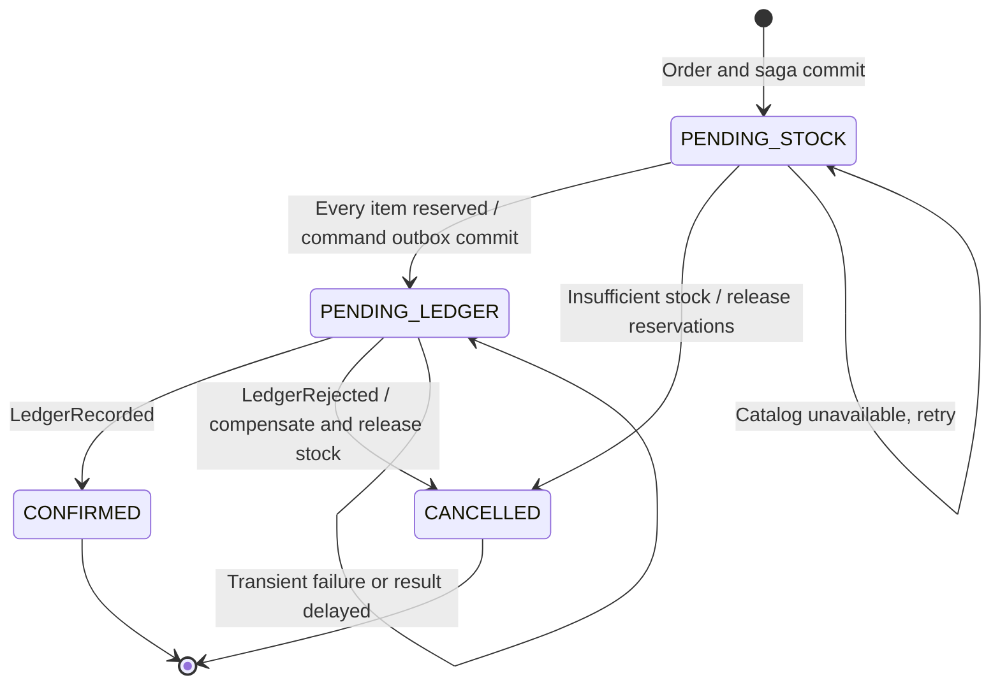
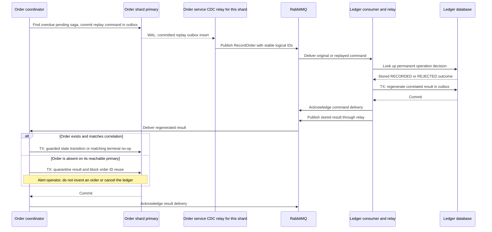

# ShardShop Architecture

Status: target architecture.

ShardShop combines product and order workloads, an inventory of replicated PostgreSQL
shards (initially `shard-a` for US, `shard-b` for EU, and `shard-c` for ASIA),
and an asynchronous order ledger. This document defines its contracts and
boundaries; [PLAN.md](PLAN.md) describes implementation milestones and infrastructure.
All runtimes, libraries, build plugins, and images follow [VERSIONS.md](VERSIONS.md):
LTS where available, otherwise maintained stable GA releases with explicit upgrade
deadlines, plus the named support-policy exception for the requested
`de.mkammerer.snowflake-id:snowflake-id` library. The version gate also includes
repository-inherited dependency overrides.

The primary target is a local kind lab on one machine: every contract, drill, and
acceptance scenario in this document must run and pass there. A later AWS target
(EKS provisioned with Terraform, PLAN milestone 7) is optional. It reuses the same
shared Helm templates through environment values and the same verified operator
Helm charts and values, delivers the applications through GitOps, and may add cloud-only
durability such as S3 backups with WAL archiving and a three-broker RabbitMQ. No
local behavior or check may depend on a cloud service.

Build and test with JDK 25 or newer (bytecode targets release 25), and run the
applications on OpenJDK 25. The Maven toolchain uses the installation selected by
`JAVA_HOME`, without a vendor or exact-patch restriction; preview features remain
disabled. Container bases are the verified
Canonical OpenJDK 25 JDK/JRE images on Ubuntu 26.04 in the version lock. The JRE
is shell-free; implement the startup allocator launcher as a Java/native executable
and explicitly configure a non-root container user. Final application images
retain the deployment qualification gates in the version policy.
This runtime selection includes Java migration tools. Flyway's final image uses
the same Canonical JRE, with only libraries, drivers, configuration and licenses
copied from the pinned upstream Flyway distribution image. Its bundled Temurin
runtime is not copied. Local Maven continues to use the selected `JAVA_HOME`
installation, including the existing upstream OpenJDK `25-open` installation.

## 1. Goal and module boundaries

Build a Kubernetes lab that generates product writes, heavy product reads, and
orders against sharded, replicated PostgreSQL. Capture committed order writes
using change data capture (CDC) and pass their immutable order information through
RabbitMQ to `shardshop-ledger`, which records it in a separate ledger database as
part of the saga.

RabbitMQ supports this pipeline as the message transport: Debezium performs the
database capture, and its official RabbitMQ sink demonstrates the supported
integration. RabbitMQ itself does not read PostgreSQL's write-ahead log (WAL).
See [Debezium Server's RabbitMQ sink](https://debezium.io/documentation/reference/stable/operations/debezium-server.html#debezium-server-rabbitmq-stream-sink-configuration).
This design embeds Debezium Engine in the existing order relay so it can retain
the publication bookkeeping and mandatory-routing protocol defined below;
Kafka and a separate Debezium Server deployment are not required.

There are five top-level Maven modules and six deployable applications. The
workload module is a POM aggregator containing three applications; product, order,
and ledger are the other three applications; `shardshop-sharding` is a library used
only by product and order. PostgreSQL and RabbitMQ are supporting infrastructure.

No module owns a database schema or ships migrations: schemas, roles and
migrations belong to the database layer described in section 3, and each service
connects with its own login role.

**ID ownership constraint:** only `shardshop-product` and `shardshop-order`
create application IDs. Product creates seller and product IDs; order creates
buyer, order, saga, command, and message IDs, including IDs reserved for ledger
results. Workload modules and ledger only consume and reuse service-issued IDs;
they never generate, derive, or allocate them locally.

| # | Proposed module | Responsibility | Initial deployment | Database access |
|---|---|---|---|---|
| 1 | `shardshop-workload` | Aggregate the three workload applications below | No aggregator pod; one seeder Job and two load Deployments | None: no tables, migrations, or database credentials |
| 2 | `shardshop-product` | Accept seller and product creation and product reader HTTP requests | Two identical product service pods behind one Kubernetes Service | Creates and reads sellers and products in schema `catalog` of the shared sharded PostgreSQL deployment |
| 3 | `shardshop-order` | Accept buyer and order HTTP requests, coordinate the saga including stock reservation, and relay captured order-outbox inserts to RabbitMQ | One stateless order service pod initially | Buyers, orders, items, saga state, inbox, outbox, and CDC offsets in schema `ordering`; reads sellers and products and writes stock reservations and product stock in `catalog` |
| 4 | `shardshop-ledger` | Consume ledger commands and persist order ledger records | One ledger consumer pod plus a separate PostgreSQL pod initially | Schema `ledger` in a dedicated ledger database: entries, decisions, inbox, and outbox |
| 5 | `shardshop-sharding` | Route seller and buyer IDs to shards (section 3) | None; a library inside the product and order services | None |

Module 1 contains exactly three independently runnable submodules:

| Submodule | Workload | Deployment |
|---|---|---|
| `shardshop-product-seeder` | Seed a fixed dataset of sellers and their products through module 2 over HTTP | Its own Job pod; exits when seeding completes |
| `shardshop-product-reader` | Generate many concurrent product reads through module 2 to load the database | Its own Deployment with one pod |
| `shardshop-order-producer` | Create its buyers, generate their orders, submit them to module 3 over HTTP, and observe their status | Its own Deployment with one pod |

Each workload app uses configuration, IDs returned by product/order APIs, and
bounded in-memory business state. Workloads have no ID generator, Snowflake
dependency, generator-allocation launcher or allocator permissions. They have no
direct SQL connections or persistent tables, including inbox/outbox tables. Each
has its own request rate, concurrency limit, and resource budget. They discover
the same fixed product dataset through the product API; no manifest file is
shared between modules. Dataset size chooses a deterministic subset; a retry
reuses the IDs issued by the owning service. Dataset discovery and service-side
identifier allocation follow section 3.

### Workload lifecycle

1. Start the infrastructure and product, order, and ledger services. Keep reader
   and order producer Deployments at zero replicas.
2. Run `shardshop-product-seeder` as a Job with `restartPolicy: Never`,
   `backoffLimit: 3`, and `activeDeadlineSeconds: 300`. Its idempotent PUTs seed
   the sellers first, then their products with initial stock, using the IDs
   obtained from the product service's dataset API. It exits
   successfully only after every seller and product has been acknowledged and
   verified through primary reads. A retry uses the same IDs.
3. The startup script waits for that run's Job `Complete` condition with a
   300-second deadline. A failed Job or deadline stops startup; it never starts
   load against a partially seeded dataset. Only after success does it scale the
   reader and order producer to one replica each. Their startup checks verify the
   same dataset configuration; replica-profile reads may still observe lag.
4. The baseline performs **no continuous seller or product creation after
   seeding**; orders change only stock, through reservations. The Job
   stays completed rather than being restarted as a Deployment. Reader and order
   producer run until the scenario controller scales them to zero. Each new run
   receives a distinct run name in its deployment configuration and has a fresh
   seeding gate; a previous Job cannot satisfy it. Workloads do not generate run IDs.

Seed sellers, buyers, and products across US, EU, and ASIA, with both USD and
EUR product fixtures in every region. Region and currency are independent: the
order producer must exercise purchases from other regions and orders mixing
sellers from all three regions within one currency. For deterministic saga
rejection, select the separate USD and EUR fixtures.
The order API accepts any valid single currency matching its products; the ledger
allowlist is USD in the rejection scenario. Configure `rejected-order-percent=10`.
The producer first obtains an order ID from the order service's allocation API.
Using that returned ID with exactly the SHA-256 input and unsigned big-endian
digest interpretation specified in section 3, compute
`currencyBucket = digestInteger % 100`. Select
EUR-only items when `currencyBucket < rejected-order-percent`, otherwise USD-only
items. The percentage must be an integer from 0 through 100; the default selects
approximately 10% of uniformly generated IDs. The order producer's tests fix the
boundaries with IDs `880803840000004605` (bucket 0), `880803840000004432` (9),
`880803840000004254` (10), and `880803840000004299` (99), computed independently
of the implementation. A retry preserves its items and currency. This
exercises a ledger business rejection rather than an HTTP validation failure.

Module 2 also handles seller and product creation so the product seeder can populate the
shared database through an application API. Module 4 includes a consumer process:
the ledger database itself does not consume RabbitMQ messages.

### Shared shard routing, nothing else

`shardshop-sharding` is the only shared ShardShop Java module. It holds the
version-2 routing rule from section 3 and its golden-vector tests, whose expected
shards were computed independently of the implementation; never regenerate them
with the code under test. Only product and order depend on it; the ledger and the
workload apps never see shard routing. Nothing else is shared: each module owns its
HTTP API, DTO/model classes, JSON handling, validation, persistence types, and test
data, which keeps release cycles and domain models decoupled. The order service's
catalog reads and stock reservations remain explicit database grants.

Proposed source layout:

```text
shardshop/
  pom.xml                         # parent aggregator, no runtime process
  shardshop-sharding/             # shard routing, used only by product and order
  shardshop-workload/
    shardshop-product-seeder/
    shardshop-product-reader/
    shardshop-order-producer/
  shardshop-product/
  shardshop-order/
  shardshop-ledger/
  database/                       # Flyway migration streams, one per schema (section 3)
  infra/                          # Kubernetes, PostgreSQL, RabbitMQ configuration
```

## 2. Runtime topology



After seeding, six application pods run: one reader, one order producer, two
product pods, one order pod, and one ledger consumer pod. The product seeder's
completed Job pod is separate and consumes no ongoing application CPU. The diagram
shows both lifecycle phases. The nine shared PostgreSQL pods, one ledger PostgreSQL
pod, **one RabbitMQ broker pod**, and operator/system pods are additional. The
order CDC relay runs inside the order service process; the ledger's result-outbox
relay continues to poll its own database. The order pod stays stateless: each
shard's CDC offsets live in that shard's database.

Both product pods are stateless and interchangeable. They use the same shard
mapping and database constraints; pod-local state must not determine correctness.
Clients connect through Kubernetes Services, and applications connect through
database role Services rather than pod addresses.

## 3. Shared PostgreSQL: sharding and replication

Modules 2 and 3 share one **logical database deployment**, implemented as three
independent PostgreSQL shards. They connect to the same `shardshop` database on
each shard and use separate schemas: `catalog` for sellers, products and stock,
and `ordering` for buyers, orders and sagas. The database layer owns both schemas; the
services only hold granted privileges. This is an intentional shared-database
boundary for the lab. The initial home-region mapping is immutable: `shard-a`
serves US, `shard-b` serves EU, and `shard-c` serves ASIA. Regions are business
placement labels, not separate physical locations in this single-machine kind
lab. The shared chart labels each shard Cluster and its inherited metadata with
`shardshop.javacraft/region`; the separate ledger has no home-region assignment.



Each shard has the same catalog/ordering schema definitions but different rows.
A replica copies its own primary; replication does not distribute rows between
A, B, and C. Use three CloudNativePG clusters with three instances each, one per
worker node, as described in [PLAN.md](PLAN.md). Each is a replication quorum: a
commit is acknowledged once any one of its two standbys has durably flushed it
(`ANY 1`), so a shard tolerates losing one instance without losing acknowledged
commits or blocking writes. Quorum-based failover (`failoverQuorum`) promotes a
standby only when the operator can confirm it holds every synchronously committed
transaction; otherwise the shard waits for an operator decision. Primary and
replica roles can change during failover. See
[CNPG synchronous replication](https://cloudnative-pg.io/docs/1.30/replication/)
and [quorum-based failover](https://cloudnative-pg.io/docs/1.30/failover/).

### Identifier generation and representation

Generate new application IDs only inside product and order, with the pinned dependency
`de.mkammerer.snowflake-id:snowflake-id:0.0.2`. Use it for `sellerId`, `productId`, `buyerId`, `orderId`,
`sagaId`, logical `commandId`, and transport `messageId` wherever a new ID is
required. Reuse existing correlation/business IDs on retries. Order reserves
both a command's transport ID and its result's transport ID when committing a
new command envelope; ledger copies the reserved result ID. Item positions can
remain order-local integers rather than requiring another global ID.

Use an injected, process-scoped `SnowflakeIdGenerator` configured explicitly with
`createCustom`, a checked wrapper around `MonotonicTimeSource`, `Structure(41, 10, 12)`, and
`Options.SequenceOverflowStrategy.THROW_EXCEPTION`. The common epoch is
**2026-01-01T00:00:00Z**. The sign bit stays zero; the remaining bits are a
41-bit millisecond offset, 10-bit generator ID, and 12-bit sequence. Treat epoch,
layout, and generation contract as immutable for the lifetime of retained data.
The overflow option avoids the default unbounded spin-wait. The library's lock
serializes concurrent callers; never create a generator per request or thread.
See the [upstream implementation](https://github.com/phxql/snowflake-id/tree/v0.0.2).
The wrapper implements the library's `TimeSource` and validates the exact tick it
returns on every call: `0 <= ticks < 2^41`. Check before the library masks the
timestamp bits; the library alone cannot detect wrap on a fresh process. With
this epoch, generation expires at **2095-09-07T15:47:35.552Z**. The wrapper retains
millisecond tick duration and the configured epoch. An out-of-range source must
throw immediately, never clamp or wrap.

Java models use `long`/`Long`, and PostgreSQL identifier/correlation columns use
`BIGINT` with positive-value constraints and their existing uniqueness/foreign-key
rules. HTTP paths use canonical decimal text. All ID fields in JSON requests,
responses, broker envelopes, fixture files, and OpenAPI/JSON Schema contracts are
**strings**, for example `"1006632960004096"`, never JSON numbers. This preserves
values above JavaScript's exact-integer range. Require a whole-string match of
ASCII `[1-9][0-9]{0,18}` using Java `Matcher.matches()` or Python `re.fullmatch`,
followed by a checked range validation from 1 through 9223372036854775807.
Anchors alone do not replace whole-string matching; never use `find()` or
`re.match` for this check. Reject zero, signs, padding, whitespace (including
trailing LF/CRLF and leading TAB), fractions, exponents, overflow, and numeric
JSON tokens before conversion or hashing; do not coerce them. HTTP validation
returns `400 INVALID_REQUEST`, not an uncaught conversion error. Hash the accepted text
without modification. IDs are identifiers, not secrets or authorization tokens,
and generation time/worker bits are not a public business-time ordering contract.

The order producer obtains each order ID from order before its first PUT and
retains it with the exact creation payload through bounded retries/status
polling. Product owns seller/product ID generation; order owns buyer/order and
saga/command/message ID generation. Ledger has no generator: each `RecordOrder`
includes an order-generated `resultMessageId`, which ledger uses as its result's
`messageId`. A duplicate command republishes the same result identity; a new
reconciliation command carries a newly reserved result ID. Do not allocate a
separate ID for a ledger entry already uniquely identified by its order ID.

### Generator identity across processes and restarts

Reserve generator **0** for deterministic fixtures generated inside product and
order only, in disjoint timestamp ranges for each entity type. For this finite local
lab, a named `shardshop-snowflake-generators` ConfigMap keeps a monotonically
increasing allocation counter for live IDs **1-1023**. A startup launcher reserves
one fresh ID with a Kubernetes resource-version compare-and-set before **every
product or order JVM start**, including a container restart in the same pod. This
must not run only in an init container. Use the pinned kubectl/tooling and narrow
RBAC for this one precreated ConfigMap, granted only to product and order.
Workload and ledger pods have no allocator access. Concurrent starts retry CAS
conflicts with a bounded deadline.
An uncertain reservation burns that slot and obtains another; it never guesses
or reuses one. The live generator receives its allocation only after success.

Never reuse a slot while any data from that lab can be restored/replayed. This
allows at most 1,023 ID-producing process starts, including burned reservations,
per retained lab dataset. Exhaustion, allocation failure, or missing/stale registry
state fails startup visibly. Preserve the allocation high-water independently of
older database backups, and never roll it back on restore. A destructive fresh-lab
reset can reset the registry only after all old emitters and associated data,
broker deliveries, backups, and replay inputs have been retired. Scaling beyond
this bound needs a separately designed persistent timestamp-fencing/reuse scheme.

The monotonic time source protects an active generator from wall-clock steps but
does not persist a high-water mark across JVM restarts; distinct incarnation IDs
provide the restart safety here. Invalid epoch/time range, clock-source failure,
or sequence overflow must fail without emitting an ID. Return a bounded
`503 ID_GENERATION_UNAVAILABLE` if a service needs a new ID and cannot allocate
one; rollback its transaction and retain any consumed broker delivery for the
existing retry/DLQ path. Workload generation backs off with a bounded budget.
Once an ID has been assigned to a logical request, transient failures never
replace it with another ID.

### Service-issued IDs, reproducible datasets, and routing

Product derives the fixed dataset of sellers and products with this same library and
layout, generator 0, and an injected deterministic millisecond `TimeSource` whose
first timestamp is above zero. A versioned dataset configuration fixes the
timestamp/sequence schedule, seller and product counts, each product's seller and
initial stock, the USD/EUR split within each region, and payload rules; reserve
disjoint timestamp ranges for future dataset versions. Each seller's immutable
`region` is the region of its ID's routed shard, derived by product; each product
inherits its seller's region and has no independent region field or selector.
Product exposes a paginated dataset API returning those IDs, seller/product
relationships, seller regions, and immutable fixture payloads for a configured
dataset version. Seeder, reader and order producer obtain that
data over HTTP; they never reimplement the derivation or construct IDs. Dataset
changes may select subsets but must never assign a different seller or product
payload to an existing ID. Order similarly derives buyer fixtures in a disjoint
reserved timestamp range, derives each buyer's immutable `region` from its routed
shard, and exposes the IDs, regions, and immutable creation payloads through its
own dataset API. The producer obtains those descriptors before creating buyers.
The dataset APIs describe fixtures; creation still uses the owning service's PUT endpoints. Live
generators never use generator 0.

Before submitting a live order, the producer calls
`POST /api/v1/buyers/{buyerId}/order-allocations` with its configured run name and
request ordinal. These are retry coordinates, not application IDs. Order checks
the buyer and atomically stores a generated order ID under a unique
`(buyer_id, run_name, request_ordinal)` key on the buyer's shard before returning
it. Concurrent or retried calls return the same committed ID, including after a
lost response or process restart. Preserve this mapping for the retained dataset;
never recycle an allocation. Workload restarts reuse their configured run name
and ordinals; a new independent run gets a new name from deployment configuration.
Freeze dataset versions and workload settings for that run. Select the buyer,
items and quantities deterministically from the configured run name and ordinal
over the service-returned descriptors, using the returned order ID for currency
selection. A restart therefore reconstructs the same buyer and creation payload
without generating IDs or keeping a local database.
An allocation alone creates no order, saga or outbox. It supplies the ID needed
for currency selection and the following idempotent PUT.
The allocation endpoint returns `201` for a new mapping and `200` for a retry,
`422 BUYER_NOT_FOUND` for an absent buyer, `503 ORDER_STORE_UNAVAILABLE` for an
unavailable store or unknown commit, and `503 ID_GENERATION_UNAVAILABLE` if a new
ID cannot be generated. Existing allocations require no new ID generation.

Creation APIs accept only IDs issued for the addressed entity and parent by the
owning service: product validates its seller/product fixture mapping, order its
buyer fixture mapping and durable order allocation. Reject an unissued ID or a
wrong parent with `400 INVALID_REQUEST`. Seller and buyer creation payloads
include the service-issued home `region`; reject a missing/unknown region or one
that differs from the issued fixture and routed shard with `400 INVALID_REQUEST`.
Regions use only uppercase `US`, `EU`, and `ASIA`; they cannot be chosen or changed
by the caller. Canonical numeric formatting alone is not proof of issuance.
Service tests cover issuance and retry behavior; workload
tests use recorded API responses and assert that IDs are forwarded unchanged.

Sellers and buyers use the same routing rule with their own Snowflake IDs,
implemented once in `shardshop-sharding`. Sellers may create products only on
their home-region shard; a product's ID does not determine its placement. A
seller's products and stock reservations stay on the seller's shard, so the
catalog routes by `seller_id`. A buyer's orders, with their items, sagas and
transport records, live on the buyer's
shard, so ordering routes by `buyer_id`:

```text
digestInteger(id) = unsignedBigEndian(SHA-256(UTF-8(canonical decimal Snowflake ID)))
shard(id) = deployedShards[digestInteger(id) % deployedShards.size]
initial deployedShards = [shard-a, shard-b, shard-c]
initial regions = [US, EU, ASIA]
homeRegion(id) = shard(id).region
```

Use the validated canonical decimal ID text, with no newline or leading zeros,
before UTF-8 encoding. Interpret all 32 SHA-256 digest bytes as one unsigned
256-bit **big-endian** integer: byte 0 is most significant, byte 31 least
significant. Do not use a signed integer, truncate the digest, or use Java
`hashCode()`. Currency selection uses this same integer modulo 100, independently
of the configured shard result; the order producer implements it with its own code
and does not depend on `shardshop-sharding`. This is identifier/routing contract **version 2**,
replacing the previous unreleased draft and its vectors. The hash contract stays
immutable; the initial ordered inventory preserves all version-2 routing vectors.
`infra/shards.yaml` defines ordered entries with `name` and `region`. Multiple
shards may serve the same region in a custom inventory; IDs still select the
exact shard through the unchanged hash rule. Shared Helm templates generate all
resources and a routing snapshot. Its `version` remains SHA-256 of the comma-joined
UTF-8 names; `regionVersion` is SHA-256 of the comma-joined UTF-8 `name=REGION` pairs
in the same order. Only after every deployed shard passes its migrations does
`migrate.sh` publish that snapshot as the `shardshop-routing` ConfigMap. The chart
schema validates names and the `US`/`EU`/`ASIA` enum. Product/order import aligned
`shardshop.routing.shards` and `shardshop.routing.regions` lists at startup and
construct an immutable `ShardTopology` with `fromNamesAndRegions`. Missing, empty
or duplicate names, invalid regions, or different list lengths fail startup.
All replicas must start with the same snapshot.

Topology membership is not a health check: outages and primary promotion never
remove shards from the list. Processes do not refresh topology live. Changing
membership or order reassigns existing IDs; deployment/migration refuse changes
to a published list until the lab is explicitly reset and reseeded. Changing an
existing shard's region also fails the published `regionVersion` guard. Before
starting migrations, `migrate.sh` reserves both version hashes in the
`shardshop-migration-topology` ConfigMap. `up.sh` and `migrate.sh` compare the
inventory with this saved topology as well as the published routing snapshot,
including when no versioned migration is pending. Both existing ConfigMaps must
contain matching `version` and `regionVersion` values; absent snapshots are allowed
for initial bootstrap. The reservation survives a partial migration or failed
first publication and matching reruns reuse it.
Retaining populated data across topology changes needs a separate migration/cutover
protocol; never probe all shards as a
fallback. Generator IDs
are independent of database shard IDs.

| Data | Routing key | Writer / owner |
|---|---|---|
| `catalog.sellers` | `seller_id` | Product service |
| `catalog.products` | the product's `seller_id` | Product service creates them; the order service reads them and updates only `stock` in its reservation transactions |
| `catalog.stock_reservations` | the product's `seller_id` | Order service, writing reservations and adjusting product stock in the same shard transaction |
| `ordering.buyers` | `buyer_id` | Order service |
| `ordering.orders`, `ordering.order_items` | the order's `buyer_id` | Order service |
| `ordering.order_sagas`, `ordering.order_outbox`, `ordering.order_inbox` | the order's `buyer_id` | Order service; colocated with the order |
| `ordering.orphan_results` | the order's `buyer_id` | Order service; quarantine for a result whose order is missing |
| `ordering.conflicting_results` | the order's `buyer_id` | Order service; quarantine for a result that conflicts with saved identity or outcome |
| `ledger.ledger_entries`, `ledger.ledger_operations`, `ledger.ledger_inbox`, `ledger.ledger_outbox` | No sharding initially | Ledger service, in its separate database |
| `ledger.conflicting_commands` | No sharding initially | Ledger service; quarantine for a command that conflicts with a permanent decision |

Order items remain on their order's shard even when referenced products live on
other shards: a buyer in US, EU, or ASIA may buy from sellers in any region, and
one order may mix sellers from all three. Region does not restrict buying or
determine currency; existing same-currency and stock rules still apply. Each item
names its seller, product and the quantity the buyer wants; resolve them against
the seller's primary before creating the order and
persist server-derived product/price snapshots in its items. Product details are
immutable after creation; only `stock` changes, through the reservation step in
section 5. There is no payment or cross-shard transaction. Foreign keys stay
inside one shard (products to sellers, reservations to products, orders to buyers,
items to orders); cross-shard references from order items to products have none.
Product and order IDs are unique within a shard by constraint and across shards by
Snowflake generation, and the API always addresses a product together with its
seller and an order together with its buyer.

All writes, order validation, order status reads, and saga processing use `-rw`.
Product reads also use `-rw` by default. An optional load-test profile uses `-ro`
to demonstrate replica read scaling; it explicitly permits stale or temporarily
missing products. Standby replay can lag behind committed primary writes. See
[PostgreSQL standby replication](https://www.postgresql.org/docs/current/warm-standby.html).

The replica read profile is strict: it **does not fall back to `-rw`**. CNPG's
`-ro` Service selects standbys only; with three instances it has no endpoints only
when neither standby is ready, such as when one is down and the other is
promoted. Fail affected reads with
`503 READ_REPLICA_UNAVAILABLE` within a four-second server request deadline,
never `404`. Bound the complete database phase, including pool acquisition,
connection setup, SQL execution, and any retry, to three seconds in total; every
individual timeout must fit the remaining budget. Reserve the final server
second for cancellation/error mapping and sending the response. The reader's
five-second overall deadline leaves a one-second response margin in the local lab.
Discard broken connections and reconnect to `-ro` when a standby becomes ready.
Record these failures separately from stale/missing products and continue requests
to unaffected shards. This keeps the measured primary and replica workloads
distinct. See [CNPG Service roles](https://cloudnative-pg.io/docs/1.30/service_management/).

Select the shard before opening a transaction, and keep it fixed until commit.
Order creation, saga state, and its outgoing command commit together on one
primary. The order CDC relay captures committed outbox inserts from every shard's
WAL, rather than polling for unpublished rows. Freeze the hash and
three-shard mapping: changing the divisor requires a data migration strategy.
Public APIs expose decimal-string Snowflake business IDs, never shard selectors:
catalog calls carry the seller ID and order calls the buyer ID, and the services
derive the shard from them.

### CDC from shard writes to the ledger

Use the **transactional outbox with log-based CDC** pattern. Each accepted order
write inserts one `RecordOrder` envelope into `ordering.order_outbox` in the same
transaction as the order, item snapshots, and saga. That committed insert is the
captured change. Rollbacks emit no command, and the HTTP handler never publishes
to RabbitMQ. Capture only this table for the ledger command flow: product seeding,
raw order/item changes, and saga status updates are not separate ledger commands.
The outbox supplies a complete business snapshot without downstream joins or
cross-shard transaction assembly.

- Run one Debezium PostgreSQL connector per shard against its `-rw` Service,
  using `pgoutput`, `wal_level=logical`, a dedicated publication for
  `ordering.order_outbox`, and distinct connector, slot, and offset identities.
  Size replication slots and WAL senders for both physical replication and CDC.
  Provision publications administratively and disable connector auto-creation.
  The CDC login has replication permission and only the SQL privileges needed
  to connect and snapshot that table; it is separate from `order_app` and has
  no business-table DML or DDL privileges. The relay uses `order_app` for its
  publication-status update and its offset writes.
- Embed the connectors through [Debezium Engine](https://debezium.io/documentation/reference/stable/development/engine.html)
  in the order service's IO layer, with bounded buffers and a batch consumer
  that explicitly controls record completion. Keep one active reader per shard:
  PostgreSQL allows only one active consumer per replication slot, and the
  initial single order pod uses a non-overlapping replacement strategy. Scaling
  order pods requires explicit per-shard ownership, such as a Kubernetes Lease;
  the offsets are already shared through each shard's database.
- On first start, take a consistent snapshot of retained outbox rows and then
  stream WAL; on restart, resume the saved offsets. Handle snapshot (`r`) and
  insert (`c`) records as commands, skipping snapshot rows already marked
  published. Ignore publication-status updates, cleanup deletes, tombstones,
  and connector control records as business messages. Keep the outbox envelope
  immutable; only publication metadata may change. Reconciliation inserts a
  new envelope rather than updating the original payload.
- Extract the stored envelope, preserving `messageId`, logical IDs, fingerprint,
  schema version, and all ID fields as canonical decimal JSON strings. Publish
  it persistently to `ledger.commands` with routing key `ledger.record-order`.
  Do not send the raw Debezium row-change envelope to the ledger consumer.
  Preserve source order within each shard; there is no global order across
  shards, and redelivery still requires the existing idempotency checks.
- After a publisher confirm with no mandatory return, mark that outbox row
  published in its shard using the existing service role. Only after that local
  transaction commits may the batch consumer mark the source record processed
  and allow its offset to be flushed. Never advance past a failed publication
  or status update. Use finite publish/SQL timeouts and bounded backoff; on
  exhaustion, fail that reader. A per-shard supervisor restarts it from its
  durable position with capped exponential backoff, indefinitely, without
  affecting other shards or the pod's liveness; alert when a reader stays down
  or lags past a threshold. A crash before the durable offset checkpoint can
  redeliver the same `messageId`; it must never generate a new logical command.

Retain the logical slots on shutdown. Store each reader's offsets with
Debezium's JDBC offset store in a table of its own shard database, so offsets
replicate, fail over, and are backed up with that shard. Configure and verify
failover-capable logical slots and their synchronization to both standbys before
promotion; reconnecting to `-rw` alone does not preserve CDC progress. In both
durability profiles, logical decoding must not advance beyond WAL the standbys
have flushed (`synchronized_standby_slots`, which CloudNativePG manages once
slot synchronization is enabled), so no command is published for a change a
promoted standby could lack. CloudNativePG lists every standby's slot there, so
CDC pauses while either standby is unavailable, even though quorum writes
continue; alert on its lag. See the
[PostgreSQL connector](https://debezium.io/documentation/reference/stable/connectors/postgresql.html)
and [PostgreSQL logical-slot failover requirements](https://www.postgresql.org/docs/current/logicaldecoding-explanation.html#LOGICALDECODING-REPLICATION-SLOTS-SYNCHRONIZATION).
If a slot, offset, or required WAL is lost, stop and reconcile retained outbox
and permanent saga/ledger state before an explicit resnapshot; never silently
start at the current WAL position. Detect this by failing on a slot/offset
mismatch (Debezium's `offset.mismatch.strategy=trust_offset`, never
`trust_slot`) and on a slot without offsets; the supervisor never restarts a
reader stopped this way. Pin and qualify Debezium with PostgreSQL,
the application runtime, and RabbitMQ under [VERSIONS.md](VERSIONS.md) before
implementation.

### Database change management

The database layer, not the services, owns every schema. Changes are either
declarative Kubernetes resources or versioned SQL migrations: nothing is applied
by hand, and no step needs a superuser session. The same definitions therefore
run on the kind lab and on EKS (PLAN milestone 7), where Argo CD applies them.

| Layer | Contents | Defined in | Applied on kind / on EKS |
|---|---|---|---|
| Instances | CNPG `Cluster`s, parameters, storage, database-wide hardening | `infra/helm/shardshop/templates/clusters.yaml` | `up.sh` / Argo CD |
| Identities | Group roles, login roles, memberships | CNPG `DatabaseRole`s, one template rendered for each inventory entry (`infra/helm/shardshop/templates/databases.yaml`); one password Secret per login role, shared by every shard and referenced by name | `up.sh`, which generates the Secrets / Argo CD, with Secrets synced from AWS Secrets Manager |
| Containers | Databases, schemas and their owners, CDC publications | CNPG `Database` and `Publication` resources, in the same per-shard template | `up.sh` / Argo CD |
| Contents | Tables, constraints, indexes, grants, data | Flyway streams under `database/`, run by Jobs rendered from `infra/helm/shardshop/templates/migration.yaml` | `migrate.sh` / Argo CD `PreSync` hook Jobs |

`database/` holds one Flyway stream per schema. Each stream is a folder with its
SQL files and a `flyway.toml` that fixes the schema, the history table
`<schema>.flyway_schema_history`, the location, retries, and session timeouts.
The migration Jobs run Flyway OSS 13.8.1 on the pinned Canonical OpenJDK 25 JRE
as the stream's migrator. `infra/images/flyway/Dockerfile` assembles this image
without an application JAR or Maven build and invokes Flyway's main class directly
because the JRE image has no shell. The image and Jobs select UID/GID 10001.
After the topology guard, `migrate.sh` calls `scripts/build-migration-image.sh`
before creating migration resources. That helper builds with Docker Buildx,
pinned source/runtime images and `SOURCE_DATE_EPOCH=0`, loads the result into kind,
and checks the CRI manifest digest on every node against the configured image pin.
This is the local ARM64 delivery path; a future cloud deployment must publish and
qualify the same final image for its target architecture.

The single ordered inventory `infra/shards.yaml` drives the shared chart's
infrastructure, migration, and routing renders. Shared values carry image pins,
resource budgets and database defaults; environment values carry storage and
placement. Scripts snapshot the inventory, enumerate its entries, and never keep
another shard list. `render.sh migration SHARD [catalog|ordering]` selects the
stream, defaulting to `catalog`. The shared template uses stream-specific Job,
SQL ConfigMap and migrator Secret names; both streams receive the same
`shardRegion`, `shardIndex`, and `shardCount` placeholders. Shard names are limited
to 44 characters so the longer `-ordering-migration` suffix stays within the
63-character Job-name limit. The template names the cluster endpoint and CA Secret
directly; no prefix replacement transformers are needed. Infrastructure rendering
excludes Jobs and routing publication. `migrate.sh` runs existing catalog and
ordering stream directories sequentially, catalog first, and stops on the first
failure; only complete success activates the routing ConfigMap. Run one
`migrate.sh` at a time. Existing resource names and storage identities are retained.
The ordering stream remains planned in step 2.5.

```text
database/
  shard/            # database `shardshop`, applied to every shard primary
    catalog/
      flyway.toml
      V1__catalog.sql
      R__catalog_grants.sql
    ordering/       # step 2.5
  ledger/
    ledger/         # database `ledger`, step 2.6
```

#### Roles

Privileges belong to group roles that cannot log in; login roles only log in and
inherit what their groups hold. This is PostgreSQL's role-membership model:
passwords rotate without touching ownership, and adding a service means one login
role and its memberships, with no SQL. For the catalog:

| Role | Login | Member of | Rights |
|---|---|---|---|
| `catalog_owner` | no | none | Owns schema `catalog`, its objects, and its Flyway history |
| `catalog_migrator` | yes | `catalog_owner`, without inheriting it | Runs Flyway; `flyway.toml` starts each connection with the `role` option set to `catalog_owner`, so no object belongs to a login |
| `catalog_reader` | no | none | `SELECT` on sellers and products |
| `catalog_writer` | no | none | `SELECT` and `INSERT` on sellers and products |
| `catalog_reserver` | no | none | `SELECT`, `INSERT`, `UPDATE` and `DELETE` on `stock_reservations`, plus `UPDATE (stock)` on `products`; no `TRUNCATE` |
| `product_app` | yes | `catalog_writer` | Product service |
| `order_app` | yes | `catalog_reader`, `catalog_reserver`, and the ordering groups (step 2.5) | Order service |

The ordering and ledger streams repeat the pattern with their own owner, migrator
and groups. The CDC login is a `DatabaseRole` with the replication attribute and
membership only in a group that may read `ordering.order_outbox`; its publication
is a CNPG `Publication` resource. The Debezium offsets table belongs to the
ordering stream, with DML granted to the order service's group.

- Grant only to group roles. Each stream's repeatable `R__<schema>_grants.sql`
  revokes everything from its groups and grants the complete matrix again, so one
  reviewed file is the privilege model; Flyway reapplies it whenever it changes.
- No login role owns objects, runs DDL, or reads a Flyway history, and no service
  login is a member of an owner role.
- Database-wide hardening runs once, when a cluster is created
  (`postInitApplicationSQL`): revoke `TEMPORARY` on the database and all access to
  schema `public` from `PUBLIC`. `CONNECT` stays with `PUBLIC`; on its own it
  grants nothing inside a schema.
- The CNPG bootstrap owner (`shardshop_owner`, `ledger_owner`) owns only its
  database. Each schema gets its own owner through the `Database` resource.

#### Migrations

- Keep all Flyway SQL simple and declarative: tables, constraints, indexes,
  grants, and data changes only. Do not create SQL functions or triggers; business
  logic belongs in Java and deployment checks belong in scripts.
- A stream runs as its migrator with `createSchemas=false`: the `Database`
  resource creates each schema and its owner before any migration runs.
- A versioned migration is immutable once it is committed; fix forward with a new
  version for retained datasets. Never repair checksums automatically or bypass
  validation. Normal streams keep `clean` disabled. Repeatable migrations hold
  grants.
- Every session is bounded: 5-second connect, 30-second socket, 15-second statement
  and 5-second lock timeouts. Build large indexes with `CREATE INDEX CONCURRENTLY`
  in a migration marked `executeInTransaction=false`.
- Shards migrate one at a time, and a failure stops the rollout. Migrations are
  not atomic across shards, so each change follows expand/contract: add the new
  form, backfill, switch readers, and drop the old form in a later release, so
  running code keeps working while shards differ. Run the catalog stream before
  ordering. Schema changes reach standbys through physical replication.
- Applications never migrate at startup. Use bounded connection pools per
  service, pod, and endpoint; account for both product pods when budgeting
  PostgreSQL connections.

### Catalog: sellers, products, and stock

`catalog.sellers` holds a seller's positive `BIGINT` ID, name, and immutable
`region` (`US`, `EU`, or `ASIA`). `V1__catalog.sql` creates the region column with
its default from the validated `shardRegion` Flyway placeholder and named checks
that require the deployed region and an ID that hashes to this shard. The latter
uses a `CHECK` expression with PostgreSQL's built-in SHA-256, hexadecimal
encoding, exact `NUMERIC` conversion, and modulo operator, with the `shardIndex`
and `shardCount` placeholders. It preserves all 256 digest bits and matches Java's
unsigned routing calculation. Incorrect seller placement is rejected on insertion.
Schema migration V1 and the unchanged version-2 ID-routing algorithm are independent
version numbers. `verify-topology.sh --routing-only` checks PostgreSQL's calculation
and the deployed seller placement constraint on every primary against the same
golden fixtures used by Java, using read-only queries without a failure drill.

The migration script reserves the ordered names and assigned regions before any
shard changes, using the two version hashes in `shardshop-migration-topology`.
Both existing topology ConfigMaps must include both matching hashes. `up.sh` and
`migrate.sh` reject missing hashes or a different inventory before applying changes,
even when no migration is pending.
Keep this ConfigMap while retaining the dataset: versioned SQL checksums alone
do not detect changed Flyway placeholder values.

`catalog.products` references its seller with a local foreign key and carries the
name, price, currency, `initial_stock` and `stock`, with `0 <= stock <= initial_stock`.
`catalog.stock_reservations` records one row per order and product, keyed by both
IDs, with the reserved quantity and its release time. All three live on the
seller's shard, so their foreign keys stay local. Products inherit the seller's
region through that relationship; they store no second region value. The foreign
key and seller placement checks prevent product creation on another region's
shard, even through the catalog writer's SQL privileges. Runtime grants allow no
updates to seller identity or region. Placement is enforced by the table
constraints and needs no function execution grants.

The planned `ordering.buyers` schema likewise persists an immutable home region
and enforces the deployed region and ID placement. Orders and all their local
records inherit the buyer's placement; they have no separate region selector.

The order service writes `catalog.stock_reservations` and adjusts product stock
through Java-managed transactions on the seller's shard. `catalog_reserver` has
column-level `UPDATE (stock)` on products; `catalog_reader` supplies the reads
needed for conditional updates. There is no stock trigger. The schema and grants
are implemented; the Java reservation logic is planned in step 4.9.

- **Reserve** inserts a row with `INSERT … ON CONFLICT (order_id, product_id) DO
  NOTHING`. Only when a row was inserted, issue `UPDATE catalog.products SET
  stock = stock - quantity WHERE product_id = … AND stock >= quantity` in the
  same transaction. A zero-row decrement means insufficient stock after the
  reservation's product foreign key has succeeded: roll back the reservation
  insert and report `OUT_OF_STOCK`. A duplicate insert does not decrement again.
  An unknown product fails the foreign key with SQLSTATE `23503`.
- **Release** updates an active reservation with `UPDATE … SET released_at = …
  WHERE … AND released_at IS NULL RETURNING product_id, quantity`. Restore the
  returned quantity to the product in that same transaction. A repeated release
  returns no row and restores nothing. Roll back both writes on failure.
- Reservation identity and quantity are immutable in the application. The Java
  reservation API does not reactivate or delete reservations; any future such
  operation must also adjust stock in the same transaction.
- The order service has no `TRUNCATE` and cannot update sellers or product
  columns other than `stock`. Product and reservation changes must use the
  transaction protocol above; grants alone do not enforce that relationship.

`CHECK (stock >= 0)` backs up the conditional decrement. The planned reservation
flow must keep `stock` equal to `initial_stock` minus active reserved quantities;
direct SQL can violate that relationship while satisfying the table's checks.
There is no restock operation yet. Until step 4.9 is implemented, writing a
reservation alone does not change stock.

**Decision: atomic conditional decrement.** Java issues the conditional stock
update and the reservation write on the same connection in one shard transaction.
This is the pattern AWS documents for DynamoDB (an update expression
with a condition expression, and a request marker in the same write), combined
with Amazon's client-token idempotency. Optimistic locking with a version column
is not used: two orders for the same product would conflict and retry even when
stock covers both, and it would not avoid the row lock that every `UPDATE` takes.
Reservation writers run at `READ COMMITTED`, PostgreSQL's default, where a
waiting update rechecks `stock >= quantity` against the newly committed row; at
`REPEATABLE READ` or `SERIALIZABLE` the second writer would instead fail with
`40001`. If one product's row ever limits throughput, the upgrade is one row per
sellable unit, claimed with `SELECT … FOR UPDATE SKIP LOCKED` from a bounded,
replenished pool, as Shopify describes; the lab does not need it. Sources:
[DynamoDB condition expressions](https://docs.aws.amazon.com/amazondynamodb/latest/developerguide/Expressions.ConditionExpressions.html),
[high-concurrency conditional writes](https://aws.amazon.com/blogs/database/handle-conditional-write-errors-in-high-concurrency-scenarios-with-amazon-dynamodb/),
[idempotent APIs](https://aws.amazon.com/builders-library/making-retries-safe-with-idempotent-APIs/),
[Shopify inventory reservations](https://shopify.engineering/scaling-inventory-reservations).

## 4. Product generation and read load

Proposed HTTP contract. Product's dataset API issues seller/product fixture IDs
before these calls; workloads only forward the returned IDs. Creation checks
issuance, the seller/product association, and the immutable seller home region.
Data calls route by seller ID; product payloads expose no independent region or
shard selector:

- `PUT /api/v1/sellers/{sellerId}` creates an immutable seller with the issued
  `region`. A missing/unknown or mismatched fixture/home region returns
  `400 INVALID_REQUEST` before IO. Valid requests return `201` on creation,
  `200` for an identical retry, and `409` for conflicting ID reuse.
- `GET /api/v1/sellers/{sellerId}` returns the seller or `404`.
- `PUT /api/v1/sellers/{sellerId}/products/{productId}` creates a product with its
  initial stock only on its seller's home-region shard. It inherits the seller's
  region. Return `201` on creation, `200` for an identical retry, `409` for
  conflicting ID reuse, and `422 SELLER_NOT_FOUND` when the seller does not exist.
  A retry is compared with the stored creation payload, including the initial
  stock, so later stock changes never turn a retry into a conflict.
- `GET /api/v1/sellers/{sellerId}/products/{productId}` returns the product with its
  current stock, or `404`.

All endpoints validate the canonical positive decimal ID contract before IO;
invalid path/body IDs return `400 INVALID_REQUEST`. Product JSON uses string IDs
and storage uses `BIGINT`, including the seller and product references in order
items. Stock changes only through the order saga's reservations; no HTTP endpoint
changes it.

### HTTP connection policy

Use HTTP/1.1 for the load profile, with 16 connections per reader pod to the
product Service, at least 16 concurrent workers, a maximum connection lifetime
of 30 seconds with up to three seconds of jitter, and a 10-second idle timeout.
Warm up the pool with concurrent requests. Retire aged connections after their
current request and discard failed connections immediately. Use a two-second
connect timeout and five-second overall request deadline; retries stay inside
that deadline. Configure the Service with `sessionAffinity: None`.

Kubernetes selects a backend for a TCP connection; repeated HTTP requests on
that connection stay on that backend. Pool size and connection rotation create
new selection opportunities, including after a pod restart, but do not guarantee
an exact 50/50 split. See [Kubernetes Service proxies](https://kubernetes.io/docs/reference/networking/virtual-ips/).
Expose request counters by pod identity. Under sustained load, verify positive
counter deltas for both ready product pods within a 120-second observation window,
and repeat after replacing one pod. Fail the check with per-pod counts and pool
metrics if either receives no traffic; do not assume that replica count proves
traffic distribution.



The diagram illustrates replica visibility. The default synchronous durability
profile waits for a durable WAL acknowledgement from any one of the shard's two
standbys before reporting commit; replica query visibility still waits for WAL
replay, so a read can reach the standby that has not yet replayed it. The
separate asynchronous profile omits that commit acknowledgement requirement.
The product service queries PostgreSQL for every load-test read; caching is
disabled so the reader exercises the database. Measure request rate, latency,
errors, pool saturation, shard distribution, and replica lag. Configure finite
HTTP/SQL timeouts, bounded concurrency, and bounded retries with backoff.

## 5. Order creation and ledger saga

Module 3 is the saga coordinator. The workflow uses local database transactions
and asynchronous commands/results; there is no transaction spanning PostgreSQL,
RabbitMQ, and the ledger database.

Buyers are created through the order service using its buyer dataset IDs and
issued home regions. Buyers may purchase from any region, while their home region
determines order storage. The producer obtains an order ID through the allocation API before constructing the
order request. Order routes every buyer and order call by the buyer ID:

- `PUT /api/v1/buyers/{buyerId}` creates an immutable buyer with its issued
  `region`. A missing/unknown or mismatched fixture/home region returns
  `400 INVALID_REQUEST` before IO; valid requests return `201` on creation,
  `200` for an identical retry, `409` for conflicting ID reuse.
  `GET /api/v1/buyers/{buyerId}` returns the buyer or `404`.
- `PUT /api/v1/buyers/{buyerId}/orders/{orderId}` places an order with a stable
  order-service-issued Snowflake ID and immutable creation payload; each item names
  its `sellerId`, `productId` and the quantity the buyer wants. The first valid
  request commits a `PENDING_STOCK` order on the buyer's shard and returns
  `202 Accepted`, its ID, and a status URL. An identical retry returns `202`
  while pending or `200` with the existing terminal status; conflicting ID reuse
  returns `409`. Compare a persisted normalized request fingerprint. A retry never
  starts another saga.
- `GET /api/v1/buyers/{buyerId}/orders/{orderId}` returns the current status or
  `404`; accepting a request does not yet mean the ledger has recorded it.

### Validation and HTTP errors

| Condition | Response | Retry behavior |
|---|---|---|
| Noncanonical/out-of-range Snowflake ID, numeric JSON ID, malformed body, empty items, non-positive quantity, invalid currency code | `400 INVALID_REQUEST` | Correct the request |
| Creation ID was not issued by its owning service, belongs to another parent, or seller/buyer region differs from the issued home region | `400 INVALID_REQUEST` | Use the owning service's ID and immutable fixture payload |
| The buyer does not exist on its reachable primary | `422 BUYER_NOT_FOUND` | Create the buyer first |
| A product is absent under its seller on the seller's reachable primary | `422 PRODUCT_NOT_FOUND` | Seed or correct the seller and product IDs |
| Items use different currencies | `422 MIXED_CURRENCIES` | Submit an order in one currency |
| Order currency differs from an item's product currency | `422 CURRENCY_MISMATCH` | Correct the order currency; no currency conversion |
| Any required product shard is unavailable or its query times out | `503 CATALOG_UNAVAILABLE` | Bounded backoff with the same order ID and payload |
| The order shard cannot be reached, including an unknown commit result | `503 ORDER_STORE_UNAVAILABLE` | Retry the same ID and payload; the existing order may already have committed |
| A new saga or logical command ID cannot be generated during order acceptance | `503 ID_GENERATION_UNAVAILABLE` | Retry the same order ID and payload; no partial order/saga commit |
| Existing order ID has a different normalized creation payload | `409 ORDER_ID_CONFLICT` | Do not reuse that ID for different data |
| Order ID is quarantined after detected data loss | `409 ORDER_RECONCILIATION_REQUIRED` | Operator reconciliation must resolve it |

Apply this precedence and transaction boundary, independent of lookup completion
order:

1. Validate canonical decimal ID strings/ranges, body syntax, and local field
   constraints. Any failure returns `400 INVALID_REQUEST` before database access.
2. Open a short transaction on the order primary, take the per-order advisory
   lock, and check unresolved orphan quarantine first: return
   `409 ORDER_RECONCILIATION_REQUIRED` if ID reuse is blocked. Otherwise check
   that the order allocation belongs to this buyer, then check the existing
   order: a different fingerprint returns `409 ORDER_ID_CONFLICT`,
   and an identical fingerprint returns its saved status without catalog access.
   A new order whose buyer does not exist returns `422 BUYER_NOT_FOUND`; the buyer
   lives on the same shard, so this needs no extra IO. Failure to perform these
   checks returns `503 ORDER_STORE_UNAVAILABLE`. For a new order, release the
   transaction, lock, and connection before catalog IO.
3. Resolve all distinct seller and product pairs through their sellers'
   primaries, with bounded concurrency and a shared lookup deadline. No order-shard transaction, advisory
   lock, or borrowed order connection may be held during these queries. Collect
   outcomes rather than returning whichever lookup finishes first. Within catalog
   validation, any unavailable shard/timeout wins as `503 CATALOG_UNAVAILABLE`,
   then any missing product wins as `422 PRODUCT_NOT_FOUND`, then multiple product
   currencies win as `422 MIXED_CURRENCIES`, then a single product currency that
   differs from the order currency gives `422 CURRENCY_MISMATCH`. Thus a USD order
   with USD and EUR items is mixed, and a missing product plus an unavailable
   catalog shard is unavailable. Sort any reported product IDs canonically.
4. After catalog IO completes, open a new short order transaction, reacquire the
   same lock, and repeat step 2's quarantine/existing-order checks before acting
   on the catalog outcome. A concurrent creation or quarantine wins over the
   preliminary catalog result. Order-store failure here returns
   `503 ORDER_STORE_UNAVAILABLE`. If still new and validation failed, return the
   selected catalog error without writing state. If valid, atomically insert the
   order, snapshots, and a `PENDING_STOCK` saga; the command outbox follows the
   stock reservation below. Reuse the allocated order ID; generate saga and
   logical command IDs only for a new order. Generation failure gives
   `503 ID_GENERATION_UNAVAILABLE` without a partial commit. Existing-order
   retries do not need new IDs. Order generates transport/result IDs later, in
   the transaction inserting the outbox; failure leaves the saga pending for
   retry. Unique constraints remain the final guard.

Product details are immutable, so validated snapshots can be used after
reacquiring the order lock; stock is not part of the snapshot, and the reservation
step decides it. No catalog query occurs inside either order transaction. Bound
advisory-lock acquisition and the write transaction as well. Derive amounts from
catalog prices and requested quantities; never trust client totals. Ledger
currency support is a later business decision, allowing the deterministic EUR
rejection scenario after successful HTTP validation.

### Stock reservation

After the order commits, the coordinator reserves every item on its seller's
primary in a Java-managed transaction: insert a `catalog.stock_reservations` row
with `INSERT … ON CONFLICT (order_id, product_id) DO NOTHING`, and only for a new
row perform the conditional stock decrement. Roll back that transaction if the
stock update affects no row. Process a shard's items in product-ID order when
they share a transaction, including releases, to avoid inconsistent product lock
ordering. No order transaction or advisory lock is held during these writes.

- When every item is reserved, one transaction on the order shard moves the saga
  to `PENDING_LEDGER` and inserts the `RecordOrder` outbox envelope, so the ledger
  only ever sees orders whose stock is held.
- When a conditional decrement affects no row, the coordinator reports
  `OUT_OF_STOCK`, releases any earlier committed reservations, and cancels the
  order. The ledger never receives it. No trigger-specific SQLSTATE is used.
- An unavailable catalog shard or an unknown outcome leaves the saga in
  `PENDING_STOCK`. The coordinator retries with bounded backoff; a retried insert
  of an existing reservation does nothing, so no second decrement occurs.
  Infrastructure failure never cancels an order.

Every cancellation after a reservation releases the order's reservations: the
coordinator commits `CANCELLED` first, then marks each active reservation released
and restores its quantity in the same transaction on the seller's shard. Only an
active-to-released transition restores stock. It records completion on the saga
when all reservations are released, retrying unfinished releases.
One worker at a time handles a saga's reservations and releases, for example under
a per-saga lease, so a stale reserve retry never lands after that saga's release.
Stock never goes below zero: the conditional decrement refuses, and the table's
check constraint backs it up.

### Successful order



The ledger app inserts one `ledger_entries` row per successfully recorded order,
with a unique `order_id`, amount, currency, and recorded timestamp. It receives
the required immutable order snapshot in the command and never queries the shared
database. Module 3 never writes directly to the ledger database.

### Business rejection and compensation

A definitive ledger business rejection, such as an unsupported currency, records
a durable `REJECTED` operation outcome without inserting a ledger entry. The
coordinator compensates the already committed order creation by marking the order
and saga `CANCELLED`, retaining their audit history, and then releases the
order's stock reservations as described above.





An infrastructure timeout is an unknown outcome, never proof of rejection. Retry
transient failures; leave the order pending while its outcome is unresolved.
Persist one immutable ledger operation outcome per order, so replay cannot turn
a rejected operation into a recorded one. Terminal saga transitions are guarded
against duplicates and conflicting results. Cancelling an already confirmed
order is outside this workflow; it would require a separate compensating ledger
entry and saga, not deletion of the original ledger row.

### Reconciliation and replayed outcomes

Persist `reconciliation_attempts` and `next_reconciliation_at` on
`ordering.order_sagas`, initialized to zero and creation time plus 60 seconds.
The coordinator scans each primary every 30 seconds for eligible `PENDING_LEDGER`
sagas. The same scan retries `PENDING_STOCK` sagas and unfinished releases with
bounded backoff; those retries consume no reconciliation attempts. Under the saga lock, re-check the state, schedule, and five-attempt limit.
If there is already an unpublished command, its CDC reader resumes/retries that
captured insert without incrementing the reconciliation counter; a reader stopped
by slot, offset, or WAL loss must be recovered first. Otherwise atomically enqueue another
`RecordOrder` with new order-generated transport `messageId` and `resultMessageId`
but the same logical `commandId`,
`sagaId`, `orderId`, fingerprint, and immutable snapshot, increment the saga's
counter, and persist its next eligible time in the same transaction.

The five waits before attempts are 60, 120, 240, 300, and 300 seconds, giving
approximately 17 minutes from creation through attempt five, plus scan/IO delay.
An unpublished outbox row can extend this schedule. After attempt five, disable
further automatic enqueueing and alert if the saga remains pending; operator
replay is explicit. Transport cleanup, restarts, or duplicate deliveries never
reset the saga's counter or schedule. Keep this state even after outbox rows are
deleted, and retain it with the saga through terminal-state retention and backups.

The ledger looks up the permanent operation decision before short-circuiting on
an inbox duplicate. For an identical command that already has a decision, it
**enqueues the stored `LedgerRecorded` or `LedgerRejected` outcome again** in a
local transaction, using the command's reserved `resultMessageId` as its
`messageId` and preserving the original correlation IDs. It does this even if
the command's transport `messageId` was seen before. Recreate a cleaned result
outbox row or mark the existing row pending again; ignoring an insert conflict
would suppress the replay. Reconstruct the same immutable envelope for that
result ID, without changing timestamps or payload fields. Advance a durable
publication-attempt counter, retained through outbox cleanup, and let the
publisher mark only the attempt it sent, so an older in-flight confirm cannot
erase a newer replay request. Neither a duplicate nor a replay generates an ID
in ledger. Transport IDs, including `resultMessageId`, are excluded from the
business fingerprint and permanent-decision conflict comparison.
It never reevaluates ledger policy or inserts another entry. Persist a conflicting
command snapshot/identity in `ledger.conflicting_commands`, commit, then
acknowledge and alert. Preserve the original decision, without emitting a business
rejection that could cancel an order already recorded. This regeneration recovers results
even when the original result outbox row has been cleaned up.



Normal publishers in this diagram follow the confirm/mark-published protocol in
the success flow; the CDC publisher also checkpoints its source position only
after that protocol succeeds. Result consumers validate the command, saga, and
fingerprint; matching terminal outcomes are harmless. Persist conflicting
identities or outcomes in `ordering.conflicting_results` on the expected order shard, commit, then
acknowledge and alert while preserving the order and saga's saved state.

Both conflict tables store the received envelope, transport/logical IDs,
fingerprint, expected and received identities/outcomes, reason, and audit
timestamps. Deduplicate repeated quarantine deliveries by message identity and
payload fingerprint without hiding different conflicting payloads. Unresolved
records survive transport cleanup and backups. If quarantine persistence fails,
do not acknowledge: use the bounded retry/DLQ path in section 6. Malformed
unrouteable envelopes use the source queue's DLQ instead.

### Orders lost by asynchronous failover or restore

A result for an order absent on a **reachable primary** is different from a
temporarily unavailable shard. Persist its envelope, logical IDs, fingerprint,
outcome, and audit metadata in `ordering.orphan_results` on the expected shard,
which the result's buyer ID selects, then acknowledge and alert. The quarantine has no foreign key to `orders` and
blocks new HTTP creation with that order ID. If the shard is unavailable, use
bounded broker retries, then DLQ parking and saga reconciliation as specified in
section 6, instead of declaring the order missing. A long failover can exceed
the transport retry window, especially if both standbys are lost and synchronous
writes block until one returns. For a surviving pending saga with attempts remaining,
reconciliation regenerates a result after recovery while the old delivery may
remain parked. A lost order/saga or exhausted budget requires the operator audit
and explicit replay/restore path below; replaying an old delivery remains safe.
Serialize order creation, result application, and quarantine changes by order ID
even before an order row exists, using a transaction-scoped advisory lock; check
quarantine while holding that lock so concurrent creation cannot bypass it.
Catalog lookups occur before the final creation transaction and lock, followed by
the re-check described in the validation sequence above.

Missing orders cannot be discovered by scanning pending sagas alone. After every
asynchronous-loss drill or shard restore, pause order writes and run an operator
audit comparing an exported snapshot of permanent ledger decisions with orders
on all primaries by ID and fingerprint. After a restore from an older backup, the
audit also finds ledger entries whose results were acknowledged before the order
was lost. After an asynchronous-loss drill it should find none: CDC publishes no
command for WAL the standbys lack (section 3), so a lost order leaves no ledger
entry. It persists missing or mismatched pairs in the same quarantine and reports
them; it is privileged operational tooling, not cross-database access in either
service's runtime. It also lists stock reservations whose order is missing; they
are released only after that order's fate is decided.

Restore the order and original saga identity from a verified backup or retained
creation record, then replay the command/result and clear quarantine only after
the identities and outcome agree. If the original order cannot be recovered,
retain the ledger entry and unresolved incident for an explicit business decision.
Never silently delete a ledger row, fabricate a confirmed order, or treat absence
as cancellation. Automatic reconciliation repairs missing messages; it cannot
recover lost database history. These limitations belong to shard restores and
the deliberate asynchronous-loss profile, not the synchronous durability
acceptance criteria.

## 6. RabbitMQ and delivery reliability

| Message | Route / destination queue | Consumer |
|---|---|---|
| `RecordOrder` | `ledger.commands` exchange, `ledger.record-order` queue | Ledger module |
| `LedgerRecorded`, `LedgerRejected` | `order.saga-results` exchange, `order.ledger-results` queue | Order module |

Declare `ledger.commands` as a durable direct exchange and bind
`ledger.record-order` with the routing key `ledger.record-order` before CDC starts.

Messages carry `messageId`, logical `commandId`, `sagaId`, `orderId`, `buyerId`,
type, schema version, fingerprint, and immutable business data. Commands also
carry `resultMessageId`, reserved by order for ledger to copy into the result's
`messageId`. Results retain command/saga correlation, including the buyer ID,
and the stored outcome. All ID fields use the same canonical decimal-string
Snowflake contract and originate in order; ledger never generates them. The
buyer ID routes results to the order's shard. Order checks that a result uses
one of the result IDs it reserved for that saga's command envelopes.

The reviewed community baseline is RabbitMQ **4.3.6**, with a pinned image digest
and the compatible bundled **Erlang/OTP 27.3.4.17** runtime, for native quorum delayed
retry. This is a rolling-support component, not a multi-year LTS release. Recheck
the maintained GA release and runtime matrix under [VERSIONS.md](VERSIONS.md)
before pinning; earlier broker versions need a separately specified retry design. See
[RabbitMQ release information](https://www.rabbitmq.com/release-information).
RabbitMQ 4.3.x community support ends **30 November 2026**. By 15 November 2026,
select and pin a supported successor release with native delayed retry (4.3 or
later), verify its upgrade path and policies, and rerun scenarios 6 and 7 before
cutover once they are implemented. Recheck the support schedule when implementing; 4.3.6 is a dated lab
baseline, not an indefinite deployment target.

Declare both processing queues as durable quorum queues. Install one complete
policy per source queue so each has its own dead-letter routing key; do not rely
on merging overlapping regular policies. The following provisioning specification
uses delays in milliseconds and local capacity budgets of 1,000 messages or
16 MiB of message bodies per queue, whichever admission limit is reached first.
Enable the `stream_queue` feature flag required for at-least-once dead-lettering
and verify the effective policies and queue arguments at startup:

```yaml
policies:
  - name: ledger-command-delivery
    pattern: '^ledger\.record-order$'
    apply-to: queues
    definition:
      delivery-limit: 5
      delayed-retry-type: failed
      delayed-retry-min: 1000
      delayed-retry-max: 5000
      dead-letter-strategy: at-least-once
      overflow: reject-publish
      max-length: 1000
      max-length-bytes: 16777216
      dead-letter-exchange: shardshop.dlx
      dead-letter-routing-key: ledger.record-order.dlq
  - name: order-result-delivery
    pattern: '^order\.ledger-results$'
    apply-to: queues
    definition:
      delivery-limit: 5
      delayed-retry-type: failed
      delayed-retry-min: 1000
      delayed-retry-max: 5000
      dead-letter-strategy: at-least-once
      overflow: reject-publish
      max-length: 1000
      max-length-bytes: 16777216
      dead-letter-exchange: shardshop.dlx
      dead-letter-routing-key: order.ledger-results.dlq
  - name: parking-capacity
    pattern: '^(ledger\.record-order|order\.ledger-results)\.dlq$'
    apply-to: queues
    definition:
      overflow: reject-publish
      max-length: 1000
      max-length-bytes: 16777216
```

Bind each durable quorum parking queue to the durable direct exchange
`shardshop.dlx` using its own name as routing key: `ledger.record-order.dlq` or
`order.ledger-results.dlq`. Declare
parking queues with `x-delivery-limit=-1`, no TTL/expiry, no automatic consumer,
and no onward DLX. Their capacity policy above rejects new arrivals when full,
so the source retains unconfirmed dead letters. Repeated failures of a manual
replay tool must not discard the parked message. Processing queues keep the
bounded delivery limit above.
Declare `x-quorum-initial-group-size=1` explicitly for this one-broker lab and use
a PVC; quorum queue type alone does not give a single broker high availability.

The documented retry formula is `min(delayed-retry-min * delivery_count,
delayed-retry-max)`: counts 1-5 imply delays of 1-5 seconds, approximately 15
seconds of delay plus processing time. The documentation's worked example is
inconsistent with that formula; scenario 7 must measure rejection counts,
redelivery timestamps, and the exact delivery-limit boundary on the pinned broker.
This is a short transient-retry budget. Longer outages, including primary
failover and a synchronous wait while both standbys are down, are expected to
park messages in a DLQ. Pending-saga reconciliation then regenerates commands and
stored results after recovery, subject to its durable five-attempt budget; after
exhaustion, recovery requires operator replay. Old parked deliveries can remain
until audited manual replay or resolution. Retry exhaustion never cancels an order.

- Store outgoing messages in an outbox in the same transaction as their business
  change. Use durable exchanges/queues, persistent messages, publisher confirms,
  and mandatory routing; returned or unconfirmed messages remain unpublished.
  The order CDC adapter must handle mandatory returns before marking a source
  record processed: a confirm alone can acknowledge an unroutable message.
  This is an explicit adapter requirement, not an assumed guarantee of the
  Debezium Server sink's default settings.
- Acknowledge consumed messages only after the local transaction commits. A
  publisher confirm means broker acceptance, not completed ledger processing.
  See [RabbitMQ acknowledgements and confirms](https://www.rabbitmq.com/docs/confirms).
- Expect at-least-once delivery. Persist inbox deduplication by `messageId` and
  business uniqueness by `orderId`. Serialize each ledger operation. An identical
  duplicate must regenerate its stored result through the outbox, even on an
  inbox hit; it never adds a ledger row or silently drops the result. A crash
  after publish but before marking an outbox row or checkpointing the CDC offset
  can produce another delivery.
- For a transient processing failure, use `basic.reject(requeue=true)` so the
  quorum queue increments its failure count and delays redelivery in that same
  queue. RabbitMQ 4.3 `basic.nack` does not increment that count. Do not cycle
  messages through TTL retry queues or republish them to reset the delivery limit.
  A malformed message uses `basic.reject(requeue=false)` for immediate quarantine.
- On delivery-limit exhaustion, at-least-once dead-lettering retains the source
  message until its DLQ accepts it. A missing/unavailable destination causes
  retention; retained dead letters consume the source's capacity. Once its finite
  limits are reached, negative publisher confirms make relays retain their
  database outbox rows as unpublished and back off; order CDC offsets must not
  advance past those failed publishes. Provision/bind the DLQs first
  and monitor capacity; never downgrade to drop-head or classic dead-lettering.
  See [quorum retry and dead-letter semantics](https://www.rabbitmq.com/docs/quorum-queues).
- For manual replay, publish the original payload and logical IDs persistently
  with mandatory routing and publisher confirms. Acknowledge the DLQ delivery
  only after confirmation with no return. A crash in that gap may duplicate it.
  Retry exhaustion leaves the saga pending; reconciliation follows section 5.

Resume the CDC readers for all order shards and the ledger result relay after
restart. Monitor CDC lag, reader restarts, offset checkpoints, replication-slot retained WAL,
outbox age, queue depth, dead letters, pending saga age, and conflicting results.
Broker outages can retain WAL as well as outbox rows; set disk/lag alerts and a
finite WAL retention budget. If that budget invalidates a slot, require the
explicit recovery procedure in section 3 rather than skipping missing changes.
Use bounded consumer prefetch and database timeouts. The queue delivery limit
bounds one transport message's attempts; the coordinator's separate persisted
limit bounds automatic logical-command reconciliation. Manual replay is explicit.
Queue admission limits are not exact process-memory or disk ceilings: in-flight
publishes can overshoot quorum limits, and byte limits exclude broker overhead.
Bound consumer prefetch and publisher concurrency, monitor broker resource alarms
and database outbox growth, and size the lab limits with headroom. Scenario 7
must demonstrate queue-level rejection while broker-wide alarms remain clear.
See [RabbitMQ queue length limits](https://www.rabbitmq.com/docs/maxlength).

### Retention

Retain `ledger.ledger_operations` **permanently**, including rejected decisions,
logical IDs, request fingerprint, immutable snapshot, and result data sufficient
to regenerate the exact outcome. Ledger entries are also permanent. Retain order
and saga terminal identities/states, durable order-allocation mappings, reserved
result identities, and unresolved quarantine records; never
recycle order IDs. An old rejected operation cannot become recorded merely because
the ledger's currency allowlist changed.

Transport inbox rows and confirmed-published outbox rows may be cleaned after a
configured operational window. For order outboxes, cleanup also requires a durable
CDC checkpoint past the captured insert; publication time alone is insufficient.
Keep cleanup deletes out of the command stream. Reconciliation counters and
timestamps belong to `ordering.order_sagas` and are unaffected by that cleanup.
Never remove unpublished outbox rows, unresolved `ordering.orphan_results`,
`ordering.conflicting_results`, or `ledger.conflicting_commands`, or the permanent
business decisions. An arbitrarily old manual DLQ replay remains safe after
transport cleanup because operation identity and outcome
checks still apply. Backups and restores must preserve those permanent decisions.

## 7. Consistency, tradeoffs, and verification

Sharding distributes data; replication provides two standbys for each shard. The
product service's two pods scale HTTP handling independently of these database
roles. The catalog read and reservation contracts couple product/order schema
changes, while the ledger has independent storage and eventual consistency with
orders.

Asynchronous PostgreSQL replication may lose acknowledged commits on failover,
so an accepted order can disappear; outbox/idempotency logic does not repair that
loss. Because CDC waits for WAL the standbys have flushed, such an order's command
never reached the ledger. A shard restored from an older backup, however, can lack
orders whose ledger commands were already delivered. Use the asynchronous profile
for explicit loss demonstrations. The default saga durability profile requires
a durable acknowledgement from any one of the shard's two standbys and promotes
only a standby confirmed to hold every such commit. One lost instance neither
blocks writes nor loses acknowledged commits; writes block only while both
standbys are unavailable. See
[PostgreSQL replication tradeoffs](https://www.postgresql.org/docs/current/warm-standby.html).
The initial single-instance ledger database and one-broker RabbitMQ deployment
are availability limits. Durable quorum queues with one member cannot tolerate
loss of that member's storage. Persistent volumes and backups remain necessary;
broker high availability needs three brokers and three-member quorum queues, and
ledger high availability requires its own replication design.

Acceptance scenarios for implementation:

1. Verify the seeder Job succeeds before either load Deployment starts; failed or
   partially completed seeding must block startup. Keep workloads free of SQL
   credentials/tables. With 16 connections and bounded connection lifetimes,
   observe positive request-counter deltas on both ready product pods within
   120 seconds, then repeat after one pod restarts.
2. Verify `shard-a=US`, `shard-b=EU`, and `shard-c=ASIA` in inventory, runtime
   routing and Kubernetes labels, with unchanged version-2 ID routes. Reject
   malformed regions, misaligned configuration, and reassignment of a published
   shard region; reject missing version hashes in either ConfigMap. Verify seller
   and buyer immutable regions, rejecting a wrong issued region with HTTP 400.
   Each seller's products and reservations stay on its home shard, and each
   buyer's orders on its home shard. Reject wrong-shard seller IDs or regions and
   foreign-region product creation at the database boundary. Exercise buyers in
   every region buying from each other region and one order mixing US/EU/ASIA
   sellers in one currency; USD and EUR fixtures exist in every region. Physical
   replication remains within each shard. Create schemas through `Database`
   resources and migrate the catalog and ordering streams without history
   collisions on all primaries. Assert the role matrix: `order_app` can select
   sellers and products, write stock reservations without `TRUNCATE`, and update
   only the `stock` column of products; no other catalog writes or DDL are allowed.
   `product_app` cannot touch reservations or
   ordering tables; Flyway creates no custom functions or triggers, and no login
   role owns an object.
   Verify fresh V1 creates all regional constraints and comments, rejects
   misplaced sellers, and reaches identical migration state on standbys. A matching
   rerun must apply no migrations. After a partial migration, reject changed
   region/index/count parameters using the saved topology before first routing
   publication, including a run with no pending versioned migrations. Preserve
   the reservation after publication failure and reuse it on a matching rerun.
   Run the version-2 routing vectors in `shardshop-sharding`, including values above
   2^53 and signed-long boundary checks, and verify that both services route through
   it. Run `verify-topology.sh --routing-only` to compare the same golden fixtures
   with SQL hashing and the deployed seller placement constraint on every primary.
3. Exercise heavy product reads, primary read-after-write behavior, and explicitly
   stale replica reads under controlled lag.
4. Verify an accepted order reaches `CONFIRMED` with exactly one ledger row, one
   reservation per item, and stock reduced exactly once; duplicate HTTP requests
   and duplicate messages create no additional records.
5. Use fixed order IDs and EUR-only products selected by the configured rejection
   share. Verify `202` becomes `CANCELLED` with no ledger entry and that its
   reservations are released and stock restored. Change the ledger
   allowlist to include EUR, clean transport inbox/outbox rows, and replay the
   old command: the permanent rejected decision must still win. Test conflicting
   payloads separately from identical retries.
6. Inject crashes before/after database commit, broker confirmation, and consumer
   acknowledgement; verify replay completes the saga without duplicate effects.
   On each shard, verify a committed order/outbox insert reaches the ledger through
   WAL capture while a rollback emits nothing. Restart CDC before/after publication
   marking and offset flush; verify the same message identity and one ledger entry.
   Cover snapshot-to-stream handoff, ignored metadata updates/deletes, missing
   command bindings (mandatory return without offset advancement), and failover
   with synchronized logical slots. Slot/offset/WAL loss must stop capture for
   explicit recovery; ordinary reconnects must resume without losing a command.
7. Measure same-queue rejection counts and redelivery timestamps on the pinned
   broker, assert its effective delayed-retry/delivery-limit behavior, and record
   total time to DLQ parking. Hold a shard unavailable beyond that window, for
   example with both standbys down so synchronous writes block, and verify DLQ
   plus reconciliation is the recovery path. In separate capacity drills, temporarily unbind a DLQ
   and then test a full DLQ: verify retained source messages reach its limits,
   negative publisher confirms leave outboxes unpublished, and broker-wide alarms
   remain clear. Keep the broker/source running; a single-broker shutdown cannot
   isolate the DLQ. Restore the binding or drain parking safely and verify progress.
   Drop a result and verify replay regenerates the immutable outcome. Delete each
   confirmed-published and CDC-checkpointed replay outbox row between reconciliation
   attempts, restart the coordinator, and use an injected clock to prove no sixth
   automatic attempt is enqueued. Recover through explicit manual replay without duplicate ledger
   effects or changes to terminal decisions. Verify conflicting command/result
   quarantine commits precede acknowledgements and survive transport cleanup.
8. Remove one standby: replica-profile reads continue through the other, writes
   continue, and CDC pauses until it returns. Remove both: replica-profile reads
   must return the documented `503` within the four-second server budget and
   observed before the reader's five-second deadline, without primary fallback,
   while unaffected shards continue. Restore the standbys and verify reads resume
   through `-ro`. Test a hung standby query as well as absent endpoints; bound the
   complete database phase to three seconds and assert an HTTP response rather
   than a client timeout. Test primary promotion separately, including any
   interval with no `-ro` endpoints.
   In an asynchronous-loss drill, verify that lost acknowledged orders leave no
   ledger records and that the audit finds none. After restoring a shard from an
   older backup, verify both late results and the operator audit detect orphan
   ledger records and block ID reuse; restoring the original order must allow
   reconciliation. Under the default synchronous profile, verify that writes
   continue with one standby unavailable and block when both are, that promotion
   preserves acknowledged saga commits, and that losing the primary together with
   one standby triggers no automatic promotion when the survivor cannot be
   confirmed current.
9. Assert the HTTP validation table: malformed input, unknown buyers, missing products, mixed or
   mismatched currencies, unavailable catalog shards, ID conflicts, and unknown
   commit outcomes. Validation failures create no saga/outbox rows; identical
   retries of an existing order still work with its product shard unavailable.
   Combine failures and reverse lookup completion order: mixed currencies beat
   order/product mismatch, and catalog unavailability beats a missing product.
   Hang catalog IO and prove no order-shard transaction, advisory lock, or borrowed
   order connection spans it. Race that lookup with order creation or quarantine
   and verify the final locked re-check takes precedence over its catalog result.
10. Verify product/order library generation under concurrent callers, sequence
    exhaustion, clock failure, and epoch/timestamp boundaries using a controlled `TimeSource`.
    Concurrent JVM starts, rolling replacements, and container restarts must obtain
    distinct generator allocations. Test lost CAS responses, stale/missing registry,
    and allocation exhaustion without emitting duplicates. Verify registry retention
    during backup/restore. Rerun service-side dataset generation and seeding with
    the same configuration and assert identical product IDs/payloads and
    seller/buyer home regions; retries preserve the service-issued descriptors.
    Workloads
    obtain IDs only from APIs, have no generator dependency or allocator access,
    and preserve returned IDs on retries. Lost allocation responses, concurrent
    requests, and producer restarts return the same order ID; unissued IDs and
    allocations for another buyer are rejected. Ledger only uses order-reserved
    result IDs, including duplicate/reconciliation replay after outbox cleanup.
    Round-trip large IDs exactly through HTTP, messages, JDBC, and the routing
    vectors;
    reject numeric JSON IDs, noncanonical text including LF/CRLF/TAB, and
    out-of-range values before conversion or hashing, with HTTP 400 for invalid IDs.
11. Race concurrent orders for the same product and verify stock never goes below
    zero and never oversells. An order that exceeds the remaining stock becomes
    `CANCELLED` with reason `OUT_OF_STOCK` and never reaches the ledger, and its
    partial reservations are released. Retried reservations and releases, and a
    catalog shard outage during reservation, change stock at most once per order
    and product. Inject failures between the Java reservation and stock writes to
    prove both roll back together. The Java API exposes no reservation quantity
    changes, reactivation or deletion, and database `TRUNCATE` is refused. After
    every supported reserve/release run, each product's `stock` equals its
    `initial_stock` minus its active reserved quantities.

Use unit and contract tests for routing, validation, duplicate handling, stored
outcome replay, and injected-clock reconciliation schedules. Use PostgreSQL and
RabbitMQ integration tests for transaction boundaries, privileges, CDC capture
and checkpoint recovery, and delivery policies, and bounded Kubernetes drills
for seeding, traffic, and failover.
Module-scoped build and drill commands are maintained in [PLAN.md](PLAN.md).
