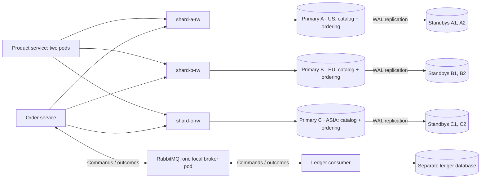

# ShardShop implementation plan

## 1. Implementation milestones

This is the implementation checklist for `microservices/shardshop`, updated on
2026-10-06. Every step starts as **Planned**; existing design documents and routing
vectors do not mean the corresponding application behavior is implemented.

**Framework migration completed, 2026-10-04:** all six application skeletons use
**Quarkus 3.40.1** in JVM mode on Java 25. Step **0.5** verifies their POMs, tests,
artifact lock and launch commands. Steps 0.2–0.4 retain their historical evidence;
the new qualification is recorded separately in step 0.5 and [VERSIONS.md](VERSIONS.md#step-05-verification-record). Quarkus 3.40.1 is the latest
stable release at this review, on the 3.40 LTS line. [Release status](https://quarkus.io/releases/).

**ID ownership constraint:** only `shardshop-product` and `shardshop-order`
create IDs, including deterministic fixtures and transport IDs. Workload modules
obtain IDs from service APIs and reuse them; they must not generate or derive IDs,
depend on Snowflake, or access the generator allocator. Ledger uses result IDs
reserved by order. Apply this constraint to every milestone below.

**Regional placement constraint:** `shard-a=US`, `shard-b=EU`, and `shard-c=ASIA`.
Seller/buyer home regions are derived from their unchanged version-2 ID routes
and included in service-issued immutable fixtures. Sellers create products only
on their home shard; buyers may order from any region, including mixed-region
orders subject to existing currency and stock rules. Public APIs have no shard
selector or independent product-region selector.

**Flyway SQL constraint:** keep every stream simple and declarative: tables,
constraints, indexes, grants, and data changes only. Do not create SQL functions
or triggers. Implement business logic in Java and deployment checks in scripts.

**2026-10-01 completed baseline consolidation:** regional seller constraints and
comments were merged into `V1__catalog.sql`, and the empty lab catalogs were reset
and migrated. All nine instances have the regional V1 schema and grants, both
routing hashes are published, and Cluster/PVC identities are unchanged. A second
migration run applied nothing. Follow-up checks passed: 54 Java routing tests,
read-only golden-vector queries on all three primaries, strict topology guards,
and Kubernetes dry runs for both migration streams at the 44-character shard-name
limit. Future retained baselines remain immutable;
application APIs, datasets, and workloads remain planned in milestones 3 and 4.

### Instructions for executing a step

1. Read the repository's `AGENTS.md`, this plan,
   [ARCHITECTURE.md](ARCHITECTURE.md), and [VERSIONS.md](VERSIONS.md). The
   architecture defines behavior; the version policy defines supported artifacts and the named library
   exception. The remaining sections of this file provide implementation context.
2. Check the listed prerequisite steps and their actual deliverables. Implement
   only the selected step. If a prerequisite is missing, record the specific
   blocker rather than silently expanding the task to another milestone.
3. Change that row's status to **In Progress** when work starts. Keep changes
   scoped to ShardShop, except its explicitly planned registration in
   `microservices/pom.xml`. Preserve the six applications, the database layer's schema ownership,
   Snowflake contracts, and absence of shard selectors in public APIs.
4. Add the behavior and edge/error tests required by the repository instructions.
   Run the affected module's checks; never build the repository root reactor.
   Use real database/broker integration tests where IO matters and bounded polling
   for Kubernetes checks. Infrastructure steps are verified by live runs against
   `kind-shardshop`, recorded as evidence; add scripts only where a step calls for
   them. Follow the context rules below.
5. Mark the row **Done** only after its acceptance condition and relevant checks
   pass. Append concise evidence and exact commands to its acceptance cell. Use
   **Blocked** with a concrete reason when completion is prevented; resume as
   **In Progress** when the blocker is resolved. Partial work is not **Done**.
6. Take Maven, `kind`, `kubectl`, `helm`, and Docker from the user's `PATH`.
   Never download, vendor, wrap, or version-pin tool binaries in the repository:
   no project-local tool folders such as `.local/bin` and no Maven Wrapper. Record
   tested versions in [VERSIONS.md](VERSIONS.md) instead. Third-party charts and
   manifests are artifacts, not tools: vendor them only with a verified checksum
   in the lock. Keep scripts short bash, and record evidence as concise text in
   this plan rather than committing dated scan or report dumps.
7. Milestones 0–6 run and are verified entirely on the local kind lab on this
   machine. Milestone 7 (AWS with Terraform) is an optional advanced track that
   starts after step 6.6; never make a local step depend on it or on a cloud
   service.

Execute steps in dependency order; the table order is a usable default except
for the added migration step 0.5, which follows the completed routing setup in
2.4 and precedes further application work. “Depends
on” lists direct prerequisites and includes their prerequisites transitively.
Scenario numbers refer to the
[architecture's acceptance scenarios](ARCHITECTURE.md#7-consistency-tradeoffs-and-verification).
Milestone numbers 0-7 remain stable for references from other documents.

### Milestone 0: Supported baseline and project skeleton

| Step / deliverable | Depends on | Status | Acceptance condition |
|---|---|---|---|
| 0.1 Version and artifact inventory | None | Done | Exact compatible tool/image selections, origins, support dates, and review deadlines are recorded; the kind node-image gap is resolved; the Snowflake exception is explicit. **2026-09-28:** all seven image digest chains verify; the kind 1.36.5 node image returns 404, so the user-authorized 1.36.4 fallback is pinned; digest-pinned Canonical OpenJDK 25 images build the product and start all six applications as non-root. **Check:** recompute the [lock](versions.lock.yaml)'s digests as [VERSIONS.md](VERSIONS.md#step-01-verification-record) describes. |
| 0.2 Maven skeleton | 0.1 | Done | The parent and workload aggregators contain six independently buildable application skeletons, and the Java 25 minimum works. **2026-09-28:** all six `clean verify` builds and JAR launches pass on OpenJDK 25 with 100% line coverage from an empty Maven cache; the build passes on JDK 25 and 26 and rejects JDK 21. **Commands:** the per-application loop in the [README](README.md#build-and-run); `mvn -B -ntp -f microservices/shardshop/pom.xml validate`. |
| 0.3 Dependency and test configuration | 0.2 | Done | Effective POMs, resolved dependencies/plugins, and SBOM agree with the inventory; Surefire and the opt-in `integration` profile are configured in each module. **2026-09-28:** all 20 unit tests pass and `integration` runs `*IT` through Failsafe; each application's effective POM matches the lock's 17 plugin pins, overrides and test-image digests, with no prereleases. **Commands:** `mvn -B -ntp -f microservices/shardshop/pom.xml -Pintegration,audit clean verify` ([README](README.md#dependency-and-test-validation)). |
| 0.4 Shared shard-routing module | 0.3 | Done | `shardshop-sharding` implements routing contract version 2 in plain Java; only product and order depend on it, and it holds no API, model, or JSON types. Golden vectors cover every shard, a value above 2^53, the signed-long maximum, and digests with the high bit set. **2026-09-28:** the router tests pass with 100% line and branch coverage on JDK 25 and 26, with no warnings; step 2.4 later made the shard list configurable. **Commands:** `mvn -B -ntp -f microservices/shardshop/pom.xml -pl shardshop-sharding clean verify`. |
| 0.5 Quarkus 3.40.1 migration | 0.4, 2.4 | Done | **2026-10-04:** all six skeletons independently pass `clean verify` with `integration,audit`, using the scoped Quarkus 3.40.1 BOM/plugin and Maven 3.9.16 on Java 25. The 62 unit/startup tests and 10 packaged startup ITs pass with 100% line coverage. CDI preserves eager routing validation and unchanged golden vectors. Effective POMs, graphs, SBOMs and verified artifact checksums agree; no Spring runtime/test artifacts resolve. The three official plugin-internal XML prereleases are qualified under the explicit version-policy exception. All six packages start non-root on the pinned JRE; product builds/tests on the pinned JDK. **Commands:** the [README build loop](README.md#build-and-run) with `-Pintegration,audit`; [qualification evidence](VERSIONS.md#step-05-verification-record). **2026-10-06 review:** default `verify` now runs the ten packaged routing checks; all six `-Paudit clean verify` builds pass with 62 unit/startup tests and no warnings. Removing unused app Mockito dependencies leaves 140 SBOM components for product/order and 139 for each other app; plugin agents remain. |

### Milestone 1: Local cluster and one replicated shard

| Step / deliverable | Depends on | Status | Acceptance condition |
|---|---|---|---|
| 1.1 Local Kubernetes bootstrap | 0.1 | Done | The host runs the selected Docker Desktop release with at least 12 GB of VM memory, and the pinned kind node image's advisories are reviewed; one control plane and three workers are ready; every command targets the `kind-shardshop` context explicitly; startup preserves existing storage and allocator state; manifests follow the §5 portability rules. **2026-09-29:** Docker Desktop 4.92.0 runs a 12 GB VM; the node image's 155 advisories (10 critical, 42 high) are accepted for this loopback-only, disposable lab. `up.sh` creates four Ready v1.36.4 nodes from the pinned digest, with the API server on 127.0.0.1, and stops on a smaller VM; the `shardshop` namespace enforces `restricted` Pod Security. A rerun recreates nothing and keeps volume data. **Commands:** `bash microservices/shardshop/scripts/up.sh` (twice); `kubectl --context kind-shardshop get nodes`. **2026-09-30 stop/start:** `down.sh` stops the four nodes in about 4 seconds after a clean PostgreSQL shutdown on all ten instances; `up.sh` starts them again in about a minute, waiting until every `-rw` Service accepts connections, and keeps every Cluster and PVC identity and primary; `migrate.sh` straight afterwards applies zero migrations. **Commands:** `bash microservices/shardshop/scripts/down.sh`; `bash microservices/shardshop/scripts/up.sh`; `bash microservices/shardshop/scripts/migrate.sh`. |
| 1.2 CloudNativePG installation | 1.1 | Done | The operator runs a release inside its support window from its verified Helm chart, deployed by digest; it and its CRDs are ready, match the Kubernetes support matrix, and can be reapplied without replacing databases. **2026-09-29:** CNPG 1.30.1 (upgrade by 2026-11-30) supports the v1.36.4 server. The vendored chart 0.29.1 matches its index SHA-256 and cosign signature, and `values.yaml` pins the operator by digest. `up.sh` installs 11 Established CRDs, kept on uninstall, and a Ready ARM64 operator; a rerun (Helm revision 2) keeps every CRD, operator and `shard-a` identity. **Commands:** `bash microservices/shardshop/scripts/up.sh` (twice); `helm --kube-context kind-shardshop -n cnpg-system get manifest cnpg`; `cosign verify` of the chart's `oci_reference` in the [lock](versions.lock.yaml). |
| 1.3 First quorum shard cluster | 1.2 | Done | `shard-a` has three instances with separate PVCs, one per worker; `-rw`/`-ro` roles, WAL streaming, and quorum commit behavior are verified: writes continue with one standby absent and block with both absent; logical decoding is ready for order CDC, with failover slots synchronized to both standbys and a finite slot WAL budget. **2026-09-29:** PostgreSQL 18.6 runs one primary and two streaming quorum standbys on three workers with independent 2 GiB PVCs, using `ANY 1` with required durability, failover quorum, logical slot synchronization and a 512 MB slot-WAL budget. `verify-topology.sh` confirmed Service endpoints, replication to both standbys, a synchronized failover slot, PVC and data survival of a replaced standby, commits with one standby fenced and a `SyncRep` wait with both fenced, then recovery with no probes left; bootstrap reruns keep all identities. **Commands:** `bash microservices/shardshop/scripts/up.sh`; `bash microservices/shardshop/scripts/verify-topology.sh shard-a`. |

### Milestone 2: Storage, ownership, and migrations

| Step / deliverable | Depends on | Status | Acceptance condition |
|---|---|---|---|
| 2.1 Remaining shard clusters | 1.3 | Done | Nine shared PostgreSQL pods form three independent three-instance quorum clusters; data replicates only within its shard. Scenario 2 topology checks pass. **2026-09-29:** all nine instances are Ready: three primaries and six quorum standbys, one per shard per worker, on nine distinct 2 GiB PVCs. Each shard's drill confirmed independent system identifiers and replication peers, fixtures reaching only their own standbys, synchronized slots, standby replacement and quorum behavior. With 512 MiB limits the nine pods used 563 MiB, with no OOM events or restarts; remeasure under load. Scenario 2 schema and grant checks belong to steps 2.3 and 2.5. **Commands:** `bash microservices/shardshop/scripts/up.sh`; `bash microservices/shardshop/scripts/verify-topology.sh <shard>` for each shard. |
| 2.2 Separate ledger database | 1.3 | Done | The ledger has its own persistent database and Service, outside the nine shared shard pods; restart preserves its data. **2026-09-29:** `ledger-db` is a fourth, single-instance CNPG Cluster on PostgreSQL 18.6 with its own 2 GiB PVC, internal `ledger-db-rw` Service and database `ledger` owned by `ledger_owner`, without synchronous standbys or logical decoding. Restricted client Jobs connected over `verify-full` TLS, rejected a wrong password, and read a committed row back after the pod was replaced, with PVC, system identifier and credentials unchanged; reruns left all ten instances unchanged. The README documents its outage and volume-loss limits; its schema, migrations and runtime grants belong to step 2.6. **Commands:** `bash microservices/shardshop/scripts/up.sh` (twice); `kubectl --context kind-shardshop -n shardshop delete pod ledger-db-1`, then wait until it is Ready. |
| 2.3 Database change management and catalog schema | 2.1 | Done | Schemas, roles and migrations live outside the Maven modules, as ARCHITECTURE.md's database change management defines. CNPG `DatabaseRole` and `Database` resources declare the catalog roles and schema `catalog` owned by `catalog_owner`; the `database/shard/catalog` Flyway stream creates sellers with immutable home regions and ID-placement checks, products (local seller foreign key, `initial_stock`, and `stock` that cannot go below zero) and stock reservations with idempotency keys, plus `UPDATE (stock)` for `catalog_reserver`. Each primary has its own history owned by `catalog_owner`; no login role owns an object or runs DDL, only `catalog_reserver` writes reservations, and no migration needs a superuser session. Java stock handling belongs to step 4.9. **2026-09-30:** Flyway 13.8.1 Jobs on a trimmed OpenJDK 25 image (74 packages, no Docker Scout findings) log in as `catalog_migrator` over `verify-full` TLS and act as `catalog_owner`; clusters disable superuser access and revoke `PUBLIC` defaults at creation. Read-only queries on all nine instances returned identical results: history and all 11 relations owned by `catalog_owner`, no triggers or functions, the exact grant matrix, `PUBLIC` limited to `CONNECT`, and the foreign key, stock bounds and reservation key present. **Commands:** `bash microservices/shardshop/scripts/up.sh`; `bash microservices/shardshop/scripts/migrate.sh` (reruns apply zero migrations); see the [runbook](README.md#database-schemas-and-migrations-step-23). |
| 2.4 Single shard inventory and configured routing | 2.3, 0.4 | Done | One ordered inventory of names and immutable regions renders all clusters, region labels, roles/databases, migration Jobs and the routing snapshot; no per-shard directories. Existing database/PVC identities and three-shard routing vectors remain unchanged. Product/order require the deployed snapshot at startup. Publication follows successful sequential migrations; invalid inventories, partial failures, changed active membership, and reassigned regions fail closed; both existing topology ConfigMaps require matching `version` and `regionVersion` values. **2026-09-30:** `infra/shards.yaml` and the shared Helm chart render all 26 prior infrastructure resources and the migration Jobs unchanged; all 14 Cluster/PVC identities survived reapply, and empty, duplicate, malformed or `ledger-db` inventories fail rendering. `migrate.sh` migrates one shard at a time, publishes the `shardshop-routing` ConfigMap only afterwards, and refuses a changed shard list; reruns apply zero migrations. Product and order fail startup without a valid imported shard list; 38 routing tests and 4 tests per application pass with 100% coverage and no warnings, and the shard drill passes. **Commands:** `helm lint microservices/shardshop/infra/helm/shardshop -f microservices/shardshop/infra/helm/shardshop/kind-values.yaml -f microservices/shardshop/infra/shards.yaml`; `mvn -B -ntp -f microservices/shardshop/pom.xml -pl shardshop-product,shardshop-order -am verify`; `bash microservices/shardshop/scripts/up.sh`; `bash microservices/shardshop/scripts/migrate.sh`; `bash microservices/shardshop/scripts/verify-topology.sh`. |
| 2.5 Ordering schema and catalog access | 2.3, 2.4 | Done | Buyers with immutable `US`/`EU`/`ASIA` home regions and checks for the deployed region and version-2 ID placement, durable order allocations uniquely keyed by buyer/run name/request ordinal, orders with a local foreign key to their buyer, items with seller and product IDs and quantities, sagas with `PENDING_STOCK`, a stock-release marker and reconciliation counters, inbox/outbox with order-reserved result IDs, and both ordering quarantine stores exist on every shard; histories stay separate; the shared migration Job uses the `ordering` stream, its ConfigMap and migrator Secret, and the same `shardRegion`/`shardIndex`/`shardCount` placeholders as catalog; `order_app` can read sellers and products, write stock reservations, and update only `products.stock` in `catalog`; each primary has the dedicated `ordering.order_outbox` publication and CDC offsets table, and the CDC login has SQL `SELECT` only on the outbox and the highly privileged `REPLICATION` attribute, which can expose changes beyond that publication. **2026-10-01:** The independent ordering V1 and repeatable grants migrate as `ordering_owner` on all three primaries; all nine instances have 12 owner-owned tables including the separate history, with no custom functions, triggers or sequences. Permanent `order_result_ids` bind command/result pairs to sagas after transport cleanup. Restricted TLS client Jobs passed 597 assertions (371 expected constraint/privilege rejections) across `order_app`, `product_app` and `ordering_cdc`: golden buyer routes and immutable regions, allocation/parent keys, remote item snapshots, saga schedules/releases, reserved result identities, quarantine deduplication and retention, offsets, catalog column grants and CDC SQL privilege restrictions. Every current-generation `ordering_order_outbox` publication contains only outbox inserts; migration waits for it before routing publication. After review, the simplified grants reapplied once per shard; the next run applied nothing, and table/column SQL grants stayed identical on all nine instances. The bootstrap rerun reconciled all 36 roles at their current generations and left no infrastructure diff, preserving all 35 Cluster/PVC/Secret identities and credential hashes. Role-wait checks reject stale success, changing generations, unapplied roles, an empty list and kubectl failure. Helm lint and 44-character shard renders passed. **Commands:** `bash microservices/shardshop/scripts/up.sh`; `bash microservices/shardshop/scripts/migrate.sh` (twice); `bash microservices/shardshop/scripts/verify-topology.sh --routing-only`; see the [runbook](README.md#ordering-schema-and-catalog-access-step-25). |
| 2.6 Ledger schema and permanent decisions | 2.2, 2.3 | Done | Ledger entries, permanent operation decisions, inbox/outbox using order-reserved result IDs, retained publication-attempt counters, and conflicting-command quarantine have the required identity constraints and separate migration/runtime roles. **2026-10-01:** The independent ledger V1 and repeatable grants migrate through `ledger_migrator` as non-login `ledger_schema_owner`; bootstrap `ledger_owner` still owns only the database. Seven schema tables including history have that schema owner, with no custom functions, triggers or sequences. Permanent `ledger_result_ids` retains command/result bindings, exact result envelopes and publication counters; the deferred outbox key requires the current attempt at commit. The initial restricted TLS `ledger_app` Job passed 129 assertions (90 expected constraint/privilege rejections), covering large IDs, immutable decisions/entries, rejected-entry prevention, identity constraints, replay after cleanup, stale confirmations, exact grants and conflict retention. All fixtures rolled back. Provisioning reruns preserve Cluster/PVC/Secret identities and credentials; all 40 roles reconcile at their current generations. The shared migration template rejects ledger/shard target mismatches, and code review plus mocked orchestration confirm that ledger failure blocks routing publication; no failing migration was injected into the shared lab. A second complete migration run applies nothing across all seven Jobs. Helm lint, `bash -n` syntax checks and the ledger-only Maven build pass; ShellCheck was not run. Review hardening replaced table-level inserts with column grants for ledger/ordering outboxes and all three quarantine stores: new outboxes cannot supply creation/publication timestamps, and incidents cannot supply resolution fields. Restricted TLS Jobs passed 99 additional assertions (60 expected rejections) across ledger and all three ordering primaries, including pending/unresolved defaults, explicit-DEFAULT denial, permitted updates, and ledger advisory-lock/insert-conflict alternatives. The order/ledger module build passed. Java consumer/publisher behavior remains in milestone 4. **Commands:** `bash microservices/shardshop/scripts/up.sh`; `bash microservices/shardshop/scripts/migrate.sh` (twice); `bash microservices/shardshop/scripts/render.sh migration ledger-db ledger`; `mvn -B -ntp -f microservices/shardshop/pom.xml -pl shardshop-order,shardshop-ledger -am verify`; see the [runbook](README.md#ledger-schema-and-replay-records-step-26). |

### Milestone 3: Product contracts, IDs, and workloads

| Step / deliverable | Depends on | Status | Acceptance condition |
|---|---|---|---|
| 3.1 HTTP and message contracts | 0.5 | Done | Each owning module holds its OpenAPI document or message schema, covering service-issued decimal-string IDs, immutable seller/buyer home regions, inherited product regions, dataset discovery, durable order-ID allocation and its retries, payloads, errors, and correlation, including order-reserved ledger result IDs; clients keep their own DTOs, and no API, model, or JSON files are shared between modules. Provider tests arrive with the implementing steps. **2026-10-06:** product/order OpenAPI 3.1.1 documents and order/ledger JSON Schema 2020-12 envelopes are self-contained, with inline HTTP and correlated message examples. Structural/example validation, signed-long and whitespace boundaries, money constraints, fingerprint/total/correlation checks pass; all seven resources match their owner JARs. The affected build passes 59 unit/startup tests and 10 packaged startup ITs without warnings. **Commands:** [contract validation](README.md#http-and-message-contracts-step-31); `mvn -B -ntp -f microservices/shardshop/pom.xml -pl shardshop-product,shardshop-order,shardshop-ledger -am -Pintegration clean verify`. **Review fixes:** UTC microsecond timestamps, coherent generator-0 fixtures/live examples, Unicode and exact-integer contracts, complete response examples and bounded status URLs are verified by the committed `scripts/verify-contracts.py`; its pinned tools are recorded in VERSIONS.md. |
| 3.2 ID validation and currency selection | 3.1 | Planned | Each ID-consuming module has its own unit-tested ID parser that accepts canonical IDs up to the signed-long maximum, including values above 2^53, and rejects numeric JSON tokens, LF/CRLF/TAB text, and other noncanonical input; the order producer's currency selection passes its boundary IDs without depending on `shardshop-sharding`. |
| 3.3 Bounded Snowflake generation | 0.5 | Planned | Injected generators exist only in product and order and satisfy concurrency, sequence-exhaustion, clock-failure, and timestamp-boundary checks; failures emit no ID. Workload and ledger dependencies contain no ID generator. Scenario 10 library checks pass. |
| 3.4 Generator allocation at JVM startup | 1.1, 3.3 | Planned | Concurrent product/order starts and same-pod container restarts reserve distinct generator IDs; lost responses, missing/stale state, and exhaustion fail safely without resetting the high-water mark. Workloads and ledger have no allocation launcher or allocator permissions. |
| 3.6 Service-owned deterministic datasets | 2.4, 3.1, 3.3 | Planned | Product derives seller/product IDs and immutable USD/EUR fixture payloads in every region; order derives buyer IDs in disjoint reserved ranges. Both services derive immutable home regions from the routed IDs and expose them in paginated descriptors and seller/buyer creation payloads. Products inherit the seller region without an independent region field. Workloads consume those responses without deriving IDs or sharing a manifest file; service tests pin generation and workload tests verify unchanged ID forwarding. |
| 3.5 Seller and product API on primaries | 0.4, 2.3, 3.2, 3.4, 3.6 | Planned | Seller and product PUTs accept only product-issued fixture IDs; seller payloads must carry the issued home region and products remain on that seller's shard. Valid requests return 201/200/409; a product PUT for a known fixture whose seller is not yet created returns `422 SELLER_NOT_FOUND`; GETs return stored data, including current stock, or 404; invalid/unissued IDs and missing/unknown or mismatched seller regions return `400 INVALID_REQUEST`; cross-region product placement is rejected by the API and database; provider tests match responses to the product OpenAPI document; reads reach PostgreSQL and use bounded pools/timeouts. |
| 3.7 Product seeder application | 3.5, 3.6 | Planned | Repeated seeding produces identical sellers and products across US/EU/ASIA, with USD and EUR products in every region; partial failures retain original IDs/regions/payloads; completion requires successful primary-read verification. |
| 3.8 Product reader application | 3.5, 3.6 | Planned | The reader has bounded load and reports request/latency/error metrics; its HTTP/1.1 pool, rotation, and five-second request deadline match the contract. |
| 3.9 Product deployment and seeding gate | 3.7, 3.8 | Planned | Application images have an OS package inventory and advisory check; two product pods receive requests within 120 seconds; a failed/partial seed blocks the reader and order producer; successful repeated runs pass scenarios 1 and 3 for primary reads. |

### Milestone 4: Complete order-to-ledger saga

| Step / deliverable | Depends on | Status | Acceptance condition |
|---|---|---|---|
| 4.1 Order validation and atomic acceptance | 2.5, 3.4, 3.5 | Planned | Buyer and order PUT/GET use order-issued IDs; buyer creation requires the issued immutable home region, with invalid regions rejected as `400 INVALID_REQUEST`. Buyer orders remain on the buyer's home shard and may contain sellers from any or all regions under the existing currency rules; order-allocation POST commits a stable buyer/run name/request ordinal mapping before returning, and retries/restarts recover the same ID. Unissued IDs and wrong-parent allocations fail. Staged 400/409/422/503 precedence including `422 BUYER_NOT_FOUND`, locked re-checks, unknown commits, and atomic order/saga writes pass scenario 9; catalog IO holds no order connection or lock; provider tests match responses to the order OpenAPI document. |
| 4.9 Stock reservation step | 2.5, 4.1 | Planned | Committed orders reserve every item on its seller's shard before the ledger sees them: success moves the saga to `PENDING_LEDGER` with its `RecordOrder` outbox insert, insufficient stock cancels with `OUT_OF_STOCK` and releases partial reservations, and catalog outages retry without cancelling; Java transactions adjust stock exactly once per reservation or release; scenario 11 passes. |
| 4.2 RabbitMQ topology and policies | 1.1, 0.5, 3.1 | Planned | The persistent broker runs a release inside its support window, under the `restricted` Pod Security profile with an arbitrary user ID, and has processing/parking quorum queues, distinct complete source policies, required feature flags, and verified length/byte/retry limits. |
| 4.3 Order outbox CDC relay | 4.2, 4.9 | Planned | Debezium is pinned and qualified. One reader per shard captures committed outbox inserts, including a first-start snapshot of unpublished rows, and publishes each stored envelope in source order; rollbacks, status updates, and deletes emit no command. Returns, nacks, timeouts, and crashes leave rows unpublished and offsets unadvanced; a failed reader restarts alone with capped backoff and resumes from the offsets in its shard database with stable envelope IDs, while slot or offset loss stops it for explicit recovery; published `RecordOrder` envelopes match the order-owned message schema. |
| 4.4 Ledger command consumer | 2.6, 3.2, 4.2 | Planned | A command commits one immutable decision and result outbox record using its order-reserved result ID before acknowledgement; duplicate commands re-arm or recreate the saved result for publication without generating IDs; conflicts commit quarantine first; commands with invalid IDs are rejected without requeue. Serialize immutable decisions with a transaction advisory lock or insert-conflict handling followed by reading/comparing the saved decision; runtime has no `UPDATE` privilege for row locks. |
| 4.5 Ledger result publisher | 4.4 | Planned | Stored outcomes reach the result queue with preserved logical correlation and order-reserved message IDs; retransmissions and duplicate-command replays retain the same ID, and publication-attempt checks prevent a stale confirm from hiding a replay. Ledger has no generator; result envelopes match its message schema. |
| 4.6 Order result consumer | 4.3, 4.5 | Planned | Results atomically confirm/cancel the correct order, and a cancellation releases its stock reservations; duplicates are harmless; absent/conflicting results use named quarantine stores; unavailable shards follow retry/DLQ handling; results with invalid IDs are rejected without requeue. |
| 4.7 Order producer application | 3.6, 4.1 | Planned | The HTTP-only producer discovers product/buyer descriptors and regions, exercises each buyer region buying from both other regions and mixed US/EU/ASIA orders in one currency, requests each order ID from order before USD/EUR selection, preserves returned IDs/regions/payloads and configured allocation coordinates on retries/restarts, and polls status within bounded deadlines; it has no ID generator or allocator access. |
| 4.8 Saga deployment and first end-to-end run | 3.9, 4.6, 4.7 | Planned | Only product and order run generator-allocation launchers; ledger and workloads have no allocator credentials. Seeding gates load; a replacement order pod on either worker resumes CDC from the stored offsets; scenarios 4, 5 and 11 pass end to end. |

### Milestone 5: Recovery, retention, and backpressure

| Step / deliverable | Depends on | Status | Acceptance condition |
|---|---|---|---|
| 5.1 Durable saga reconciliation | 4.8 | Planned | Lost results recover through stored ledger outcomes; injected-clock checks prove at most five automatic replay enqueues even after restarts and published-row cleanup. |
| 5.2 Safe transport cleanup | 5.1 | Planned | Only eligible inbox rows and confirmed-published outbox rows are removed, and order-outbox rows only after a durable CDC checkpoint passes their insert; cleanup deletes never become commands; permanent decisions, saga identity/counters, unpublished messages, and unresolved quarantine survive. |
| 5.3 DLQ replay tool | 5.2 | Planned | Replay preserves original payload/logical IDs, acknowledges parking only after confirmed routing, and remains safe on repeated failures or crashes. |
| 5.4 Retry and capacity drills | 5.3 | Planned | Scenario 7 records actual redelivery timing and limit boundaries; long outages use DLQ/reconciliation; missing/full DLQs cause queue rejection while broker-wide alarms remain clear and CDC offsets hold. |
| 5.5 Crash recovery and observability | 5.4 | Planned | Scenario 6 passes across commit/publish/ack and CDC mark/checkpoint crash windows, with its failover case in step 6.2; slot, offset, or WAL loss stops capture until the explicit recovery; required metrics identify stalled outboxes and CDC readers, sagas, quarantine, queue capacity, and pool/replication pressure. |

### Milestone 6: Read profiles, failover, restore, and operation

| Step / deliverable | Depends on | Status | Acceptance condition |
|---|---|---|---|
| 6.1 Strict replica-read profile | 3.9 | Planned | Stale reads are observable; reads continue through the remaining standby when one is absent; with no ready standby or a hung query, reads return 503 within four server seconds and before the reader's five-second deadline, without primary fallback. Scenarios 3 and 8 read checks pass. |
| 6.2 Synchronous failover drills | 5.5, 6.1 | Planned | Switchover and primary failure promote a standby confirmed to hold every acknowledged commit, preserve acknowledged saga commits, and keep writes flowing through the remaining standby; CDC resumes from the synchronized logical slot without losing a command. One lost standby keeps writes but pauses CDC, both lost block writes, and losing the primary with one standby triggers no automatic promotion; unrelated shards keep working. |
| 6.3 Coordinated backup and isolated restore | 5.3, 6.2 | Planned | Isolated restores retain schema/routing metadata, permanent outcomes, quarantine, and the latest allocator high-water mark; backup artifacts live outside kind. |
| 6.4 Asynchronous-loss audit and recovery | 6.3 | Planned | Deliberate asynchronous loss removes acknowledged orders without creating ledger records; after a restore from an older backup, late and previously acknowledged orphan outcomes are quarantined, ID reuse is blocked, and verified restore/replay resolves recoverable cases. |
| 6.5 Supported upgrade qualification | 0.5, 1.2 | Planned | Every installed component moves to a supported release before its lock deadline, with the successor choice, compatibility checks, upgrade/recovery procedure, and evidence from the checks that exist at that point recorded. |
| 6.6 Complete demo and acceptance run | 6.4, 6.5 | Planned | A fresh lab follows the README without hidden steps; all eleven architecture scenarios have commands and passing evidence, including full Snowflake lifecycle checks. |

### Milestone 7: AWS deployment (optional, advanced)

This track starts only after step 6.6 passes locally. It adds a cloud target
without changing local behavior: every earlier step must still run and pass on
kind. Qualify each new tool, provider, and service under [VERSIONS.md](VERSIONS.md)
before use, and record costs and teardown commands.

| Step / deliverable | Depends on | Status | Acceptance condition |
|---|---|---|---|
| 7.1 Terraform AWS foundation | 6.6 | Planned | `infra/terraform/` provisions a VPC across three availability zones, an EKS cluster on a Kubernetes minor inside CNPG's support matrix, workers spread across the zones, ECR repositories, an encrypted S3 bucket for backups, and least-privilege workload IAM. State lives in a locked remote backend, and `terraform destroy` removes everything. |
| 7.2 EKS values and operators | 7.1 | Planned | The same vendored CloudNativePG chart and `values.yaml` install the operator on EKS; `infra/helm/shardshop/eks-values.yaml` renders the shared chart and inventory with gp3 storage and one instance of each shard per zone; the step 1.3 and 2.1 topology drills pass on EKS. |
| 7.3 Cloud durability | 7.2 | Planned | Every shard and the ledger back up to S3 with continuous WAL archiving and pass a point-in-time restore; RabbitMQ runs three brokers with three-member quorum queues; runtime secrets come from AWS Secrets Manager. The local profile keeps its single broker and logical dumps. |
| 7.4 GitOps delivery and cloud acceptance | 7.3 | Planned | A GitOps controller deploys the six applications from the EKS overlay with images pulled from ECR by digest; all eleven architecture scenarios pass on EKS with recorded evidence and costs; the local lab still passes step 6.6 unchanged. |

The supported-version gate (milestone 0) and first replicated shard (1.3) must
pass before repeating database infrastructure. The first complete order demo is
4.8: accepting an order alone is not completion of the saga. Individual recovery
and failover steps retain their own acceptance gates. Support deadlines take
precedence over table order: steps 1.2 and 4.2 install only releases inside their
support window, and step 6.5 moves installed components to supported releases
before their lock deadlines, whatever the milestone.

## 2. Scope and target topology

Status: design roadmap, updated on 2026-10-04. [ARCHITECTURE.md](ARCHITECTURE.md)
defines module boundaries, HTTP/message contracts, consistency policies, and
acceptance scenarios. This plan defines implementation order and local
infrastructure. [VERSIONS.md](VERSIONS.md) defines the stable-release baseline,
support windows, library management, and mandatory upgrade gates.

Build ShardShop in `microservices/shardshop` to exercise product read load,
horizontal sharding, physical replication, log-based CDC, order sagas, and
Kubernetes failover. The APIs expose decimal-string Snowflake business IDs generated with
`de.mkammerer.snowflake-id:snowflake-id`; shard routing stays internal: sellers, their
products and stock route by seller ID to the seller's home region, and buyers
and their orders by buyer ID to the buyer's home region. Buyers can purchase
from sellers in any region; products inherit their seller's region.


Use one local Kubernetes cluster and three CloudNativePG `Cluster` resources,
named `shard-a` (US), `shard-b` (EU), and `shard-c` (ASIA), each with
`spec.instances: 3`. The `shardshop.javacraft/region` label on each Cluster and
its inherited metadata makes this mapping visible in Kubernetes. These are
business regions within the one-machine lab, not geographic deployment sites.
Each resource manages one primary and two physical streaming standbys, with quorum
synchronous replication (`ANY 1`) and quorum-based failover. A single resource
with nine instances would create one primary and eight standbys. See
[CloudNativePG replication](https://cloudnative-pg.io/docs/1.30/replication/).



Database pod names are operator-managed, and primary/standby roles can switch.
Connect through Services, never pod IPs. The operator redirects each `-rw`
Service after promotion; existing connections and in-flight transactions can
still fail. See [CloudNativePG architecture](https://cloudnative-pg.io/docs/1.30/architecture/).
Optional product reads through `-ro`, including standby failure behavior, follow
the architecture's replica read profile.

There are nine shared PostgreSQL instance pods, plus a separate ledger PostgreSQL
pod and one RabbitMQ broker pod. After the product seeder Job completes, six
application pods remain running: two product service pods, one order service pod,
one ledger consumer pod, one product reader pod, and one order producer pod.
The seeder Job's completed pod and operator/system/migration/backup pods are
additional; Maven aggregators have no runtime pods.

## 3. Modules, data ownership, and routing

Create a parent Maven aggregator with five top-level children and six deployable
applications. `shardshop-workload` is a POM aggregator for the three workload
applications; product, order, and ledger are services; `shardshop-sharding` is a
plain Java library with the shard-routing rule, used only by product and order.
Nothing else is shared: each module owns its API, DTO/model classes, JSON handling,
and test data, as described in the architecture.

Product and order services share three shard databases and use separate
schemas, `catalog` and `ordering`; the separate ledger database uses `ledger`. No
Maven module owns a schema. CNPG resources declare the databases, schemas and
roles, and `database/` holds one Flyway stream per schema, run by that schema's
migrator into `<schema>.flyway_schema_history` (ARCHITECTURE.md, database change
management). Services connect with login roles that only inherit group privileges
and lack DDL rights. The order service reads sellers and products and writes reservations and
`products.stock` in the same Java-managed shard transaction (step 4.9).

Every shard has the same `catalog` and `ordering` schemas but different rows.
Route sellers by `seller_id`, with each seller's products and stock reservations
on the seller's shard, and buyers by `buyer_id`, with each buyer's orders on the
buyer's shard:

```text
index = unsignedBigEndian(SHA-256(UTF-8(canonical decimal Snowflake ID))) % deployedShards.size
shard = deployedShards[index]
initial deployedShards = [shard-a, shard-b, shard-c]
initial regions = [US, EU, ASIA]
homeRegion(id) = shard.region
```

Interpret all 32 digest bytes as an unsigned big-endian integer (byte 0 most
significant). `shardshop-sharding` implements this rule and tests it against
independently computed golden vectors. `verify-topology.sh --routing-only` reads
the same fixtures on every primary to compare PostgreSQL SHA-256 arithmetic and
the deployed seller placement constraint with Java's expected results, without a
failure drill. The order producer applies the same integer modulo 100 with its own code: EUR when it is below the configured
`rejected-order-percent`, otherwise USD. The exact input encoding and boundary
cases live in [ARCHITECTURE.md](ARCHITECTURE.md). Region and currency are
independent; provide both USD and EUR products in each region.
Use positive Java `long` IDs and PostgreSQL `BIGINT` columns, with canonical
decimal strings for all HTTP and message IDs, including values above 2^53.
Reject numeric JSON IDs, signs, leading zeros, whitespace, zero, and values above
9223372036854775807. The version-2 vectors replace the unreleased draft;
deployed data using a different identifier/routing contract would need migration.

Pin `de.mkammerer.snowflake-id:snowflake-id:0.0.2` explicitly outside the Quarkus platform BOM.
Follow the architecture's fixed epoch `2026-01-01T00:00:00Z`, 41/10/12-bit layout,
checked monotonic time source, and throwing sequence-overflow policy. Use one
injected generator per product/order process; no other module generates IDs.
Reserve generator 0 for product's deterministic seller/product fixtures and
order's buyer fixtures in disjoint timestamp ranges. Workloads obtain descriptors
through service APIs and obtain live order IDs through order's durable allocation
API; they never derive IDs. Live product/order generators reserve a fresh generator ID
1-1023 for every JVM start. Persist that allocation before generating, including
on container restart; never derive it from a pod name or choose it randomly.
This finite lab supports at most 1,023 such starts per retained dataset. Existing
logical requests and outbox retransmissions retain their assigned IDs.

Seller and buyer dataset descriptors include the immutable `region` derived by
the owning service from the ID route. Their creation payloads must use that exact
region; unknown or mismatched values return `400 INVALID_REQUEST`. Products have
no independent region field and inherit their seller's placement. Catalog V1
creates the seller region with the `shardRegion` default and checks each seller's
region and ID against the deployed `shardIndex`/`shardCount`. Catalogs reject
misplaced sellers. The local product foreign key enforces seller/product
colocation; runtime roles cannot change a seller's region. Before any migrations,
the script reserves both topology hashes in `shardshop-migration-topology`;
startup and migration check that reservation
and the published routing ConfigMap on every run, even with no pending versions.
Both existing ConfigMaps require matching `version` and `regionVersion` values;
absence is allowed for initial bootstrap. A partial migration or failed routing
publication therefore cannot publish changed region/index/count parameters.
Step 2.5 applies equivalent buyer placement constraints.

Order items, saga state, inbox, and outbox remain on their order's home shard,
including purchases from other regions and orders mixing US/EU/ASIA sellers.
Resolve products from their sellers' primaries while holding no order transaction,
advisory lock, or order connection. Then open a short order transaction, lock and
re-check existing state/quarantine, and store product/price snapshots with the
order. Stock is reserved afterwards, as a saga step. There is no cross-shard
foreign key, transaction, or join. Ledger rows live only in the separate ledger database. Physical replication
copies each primary's database to its own standbys; it does not distribute rows
between shards.

Freeze the hash, ordered names, and assigned regions for each retained dataset.
The single `infra/shards.yaml` inventory stores `name`/`region` entries and
generates resource manifests and a versioned routing ConfigMap, published only
after all shard migrations pass. Multiple shards may share a region in a custom
inventory. The names-only `version` remains unchanged; `regionVersion` hashes
comma-joined `name=REGION` pairs. Product/order require aligned
`shardshop.routing.shards` and `shardshop.routing.regions` lists and load an
immutable snapshot at startup; health changes never alter membership. Changing
count or order would misroute existing data, and changing regions would redefine
home regions, so deployment refuses either published change. A different topology
needs the lab stopped, reset and reseeded. Online expansion needs a separate
migration/cutover protocol.
Routing is not authorization, and skewed access patterns can still create a hot shard.

## 4. Technology choices

Use long-supported releases where the project/vendor offers them, and maintained
stable GA releases with planned upgrades elsewhere. The selected policy is
**community releases with regular upgrades**; commercial extended support is
outside scope. This applies to runtimes, every direct/transitive library, build/test
plugins, container OS packages, and operational tooling. Stable does not imply
LTS. The explicitly requested pre-1.0 Snowflake library is the narrow exception
to the maintained-release requirement: no published support term is assumed.
The official Quarkus plugin also carries three exact plugin-only XML prereleases,
qualified under the scoped exception in the version policy.
Follow the dated baseline and lifecycle evidence in [VERSIONS.md](VERSIONS.md).

| Concern | Planned choice |
|---|---|
| Java | JDK 25 or newer for build and tests (bytecode targets release 25); OpenJDK 25 application runtime; no vendor or exact-patch restriction |
| Local Kubernetes | Kubernetes 1.36.x on kind with a digest-pinned node image; `docker`, `kind`, `kubectl`, and `helm` come from the user's `PATH` (tested with Docker Desktop 4.92.0, kind 0.33.0, kubectl 1.36, and Helm 4.3.0) |
| Node layout | One control-plane node and three worker nodes; Docker Desktop VM with at least 12 GB of memory |
| Database lifecycle | CloudNativePG 1.30.1 initially, installed from its verified Helm chart, with upgrades before operator EOL; three independent three-instance quorum shard clusters and separate ledger storage |
| Database | PostgreSQL 18, reviewed patch 18.6, with maintained 18.x updates and pinned image digests |
| Application | Six Quarkus 3.40.1 applications in the five-module layout; JVM mode, a scoped platform BOM, and supported branch upgrades |
| Persistence | Explicit JDBC repositories with PostgreSQL JDBC and Agroal; bounded pools per service, pod, shard, and endpoint |
| Identifiers | Explicitly pinned `de.mkammerer.snowflake-id:snowflake-id:0.0.2`; decimal strings on the wire and positive `BIGINT` in PostgreSQL; reviewed support-policy exception |
| Database change management | CNPG `DatabaseRole`, `Database` and `Publication` resources for roles, schemas and CDC publications; the official Flyway OSS CLI image (13.8.1 initially), pinned by digest, for one migration stream per schema under `database/`, run as Kubernetes Jobs by that schema's migrator |
| Messaging | Stable RabbitMQ 4.3.6 and its supported bundled OTP 27.3.4.17 initially; explicit rolling-support upgrade requirement and the architecture's retry/DLQ contract |
| Change data capture | Debezium Engine and its PostgreSQL connector (`pgoutput`), embedded in the order service with one reader per shard and offsets in each shard database (JDBC offset store); pinned and qualified under VERSIONS.md in step 4.3 |
| Deployment packaging | Vendored, verified Helm charts for third-party operators (the CloudNativePG chart 0.29.1 today); one ordered shard inventory and shared Helm templates with environment values for ShardShop's own manifests. The same inventory/templates serve the later cloud target |
| Cloud target (optional) | AWS EKS provisioned with Terraform in milestone 7, after the local lab passes step 6.6: an EKS overlay, the same operator charts, and GitOps delivery for the applications. No local step depends on it |
| Libraries | Quarkus platform-managed extensions and compatible JDBC/Jackson/logging/test libraries; qualify RabbitMQ and Debezium separately and audit inherited overrides |
| Build and testing | Command-line Maven 3.9.16 or newer (Quarkus plugin minimum), separately pinned GA build plugins, JUnit/Mockito/Testcontainers, and Kubernetes drills |

The infrastructure support baseline was checked on 2026-09-28; the Quarkus
framework choice was checked on 2026-10-03. PostgreSQL 18 has multi-year
maintenance; the OpenJDK 25 selection carries no assumed vendor support horizon.
OpenJDK container images need qualification after the distribution change.
Kubernetes, CNPG, RabbitMQ, Debezium, Quarkus, and many libraries need regular supported-release upgrades. Recheck sources before implementation and
pin exact artifacts only after compatibility and image-availability verification.
In particular, kind's default Kubernetes 1.37 image is outside CNPG 1.30's
supported matrix, and the reviewed kind artifacts lag Kubernetes 1.36's current
patch. Resolve that artifact gap in milestone 0. Apart from the three qualified
plugin-only XML artifacts, no prereleases, floating tags, external snapshots,
unchecked inherited library versions or assumed paid support are allowed.

The local RabbitMQ baseline has one broker pod. A single-member quorum queue
provides persistent storage but no broker high availability. Application queues
use quorum delayed redelivery with a finite `delivery-limit`. Configure
`dead-letter-strategy: at-least-once` and `overflow: reject-publish` on each source
queue that dead-letters to a durable quorum DLQ. Use separate complete source
policies with distinct dead-letter routing keys. Bound both source and parking
queues to 1,000 messages or 16 MiB of message bodies with rejection at capacity.
Follow the architecture's version-specific rejection and backoff settings. Its
short transport retry window is followed by DLQ parking and saga reconciliation
for longer outages; final DLQs have no expiry or automatic retry loop. Measure
the exact retry timing and queue rejection behavior on the pinned broker.

RabbitMQ 4.3.x and CNPG 1.30.x are explicit short-window support exceptions, with
community EOL in November and approximately December 2026 respectively. Follow
the immediate upgrade items and monthly review in [VERSIONS.md](VERSIONS.md),
including requalification of retry/capacity and database failover behavior. A
successor must be stable, available, and community-supported before selection.
If none is available, stop deployment past EOL or validate a supported community
replacement. Do not label these short-lived release lines LTS.

### Quarkus framework migration

Step 0.5 completed the framework migration and skeleton qualification. Keep the
following implementation rules for later milestones, which add HTTP, persistence,
messaging and workload behavior.

1. Import `io.quarkus.platform:quarkus-bom:3.40.1` in the ShardShop parent and
   pin `io.quarkus.platform:quarkus-maven-plugin:3.40.1` separately. Configure
   augmentation/code generation only for the six applications; keep
   `shardshop-sharding` a plain Java library. Audit inherited dependency versions,
   test providers and plugin overrides against the effective Quarkus model.
   Replace the existing repackage goal with Quarkus JVM `fast-jar` packaging: ship
   the complete `target/quarkus-app/` directory and launch its `quarkus-run.jar`.
   Native compilation is outside this migration. [Maven tooling](https://quarkus.io/guides/maven-tooling/).
2. Replace existing application/configuration wiring with Quarkus lifecycle APIs,
   CDI constructor injection and SmallRye Config. Preserve the skeletons' current
   startup-and-exit smoke behavior; add long-running service/workload lifecycles
   and the finite seeder Job in their implementing steps. Map the routing file to
   Quarkus configuration loading, retaining `shardshop.routing.shards` and
   `shardshop.routing.regions`. Validate and freeze that snapshot eagerly at
   startup so missing or invalid routing fails before serving requests.
   [Lifecycle](https://quarkus.io/guides/lifecycle/),
   [configuration](https://quarkus.io/guides/config-reference/).
3. Add extensions only in modules and milestones that need them: Quarkus REST
   with Jackson (`quarkus-rest-jackson`), Jakarta validation
   (`quarkus-hibernate-validator`), PostgreSQL JDBC with Agroal
   (`quarkus-jdbc-postgresql`), SmallRye Health (`quarkus-smallrye-health`) and
   Prometheus metrics (`quarkus-micrometer-registry-prometheus`). Retain explicit
   JDBC transactions on one selected shard and bounded pools; keep blocking IO
   off event-loop threads. Migrations remain external Flyway Jobs. Use the
   RabbitMQ Java client (`com.rabbitmq:amqp-client`) behind module-owned adapters
   to preserve mandatory routing, returns/confirms and acknowledgement ordering;
   keep Debezium Engine embedded in order and qualify both libraries against the
   Quarkus dependency graph. Workloads retain the architecture's HTTP-only client
   contract and receive no database/broker credentials.
   [REST](https://quarkus.io/guides/rest/),
   [datasources](https://quarkus.io/guides/datasource/),
   [RabbitMQ Java client](https://www.rabbitmq.com/client-libraries/java-api-guide).
4. Keep plain JUnit/Mockito tests for domain and routing code; replace the existing
   context tests with Quarkus startup/CDI tests using `quarkus-junit` and, when
   needed, `quarkus-junit-mockito`. Preserve coverage and Mockito agents, qualify
   Surefire/Failsafe wiring, and test packaged launches as well as in-process
   startup. Retain the opt-in `integration` profile and pinned Testcontainers
   images; disable automatic Dev Services for the ordinary test run and use
   explicit infrastructure in integration tests. Refresh `VERSIONS.md`,
   `versions.lock.yaml`, audit reports and the README only with newly verified
   versions, checksums and commands. [Testing](https://quarkus.io/guides/getting-started-testing/).

## 5. Local infrastructure details

- Use namespace `shardshop` and context `kind-shardshop`; scripts pass the
  context explicitly on every command. Keep the operator installation version explicit.
- Scope pod anti-affinity to each shard cluster and place its three instances on
  the three workers, one each. Do not require all nine shared database pods on
  separate nodes.
- Give every PostgreSQL instance its own PVC; start with 2 GiB each for tiny test
  data. Give RabbitMQ persistent storage as well. Confirm the StorageClass
  provisions volumes on intended nodes. Monitor disk usage because retained WAL
  can fill a small volume during replica or CDC downtime; keep slot retention finite.
- Start each PostgreSQL instance at 250m CPU request, 512 MiB memory request,
  and 1 GiB memory limit, then measure. Budget separately for six applications,
  the broker, operator, and temporary Jobs; this is not a whole-lab capacity
  guarantee. Account for both product pods when sizing database connections.
  Give Docker Desktop's VM at least 12 GB of memory: the ten PostgreSQL
  instances alone request 5 GiB, and the whole lab is estimated at 6-10 GiB in
  steady state. kind nodes each report the whole VM as capacity, so overcommit
  shows up as OOM kills or swapping rather than Pending pods. Record measured use
  after step 2.1 and lower the PostgreSQL limits if the tiny data set allows.
- Bootstrap secrets at runtime from environment input or generated credentials;
  commit references only. Separate migration, application, and CDC permissions.
  Workload apps receive HTTP configuration, never SQL credentials.
- Precreate `shardshop-snowflake-generators` with its durable allocation counter.
  An entrypoint launcher for product service and order service
  uses bounded resource-version CAS via pinned kubectl to reserve one unused
  generator ID before each JVM start. Give only these launchers narrowly scoped
  access to that named ConfigMap. An init container alone does not cover container
  restarts. Burn uncertain reservations; fail startup on exhaustion or missing,
  stale, or inaccessible allocation state. Keep its high-water mark independently
  of old database backups and never restore it backwards.
- Run applications in Kubernetes for the demo so Service DNS resolves normally.
  Keep database/broker endpoints internal; expose APIs by port-forward.
  Document separate port-forwards for IDE debugging if needed.
- Start infrastructure and services, run the idempotent product seeder Job, and
  wait for its successful completion before starting reader and order producer
  Deployments. Fail the startup gate if seeding fails. The default workload
  performs no continuous product writes after seeding.
- Treat kind storage as disposable across cluster/node deletion. PVCs protect
  against ordinary pod replacement but are not backups.

Multiple local nodes share one physical machine. This setup teaches pod/process
failure handling but cannot protect against laptop or disk failure.

### Portability beyond kind

The lab targets kind, but these rules keep a later move to AWS EKS (milestone 7),
OpenShift, or another distribution confined to the cluster bootstrap and environment values:

1. Keep everything kind-specific in `infra/kind.yaml` and the bootstrap; every
   other manifest is plain Kubernetes.
2. Keep one ordered shard inventory of names and immutable regions in
   `infra/shards.yaml` and shared Helm
   templates in `infra/helm/shardshop/`. Environment values (initially
   `kind-values.yaml`) set only what differs between clusters, such as storage
   class and anti-affinity. Render with Helm, then apply ordinary Kubernetes
   resources; never add a directory or copied manifest for another shard.
3. Every pod meets the Kubernetes `restricted` Pod Security Standard (non-root, no
   privilege escalation, all capabilities dropped, `RuntimeDefault` seccomp)
   without fixed user or group IDs, which also satisfies OpenShift's restricted
   security context constraints. Label the `shardshop` namespace
   `pod-security.kubernetes.io/enforce: restricted` so Kubernetes rejects any pod
   that breaks this. Leave CloudNativePG's `podSecurityContext` unset: its
   defaults meet the profile, and under OpenShift constraints it lets pods
   inherit them.
4. Drills cause failures through the Kubernetes API (force-delete pods, cordon or
   drain nodes). A drill that must stop a whole node is a kind-only extra, kept
   separate from the portable drills.
5. Verify that RabbitMQ runs and keeps its data under an arbitrary user ID when
   step 4.2 deploys it.
6. Install third-party operators from their vendored, verified Helm charts with
   shared values in `infra/helm/`, so every cluster runs the same chart version
   and image pins; cluster-specific settings belong in that cluster's values file.

A move to OpenShift would still need a decision on the PostgreSQL operator:
community CloudNativePG does not support OpenShift, and EDB's certified operator
(API group `postgresql.k8s.enterprisedb.io`) is a commercial product outside the
community-only policy in [VERSIONS.md](VERSIONS.md).

## 6. Implementation boundaries

Use the architecture's product and order HTTP contracts. For orders,
first obtain a durable order allocation for the buyer and configured run/ordinal.
`PUT /api/v1/buyers/{buyerId}/orders/{orderId}` commits an order, items, and a
`PENDING_STOCK` saga atomically on the buyer's shard, then returns `202 Accepted`; its `RecordOrder`
outbox insert follows once its stock is reserved.
Identical retries return `202` while pending or `200` with the terminal result;
conflicting payload reuse returns `409`. Persist a normalized request fingerprint
and never start another saga for a retry. Apply the architecture's staged error
precedence: local syntax, locked quarantine/existing-order check, catalog
validation outside the order transaction, then a final locked re-check. Catalog
unavailability wins over missing products, and mixed item currencies win over
order/product currency mismatch. Validation failures create no order, saga or
outbox state; the prior ID allocation remains available for retry.
`GET` returns the current state or `404` when absent. The request path never
publishes: the order service's per-shard CDC relay publishes committed outbox
inserts, and the ledger's result relay polls its own outbox.

Keep Jakarta REST resources responsible for mapping/validation, services for
business logic, and repositories for JDBC IO. Domain types stay free of Quarkus
and other framework dependencies.
Select the shard before a transaction and retain it through commit. Prefer
explicit shard handles over thread-local routing; test concurrent requests for
routing leakage. Public contracts expose no shard selectors; catalog calls carry
the seller ID. Enforce issued seller/buyer home regions, retain products on
their seller's home shard, and allow buyers to purchase across regions under the
same currency and stock rules.
Keep the ID generator inside product/order behind an injected service adapter;
domain types only need positive `long` values. A new-ID failure returns `503 ID_GENERATION_UNAVAILABLE`
with no partial transaction, or retains a consumer delivery for retry/DLQ handling.
Existing-order HTTP retries and retransmissions of an already persisted envelope
reuse their IDs. Order reconciliation preserves logical correlation IDs and
allocates fresh command `messageId` and `resultMessageId` transport values.
Ledger uses the supplied result ID and re-arms or recreates its result outbox on
duplicate commands; it never generates an ID. Transport IDs are excluded from
the business fingerprint and permanent-decision conflict comparison.

Use finite connection-acquisition, connection-establishment, statement, and
request timeouts. Retry within bounded deadlines with backoff. Writes with unknown
commit outcomes reuse the original stable ID and fingerprint to discover their
result. All writes, product validation, order status reads, and saga operations
use `-rw`. Optional `-ro` product reads allow staleness and fail with `503` within
four seconds if the standby is unavailable; their entire database phase has a
three-second shared budget and the reader has a five-second overall deadline.
They do not fall back to the primary.

Run every schema's migration stream once against each applicable primary as its
migrator, using only that schema's history. Replication carries changes to
standbys. Verify each owner's versions on every shard before releasing dependent
code. Migrations across clusters are not atomic: use additive compatible changes
and stop rollout if any migration fails.

Implement reconciliation with `reconciliation_attempts` and
`next_reconciliation_at` on `ordering.order_sagas`: atomically update them while
inserting each new replay outbox row, with at most five automatic enqueues.
CDC retries of an existing unpublished row do not consume a new attempt, and
published-row cleanup cannot reset the budget. Pending sagas re-send the same logical
`RecordOrder`, and duplicate commands regenerate the ledger's stored
outcome through its outbox. Ledger decisions are immutable and retained
permanently, including rejections, even when inbox/outbox rows are cleaned up.
Results whose order is absent from a reachable primary are durably quarantined
for operator restore/reconciliation. They must not silently succeed, cancel a
missing order, or create a replacement order. Retry exhaustion never cancels a saga.

Use `ordering.orphan_results` for missing orders, `ordering.conflicting_results`
for conflicting outcomes/identities, and `ledger.conflicting_commands` for
commands that contradict a permanent ledger decision. Commit quarantine before
acknowledgement, preserve the existing decision/state, alert, and retain unresolved
records through cleanup and backup. If persistence fails, use bounded broker
retry followed by DLQ parking and reconciliation/operator recovery.

## 7. Replication and backup policy

Default reliable saga/failure exercises to quorum synchronous replication: require
a durable acknowledgement from any one of the two standbys, and promote only a
standby confirmed to hold every such commit. Accept blocked writes while both
standbys are unavailable. The separate asynchronous profile
is for explicit controlled-loss demonstrations: a promoted asynchronous standby
can lack an acknowledged order, and application idempotency cannot repair that
loss. Logical-slot synchronization stays on in both profiles, so CDC never
publishes a command for WAL the standbys lack. A restore from an older backup
can still leave ledger records without their orders; exercise the missing-order
quarantine/reconciliation path rather than claiming automatic recovery. See
[PostgreSQL streaming replication](https://www.postgresql.org/docs/current/warm-standby.html)
and [CloudNativePG synchronous replication](https://cloudnative-pg.io/docs/1.30/replication/).

For the initial recovery exercise, dump all three shards and the ledger database
to storage outside kind, and restore into isolated targets. Record each database's
identity, routing names and region versions, owner schema versions, and backup
time. Separate dumps are not a globally consistent snapshot: quiesce producers and drain sagas/relays
for a coordinated baseline backup, or explicitly reconcile restored order and
ledger state. Preserve permanent ledger operation outcomes in every supported
backup/restore process. Export broker definitions; database outboxes and
reconciliation provide replay data, not a cross-system snapshot. Logical dumps
carry each shard's stale CDC offsets but no replication slot, so a shard
restored into service needs the explicit CDC recovery.

Preserve the Snowflake epoch/layout, the product/buyer dataset configuration
versions, durable order-allocation mappings, reserved result identities, and live
generator allocation history along with the recovery metadata. A database
restore must retain the latest allocator high-water mark, even if the restored
data is older; fail startup if that mark cannot be established. Resetting the
counter is allowed only after retiring all old emitters, databases, broker data,
backups, and other replay inputs from that lab. Ordinary startup or pod replacement
must never reset it.

A later operational version should add base backups and continuous WAL archiving
for point-in-time recovery through the operator's supported integration. Replicas
copy accidental deletes and cannot replace backups. The single-instance ledger
database and single broker remain availability limits.

## 8. Planned layout and verification

```text
microservices/shardshop/
  PLAN.md
  README.md
  ARCHITECTURE.md
  VERSIONS.md                     # baseline, support evidence, update policy
  versions.lock.yaml              # verified artifact inventory, support dates, open blockers
  pom.xml                         # parent POM aggregator
  shardshop-sharding/             # shard routing, used only by product and order
  shardshop-workload/
    pom.xml                       # workload POM aggregator
    shardshop-product-seeder/      # product seeder Job application
    shardshop-product-reader/      # read-load application
    shardshop-order-producer/      # order-load application
  shardshop-product/              # seller and product API
  shardshop-order/                # buyer and order API, saga, and stock reservation step
  shardshop-ledger/               # ledger consumer and result relay
  database/                       # Flyway streams: shard/catalog, shard/ordering, ledger/ledger
  infra/kind.yaml                # kind-only cluster configuration
  infra/shards.yaml              # only ordered list of shard names and immutable regions
  infra/helm/shardshop/           # shared infrastructure, migration and routing templates
    kind-values.yaml             # kind storage class and anti-affinity strictness
    eks-values.yaml              # milestone 7: EKS storage class and zone placement
  infra/helm/cnpg/                # vendored CloudNativePG chart and pinned values
  infra/terraform/               # milestone 7: AWS infrastructure (optional)
  scripts/                       # up.sh (Kubernetes), migrate.sh (schemas), verification, backup, restore
```

ShardShop's parent aggregator is registered in `microservices/pom.xml` (step 0.2).
Unit tests use Mockito with no network, cover new executable lines,
and check edge/error paths. Use explicit integration profiles for local
containers and Kubernetes drills, with bounded condition polling, not fixed
sleeps. Turn every architecture acceptance scenario into a reproducible check,
including per-product-pod request counts, rejected-order fixtures, lost-result
recovery, DLQ replay after cleanup, durable reconciliation limits, combined-error
precedence, catalog IO outside order locks/transactions, queue-capacity rejection,
standby-loss behavior, and the complete Snowflake generation/restart contract.

Infrastructure checks must also:

1. Use fixed decimal-string Snowflake fixtures with independently calculated
   A/B/C routes and US/EU/ASIA home regions. Verify region labels, SQL placement
   constraints, rejected wrong-region creation, and rows on exactly the expected
   primary and eventually both standbys. Preserve the version-2 routing vectors;
   verify V1 on fresh catalogs, with named checks and comments and no SQL functions
   or triggers. A matching rerun applies no migrations. Run the read-only
   `verify-topology.sh --routing-only` check on every primary using the Java golden
   fixtures to detect differences in SQL hashing or deployed placement constraints.
   Reject changed placement parameters after a partial migration, including when no
   versioned migrations remain, before publishing the first regional snapshot.
   Preserve the saved topology after failed publication, reject missing hashes,
   and reuse the reservation on a matching retry.
   Assert cross-region buying and mixed US/EU/ASIA orders with both USD and EUR
   fixtures in every region, without bypassing currency or stock validation.
2. Check `pg_is_in_recovery()` on every instance and `pg_stat_replication` on
   every primary. Confirm three writable shard primaries, rejected writes on
   standbys, each schema's migration version, and effective runtime privileges.
3. Replace a pod without deleting its PVC and verify persisted records.
4. Perform controlled switchover and abrupt primary failure drills. Assert actual
   promotion rather than a restart, safe rejoining of the former primary, no two
   writable primaries in a shard, and continued operation of unrelated shards.
   Design drills against the operator's [failover behavior](https://cloudnative-pg.io/docs/1.30/failover/).
5. Record actual asynchronous loss and synchronous blocked-commit behavior.
   Restore isolated backups and assert schema/routing compatibility plus order,
   saga, and ledger consistency.
6. Start concurrent product/order JVMs and restart containers without replacing
   pods. Verify distinct generator reservations, bounded allocation failures,
   retained allocator history across restore, and no duplicate IDs. Confirm
   that workloads only consume service-issued dataset/order IDs, that ledger only
   uses order-reserved result IDs, and exact large-ID round trips
   as in scenario 10.
7. Verify the order CDC relay as in scenario 6: committed inserts reach the
   ledger through WAL capture, rollbacks emit nothing, readers resume from
   durable offsets and, after promotion, from synchronized slots, and slot,
   offset, or WAL loss stops capture for explicit recovery.

The planned commands below run from the repository root after the module,
profiles, and scripts are implemented. Build only Shardshop or the affected
submodule; never run the repository's root Maven build for this project.

```bash
mvn -f microservices/shardshop/pom.xml clean verify
mvn -f microservices/shardshop/pom.xml -Pintegration verify
bash microservices/shardshop/scripts/up.sh
kubectl --context kind-shardshop -n shardshop get clusters.postgresql.cnpg.io -L shardshop.javacraft/region
kubectl --context kind-shardshop -n shardshop get pods,pvc,svc
bash microservices/shardshop/scripts/verify-topology.sh --routing-only
bash microservices/shardshop/scripts/verify-topology.sh
bash microservices/shardshop/scripts/verify-sagas.sh
bash microservices/shardshop/scripts/verify-failover.sh
```

Verification scripts must restrict mutations to this disposable lab and report
their scenarios. Keep destructive volume/cluster cleanup separate from startup
and verification. Supply explicit source/target arguments for backup and restore.
