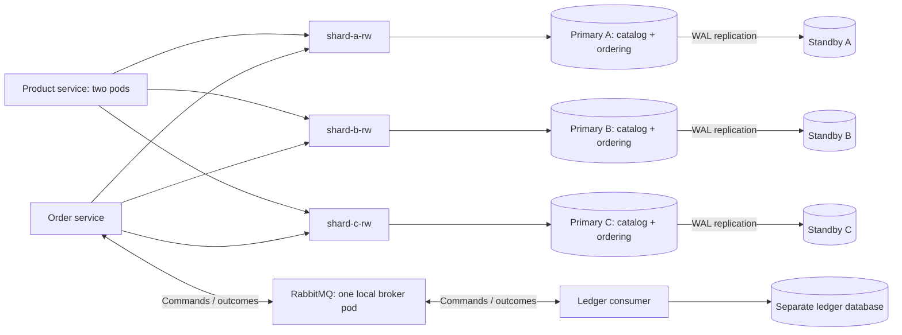

# ShardShop implementation plan

## 1. Implementation milestones

This is the implementation checklist for `microservices/shardshop`, updated on
2026-09-28. Every step starts as **Planned**; existing design documents and routing
vectors do not mean the corresponding application behavior is implemented.
Copy a row's **Implementation prompt** to start that step. Each prompt identifies
this file so the following instructions and its acceptance condition travel with it.

### Instructions for executing a step

1. Read the repository's `AGENTS.md`, this plan,
   [ARCHITECTURE.md](ARCHITECTURE.md), and [VERSIONS.md](VERSIONS.md). The
   architecture defines behavior; the version policy defines supported artifacts and the named library
   exception. The remaining sections of this file provide implementation context.
2. Check the listed prerequisite steps and their actual deliverables. Implement
   only the selected step. If a prerequisite is missing, record the specific
   blocker rather than silently expanding the task to another milestone.
3. Change that row's status to **In Progress** when work starts. Keep changes
   scoped to ShardShop, except its explicitly planned registration in
   `microservices/pom.xml`. Preserve the six applications, schema ownership,
   Snowflake contracts, and absence of tenant/shard selectors in public APIs.
4. Add the behavior and edge/error tests required by the repository instructions.
   Run the affected module's checks; never build the repository root reactor.
   Use real database/broker integration tests where IO matters and bounded polling
   for Kubernetes checks. Follow the script context/namespace guards below.
5. Mark the row **Done** only after its acceptance condition and relevant checks
   pass. Append concise evidence and exact commands to its acceptance cell. Use
   **Blocked** with a concrete reason when completion is prevented; resume as
   **In Progress** when the blocker is resolved. Partial work is not **Done**.

Execute steps in dependency order; the table order is a usable default. “Depends
on” lists direct prerequisites and includes their prerequisites transitively.
Scenario numbers refer to the
[architecture's acceptance scenarios](ARCHITECTURE.md#7-consistency-tradeoffs-and-verification).
Milestone numbers 0-6 remain stable for references from other documents.

### Milestone 0: Supported baseline and project skeleton

| Step / deliverable | Depends on | Status | Acceptance condition | Implementation prompt |
|---|---|---|---|---|
| 0.1 Version and artifact inventory | None | Done | Exact compatible tool/image selections, origins, support dates, and review deadlines are recorded; the kind node-image gap is resolved; the Snowflake exception is explicit. **2026-09-28 evidence:** all seven image index/ARM64 manifest/config chains verify. kind 1.36.5 still returns 404, so the user-authorized 1.36.4 fallback is pinned. Canonical OpenJDK 25 JDK/JRE images on Ubuntu 26.04 are pinned by digest; the JDK passes product build/tests and the JRE starts all six applications as non-root. **Check:** recompute the lock's digests and checksums as described in [support/artifact evidence](VERSIONS.md#step-01-verification-record); see the [lock](versions.lock.yaml). Host update, full image OS scans and cluster/final application-image qualification remain later milestones. | Implement step 0.1 of `microservices/shardshop/PLAN.md`: verify the dated `VERSIONS.md` baseline against official sources and create `versions.lock.yaml` for infrastructure, tooling, image digests, and support metadata. Resolve the compatible kind node artifact and required build-plugin versions. Record unresolved compatibility issues instead of inventing pins. |
| 0.2 Maven skeleton | 0.1 | Done | The parent and workload aggregators contain six independently buildable application skeletons, and the Java 25 minimum works. **2026-09-28 evidence:** all six individual `clean verify` builds and executable JAR launches passed on OpenJDK 25 (`25+36-3489`), with six startup tests and 100% line coverage; an initially empty Maven cache required no installed reactor artifacts. The build passes on JDK 25 and 26 and rejects JDK 21. **Commands:** the exact per-application build/launch loop is in [README](README.md#build-and-run); `mvn -B -ntp -f microservices/shardshop/pom.xml validate` passes for only the nine ShardShop projects. Step 0.1 artifact selections are now complete; cluster and final application-image qualification remain later milestones. | Implement step 0.2 of `microservices/shardshop/PLAN.md`: create the parent and workload aggregators, six application POMs and minimal entry points, and ShardShop-scoped Java/toolchain rules. Register ShardShop in `microservices/pom.xml`. Verify each application skeleton without adding business behavior or building unrelated modules. |
| 0.3 Dependency and test configuration | 0.2 | Done | Effective POMs, resolved dependencies/plugins, and SBOM agree with the inventory; Surefire and the opt-in `integration` profile are configured in each module. **2026-09-28 evidence:** the OpenJDK 25 build passes all 20 unit tests; the `integration` profile runs `*IT` through Failsafe, and there are no integration tests yet. In all six applications the effective POMs match the lock's 17 plugin pins, plugin dependency overrides and test-image digests, with 50 third-party application/test dependencies each and no prereleases. Scoped plugin overrides fix the advisories named in the parent POM. **Commands:** `mvn -B -ntp -f microservices/shardshop/pom.xml -Pintegration,audit clean verify`; reports land in each application's `target/audit/` ([README](README.md#dependency-and-test-validation)). Step 0.1 image/node selections are now complete; deployment qualification remains separate. | Implement step 0.3 of `microservices/shardshop/PLAN.md`: apply the scoped Boot BOM and pinned plugins, audit inherited overrides and test agents, and pin test-container images. Produce dependency/plugin reports and an SBOM, check support/advisories, and add repeatable module-level validation commands. |
| 0.4 Shared shard-routing module | 0.3 | Done | `shardshop-sharding` implements routing contract version 2 in plain Java; only product and order depend on it, and it holds no API, model, or JSON types. Golden vectors cover every shard, a value above 2^53, the signed-long maximum, and digests with the high bit set. **2026-09-28 evidence:** 14 router tests pass with 100% line and branch coverage on JDK 25 and 26; the full ShardShop build, including the `integration` profile, passes with no warnings, and product builds on its own with `-am`. **Commands:** `mvn -B -ntp -f microservices/shardshop/pom.xml -pl shardshop-sharding clean verify`. | Implement step 0.4 of `microservices/shardshop/PLAN.md`: create `shardshop-sharding` with the version-2 shard router and independently computed golden vectors, make it a dependency of product and order only, and retire the shared `contracts/` folder. Keep API, model, and JSON types out of shared modules. |

### Milestone 1: Local cluster and one replicated shard

| Step / deliverable | Depends on | Status | Acceptance condition | Implementation prompt |
|---|---|---|---|---|
| 1.1 Local Kubernetes bootstrap | 0.1 | Planned | The host runs the lock's selected Docker Desktop release with its runtime inventory recorded, and the pinned kind node image has an OS package inventory and advisory check; one control plane and two workers are ready; namespace/context guards reject unintended targets; startup preserves existing storage and allocator state. | Implement step 1.1 of `microservices/shardshop/PLAN.md`: first clear the lock's `HOST-RUNTIME-UPDATE` and the node-image part of `SBOM-AND-RUNTIME`: update the host to the selected Docker Desktop release, record its runtime inventory, and inventory and advisory-check the pinned kind node image. Then add pinned kind configuration, namespace setup, and idempotent bootstrap scripts for `kind-shardshop`. Check prerequisites, node readiness, and the StorageClass. Require the expected context and namespace before mutations; keep destructive cleanup out of startup. |
| 1.2 CloudNativePG installation | 1.1 | Planned | The operator runs a release inside its support window, deployed by digest; it and its CRDs are ready, match the Kubernetes support matrix, and can be reapplied without replacing databases. | Implement step 1.2 of `microservices/shardshop/PLAN.md`: first check the CNPG pin against its lock deadline; if it is at or past `upgrade_by`, select and lock the supported successor, repeating the step 0.1 checks for it. Install the release through a repeatable script or pinned manifests, replacing the release manifest's tag-only operator image with the lock's `images.cnpg_operator.reference` digest and checking the rendered manifest. Verify operator readiness and CRD availability with bounded waits, and report compatibility or installation failures clearly. |
| 1.3 First synchronous shard pair | 1.2 | Planned | `shard-a` has two instances with separate PVCs on different workers; `-rw`/`-ro` roles, WAL streaming, and synchronous commit behavior are verified. | Implement step 1.3 of `microservices/shardshop/PLAN.md`: provision only `shard-a` with two CloudNativePG instances, pair-scoped placement, resource limits, runtime-provided secrets, and the default synchronous profile. Add `scripts/verify-topology.sh` to verify roles, replicated writes, storage persistence, and blocked writes when its required standby is absent. |

### Milestone 2: Storage, ownership, and migrations

| Step / deliverable | Depends on | Status | Acceptance condition | Implementation prompt |
|---|---|---|---|---|
| 2.1 Remaining shard pairs | 1.3 | Planned | Six shared PostgreSQL pods form three independent primary/standby pairs; data replicates only within its pair. Scenario 2 topology checks pass. | Implement step 2.1 of `microservices/shardshop/PLAN.md`: add `shard-b` and `shard-c` using the verified pair configuration and extend `scripts/verify-topology.sh`. Assert three writable primaries, three standbys, pair-local replication, Service endpoints, and independent PVCs. |
| 2.2 Separate ledger database | 1.3 | Planned | The ledger has its own persistent database and Service, outside the six shared shard pods; restart preserves its data. | Implement step 2.2 of `microservices/shardshop/PLAN.md`: provision the separate single-instance PostgreSQL ledger database with pinned artifacts, resources, PVC, and runtime-provided credentials. Verify connectivity and persistence, and document its single-instance availability limit. |
| 2.3 Catalog migrations and grants | 0.3, 2.1 | Planned | Catalog migrations validate on every primary with their own history; product runtime can perform required DML but cannot run DDL. | Implement step 2.3 of `microservices/shardshop/PLAN.md`: add the product-owned `catalog.products` migration stream, positive `BIGINT` identifiers, migration owner/runtime roles, and a one-run-per-primary migration mechanism. Configure `catalog.flyway_schema_history`, verify idempotent migration reruns, and test runtime privilege boundaries. |
| 2.4 Ordering migrations and catalog read grants | 2.3 | Planned | Orders, items, saga counters, inbox/outbox, and both ordering quarantine stores exist on every shard; histories stay separate and `order_app` can only read catalog data. | Implement step 2.4 of `microservices/shardshop/PLAN.md`: add ordering-owned schemas, constraints, migrations, and roles for orders, snapshots, sagas, transport records, orphan results, and conflicting results. Put reconciliation counters on `ordering.order_sagas`. Grant `order_app` catalog reads without writes, and verify migration/history and privilege isolation. |
| 2.5 Ledger migrations and permanent decisions | 0.3, 2.2 | Planned | Ledger entries, permanent operation decisions, inbox/outbox, and conflicting-command quarantine have the required identity constraints and separate migration/runtime permissions. | Implement step 2.5 of `microservices/shardshop/PLAN.md`: add the `ledger` migration stream and roles for entries, immutable accepted/rejected operations, transport records, and `ledger.conflicting_commands`. Use positive `BIGINT` identifiers and uniqueness by order/logical identity. Verify the separate history, constraints, and runtime grants. |

### Milestone 3: Product contracts, IDs, and workloads

| Step / deliverable | Depends on | Status | Acceptance condition | Implementation prompt |
|---|---|---|---|---|
| 3.1 HTTP and message contracts | 0.3 | Planned | Each owning module holds its OpenAPI document or message schema, covering decimal-string IDs, payloads, errors, and correlation; clients keep their own DTOs, and no API, model, or JSON files are shared between modules. Provider tests arrive with the implementing steps. | Implement step 3.1 of `microservices/shardshop/PLAN.md`: add the product and order OpenAPI documents and the message schemas inside the modules that own them: order owns `RecordOrder`, and ledger owns its results. Capture the architecture's immutable payloads, staged validation precedence, idempotency responses, and message identities. Preserve `/api/v1` HTTP paths and reject numeric JSON IDs. Clients keep their own DTOs and tests; provider tests against these documents belong to steps 3.5, 4.1, 4.3, and 4.5. |
| 3.2 ID validation and currency selection | 3.1 | Planned | Each ID-consuming module has its own unit-tested ID parser that accepts canonical IDs up to the signed-long maximum, including values above 2^53, and rejects numeric JSON tokens, LF/CRLF/TAB text, and other noncanonical input; the order producer's currency selection passes its boundary IDs without depending on `shardshop-sharding`. | Implement step 3.2 of `microservices/shardshop/PLAN.md`: add canonical positive-long ID parsing/serialization with whole-string matching, written separately in each module that consumes IDs. Reject LF/CRLF/TAB text before conversion or hashing. Implement the order producer's modulo-100 currency rule with its own SHA-256 code and test it with the boundary IDs in ARCHITECTURE.md. Wiring the parsers into HTTP and message boundaries, including HTTP 400 for invalid IDs, belongs to steps 3.5, 4.1, 4.4, and 4.6; shard routing itself is step 0.4. |
| 3.3 Bounded Snowflake generation | 0.3 | Planned | Injected generators satisfy concurrency, sequence-exhaustion, clock-failure, and timestamp-boundary checks; failures emit no ID. Scenario 10 library checks pass. | Implement step 3.3 of `microservices/shardshop/PLAN.md`: integrate pinned `de.mkammerer.snowflake-id:snowflake-id` in ID-producing modules behind injected adapters. Use the fixed epoch/layout, checked monotonic `TimeSource`, and throwing overflow policy. Test controlled time and concurrent calls; keep domain types independent of the generator library. |
| 3.4 Generator allocation at JVM startup | 1.1, 3.3 | Planned | Concurrent starts and same-pod container restarts reserve distinct IDs; lost responses, missing/stale state, and exhaustion fail safely without resetting the high-water mark. | Implement step 3.4 of `microservices/shardshop/PLAN.md`: add the named ConfigMap allocator, narrow RBAC, and entrypoint launcher for order producer, order service, and ledger service. Reserve IDs 1-1023 with bounded resource-version CAS before every JVM start, burn uncertain reservations, and test the architecture's restart/failure rules. Reserve generator 0 for fixtures. |
| 3.5 Product API on primaries | 0.4, 2.3, 3.2 | Planned | PUT returns 201/200/409 correctly; GET returns stored data or 404; invalid IDs return 400; provider tests match responses to the product OpenAPI document; reads reach PostgreSQL and use bounded pools/timeouts. | Implement step 3.5 of `microservices/shardshop/PLAN.md`: implement the product controller, domain/service logic, and JDBC repositories for immutable products across three primary endpoints. Select the shard with `shardshop-sharding` before transactions, disable read caching, and test idempotency, conflicts, large-ID storage round trips, and IO failures. Keep replica-profile reads for step 6.1. |
| 3.6 Deterministic product dataset | 3.3 | Planned | Seeder, reader, and order producer each derive the same unique USD/EUR product IDs from one dataset configuration, and repeated derivations reproduce the seeder's payloads; no manifest file is shared. | Implement step 3.6 of `microservices/shardshop/PLAN.md`: derive the fixed product dataset in each workload app from its configuration: generator 0, the dataset's reserved timestamp range and sequence schedule, product count, and USD/EUR split, using the pinned library with a deterministic `TimeSource`. Test that every app derives the same first and last IDs and that repeated runs reproduce payloads. Share no manifest file or Java module. |
| 3.7 Product seeder application | 3.5, 3.6 | Planned | Repeated seeding produces identical products; partial failures retain original IDs/payloads; completion requires successful primary-read verification. | Implement step 3.7 of `microservices/shardshop/PLAN.md`: implement `shardshop-product-seeder` as a finite HTTP-only application using the derived product dataset. Add bounded concurrency, request deadlines, retries, verification reads, and success/failure exit behavior. Test interrupted and repeated runs without SQL credentials or continuous product writes. |
| 3.8 Product reader application | 3.5, 3.6 | Planned | The reader has bounded load and reports request/latency/error metrics; its HTTP/1.1 pool, rotation, and five-second request deadline match the contract. | Implement step 3.8 of `microservices/shardshop/PLAN.md`: implement `shardshop-product-reader` using the derived product dataset, the documented 16-connection load profile, finite connection lifetimes, and bounded retries. Add counters needed to distinguish product pods, routing outcomes, and later replica failures; test configuration and deadline behavior. |
| 3.9 Product deployment and seeding gate | 3.7, 3.8 | Planned | Application images have an OS package inventory and advisory check; two product pods receive requests within 120 seconds; a failed/partial seed blocks the reader and order producer; successful repeated runs pass scenarios 1 and 3 for primary reads. | Implement step 3.9 of `microservices/shardshop/PLAN.md`: add pinned application images with an OS package inventory and advisory check (the lock's `SBOM-AND-RUNTIME` item), product Service/two-pod Deployment, reader Deployment, and the seeder Job with its documented deadlines. Add a run-specific startup gate and pod-traffic checks. Hold the order producer at zero until step 4.8 deploys the complete saga; keep workloads free of SQL access. |

### Milestone 4: Complete order-to-ledger saga

| Step / deliverable | Depends on | Status | Acceptance condition | Implementation prompt |
|---|---|---|---|---|
| 4.1 Order validation and atomic acceptance | 2.4, 3.4, 3.5 | Planned | PUT/GET, staged 400/409/422/503 precedence, locked re-checks, unknown commits, and atomic order/saga/outbox writes pass scenario 9; catalog IO holds no order connection or lock; provider tests match responses to the order OpenAPI document. | Implement step 4.1 of `microservices/shardshop/PLAN.md`: implement order validation, catalog lookups, request fingerprints, idempotent PUT/GET, and the two short locked checks. Route the order and each product lookup with `shardshop-sharding`. Atomically persist valid orders, snapshots, saga identity, and `RecordOrder` outbox data. Test races, conflicting retries, new-ID failures, and catalog outages using the architecture's precedence. |
| 4.2 RabbitMQ topology and policies | 1.1, 0.3, 3.1 | Planned | The persistent broker runs a release inside its support window and has processing/parking quorum queues, distinct complete source policies, required feature flags, and verified length/byte/retry limits. | Implement step 4.2 of `microservices/shardshop/PLAN.md`: first check the RabbitMQ pin against its lock deadlines; if it is at or past `qualify_successor_by`, select and lock the supported successor with native delayed retry, repeating the step 0.1 checks for it. Deploy the pinned one-broker RabbitMQ/OTP image and provision the exact exchanges, bindings, queues, and per-queue policies in the architecture. Bound source and parking queues, provision DLQs first, and verify effective settings and readiness without substituting TTL retry loops. |
| 4.3 Order outbox publisher | 4.1, 4.2 | Planned | All three order shards are polled after restart; confirmed/routed messages become published; returns, nacks, timeouts, and crashes keep safe retry state and stable envelope IDs; published `RecordOrder` envelopes match the order-owned message schema. | Implement step 4.3 of `microservices/shardshop/PLAN.md`: implement the order outbox relay with bounded polling, persistent mandatory publishing, publisher confirms, and finite backoff. Mark a row published only after confirmation without return. Test crash/restart boundaries and duplicate publication without changing a persisted envelope's identity. |
| 4.4 Ledger command consumer | 2.5, 3.2, 3.4, 4.2 | Planned | A command commits one immutable decision and result outbox record before acknowledgement; duplicate commands regenerate the saved outcome; conflicts commit quarantine first; commands with invalid IDs are rejected without requeue. | Implement step 4.4 of `microservices/shardshop/PLAN.md`: implement ledger command validation, inbox handling, per-order serialization, USD acceptance/EUR rejection, and permanent operation outcomes. Atomically create ledger state and a result outbox envelope. Test duplicate inbox hits, changed allowlists, conflicting commands, rollback, and acknowledge/reject behavior. |
| 4.5 Ledger result publisher | 4.4 | Planned | Stored outcomes reach the result queue with preserved logical correlation; each new envelope has a fresh message ID and retransmissions retain it; result envelopes match the ledger-owned message schema. | Implement step 4.5 of `microservices/shardshop/PLAN.md`: implement the ledger outbox relay with mandatory persistent publishing, confirms, bounded retry, and restart recovery. Test returned/unconfirmed deliveries and publish-before-mark crashes. Preserve permanent decision data and distinguish new result envelopes from retransmissions. |
| 4.6 Order result consumer | 4.3, 4.5 | Planned | Results atomically confirm/cancel the correct order; duplicates are harmless; absent/conflicting results use named quarantine stores; unavailable shards follow retry/DLQ handling; results with invalid IDs are rejected without requeue. | Implement step 4.6 of `microservices/shardshop/PLAN.md`: implement result routing, correlation/fingerprint checks, per-order advisory locking, inbox persistence, and terminal transitions. Commit `ordering.orphan_results` or `ordering.conflicting_results` before acknowledgement when required. Test concurrency with order creation, immutable terminal outcomes, and database failures. |
| 4.7 Order producer application | 3.4, 3.6, 4.1 | Planned | The HTTP-only producer uses the derived product dataset, selects USD/EUR deterministically, preserves request IDs/payloads, and polls status within bounded deadlines. | Implement step 4.7 of `microservices/shardshop/PLAN.md`: implement `shardshop-order-producer` with bounded rates/concurrency, the currency rule from step 3.2, and one retained Snowflake ID per new order. Test submission failures, unknown outcomes, status polling, and terminal results without SQL access or replacement IDs on retries. |
| 4.8 Saga deployment and first end-to-end run | 3.9, 4.6, 4.7 | Planned | Order, ledger, and order producer run with the correct launchers and credentials; seeding gates load; scenarios 4 and 5 pass end to end. | Implement step 4.8 of `microservices/shardshop/PLAN.md`: add order/ledger/producer application images and Kubernetes manifests, wiring generator launchers, services, secrets, and the seeding gate. Run bounded USD/EUR traffic and verify CONFIRMED/CANCELLED outcomes, stable retries, exactly-once business effects, and the final six running application pods. |

### Milestone 5: Recovery, retention, and backpressure

| Step / deliverable | Depends on | Status | Acceptance condition | Implementation prompt |
|---|---|---|---|---|
| 5.1 Durable saga reconciliation | 4.8 | Planned | Lost results recover through stored ledger outcomes; injected-clock checks prove at most five automatic replay enqueues even after restarts and published-row cleanup. | Implement step 5.1 of `microservices/shardshop/PLAN.md`: implement the architecture's reconciliation schedule using counters/timestamps on `ordering.order_sagas`. Atomically advance the attempt and enqueue a new envelope while preserving logical IDs. Test lost messages, existing unpublished rows, cleanup, restarts, and exhausted budgets without cancelling an order. |
| 5.2 Safe transport cleanup | 5.1 | Planned | Only eligible inbox and confirmed-published outbox rows are removed; permanent decisions, saga identity/counters, unpublished messages, and unresolved quarantine survive. | Implement step 5.2 of `microservices/shardshop/PLAN.md`: add configurable bounded transport-retention jobs in order and ledger modules. Test old duplicate commands/results after cleanup, including a rejected ledger operation after its allowlist changes. Verify every protected business/quarantine record and reconciliation limit remains intact. |
| 5.3 DLQ replay tool | 5.2 | Planned | Replay preserves original payload/logical IDs, acknowledges parking only after confirmed routing, and remains safe on repeated failures or crashes. | Implement step 5.3 of `microservices/shardshop/PLAN.md`: add an explicit bounded manual replay tool for both parking queues, guarded to the lab context. Publish persistently with mandatory routing and confirms before acknowledging the parked delivery. Test failed replay, confirm/ack crash gaps, and replay after transport cleanup; never add an automatic DLQ loop. |
| 5.4 Retry and capacity drills | 5.3 | Planned | Scenario 7 records actual redelivery timing and limit boundaries; long outages use DLQ/reconciliation; missing/full DLQs cause queue rejection while broker-wide alarms remain clear. | Implement step 5.4 of `microservices/shardshop/PLAN.md`: add bounded drills for the pinned broker's reject/retry behavior, long shard outages, unbound DLQs, and full parking queues. Verify negative confirms leave outboxes unpublished, measure actual delays, restore bindings/capacity, and demonstrate progress with reconciliation or explicit replay. |
| 5.5 Crash recovery and observability | 5.4 | Planned | Scenario 6 passes across commit/publish/ack crash windows; required metrics identify stalled outboxes, sagas, quarantine, queue capacity, and pool/replication pressure. | Implement step 5.5 of `microservices/shardshop/PLAN.md`: add deterministic crash-window integration checks and bounded restart drills for relays and consumers. Complete actionable metrics/logging for recovery and resource pressure without secrets or full payloads. Verify duplicate delivery has no duplicate business effect and failures can be diagnosed from recorded evidence. |

### Milestone 6: Read profiles, failover, restore, and operation

| Step / deliverable | Depends on | Status | Acceptance condition | Implementation prompt |
|---|---|---|---|---|
| 6.1 Strict replica-read profile | 3.9 | Planned | Stale reads are observable; absent/hung standbys return 503 within four server seconds and before the reader's five-second deadline, without primary fallback. Scenarios 3 and 8 read checks pass. | Implement step 6.1 of `microservices/shardshop/PLAN.md`: add optional product reads through `-ro` with a shared three-second database budget and four-second server deadline. Test lag, absent endpoints, hung queries, promotion gaps, and recovery; keep primary reads as default and record replica failures separately. |
| 6.2 Synchronous failover drills | 5.5, 6.1 | Planned | Switchover and primary failure promote the synchronized standby, preserve acknowledged saga commits, block writes during standby loss, and leave unrelated shards working. | Implement step 6.2 of `microservices/shardshop/PLAN.md`: add repeatable synchronous switchover, abrupt primary-loss, and standby-recovery drills. Assert actual promotion, safe former-primary rejoin, no dual writable primary, PVC persistence, connection recovery, and the documented DLQ/reconciliation path for outages longer than transport retries. |
| 6.3 Coordinated backup and isolated restore | 5.3, 6.2 | Planned | Isolated restores retain schema/routing metadata, permanent outcomes, quarantine, and the latest allocator high-water mark; backup artifacts live outside kind. | Implement step 6.3 of `microservices/shardshop/PLAN.md`: add guarded backup/restore scripts with explicit source/target arguments. Quiesce producers and drain work for a baseline dump of all shards and ledger, export broker definitions and dataset/generation metadata, and retain allocator history independently. Verify restored data and reject an unknown or regressed allocator mark. |
| 6.4 Asynchronous-loss audit and recovery | 6.3 | Planned | Deliberate loss is distinguished from synchronous guarantees; late and previously acknowledged orphan outcomes are quarantined, ID reuse is blocked, and verified restore/replay resolves recoverable cases. | Implement step 6.4 of `microservices/shardshop/PLAN.md`: add the opt-in asynchronous-loss drill and privileged ledger-to-order audit while writes are paused. Compare identities/fingerprints, persist missing/mismatched pairs in the named stores, and test restoration of original order/saga identity before replay and quarantine clearing. Preserve unresolved incidents and permanent ledger decisions. |
| 6.5 Supported upgrade qualification | 0.3, 1.2 | Planned | Every installed component moves to a supported release before its lock deadline, with the successor choice, compatibility checks, upgrade/recovery procedure, and evidence from the checks that exist at that point recorded. | Implement step 6.5 of `microservices/shardshop/PLAN.md`: recheck `VERSIONS.md` against official sources and qualify available community-supported broker/operator/runtime updates for the components already installed. Run it whenever an installed component approaches its lock deadline, whatever the milestone. Rerun the affected checks that exist at that point (contract, retry, capacity, failover, restore); update pins and support evidence. If a successor is unavailable, record the blocker and deadline rather than inventing a version or passing EOL. |
| 6.6 Complete demo and acceptance run | 6.4, 6.5 | Planned | A fresh lab follows the README without hidden steps; all ten architecture scenarios have commands and passing evidence, including full Snowflake lifecycle checks. | Implement step 6.6 of `microservices/shardshop/PLAN.md`: finish ShardShop's README and guarded startup/verification scripts, assemble a scenario-to-command checklist, and run the complete demo. Verify final pod counts, no workload SQL access, replica/failover recovery, allocation exhaustion/restarts, dataset consistency across workloads, and large-ID round trips. Record limitations and exact affected-module test/drill commands. |

The supported-version gate (milestone 0) and first replicated pair (1.3) must
pass before repeating database infrastructure. The first complete order demo is
4.8: accepting an order alone is not completion of the saga. Individual recovery
and failover steps retain their own acceptance gates. Support deadlines take
precedence over table order: steps 1.2 and 4.2 install only releases inside their
support window, and step 6.5 moves installed components to supported releases
before their lock deadlines, whatever the milestone.

## 2. Scope and target topology

Status: design roadmap, updated on 2026-09-28. [ARCHITECTURE.md](ARCHITECTURE.md)
defines module boundaries, HTTP/message contracts, consistency policies, and
acceptance scenarios. This plan defines implementation order and local
infrastructure. [VERSIONS.md](VERSIONS.md) defines the stable-release baseline,
support windows, library management, and mandatory upgrade gates.

Build ShardShop in `microservices/shardshop` to exercise product read load,
horizontal sharding, physical replication, order sagas, and Kubernetes failover.
The APIs expose decimal-string Snowflake business IDs generated with
`de.mkammerer.snowflake-id:snowflake-id`; shard routing stays internal, and there
is no tenant concept in the API or data model.


Use one local Kubernetes cluster and three CloudNativePG `Cluster` resources,
named `shard-a`, `shard-b`, and `shard-c`, each with `spec.instances: 2`.
Each resource manages one primary and one physical streaming standby. A single
resource with six instances would create one primary and five standbys. See
[CloudNativePG replication](https://cloudnative-pg.io/docs/1.30/replication/).



Database pod names are operator-managed, and primary/standby roles can switch.
Connect through Services, never pod IPs. The operator redirects each `-rw`
Service after promotion; existing connections and in-flight transactions can
still fail. See [CloudNativePG architecture](https://cloudnative-pg.io/docs/1.30/architecture/).
Optional product reads through `-ro`, including standby failure behavior, follow
the architecture's replica read profile.

There are six shared PostgreSQL instance pods, plus a separate ledger PostgreSQL
pod and one RabbitMQ broker pod. After the product seeder Job completes, six
application pods remain running: two product service pods, one order service pod,
one ledger consumer pod, one product reader pod, and one order producer pod.
The seeder Job's completed pod and operator/system/migration/backup pods are
additional; Maven aggregators have no runtime pods.

## 3. Modules, data ownership, and routing

Create a parent Maven aggregator with five top-level children and six deployable
applications. `shardshop-workload` is a POM aggregator for the three workload
applications; product, order, and ledger are services; `shardshop-sharding` is a
plain Java library with the shard-routing rule, used only by product and order.
Nothing else is shared: each module owns its API, DTO/model classes, JSON handling,
and test data, as described in the architecture.

Product and order services share three shard databases with separate schema
ownership. On every shard, product migrations own `catalog` and
`catalog.flyway_schema_history`; order migrations own `ordering` and
`ordering.flyway_schema_history`. Each migration owner has separate credentials
and explicitly configures its Flyway schema/history location. Runtime roles lack
DDL rights. The order runtime role receives `USAGE` on `catalog` and `SELECT`
on its products, with no product write permission. The separate ledger database
uses schema `ledger`, its own migration owner, and `ledger.flyway_schema_history`.
Unrelated owners never use a common default history table.

Every shard has the same `catalog` and `ordering` schemas but different rows.
Route products by `product_id` and orders by `order_id`:

```text
unsignedBigEndian(SHA-256(UTF-8(canonical decimal Snowflake ID))) % 3
  0 -> shard-a
  1 -> shard-b
  2 -> shard-c
```

Interpret all 32 digest bytes as an unsigned big-endian integer (byte 0 most
significant). `shardshop-sharding` implements this rule and tests it against
independently computed golden vectors. The order producer applies the same integer
modulo 100 with its own code: EUR when it is below the configured
`rejected-order-percent`, otherwise USD. The exact input encoding and boundary
cases live in [ARCHITECTURE.md](ARCHITECTURE.md).
Use positive Java `long` IDs and PostgreSQL `BIGINT` columns, with canonical
decimal strings for all HTTP and message IDs, including values above 2^53.
Reject numeric JSON IDs, signs, leading zeros, whitespace, zero, and values above
9223372036854775807. The version-2 vectors replace the unreleased draft;
deployed data using a different identifier/routing contract would need migration.

Pin `de.mkammerer.snowflake-id:snowflake-id:0.0.2` explicitly outside the Boot BOM.
Follow the architecture's fixed epoch `2026-01-01T00:00:00Z`, 41/10/12-bit layout,
checked monotonic time source, and throwing sequence-overflow policy. Use one
injected generator per ID-producing process. Reserve generator 0 for the
deterministic product dataset; seeder, reader, and order producer derive the same
IDs from its configuration. Live order/correlation/message generators reserve a fresh generator ID
1-1023 for every JVM start. Persist that allocation before generating, including
on container restart; never derive it from a pod name or choose it randomly.
This finite lab supports at most 1,023 such starts per retained dataset. Existing
logical requests and outbox retransmissions retain their assigned IDs.

Order items, saga state, inbox, and outbox remain on their order's shard.
Resolve products from their owning primaries while holding no order transaction,
advisory lock, or order connection. Then open a short order transaction, lock and
re-check existing state/quarantine, and store immutable product/price snapshots
with the order. There is no cross-shard foreign key, transaction, or
join. Ledger rows live only in the separate ledger database. Physical replication
copies each primary's database to its own standby; it does not distribute rows
between shards.

Freeze the hash and three-shard mapping. Changing `% 3` to `% 4` would misroute
existing data; expansion requires a versioned routing map or virtual buckets
and an explicit migration. Routing is not authorization, and skewed access
patterns can still create a hot shard.

## 4. Technology choices

Use long-supported releases where the project/vendor offers them, and maintained
stable GA releases with planned upgrades elsewhere. The selected policy is
**community releases with regular upgrades**; commercial extended support is
outside scope. This applies to runtimes, every direct/transitive library, build/test
plugins, container OS packages, and operational tooling. Stable does not imply
LTS. The explicitly requested pre-1.0 Snowflake library is the narrow exception
to the maintained-release requirement: no published support term is assumed.
Follow the dated baseline and lifecycle evidence in [VERSIONS.md](VERSIONS.md).

| Concern | Planned choice |
|---|---|
| Java | JDK 25 or newer for build and tests (bytecode targets release 25); OpenJDK 25 application runtime; no vendor or exact-patch restriction |
| Local Kubernetes | Kubernetes 1.36.x with stable kind 0.33.0 and the existing supported Docker-compatible runtime; explicitly resolve a compatible node image |
| Node layout | One control-plane node and two worker nodes |
| Database lifecycle | CloudNativePG 1.30.1 initially, with upgrades before operator EOL; three independent two-instance shard clusters and separate ledger storage |
| Database | PostgreSQL 18, reviewed patch 18.6, with maintained 18.x updates and pinned image digests |
| Application | Six Spring Boot 4.1.1 applications in the five-module layout; a scoped BOM baseline and supported branch upgrades |
| Persistence | Explicit JDBC repositories; bounded pools per service, pod, shard, and endpoint |
| Identifiers | Explicitly pinned `de.mkammerer.snowflake-id:snowflake-id:0.0.2`; decimal strings on the wire and positive `BIGINT` in PostgreSQL; reviewed support-policy exception |
| Migrations | Boot-managed Flyway core/PostgreSQL module at matching versions, with separate schema/history and migration stream for each owner |
| Messaging | Stable RabbitMQ 4.3.6 and its supported bundled OTP 27.3.4.17 initially; explicit rolling-support upgrade requirement and the architecture's retry/DLQ contract |
| Libraries | Boot-managed compatible Spring/JDBC/AMQP/Jackson/logging/test libraries; verify upstream maintenance and audit inherited overrides |
| Build and testing | Command-line Maven (repository minimum 3.9.0), separately pinned GA build plugins, JUnit/Mockito/Testcontainers, and Kubernetes drills |

The support baseline was checked on 2026-09-28. PostgreSQL 18 has multi-year
maintenance; the OpenJDK 25 selection carries no assumed vendor support horizon.
OpenJDK container images need qualification after the distribution change.
Kubernetes, CNPG, RabbitMQ, Boot, and many libraries need regular supported-release upgrades. Recheck sources before implementation and
pin exact artifacts only after compatibility and image-availability verification.
In particular, kind's default Kubernetes 1.37 image is outside CNPG 1.30's
supported matrix, and the reviewed kind artifacts lag Kubernetes 1.36's current
patch. Resolve that artifact gap in milestone 0. No prereleases, floating tags,
external snapshots, unchecked inherited library versions, or assumed paid support.

The local RabbitMQ baseline has one broker pod. A single-member quorum queue
provides persistent storage but no broker high availability. Application queues
use quorum delayed redelivery with a finite `delivery-limit`. Configure
`dead-letter-strategy: at-least-once` and `overflow: reject-publish` on each source
queue that dead-letters to a durable quorum DLQ. Use separate complete source
policies with distinct dead-letter routing keys. Bound both source and parking
queues to 1,000 messages or 16 MiB of message bodies with rejection at capacity.
Follow the architecture's version-specific rejection and backoff settings. Its
short transport retry window is followed by DLQ parking and saga reconciliation
for longer outages; final DLQs have no expiry or automatic retry loop. Measure
the exact retry timing and queue rejection behavior on the pinned broker.

RabbitMQ 4.3.x and CNPG 1.30.x are explicit short-window support exceptions, with
community EOL in November and approximately December 2026 respectively. Follow
the immediate upgrade items and monthly review in [VERSIONS.md](VERSIONS.md),
including requalification of retry/capacity and database failover behavior. A
successor must be stable, available, and community-supported before selection.
If none is available, stop deployment past EOL or validate a supported community
replacement. Do not label these short-lived release lines LTS.

## 5. Local infrastructure details

- Use namespace `shardshop` and context `kind-shardshop`; scripts must check
  both before making changes. Keep the operator installation version explicit.
- Scope pod anti-affinity to each shard pair and spread its instances across
  the two workers. Do not require all six shared database pods on separate nodes.
- Give every PostgreSQL instance its own PVC; start with 2 GiB each for tiny test
  data. Give RabbitMQ persistent storage as well. Confirm the StorageClass
  provisions volumes on intended nodes. Monitor disk usage because retained WAL
  can fill a small volume during replica downtime.
- Start each PostgreSQL instance at 250m CPU request, 512 MiB memory request,
  and 1 GiB memory limit, then measure. Budget separately for six applications,
  the broker, operator, and temporary Jobs; this is not a whole-lab capacity
  guarantee. Account for both product pods when sizing database connections.
- Bootstrap secrets at runtime from environment input or generated credentials;
  commit references only. Separate migration and application permissions.
  Workload apps receive HTTP configuration, never SQL credentials.
- Precreate `shardshop-snowflake-generators` with its durable allocation counter.
  An entrypoint launcher for order producer, order service, and ledger service
  uses bounded resource-version CAS via pinned kubectl to reserve one unused
  generator ID before each JVM start. Give only these launchers narrowly scoped
  access to that named ConfigMap. An init container alone does not cover container
  restarts. Burn uncertain reservations; fail startup on exhaustion or missing,
  stale, or inaccessible allocation state. Keep its high-water mark independently
  of old database backups and never restore it backwards.
- Run applications in Kubernetes for the demo so Service DNS resolves normally.
  Keep database/broker endpoints internal; expose APIs by port-forward.
  Document separate port-forwards for IDE debugging if needed.
- Start infrastructure and services, run the idempotent product seeder Job, and
  wait for its successful completion before starting reader and order producer
  Deployments. Fail the startup gate if seeding fails. The default workload
  performs no continuous product writes after seeding.
- Treat kind storage as disposable across cluster/node deletion. PVCs protect
  against ordinary pod replacement but are not backups.

Multiple local nodes share one physical machine. This setup teaches pod/process
failure handling but cannot protect against laptop or disk failure.

## 6. Implementation boundaries

Use the architecture's product and order HTTP contracts. For orders,
`PUT /api/v1/orders/{orderId}` commits an order, items, pending saga, and
`RecordOrder` outbox atomically on one shard, then returns `202 Accepted`.
Identical retries return `202` while pending or `200` with the terminal result;
conflicting payload reuse returns `409`. Persist a normalized request fingerprint
and never start another saga for a retry. Apply the architecture's staged error
precedence: local syntax, locked quarantine/existing-order check, catalog
validation outside the order transaction, then a final locked re-check. Catalog
unavailability wins over missing products, and mixed item currencies win over
order/product currency mismatch. Create no state for validation failures.
`GET` returns the current state or `404` when absent.

Keep controllers responsible for mapping/validation, services for business logic,
and repositories for JDBC IO. Domain types stay free of Spring dependencies.
Select the shard before a transaction and retain it through commit. Prefer
explicit shard handles over thread-local routing; test concurrent requests for
routing leakage. Public contracts expose no tenant or shard selectors.
Keep the ID generator behind an injected service adapter; domain types only need
positive `long` values. A new-ID failure returns `503 ID_GENERATION_UNAVAILABLE`
with no partial transaction, or retains a consumer delivery for retry/DLQ handling.
Existing-order HTTP retries and retransmissions of an already persisted envelope
reuse their IDs. Reconciliation and regenerated ledger outcomes keep their logical
correlation IDs but allocate a fresh `messageId` for each newly enqueued envelope.

Use finite connection-acquisition, connection-establishment, statement, and
request timeouts. Retry within bounded deadlines with backoff. Writes with unknown
commit outcomes reuse the original stable ID and fingerprint to discover their
result. All writes, product validation, order status reads, and saga operations
use `-rw`. Optional `-ro` product reads allow staleness and fail with `503` within
four seconds if the standby is unavailable; their entire database phase has a
three-second shared budget and the reader has a five-second overall deadline.
They do not fall back to the primary.

Run every owner's migration stream once against each applicable primary, using
only that owner's schema/history and credentials. Replication carries changes to
standbys. Verify each owner's versions on every shard before releasing dependent
code. Migrations across clusters are not atomic: use additive compatible changes
and stop rollout if any migration fails.

Implement reconciliation with `reconciliation_attempts` and
`next_reconciliation_at` on `ordering.order_sagas`: atomically update them while
inserting each new replay outbox row, with at most five automatic enqueues.
Existing unpublished-row retries do not consume a new attempt, and published-row
cleanup cannot reset the budget. Pending sagas re-send the same logical
`RecordOrder`, and duplicate commands regenerate the ledger's stored
outcome through its outbox. Ledger decisions are immutable and retained
permanently, including rejections, even when inbox/outbox rows are cleaned up.
Results whose order is absent after asynchronous failover are durably quarantined
for operator restore/reconciliation. They must not silently succeed, cancel a
missing order, or create a replacement order. Retry exhaustion never cancels a saga.

Use `ordering.orphan_results` for missing orders, `ordering.conflicting_results`
for conflicting outcomes/identities, and `ledger.conflicting_commands` for
commands that contradict a permanent ledger decision. Commit quarantine before
acknowledgement, preserve the existing decision/state, alert, and retain unresolved
records through cleanup and backup. If persistence fails, use bounded broker
retry followed by DLQ parking and reconciliation/operator recovery.

## 7. Replication and backup policy

Default reliable saga/failure exercises to synchronous replication: require the
standby's durable acknowledgement and promote only the synchronized standby.
Accept blocked writes while it is unavailable. The separate asynchronous profile
is for explicit controlled-loss demonstrations. A promoted asynchronous standby
can lack an acknowledged order whose command already reached the ledger;
application idempotency cannot repair that loss. Exercise the missing-order
quarantine/reconciliation path rather than claiming automatic recovery. See
[PostgreSQL streaming replication](https://www.postgresql.org/docs/current/warm-standby.html)
and [CloudNativePG synchronous replication](https://cloudnative-pg.io/docs/1.30/replication/).

For the initial recovery exercise, dump all three shards and the ledger database
to storage outside kind, and restore into isolated targets. Record each database's
identity, routing version, owner schema versions, and backup time. Separate dumps
are not a globally consistent snapshot: quiesce producers and drain sagas/relays
for a coordinated baseline backup, or explicitly reconcile restored order and
ledger state. Preserve permanent ledger operation outcomes in every supported
backup/restore process. Export broker definitions; database outboxes and
reconciliation provide replay data, not a cross-system snapshot.

Preserve the Snowflake epoch/layout, the product dataset configuration version,
and live generator allocation history along with the recovery metadata. A database
restore must retain the latest allocator high-water mark, even if the restored
data is older; fail startup if that mark cannot be established. Resetting the
counter is allowed only after retiring all old emitters, databases, broker data,
backups, and other replay inputs from that lab. Ordinary startup or pod replacement
must never reset it.

A later operational version should add base backups and continuous WAL archiving
for point-in-time recovery through the operator's supported integration. Replicas
copy accidental deletes and cannot replace backups. The single-instance ledger
database and single broker remain availability limits.

## 8. Planned layout and verification

```text
microservices/shardshop/
  PLAN.md
  README.md
  ARCHITECTURE.md
  VERSIONS.md                     # baseline, support evidence, update policy
  versions.lock.yaml              # verified artifact inventory, support dates, open blockers
  pom.xml                         # parent POM aggregator
  shardshop-sharding/             # shard routing, used only by product and order
  shardshop-workload/
    pom.xml                       # workload POM aggregator
    shardshop-product-seeder/      # product seeder Job application
    shardshop-product-reader/      # read-load application
    shardshop-order-producer/      # order-load application
  shardshop-product/              # product API, catalog migrations
  shardshop-order/                # order API and saga, ordering migrations
  shardshop-ledger/               # consumer and ledger migrations
  infra/kind.yaml
  infra/k8s/                     # databases, broker, roles, Services, Jobs, apps
  scripts/                       # startup gates, verification, backup, restore
```

ShardShop's parent aggregator is registered in `microservices/pom.xml` (step 0.2).
Unit tests use Mockito with no network, cover new executable lines,
and check edge/error paths. Use explicit integration profiles for local
containers and Kubernetes drills, with bounded condition polling, not fixed
sleeps. Turn every architecture acceptance scenario into a reproducible check,
including per-product-pod request counts, rejected-order fixtures, lost-result
recovery, DLQ replay after cleanup, durable reconciliation limits, combined-error
precedence, catalog IO outside order locks/transactions, queue-capacity rejection,
standby-loss behavior, and the complete Snowflake generation/restart contract.

Infrastructure checks must also:

1. Use fixed decimal-string Snowflake fixtures with independently calculated A/B/C routes.
   Verify rows on exactly the expected primary and eventually its paired standby.
2. Check `pg_is_in_recovery()` on every instance and `pg_stat_replication` on
   every primary. Confirm three writable shard primaries, rejected writes on
   standbys, each owner's migration version, and effective runtime privileges.
3. Replace a pod without deleting its PVC and verify persisted records.
4. Perform controlled switchover and abrupt primary failure drills. Assert actual
   promotion rather than a restart, safe rejoining of the former primary, no two
   writable primaries in a pair, and continued operation of unrelated shards.
   Design drills against the operator's [failover behavior](https://cloudnative-pg.io/docs/1.30/failover/).
5. Record actual asynchronous loss and synchronous blocked-commit behavior.
   Restore isolated backups and assert schema/routing compatibility plus order,
   saga, and ledger consistency.
6. Start concurrent ID-producing JVMs and restart containers without replacing
   pods. Verify distinct generator reservations, bounded allocation failures,
   retained allocator history across restore, and no duplicate IDs. Confirm
   that all workloads derive the same dataset IDs, and exact large-ID round trips
   as in scenario 10.

The planned commands below run from the repository root after the module,
profiles, and scripts are implemented. Build only Shardshop or the affected
submodule; never run the repository's root Maven build for this project.

```bash
mvn -f microservices/shardshop/pom.xml clean verify
mvn -f microservices/shardshop/pom.xml -Pintegration verify
bash microservices/shardshop/scripts/up.sh
kubectl --context kind-shardshop -n shardshop get clusters.postgresql.cnpg.io
kubectl --context kind-shardshop -n shardshop get pods,pvc,svc
bash microservices/shardshop/scripts/verify-topology.sh
bash microservices/shardshop/scripts/verify-sagas.sh
bash microservices/shardshop/scripts/verify-failover.sh
```

Verification scripts must restrict mutations to this disposable lab and report
their scenarios. Keep destructive volume/cluster cleanup separate from startup
and verification. Supply explicit source/target arguments for backup and restore.
