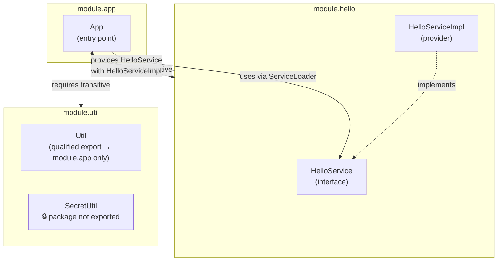
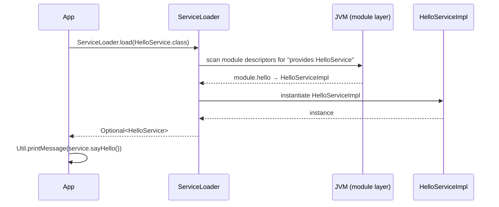

# Java Platform Module System (JPMS)

A hands-on demonstration of Java 9+ JPMS covering qualified exports, `transitive` requires,
the Service Provider Interface (SPI) pattern via `ServiceLoader`, and strong encapsulation
of internal packages.

**Stack:** at least Java 9

## Contents
1. [Quick Start](#1-quick-start)
2. [Architecture](#2-architecture)
3. [Modules](#3-modules)
4. [JPMS Features Demonstrated](#4-jpms-features-demonstrated)
5. [ServiceLoader Flow](#5-serviceloader-flow)
6. [Tests](#6-tests)

---

## 1. Quick Start

### Build and test

```bash
mvn -pl modules/module-app -am test
```

### Run the modular application

```bash
mvn -pl modules/module-app -am package
java \
  --module-path modules/module-util/target/module-util-1.0-SNAPSHOT.jar:modules/module-hello/target/module-hello-1.0-SNAPSHOT.jar:modules/module-app/target/module-app-1.0-SNAPSHOT.jar \
  --module module.app/dev.nklip.javacraft.modules.app.App
```

Expected output:

```
Hello World from Modules!
```

---

## 2. Architecture
<sub>[Back to top](#java-platform-module-system-jpms)</sub>



---

## 3. Modules
<sub>[Back to top](#java-platform-module-system-jpms)</sub>

### `module.util` — Utility module

Exports a single utility package to **one specific consumer only** (`module.app`), while
keeping the `secret` package completely hidden from all other modules.

```java
module module.util {
    exports dev.nklip.javacraft.modules.util to module.app;
}
```

| Class | Package | Accessible from | Description |
|-------|---------|-----------------|-------------|
| `Util` | `dev.nklip.javacraft.modules.util` | `module.app` only | Prints a message to stdout |
| `SecretUtil` | `dev.nklip.javacraft.modules.util.secret` | **Nobody** (not exported) | Internal helper — invisible to all other modules |

---

### `module.hello` — Service module

Defines the service interface and registers its implementation as a provider.
The consumer (`module.app`) is fully decoupled — it depends on the interface, not the class.

```java
module module.hello {
    exports dev.nklip.javacraft.modules.hello;
    provides dev.nklip.javacraft.modules.hello.HelloService
            with impl.dev.nklip.javacraft.modules.hello.HelloServiceImpl;
}
```

| Class | Package | Description |
|-------|---------|-------------|
| `HelloService` | `dev.nklip.javacraft.modules.hello` | Service interface — declares `sayHello()` returning a `String` |
| `HelloServiceImpl` | `dev.nklip.javacraft.modules.hello.impl` | Provider implementation — returns `"Hello World from Modules!"` |

---

### `module.app` — Consumer module

Requires both other modules with `transitive` (re-exporting their read access to any
downstream consumer of `module.app`), then discovers the service provider at runtime
via `ServiceLoader`.

```java
module module.app {
    requires transitive module.util;
    requires transitive module.hello;
    uses dev.nklip.javacraft.modules.hello.HelloService;
}
```

`App.java` wires the service and utility together:

```java
String message = ServiceLoader.load(HelloService.class)
                               .findFirst()
                               .map(HelloService::sayHello)
                               .orElseThrow();
Util.printMessage(message);
```

---

## 4. JPMS Features Demonstrated
<sub>[Back to top](#java-platform-module-system-jpms)</sub>

| Feature | Module | Directive | What it achieves |
|---------|--------|-----------|------------------|
| **Unqualified export** | `module.hello` | `exports dev.nklip.javacraft.modules.hello` | Package visible to every module on the module path |
| **Qualified export** | `module.util` | `exports dev.nklip.javacraft.modules.util to module.app` | Package visible only to `module.app`; all others get a compile-time error |
| **Hidden package** | `module.util` | *(no export for `secret`)* | `dev.nklip.javacraft.modules.util.secret` is inaccessible outside the module at both compile time and runtime |
| **Transitive requires** | `module.app` | `requires transitive module.util` | Any module that reads `module.app` implicitly also reads `module.util` and `module.hello` |
| **Service declaration** | `module.hello` | `provides HelloService with HelloServiceImpl` | Registers the implementation in the module layer — no compile-time dependency on the impl class from the consumer |
| **Service consumption** | `module.app` | `uses HelloService` | Enables `ServiceLoader` to scan module descriptors and discover providers at runtime |

---

## 5. ServiceLoader Flow
<sub>[Back to top](#java-platform-module-system-jpms)</sub>



---

## 6. Tests
<sub>[Back to top](#java-platform-module-system-jpms)</sub>

Run all tests:

```bash
mvn -pl modules/module-app -am test
```

### Coverage summary

| Module | Tests | Line coverage |
|--------|------:|--------------:|
| modules/module-app | 5 | 0% ⚠ |

> [!TIP]
> JaCoCo reports 0 % because neither test class exercises the production `App.java` directly: `JpmsDescriptorTest` inspects module descriptors via reflection, and `ServiceLoaderIntegrationTest` launches a subprocess JVM — code running in a forked process is not instrumented by the JaCoCo agent attached to the test JVM.

| Test class | Tests | Type | Covers |
|------------|------:|------|--------|
| `JpmsDescriptorTest` | 4 | Unit | JPMS descriptor assertions: `uses`, `provides`, qualified export targets, hidden package absence |
| `ServiceLoaderIntegrationTest` | 1 | Integration | Launches a real JVM on `--module-path`; asserts exit code `0` and output contains `"Hello World from Modules!"` |

**Total — 5 tests**

Tests live in `module-app` and cover both the JPMS descriptor structure and end-to-end runtime behaviour.
