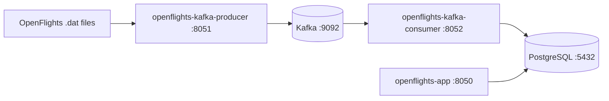
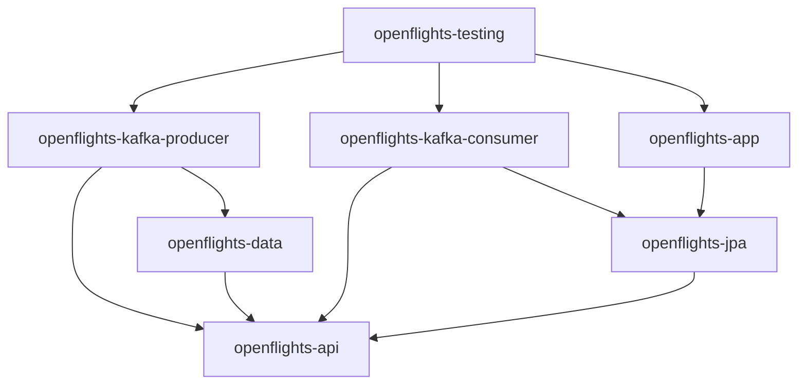
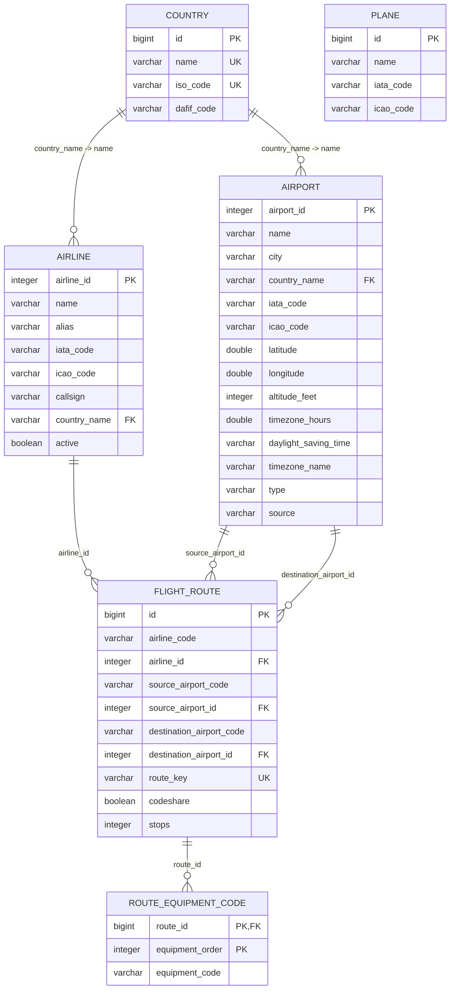
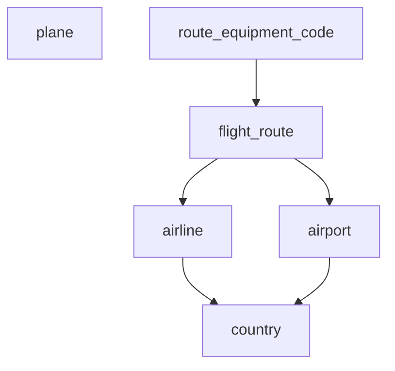
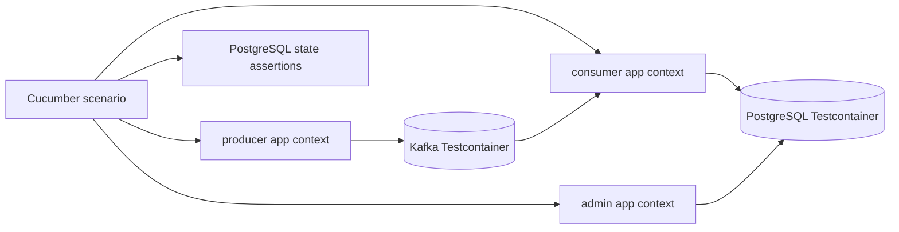

# OpenFlights Architecture

[Back to OpenFlights](README.md)

## Contents
1. [Goal](#1-goal)
2. [Runtime Topology](#2-runtime-topology)
3. [Module Map](#3-module-map)
4. [Import and Persistence Flow](#4-import-and-persistence-flow)
5. [Kafka Topology](#5-kafka-topology)
6. [Persistence Model](#6-persistence-model)
7. [Testing Architecture](#7-testing-architecture)
8. [Current Tradeoffs](#8-current-tradeoffs)

## 1. Goal
[Back to top](#openflights-architecture)

OpenFlights is a data-ingestion application built around the OpenFlights `.dat` datasets.

The architecture separates:

- shared record contracts
- source-file parsing
- Kafka publishing
- Kafka consumption
- persistence mapping and normalization
- operational/admin endpoints

The intended end-to-end flow is:

1. read OpenFlights `.dat` files
2. parse them into shared API records
3. publish those records through Kafka
4. consume typed Kafka topics
5. map/normalize records into JPA entities
6. persist them into PostgreSQL
7. expose cleanup/operational actions through a separate admin app

## 2. Runtime Topology
[Back to top](#openflights-architecture)

### Local runtime components

### Operational split

- `openflights-kafka-producer`
  owns source-file import and Kafka publication.
- `openflights-kafka-consumer`
  owns Kafka ingestion and persistence orchestration.
- `openflights-app`
  owns admin HTTP operations against persisted SQL data.
- `openflights-jpa`
  centralizes entities, repositories, mappers, normalizers, and shared datasource defaults.

## 3. Module Map
[Back to top](#openflights-architecture)

| Module | ArtifactId | Responsibility | Depends on |
|---|---|---|---|
| `openflights-api` | `openflights-api` | shared records, Kafka topic constants, low-level parsing helpers | none |
| `openflights-data` | `openflights-data` | framework-light `.dat` parsers and readers | `openflights-api` |
| `openflights-jpa` | `openflights-jpa` | JPA entities, repositories, mappers, normalizers, shared datasource defaults | `openflights-api`, Spring Data JPA |
| `openflights-kafka-producer` | `openflights-kafka-producer` | import endpoints, Spring wiring for readers/parsers, Kafka topic creation, file-import orchestration | `openflights-api`, `openflights-data` |
| `openflights-kafka-consumer` | `openflights-kafka-consumer` | typed Kafka listeners, persistence orchestration, placeholder recovery for out-of-order references | `openflights-api`, `openflights-jpa` |
| `openflights-app` | `openflights-app` | admin HTTP endpoints and SQL cleanup operations | `openflights-jpa` |
| `openflights-testing` | `openflights-testing` | Cucumber end-to-end tests with Testcontainers | producer, consumer, app |

## 4. Import and Persistence Flow
[Back to top](#openflights-architecture)

### Import flow

```mermaid
flowchart LR
    dat["OpenFlights .dat files"]
    parser["openflights-data parsers/readers"]
    api["openflights-api records"]
    producer["Kafka producer services"]
    kafka["Kafka topics"]
    consumer["Kafka consumer services"]
    mapper["openflights-jpa mappers/normalizers"]
    repo["JPA repositories"]
    pg["PostgreSQL"]

    dat --> parser
    parser --> api
    api --> producer
    producer --> kafka
    kafka --> consumer
    consumer --> mapper
    mapper --> repo
    repo --> pg
```

### Runtime code locations

| Step | Package |
|---|---|
| low-level source value parsing | `dev.nklip.javacraft.openflights.api.parser` |
| `.dat` parsing | `dev.nklip.javacraft.openflights.data.parser` |
| data reader | `dev.nklip.javacraft.openflights.data.reader` |
| producer-side data wiring | `dev.nklip.javacraft.openflights.kafka.producer.config` |
| producer-side import orchestration | `dev.nklip.javacraft.openflights.kafka.producer.service` |
| producer HTTP endpoints | `dev.nklip.javacraft.openflights.kafka.producer.controller` |
| Kafka consumer wiring | `dev.nklip.javacraft.openflights.kafka.consumer.config` |
| Kafka listeners | `dev.nklip.javacraft.openflights.kafka.consumer.service` |
| SQL entities | `dev.nklip.javacraft.openflights.jpa.entity` |
| repositories | `dev.nklip.javacraft.openflights.jpa.repository` |
| API-to-entity mapping | `dev.nklip.javacraft.openflights.jpa.mapper` |
| persistence-side normalization | `dev.nklip.javacraft.openflights.jpa.normalize` |
| admin cleanup HTTP/API | `dev.nklip.javacraft.openflights.app.controller` |
| admin cleanup SQL operations | `dev.nklip.javacraft.openflights.app.repository` |

### Key runtime classes

| Class | Module | Purpose |
|---|---|---|
| `OpenFlightsValueParser` | `openflights-api` | centralizes low-level OpenFlights conventions such as blanks and `\N` values |
| `OpenFlightsDataConfiguration` | `openflights-kafka-producer` | turns framework-light readers/parsers into Spring beans and provides the import executor |
| `OpenFlightsFileImportService` | `openflights-kafka-producer` | reads one dataset, splits it into bounded chunks, and publishes those chunks in parallel |
| `KafkaMessageProducer` | `openflights-kafka-producer` | centralizes topic routing, stable key derivation, and asynchronous send handling |
| `KafkaConsumerConfiguration` | `openflights-kafka-consumer` | configures typed Kafka consumers and route-specific concurrency |
| `KafkaMessageConsumer` | `openflights-kafka-consumer` | keeps Kafka listeners thin and delegates persistence work to services |
| `OpenFlightsPersistenceService` | `openflights-kafka-consumer` | owns normalization, idempotent persistence, placeholder recovery, and out-of-order route/reference handling |
| `OpenFlightsPlaceholderWriteService` | `openflights-kafka-consumer` | creates temporary placeholder rows in isolated transactions so concurrent route imports do not poison the outer transaction |
| `CountryNameNormalizer` | `openflights-jpa` | converts raw source country strings into canonical SQL-facing country names |
| `AdminDataController` | `openflights-app` | exposes the PostgreSQL cleanup endpoint |

### Operational data paths

#### Producer path

1. `OpenFlightsFileImportController` receives a dataset-specific import request.
2. `OpenFlightsFileImportService` loads the matching source file through `OpenFlightsDataReader`.
3. Parsed records are split into bounded chunks and published in parallel.
4. `KafkaMessageProducer` sends typed records to dataset-specific Kafka topics with stable keys.

#### Consumer path

1. `KafkaMessageConsumer` receives typed records from a dataset-specific Kafka listener.
2. `OpenFlightsPersistenceService` normalizes and persists the record.
3. If a route arrives before its airline or airports, placeholder reference rows may be created.
4. Later real reference messages overwrite those placeholders using the same primary keys.

#### Admin path

1. `AdminDataController` exposes `DELETE /api/v1/openflights/admin/data`.
2. `AdminDataService` delegates cleanup.
3. `OpenFlightsAdminDataRepository` deletes PostgreSQL rows in FK-safe order.
4. Kafka offsets and broker state are intentionally left unchanged.

## 5. Kafka Topology
[Back to top](#openflights-architecture)

| Topic | Payload type | Default partitions | Notes |
|---|---|---|---|
| `openflights.country` | `Country` | `1` | reference data |
| `openflights.airline` | `Airline` | `1` | reference data |
| `openflights.airport` | `Airport` | `1` | reference data |
| `openflights.plane` | `Plane` | `1` | reference data |
| `openflights.route` | `Route` | `8` | higher-throughput route ingestion |

Design notes:

- most topics stay single-partition because they are smaller reference datasets
- `openflights.route` is partitioned more aggressively because it is much larger
- the route consumer uses matching higher concurrency by default
- same-key ordering is preserved by Kafka, but unrelated routes may be processed in parallel
- the preferred publication order is still `countries -> airlines -> airports -> planes -> routes`

## 6. Persistence Model
[Back to top](#openflights-architecture)

### Source-file mapping

| Source file | Shared API record | SQL entity | SQL table |
|---|---|---|---|
| `airlines.dat` | `Airline` | `AirlineEntity` | `airline` |
| `airports.dat` | `Airport` | `AirportEntity` | `airport` |
| `countries.dat` | `Country` | `CountryEntity` | `country` |
| `planes.dat` | `Plane` | `PlaneEntity` | `plane` |
| `routes.dat` | `Route` | `RouteEntity` | `flight_route` |
| `routes.dat` equipment column | `Route.equipmentCodes` | `RouteEntity.equipmentCodes` | `route_equipment_code` |

### ER diagram

### Table dependency diagram

### Entity/table notes

#### `CountryEntity` -> `country`

- surrogate primary key: `id`
- business uniqueness:
  - `name`
  - `iso_code`
- used as the lookup table for airline and airport country references

#### `AirlineEntity` -> `airline`

- primary key comes from the source dataset: `airline_id`
- stores the raw normalized `country_name`
- links to `CountryEntity` through `country_name -> country.name`

#### `AirportEntity` -> `airport`

- primary key comes from the source dataset: `airport_id`
- stores geographic and timezone metadata
- uses the same country-link pattern as `AirlineEntity`

#### `PlaneEntity` -> `plane`

- uses a generated surrogate primary key: `id`
- stores the OpenFlights plane name and optional IATA/ICAO codes
- is currently independent from routes at the relational level

#### `RouteEntity` -> `flight_route`

- uses a generated surrogate primary key: `id`
- uses a derived natural key: `route_key`
- `route_key` is protected by a unique constraint so duplicate Kafka deliveries do not create another route row
- references:
  - `airline_id -> airline.airline_id`
  - `source_airport_id -> airport.airport_id`
  - `destination_airport_id -> airport.airport_id`

#### `RouteEntity.equipmentCodes` -> `route_equipment_code`

- implemented as `@ElementCollection`
- one route can have zero or more equipment codes
- preserves source order with `equipment_order`
- intentionally stored as values, not as a join to `plane`

## 7. Testing Architecture
[Back to top](#openflights-architecture)

`openflights-testing` runs the full ingestion flow with Testcontainers:

Testing notes:

- the end-to-end Cucumber suite uses the same route partition count and route consumer concurrency as runtime
- final expected PostgreSQL counts are asserted directly in the feature file
- helper calculator code cross-checks those feature values against the source datasets
- reported timings are environment-dependent and should be treated as observational throughput measurements

## 8. Current Tradeoffs
[Back to top](#openflights-architecture)

- route equipment is still stored as raw equipment codes rather than linked plane rows
- country relationships are based on the natural key `country.name`, because the source files use country names rather than a shared numeric country id
- route ingestion favors robustness over purity: if a route arrives before its airline or airports, the consumer may create placeholder reference rows and later overwrite them with real data
- the admin cleanup endpoint clears PostgreSQL only; it does not reset Kafka topics, offsets, or retry state
- end-to-end ingestion timings are useful operationally, but they are not stable cross-machine performance guarantees
