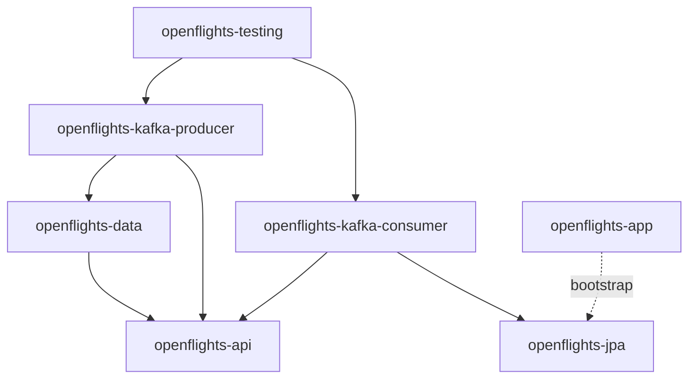
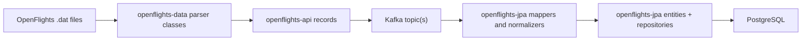
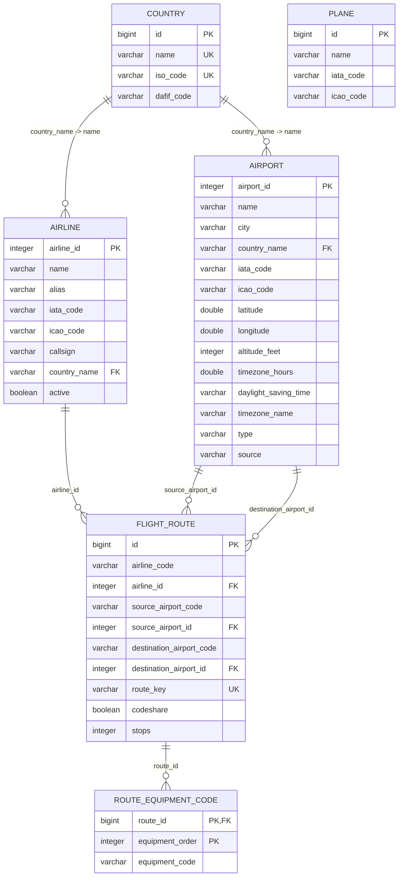
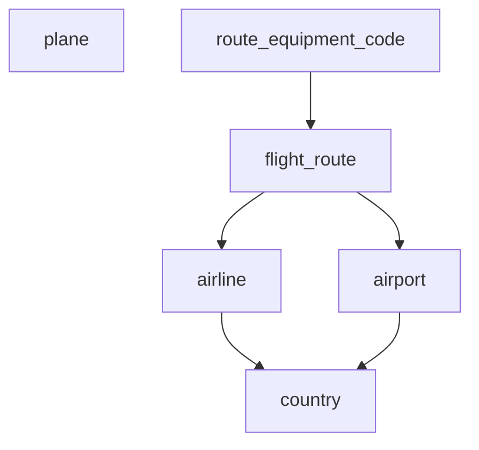

# OpenFlights-Architecture

[Back to OpenFlights](README.md)

## Contents
1. [Goal](#1-goal)
2. [Module Map](#2-module-map)
3. [Data Flow](#3-data-flow)
4. [Source Files](#4-source-files)
5. [Persistence Model](#5-persistence-model)
6. [Entity and Table Notes](#6-entity-and-table-notes)
7. [Current Tradeoffs](#7-current-tradeoffs)

## 1. Goal
[Back to top](#openflights-architecture)

OpenFlights is a data-ingestion application built around the OpenFlights `.dat` datasets.
The current architecture separates:

- shared OpenFlights record types
- file parsing
- JPA persistence
- Kafka producer and consumer responsibilities

The intended end-to-end flow is:

1. read OpenFlights `.dat` files
2. parse them into shared API records
3. publish records through Kafka
4. consume records
5. map them to JPA entities
6. persist them into PostgreSQL

## 2. Module Map
[Back to top](#openflights-architecture)

| Module | ArtifactId | Responsibility | Depends on |
|---|---|---|---|
| `openflights-api` | `openflights-api` | Shared OpenFlights record classes, Kafka topic constants, and low-level value parsing helpers | none |
| `openflights-data` | `openflights-data` | Framework-light `.dat` parsers and readers | `openflights-api` |
| `openflights-jpa` | `openflights-jpa` | JPA entities, repositories, mappers, and persistence-side normalizers | `openflights-api`, Spring Data JPA |
| `openflights-kafka-producer` | `openflights-kafka-producer` | Spring wiring for data import, file-import orchestration, and Kafka publishing | `openflights-api`, `openflights-data` |
| `openflights-kafka-consumer` | `openflights-kafka-consumer` | Kafka consumer side, persistence orchestration, and placeholder reference handling | `openflights-api`, `openflights-jpa` |
| `openflights-app` | `openflights-app` | Spring Boot application shell and admin HTTP endpoints | `openflights-api`, `openflights-jpa` |
| `openflights-testing` | `openflights-testing` | Cucumber and integration-style test support using the same Kafka route settings as runtime | producer, consumer |

## 3. Data Flow
[Back to top](#openflights-architecture)

### Import flow

### Current code locations

| Step | Package |
|---|---|
| value parsing helpers | `dev.nklip.javacraft.openflights.api.parser` |
| `.dat` parsing | `dev.nklip.javacraft.openflights.data.parser` |
| data reader | `dev.nklip.javacraft.openflights.data.reader` |
| producer-side data/import wiring | `dev.nklip.javacraft.openflights.kafka.producer.config` |
| file import orchestration | `dev.nklip.javacraft.openflights.kafka.producer.service` |
| shared record types | `dev.nklip.javacraft.openflights.api` |
| Kafka consumer wiring | `dev.nklip.javacraft.openflights.kafka.consumer.config` |
| Kafka listener entrypoints | `dev.nklip.javacraft.openflights.kafka.consumer.service` |
| SQL entities | `dev.nklip.javacraft.openflights.jpa.entity` |
| repositories | `dev.nklip.javacraft.openflights.jpa.repository` |
| API-to-entity mapping | `dev.nklip.javacraft.openflights.jpa.mapper` |
| country normalization | `dev.nklip.javacraft.openflights.jpa.normalize` |

### Key runtime classes

| Class | Module | Purpose |
|---|---|---|
| `OpenFlightsDataConfiguration` | `openflights-kafka-producer` | Turns framework-light readers/parsers from `openflights-data` into Spring beans and provides the dedicated import executor |
| `OpenFlightsFileImportService` | `openflights-kafka-producer` | Reads one dataset, splits it into bounded chunks, and publishes records in parallel |
| `KafkaMessageProducer` | `openflights-kafka-producer` | Centralizes topic routing, Kafka key derivation, and asynchronous send handling |
| `KafkaConsumerConfiguration` | `openflights-kafka-consumer` | Configures typed Kafka consumers and route concurrency |
| `KafkaMessageConsumer` | `openflights-kafka-consumer` | Keeps Kafka listeners thin and delegates persistence work to services |
| `OpenFlightsPersistenceService` | `openflights-kafka-consumer` | Owns normalization, idempotent persistence, and out-of-order route/reference handling |
| `OpenFlightsPlaceholderWriteService` | `openflights-kafka-consumer` | Creates temporary placeholder rows in isolated transactions so concurrent route imports do not abort the outer route transaction |
| `CountryNameNormalizer` | `openflights-jpa` | Converts source country strings into canonical persistence-side country names |

## 4. Source Files
[Back to top](#openflights-architecture)

| Source file | Shared API record | SQL entity | SQL table |
|---|---|---|---|
| `airlines.dat` | `Airline` | `AirlineEntity` | `airline` |
| `airports.dat` | `Airport` | `AirportEntity` | `airport` |
| `countries.dat` | `Country` | `CountryEntity` | `country` |
| `planes.dat` | `Plane` | `PlaneEntity` | `plane` |
| `routes.dat` | `Route` | `RouteEntity` | `flight_route` |
| `routes.dat` equipment column | `Route.equipmentCodes` | `RouteEntity.equipmentCodes` | `route_equipment_code` |

## 5. Persistence Model
[Back to top](#openflights-architecture)

### ER diagram

### Table dependency diagram

`plane` is currently independent from `route_equipment_code`.
The route file carries equipment codes, not direct plane primary keys, so the model stores those codes as value rows instead of a many-to-many join to `plane`.

## 6. Entity and Table Notes
[Back to top](#openflights-architecture)

### `CountryEntity` -> `country`

- Surrogate primary key: `id`
- Business uniqueness:
  - `name`
  - `iso_code`
- Acts as the lookup table for airline and airport country references

### `AirlineEntity` -> `airline`

- Primary key comes from the source dataset: `airline_id`
- Stores the raw `country_name` string from OpenFlights
- Has a read-only `ManyToOne` relation to `CountryEntity` via `country_name -> country.name`

### `AirportEntity` -> `airport`

- Primary key comes from the source dataset: `airport_id`
- Stores geographic and timezone metadata
- Uses the same country-link pattern as `AirlineEntity`:
  `country_name -> country.name`

### `PlaneEntity` -> `plane`

- Uses a generated surrogate primary key: `id`
- Stores the OpenFlights plane name and optional IATA/ICAO codes
- Currently independent from routes at the relational level

### `RouteEntity` -> `flight_route`

- Uses a generated surrogate primary key: `id`
- Uses a derived natural key: `route_key`
  - built from airline, source airport, destination airport, codeshare flag, and stop count
  - protected by a unique constraint so duplicate Kafka deliveries do not create a second route row
- References:
  - `airline_id -> airline.airline_id`
  - `source_airport_id -> airport.airport_id`
  - `destination_airport_id -> airport.airport_id`
- Stores both code-style fields and id-style fields because the source route file contains both

### `RouteEntity.equipmentCodes` -> `route_equipment_code`

- Implemented as `@ElementCollection`
- One route can have zero or more equipment codes
- Preserves source order using `equipment_order`
- This is intentionally a value table, not a foreign-key join to `plane`

## 7. Current Tradeoffs
[Back to top](#openflights-architecture)

- The SQL model is normalized around countries, airports, airlines, and routes, but route equipment is still stored as raw codes rather than linked plane rows.
- Country relationships are based on the natural key `country.name`, because the OpenFlights source files use country names rather than a shared numeric country id.
- Route ingestion favors robustness over purity: if a route arrives before its airline or airports, the consumer may create placeholder reference rows and later overwrite them with real reference data.
- `openflights-app` is currently only a thin shell. Most real persistence work happens in `openflights-jpa`, and import orchestration lives in the Kafka producer/consumer side.
- The consumer module still contains some older generic Kafka package roots. The API-to-entity mappers now live in `openflights-jpa` alongside the entities they populate.
- The end-to-end ingestion timings reported by `openflights-testing` are environment-dependent and should be treated as observational throughput numbers rather than strict performance guarantees.
