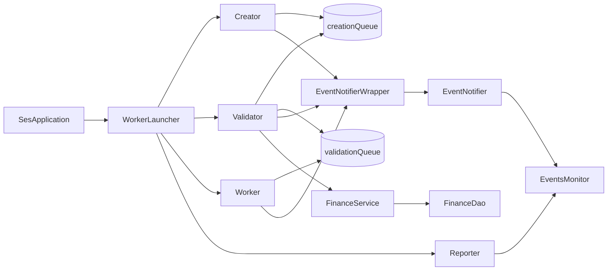
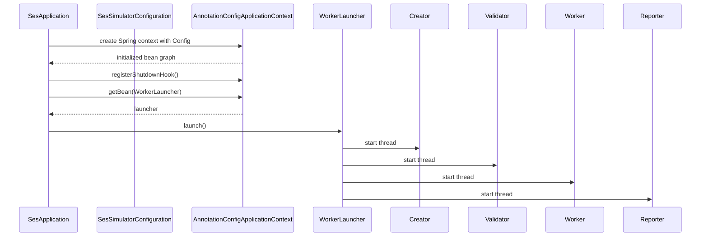
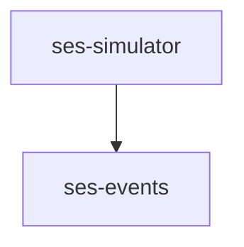
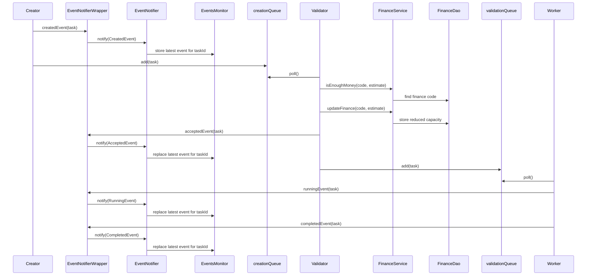
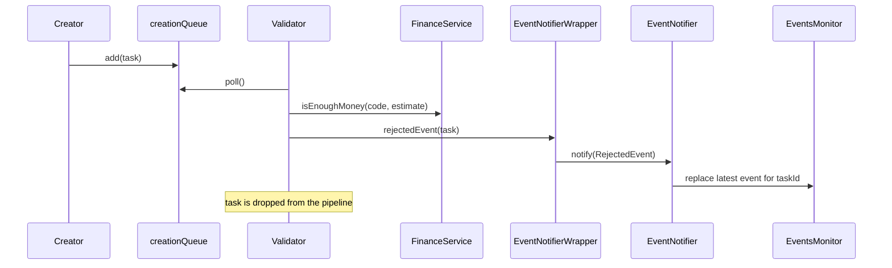

# SES Architecture

[Back to SES](README.md)

## Contents
1. [Goal](#1-goal)
2. [Runtime Topology](#2-runtime-topology)
3. [Module Map](#3-module-map)
4. [Event Lifecycle](#4-event-lifecycle)
5. [Simulator Pipeline](#5-simulator-pipeline)
6. [Package Map](#6-package-map)
7. [Testing Strategy](#7-testing-strategy)
8. [Current Tradeoffs](#8-current-tradeoffs)

## 1. Goal
[Back to top](#ses-architecture)

`ses` is a small in-memory workflow simulator.

Its main architectural rule is simple:

- workflow threads do not mutate shared workflow state directly
- every state transition is published as an event
- read-side state is derived by listening to those events

That split gives the module two clear responsibilities:

- `ses-events`
  owns the event model and the in-memory publish/subscribe infrastructure
- `ses-simulator`
  owns task generation, validation, execution, reporting, and Spring bootstrapping

## 2. Runtime Topology
[Back to top](#ses-architecture)

Runtime notes:

- the whole simulator runs in a single JVM
- both queues are in-memory `PriorityBlockingQueue<Task>` instances
- `FinanceDao` is in-memory too; there is no external database
- `EventsMonitor` is a projection of the latest event per `taskId`, not the workflow source of truth

### Startup sequence

## 3. Module Map
[Back to top](#ses-architecture)

| Module | ArtifactId | Responsibility | Depends on |
|---|---|---|---|
| `ses/events` | `ses-events` | event contracts, event types, listener registry, event dispatch, latest-state monitor | Spring context, SLF4J API |
| `ses/simulator` | `ses-simulator` | task pipeline, finance validation, Spring bootstrapping, command-line entrypoint | `ses-events`, Spring context, SLF4J Simple |

## 4. Event Lifecycle
[Back to top](#ses-architecture)

Every task moves through the simulator by producing typed events.

The stable identity is `taskId`, not title:

- titles are display labels only
- different tasks may share the same title
- `EventsMonitor` stores the latest event by `taskId`

### Accepted path

### Rejected path

## 5. Simulator Pipeline
[Back to top](#ses-architecture)

The simulator stages are intentionally narrow:

1. `Creator`
   creates random tasks and publishes `CreatedEvent`
2. `Validator`
   checks finance capacity, publishes `AcceptedEvent` or `RejectedEvent`, and forwards only accepted tasks
3. `Worker`
   publishes `RunningEvent`, simulates work with sleeps, then publishes `CompletedEvent`
4. `Reporter`
   periodically asks `EventsMonitor` for the current task snapshot and prints it

`WorkerLauncher` is the orchestration boundary:

- creates the four long-lived worker loops
- connects them to the two queues
- shares the finance and event services
- owns executor startup and shutdown

## 6. Package Map
[Back to top](#ses-architecture)

### `ses-events`

| Package | Responsibility |
|---|---|
| `dev.nklip.javacraft.ses.events` | event contracts, statuses, priorities, notifier, monitor, subscription manager |
| `dev.nklip.javacraft.ses.events.impl` | concrete event types and the Spring adapter implementation |

Key classes:

| Class | Purpose |
|---|---|
| `Event` | common contract for workflow events |
| `EventNotifier` | fan-out point that dispatches one event to subscribed listeners |
| `EventsSubscriptionsManager` | thread-safe listener registry keyed by event class |
| `EventsMonitor` | latest-state projection keyed by `taskId` |
| `BaseEvent` | shared event state, equality, and ordering rules |

### `ses-simulator`

| Package | Responsibility |
|---|---|
| `dev.nklip.javacraft.ses.simulator` | entrypoint and top-level launcher |
| `dev.nklip.javacraft.ses.simulator.config` | Spring component scan bootstrap |
| `dev.nklip.javacraft.ses.simulator.flow` | creator, validator, worker, reporter loop stages |
| `dev.nklip.javacraft.ses.simulator.service` | queue access, finance rules, task-to-event translation |
| `dev.nklip.javacraft.ses.simulator.db` | in-memory finance repository |
| `dev.nklip.javacraft.ses.simulator.model` | `Task` and `FinanceCode` model objects |

Key classes:

| Class | Purpose |
|---|---|
| `SesApplication` | command-line entrypoint |
| `SesSimulatorConfiguration` | Java-based Spring bootstrap |
| `WorkerLauncher` | starts and stops the four pipeline threads |
| `EventNotifierWrapper` | converts `Task` into concrete event objects |
| `FinanceService` | business rules around finance capacity |
| `QueueService` | owns the two shared in-memory queues |

## 7. Testing Strategy
[Back to top](#ses-architecture)

Testing is split along the same module boundary:

- `ses-events` tests cover event ordering, event dispatch, latest-state projection, enum/value behavior, and the Spring subscription adapter
- `ses-simulator` tests cover:
  - queue and finance model behavior
  - task/event translation
  - launcher wiring
  - Spring bootstrap
  - flow-loop behavior for `Creator`, `Reporter`, `Validator`, and `Worker`

The loop tests intentionally use Mockito spies to stub `busyWait(...)`:

- that keeps them deterministic
- avoids real sleeps
- still exercises the real `run()` method logic

## 8. Current Tradeoffs
[Back to top](#ses-architecture)

- the system is intentionally in-memory only; restarting the JVM loses all task and finance state
- threads communicate through in-memory queues rather than a durable message broker
- workflow timing is random, which is good for simulation but not for deterministic runtime behavior
- the reporter writes directly to stdout instead of using a structured reporting or metrics layer
- the monitor stores only the latest event per task, not the full event history
