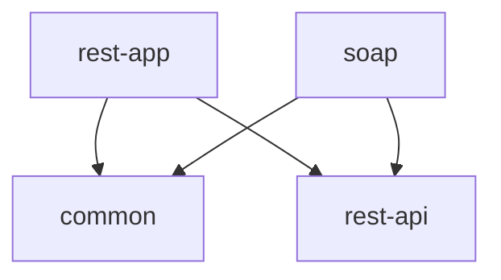
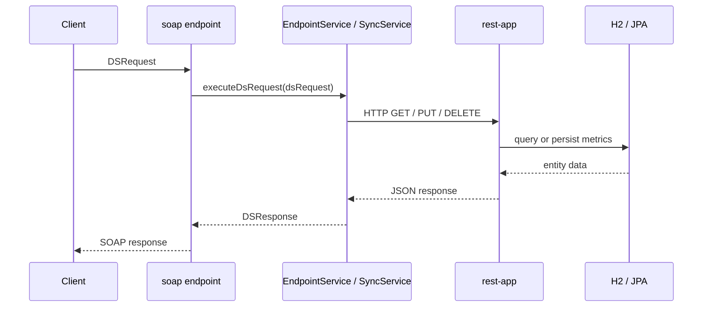
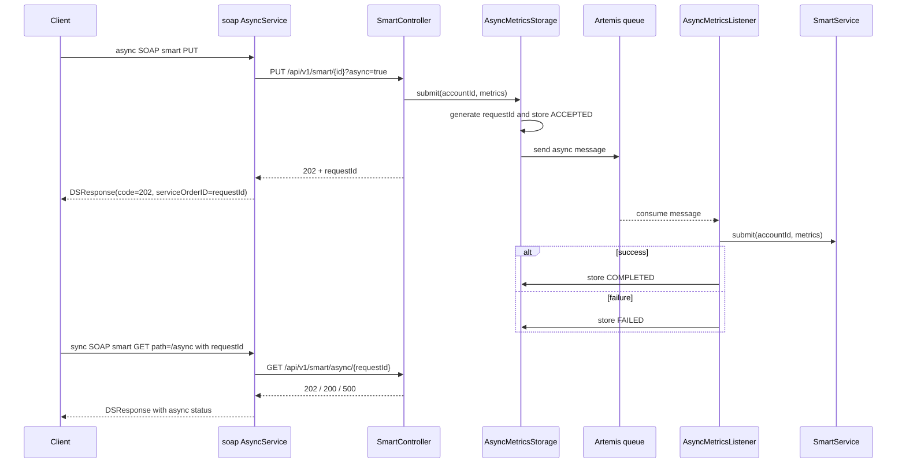

# soap2rest-architecture

[Back to soap2rest](README.md)

## Contents
1. [Goal](#1-goal)
2. [Module Map](#2-module-map)
3. [Dependency Rules](#3-dependency-rules)
4. [Layering](#4-layering)
5. [Synchronous Flow](#5-synchronous-flow)
6. [Asynchronous Smart Flow](#6-asynchronous-smart-flow)
7. [Async Status Model](#7-async-status-model)
8. [Data Ownership](#8-data-ownership)
9. [Integration Boundaries](#9-integration-boundaries)
10. [Testing Strategy](#10-testing-strategy)
11. [Current Tradeoffs](#11-current-tradeoffs)
12. [Documentation Map](#12-documentation-map)

## 1. Goal
[Back to top](#soap2rest-architecture)

`soap2rest` keeps a SOAP contract alive while shifting backend behavior to a REST application. The SOAP side acts as the facade and protocol adapter. The REST side owns the runtime behavior, persistence model, and async processing.

## 2. Module Map
[Back to top](#soap2rest-architecture)

| Module | Responsibility | Depends on |
| --- | --- | --- |
| `common` | Shared utility code used by other `soap2rest` modules | Spring AOP only |
| `rest-api` | Shared DTOs exchanged between `soap` and `rest-app` | none of the runtime modules |
| `rest-app` | REST controllers, services, JPA, Liquibase, security, async smart processing | `rest-api`, `common` |
| `soap` | SOAP endpoint, WSDL-generated model, SOAP-to-REST translation | `rest-api`, `common` |

`soap` and `rest-app` are independent of each other. At runtime `soap` calls `rest-app` over HTTP, but there is no compile-time dependency between them.

## 3. Dependency Rules
[Back to top](#soap2rest-architecture)

- `soap` may use shared DTOs from `rest-api`, but it must not depend on `rest-app` internals.
- `rest-app` owns HTTP controllers, business services, persistence, and JMS listeners.
- `soap` owns SOAP transport concerns, request routing, and SOAP response mapping.
- Shared utility code belongs in `common` only when it is truly cross-cutting.

## 4. Layering
[Back to top](#soap2rest-architecture)

### REST application

- `rest` package
  - HTTP mapping, validation, response shaping
- `service` package
  - business rules
- `dao` package
  - JPA repositories and DB-facing queries
- `conf` and `security` packages
  - infrastructure wiring

### SOAP application

- `endpoint` package
  - SOAP entry point
- `service` package
  - request routing and REST client coordination
- `service.order` package
  - service-specific request/response mapping
- `generated` package
  - WSDL-generated types

## 5. Synchronous Flow
[Back to top](#soap2rest-architecture)

## 6. Asynchronous Smart Flow
[Back to top](#soap2rest-architecture)

The async path currently exists only for smart `PUT` requests.

## 7. Async Status Model
[Back to top](#soap2rest-architecture)

Inside `rest-app`, async smart requests move through these states:

| Internal state | HTTP status from `rest-app` | Meaning |
| --- | --- | --- |
| `ACCEPTED` | `202 Accepted` | Job is queued or still running |
| `COMPLETED` | `200 OK` | Smart metrics were processed successfully |
| `FAILED` | `500 Internal Server Error` | Business execution failed |

If a request id is unknown, `rest-app` returns `404 Not Found`.

On the SOAP side:
- async submit returns immediately with SOAP status code `202`
- polling is an explicit follow-up SOAP request
- unsupported async combinations return `501`

## 8. Data Ownership
[Back to top](#soap2rest-architecture)

- `rest-app` owns the metric and meter persistence model.
- Liquibase manages schema creation and seed data.
- H2 is the default runtime database for local runs and tests.
- Metric uniqueness is meter/date scoped in the REST persistence layer.

## 9. Integration Boundaries
[Back to top](#soap2rest-architecture)

### Between SOAP and REST

- transport: HTTP
- payloads: shared DTOs from `rest-api`
- authentication: API key header expected by `rest-app`

### Inside REST async flow

- transport: JMS
- broker: Artemis
- queue: `smart-metrics-queue`
- state store: in-memory concurrent map

## 10. Testing Strategy
[Back to top](#soap2rest-architecture)

### SOAP module

- unit tests for request routing and response mapping
- Cucumber scenarios for electric, gas, and smart flows
- WireMock stubs for all REST backend calls
- no broker dependency in SOAP tests

### REST module

- unit tests for controllers and services
- Cucumber API tests with RestAssured
- async cucumber coverage boots a real Artemis broker with Testcontainers

## 11. Current Tradeoffs
[Back to top](#soap2rest-architecture)

- async job state is in memory, so it is lost on restart
- only smart `PUT` supports async execution today
- SOAP polling performs a single REST lookup per poll request; it does not block and wait for completion
- the SOAP facade is intentionally thin and delegates real business behavior to `rest-app`

## 12. Documentation Map
[Back to top](#soap2rest-architecture)

- overview: [README.md](README.md)
- common: [common/README.md](common/README.md)
- REST runtime details: [rest-app/README.md](rest-app/README.md)
- SOAP details: [soap/README.md](soap/README.md)
