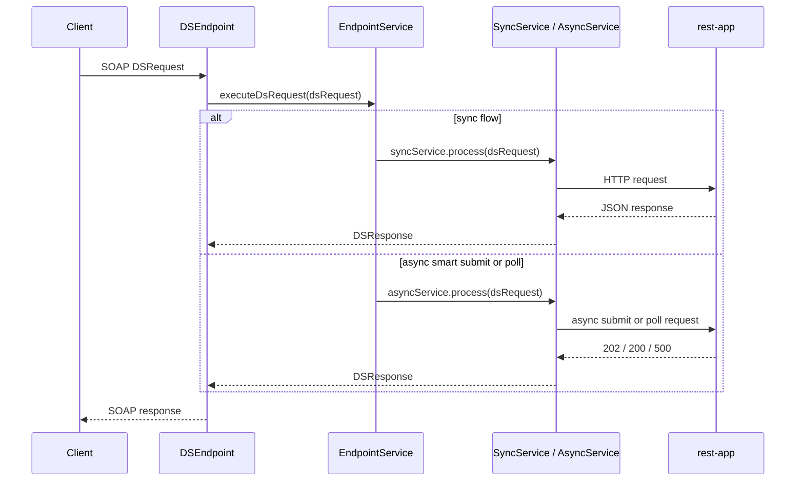

# soap2rest-soap

<sub>[Back to soap2rest](../README.md)</sub>

## Contents
1. [Purpose](#1-purpose)
2. [What It Does](#2-what-it-does)
3. [Supported Behavior](#3-supported-behavior)
4. [Request Flow](#4-request-flow)
5. [Endpoint and WSDL](#5-endpoint-and-wsdl)
6. [Generated SOAP Classes](#6-generated-soap-classes)
7. [Build and Test](#7-build-and-test)
8. [Test Strategy](#8-test-strategy)
9. [Run](#9-run)
10. [Manual Testing](#10-manual-testing)
11. [IntelliJ Note](#11-intellij-note)
12. [Related Docs](#12-related-docs)

## 1. Purpose
<sub>[Back to top](#soap2rest-soap)</sub>

`soap2rest/soap` exposes the SOAP contract and translates SOAP service orders into calls to `soap2rest/rest-app`.

It acts as the strangler facade:
- existing clients continue using SOAP
- the SOAP layer stays thin
- real business execution happens in the REST backend

## 2. What It Does
<sub>[Back to top](#soap2rest-soap)</sub>

- accepts `DSRequest` payloads in the SOAP endpoint
- routes requests through `EndpointService`
- delegates synchronous work to `SyncService`
- delegates async-capable flows to `AsyncService`
- maps REST responses back into `DSResponse`

## 3. Supported Behavior
<sub>[Back to top](#soap2rest-soap)</sub>

### Synchronous requests

Supported for electric, gas, and smart service orders across the existing `GET`, `PUT`, and `DELETE` flows implemented by the REST backend.

### Asynchronous requests

Async is currently supported only for:
- `SmartService`
- `PUT`

Behavior:
1. SOAP receives an async smart write request.
2. SOAP calls `rest-app` with `?async=true`.
3. `rest-app` returns `202 Accepted` and a request id.
4. SOAP immediately returns a `DSResponse` with:
   - SOAP status code `202`
   - description `Accepted for asynchronous processing`
   - `serviceOrderID` set to the async request id

### Polling async status

SOAP polling is explicit and synchronous:

1. Client sends a normal SOAP `GET` request for `SmartService`
2. request param `path` must be `/async`
3. `serviceOrderID` must contain the async request id
4. SOAP performs one REST poll to `GET /api/v1/smart/async/{requestId}`
5. SOAP maps the REST status back into `DSResponse`

Mapped results:

| REST status | SOAP status meaning |
| --- | --- |
| `202` | still accepted / in progress |
| `200` | completed successfully |
| `500` | async execution failed |
| other | returned as unexpected backend response |

Unsupported async combinations return `501`.

## 4. Request Flow
<sub>[Back to top](#soap2rest-soap)</sub>



## 5. Endpoint and WSDL
<sub>[Back to top](#soap2rest-soap)</sub>

- SOAP app default port: `8078`
- SOAP mapping path: `/soap2rest/soap/v1/*`
- WSDL URL: `http://localhost:8078/soap2rest/soap/v1/DeliverServiceWS.wsdl`
- target REST app default URL: `http://localhost:8081`

## 6. Generated SOAP Classes
<sub>[Back to top](#soap2rest-soap)</sub>

- WSDL source: `src/main/resources/wsdl/ds.wsdl`
- generated package: `dev.nklip.javacraft.soap2rest.soap.generated.ds.ws`
- generation plugin: `jaxws-maven-plugin`

Generate sources explicitly:

```bash
mvn -pl soap2rest/soap generate-sources
```

## 7. Build and Test
<sub>[Back to top](#soap2rest-soap)</sub>

From repository root:

Run all SOAP tests:
```bash
mvn -pl soap2rest/soap -am test
```

Run only cucumber scenarios:
```bash
mvn -pl soap2rest/soap -Dtest=cucumber.dev.nklip.javacraft.soap2rest.soap.CucumberRunner test
```

## 8. Test Strategy
<sub>[Back to top](#soap2rest-soap)</sub>

- unit tests cover request routing and async/sync mapping
- cucumber scenarios validate electric, gas, and smart flows
- SOAP tests stub the REST backend with WireMock
- async SOAP scenarios cover:
  - accepted async smart submit
  - completed async poll
  - failed async poll

Feature files:
- `src/test/resources/features/ElectricService.feature`
- `src/test/resources/features/GasService.feature`
- `src/test/resources/features/SmartService.feature`

## 9. Run
<sub>[Back to top](#soap2rest-soap)</sub>

Start the REST backend first:
```bash
mvn -pl soap2rest/rest-app -am spring-boot:run
```

Start the SOAP module:
```bash
mvn -pl soap2rest/soap -am spring-boot:run
```

## 10. Manual Testing
<sub>[Back to top](#soap2rest-soap)</sub>

- WSDL can be opened directly in the browser
- the module also contains a `SoapUI/` project for manual request testing

## 11. IntelliJ Note
<sub>[Back to top](#soap2rest-soap)</sub>

If IntelliJ marks cucumber steps as undefined even though tests pass, install next plugins:
- `Cucumber for Java`
- `Cucumber Search Indexer`

Related issue:
- <https://youtrack.jetbrains.com/projects/IDEA/issues/IDEA-362929/Cucumber-feature-file-step-appears-as-undefined-in-IntelliJ-despite-the-test-running-successfully>

## 12. Related Docs
<sub>[Back to top](#soap2rest-soap)</sub>

- overall module overview: [../README.md](../README.md)
- architecture: [../ARCHITECTURE.md](../ARCHITECTURE.md)
- REST backend: [../rest-app/README.md](../rest-app/README.md)
