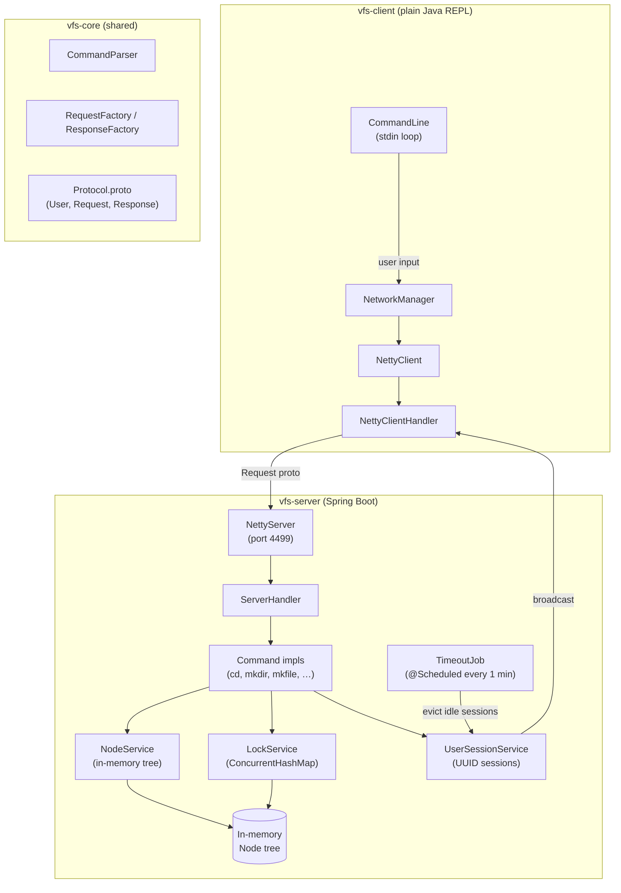
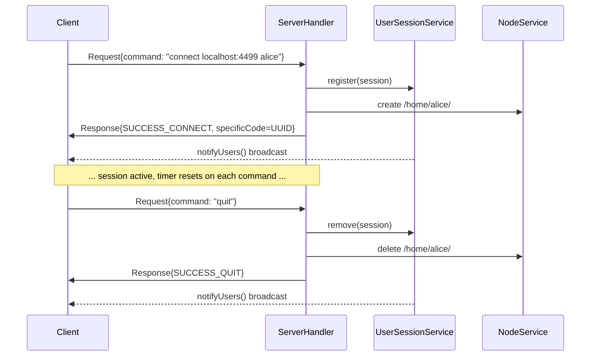

# Virtual File Server

A shared in-memory file system emulator accessed over TCP. Multiple clients connect
simultaneously, browse a shared directory tree, manage files and directories, and
coordinate access via distributed locking.

**Stack:** Java 25, Spring Boot, Spring Framework, Protobuf v2, Netty

## Contents
1. [Quick Start](#1-quick-start)
2. [Architecture](#2-architecture)
3. [Protocol](#3-protocol)
4. [Commands](#4-commands)
5. [File System](#5-file-system)
6. [Locking](#6-locking)
7. [Session Management](#7-session-management)
8. [Configuration](#8-configuration)
9. [Find and terminate a running server process](#9-find-and-terminate-a-running-server-process)
10. [Dependency management](#10-dependency-management)
11. [Tests](#11-tests)

---

## 1. Quick Start

### Build

```bash
mvn -pl vfs package
```

### Run the server

```bash
java -jar vfs/server/target/VFS.jar
```

The server listens on `localhost:4499` by default.

### Connect a client

```bash
java -jar vfs/client/target/VFS-client.jar
```

Once the client REPL starts, type:

```
connect localhost:4499 yourlogin
```

---

## 2. Architecture
<sub>[Back to top](#virtual-file-server)</sub>



---

## 3. Protocol
<sub>[Back to top](#virtual-file-server)</sub>

Communication uses Protobuf v2 messages framed with Netty's `ProtobufVarint32` codec.

### Messages

#### `User`

| Field | Type | Description |
|-------|------|-------------|
| `id` | `string` | Assigned session UUID |
| `login` | `string` | Username provided at `connect` |

#### `Request`

| Field | Type | Description |
|-------|------|-------------|
| `user` | `User` | Identifies the caller |
| `command` | `string` | Raw command string (e.g. `mkdir /home/alice/docs`) |

#### `Response`

| Field | Type | Description |
|-------|------|-------------|
| `code` | `ResponseType` | Status enum (see below) |
| `message` | `string` | Human-readable result or error text |
| `specificCode` | `string` | Optional — carries session UUID on `SUCCESS_CONNECT` |

#### `ResponseType` enum

| Value | Meaning |
|-------|---------|
| `OK` | Command executed successfully |
| `FAIL` | Command failed |
| `SUCCESS_CONNECT` | Login accepted; `specificCode` contains the session UUID |
| `FAIL_CONNECT` | Login rejected |
| `SUCCESS_QUIT` | Session closed cleanly |
| `FAIL_QUIT` | Session teardown failed |

### Netty pipeline

Both client and server share the same codec chain:

```
ProtobufVarint32FrameDecoder
    → ProtobufDecoder
    → ProtobufVarint32LengthFieldPrepender
    → ProtobufEncoder
    → Handler  (ServerHandler / NettyClientHandler)
```

---

## 4. Commands
<sub>[Back to top](#virtual-file-server)</sub>

| Command | Syntax | Description |
|---------|--------|-------------|
| `connect` | `connect server:port login` | Open a session; creates `/home/{login}/` |
| `quit` | `quit` | Close the session; removes `/home/{login}/` |
| `cd` | `cd <directory>` | Change current working directory |
| `mkdir` | `mkdir <directory>` | Create a new directory |
| `mkfile` | `mkfile <file>` | Create a new file |
| `rm` | `rm <node>` | Remove a file or directory |
| `rename` | `rename <node> <name>` | Rename a node |
| `copy` | `copy <node> <directory>` | Copy a node into a directory |
| `move` | `move <node> <directory>` | Move a node into a directory |
| `print` | `print` | Print the full directory tree from root |
| `lock` | `lock [-r] <node>` | Lock a node (`-r` = recursive) |
| `unlock` | `unlock [-r] <node>` | Unlock a node (`-r` = recursive) |
| `whoami` | `whoami` | Display current session login and UUID |
| `help` | `help` | List all available commands |

---

## 5. File System
<sub>[Back to top](#virtual-file-server)</sub>

The file tree lives entirely in JVM memory — there is no persistence across server restarts.

### Structure

```
/
└── home/
    ├── alice/        ← created on connect, removed on quit
    └── bob/
```

### `Node` model

| Field | Type | Description |
|-------|------|-------------|
| `id` | `UUID` | Unique node identifier |
| `name` | `String` | Node name |
| `type` | `NodeTypes` | `DIR` or `FILE` |
| `parent` | `Node` | Parent node reference (`null` for root) |
| `children` | `Set<Node>` | Child nodes (empty for files) |

### Path rules

- Delimiter: `/` (configurable via `application.yaml`)
- Root: `/`
- Home base: `/home/`
- User home: `/home/{login}/`
- Paths are resolved relative to the current working directory unless prefixed with `/`.

---

## 6. Locking
<sub>[Back to top](#virtual-file-server)</sub>

`LockService` maintains a `ConcurrentHashMap<Node, NodeLock>` that tracks locked nodes.

- **`lock <node>`** — locks a single node owned by the caller; fails if already locked by another session.
- **`lock -r <node>`** — recursively locks the node and all its descendants.
- **`unlock <node>`** / **`unlock -r <node>`** — symmetric release; only the locking session may unlock.
- Locked nodes reject `rm`, `rename`, `move`, and `copy` from other sessions.
- Locks are held in memory; a server restart clears all locks.

---

## 7. Session Management
<sub>[Back to top](#virtual-file-server)</sub>

`UserSessionService` manages active sessions in a `ConcurrentHashMap<String, UserSession>` keyed by session UUID.

| Event | Action |
|-------|--------|
| `connect` | Register session, create `/home/{login}/`, notify all connected clients |
| `quit` | Remove session, delete `/home/{login}/`, notify all connected clients |
| Timeout | `TimeoutJob` evicts sessions idle longer than `server.timeout` minutes |
| Any command | Resets the inactivity timer (`Timer`) for the session |

`notifyUsers()` broadcasts a presence update to every connected client when the user list changes.

### Session lifecycle



---

## 8. Configuration
<sub>[Back to top](#virtual-file-server)</sub>

`vfs/server/src/main/resources/application.yaml`:

```yaml
delimiter:
  /                    # path separator used in the in-memory tree

server:
  name: localhost      # server hostname
  port: 4499           # TCP port Netty listens on
  pool: 100            # Netty worker thread pool size
  timeout: 10          # inactivity timeout in minutes before auto-disconnect
```

---

## 9. Find and terminate a running server process
<sub>[Back to top](#virtual-file-server)</sub>

```bash
# 1. Find the process on the server port
lsof -i tcp:4499

# 2. Kill it
kill -9 <PID>
```

---

## 10. Dependency management
<sub>[Back to top](#virtual-file-server)</sub>

### Overview of dependencies

```bash
mvn dependency:tree
```

### To find unused dependencies

```bash
mvn dependency:analyze
```

### To check new dependencies

```bash
mvn versions:display-dependency-updates
```

---

## 11. Tests
<sub>[Back to top](#virtual-file-server)</sub>

Run all tests for this module:

```bash
mvn -pl vfs test
```

### Coverage summary

| Module | Tests | Line coverage |
|--------|------:|--------------:|
| vfs-core | 22 |        100% ✅ |
| vfs-client | 45 |       96.7% ✅ |
| vfs-server | 68 |       89.3% ✅ |
| **Total** | **135** |     **95.7%** |

> [!TIP]
> Prototol.java is excluded from code coverage, as it's a generated java file.
