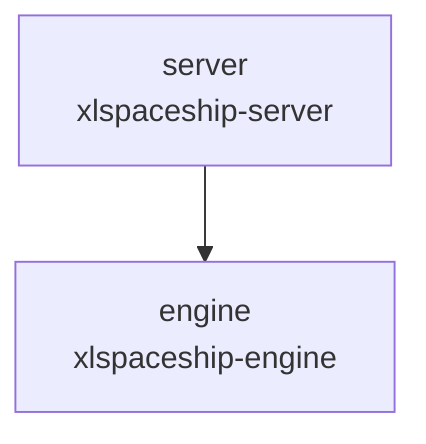
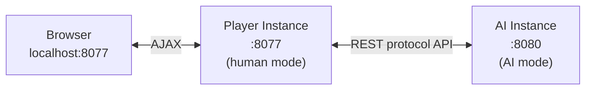
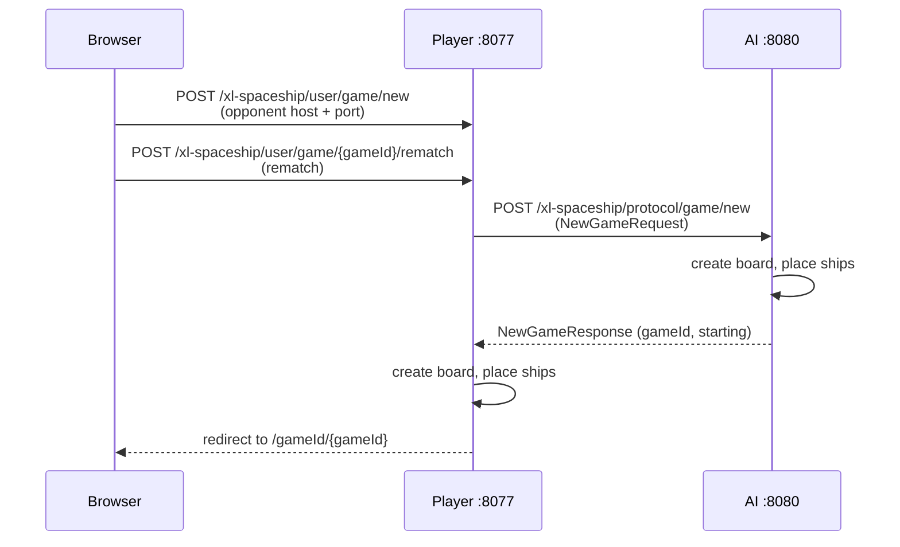
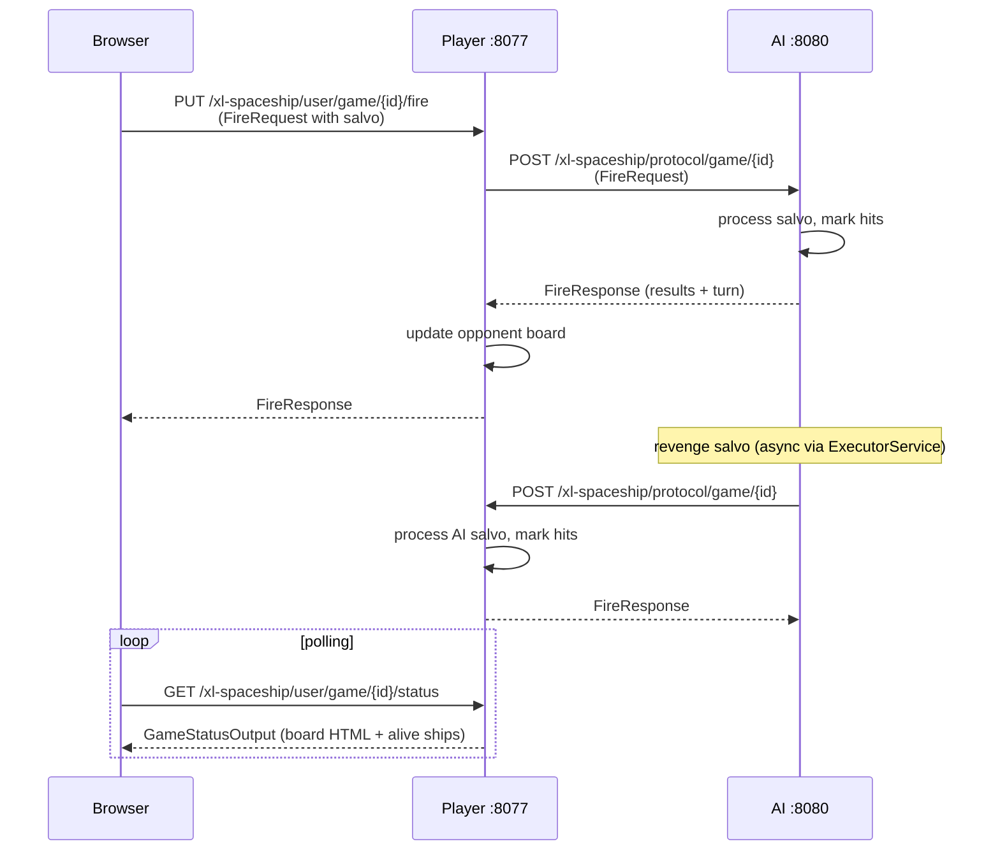

# xlspaceship-architecture

[Back to xlspaceship](README.md)

## Contents
1. [Goal](#1-goal)
2. [Module Map](#2-module-map)
3. [Deployment Model](#3-deployment-model)
4. [Game Flow](#4-game-flow)
5. [Grid and Coordinate System](#5-board-and-coordinate-system)
6. [Ship Types](#6-ship-types)
7. [AI Strategy](#7-ai-strategy)
8. [Layering](#8-layering)
9. [Frontend](#9-frontend)
10. [Testing Strategy](#10-testing-strategy)
11. [Current Tradeoffs](#11-current-tradeoffs)

## 1. Goal
[Back to top](#xlspaceship-architecture)

XL-Spaceship is a two-player battleship game where a human player competes against an AI.
The architecture separates game logic from the web tier and uses HTTP as the protocol between two independently running Spring Boot instances.

## 2. Module Map
[Back to top](#xlspaceship-architecture)

| Module | ArtifactId | Responsibility | Depends on |
|---|---|---|---|
| `engine` | `xlspaceship-engine` | Game logic, board, ships, AI, models | Spring AOP only |
| `server` | `xlspaceship-server` | Controllers, Thymeleaf views, static assets, Spring Boot app | `xlspaceship-engine` |

`engine` has no Spring Web dependency and could be reused in a different delivery mechanism (CLI, desktop, etc.).

## 3. Deployment Model
[Back to top](#xlspaceship-architecture)

The same JAR is deployed as **two separate JVM instances**:

| Instance | Port | Mode | Started by |
|---|---|---|---|
| Player | 8077 | Human — serves UI, accepts browser input | `run.sh` (with userId + fullName args) |
| AI | 8080 | AI — headless, auto-fires revenge salvos | `runAI.sh` (no args) |

The application detects its mode from command-line arguments:
- **With args** (`userId`, `fullName`) → human player mode
- **Without args** → AI mode (`LocalPlayerService.setUpAI()`)

## 4. Game Flow
[Back to top](#xlspaceship-architecture)

### Game creation

### Turn cycle

### Salvo rules

- Each turn a player fires **N shots**, where N = number of opponent's **alive ships**
- Shots use hex coordinates: `"0x0"` to `"FxF"` on a 16x16 board
- Results per shot: `miss`, `hit`, or `kill` (last cell of a ship destroyed)

## 5. Grid and Coordinate System
[Back to top](#xlspaceship-architecture)

- Grid size: **16x16** cells
- Coordinates: hexadecimal notation — row `0`–`F`, column `0`–`F` (e.g., `"8x4"`, `"AxB"`)
- Cell values:
  - `*` — ship segment (own board)
  - `-` — miss
  - `X` — hit / damaged
  - `.` — unknown (opponent board)

## 6. Ship Types
[Back to top](#xlspaceship-architecture)

Each game places 5 ships randomly on the board. Ships have multiple rotation variants (forms).

| Ship | Size (WxH) | Forms | Health |
|---|---|---|---|
| BClass | 3x5 | 4 | 10 |
| Winger | 3x5 | 2 | 9 |
| SClass | 4x5 | 2 | 8 |
| AClass | 3x4 | 4 | 8 |
| Angle | 3x4 | 4 | 6 |

Ship placement:
1. A random form variant is selected.
2. A random position is tried (up to 20 attempts).
3. Collision detection checks surrounding cells as a buffer zone.
4. If random placement fails, an iterative brute-force search finds the first valid position.

## 7. AI Strategy
[Back to top](#xlspaceship-architecture)

`AiTurnService` implements the AI shooting logic:

1. **Smart targeting:** scan the board for damaged cells (`X`). For each damaged cell, try all 8 adjacent directions. Prioritize cells next to existing hits.
2. **Random fallback:** if no damaged cells found, pick random coordinates (up to 30 attempts).
3. **Brute-force fallback:** if random attempts fail, iterate the entire board for the first valid target.

AI fires are executed **asynchronously** via an `ExecutorService` (10-thread pool) to prevent blocking the HTTP response to the player's salvo.

## 8. Layering
[Back to top](#xlspaceship-architecture)

### Engine module (`xlspaceship-engine`)

| Package | Responsibility |
|---|---|
| `engine.model` | Request/response DTOs: `FireRequest`, `FireResponse`, `NewGameRequest`, `NewGameResponse`, `GameStatusOutput`, `ErrorResponse`, `SpaceshipProtocol` |
| `engine.game` | Game state: `Cell`, `Grid`, `GameStatus`, `GridStatus`, `GameTurn` |
| `engine.game.ships` | Ship hierarchy: `Spaceship` (abstract), `AClass`, `BClass`, `SClass`, `Winger`, `Angle` |
| `engine.service` | `GameSessionService`, `AiTurnService`, `LocalPlayerService`, `GameSetupService`, `GridFactory`, `GridHtmlRenderer`, `RemoteGameClient`, `RandomProvider` |

### Server module (`xlspaceship-server`)

| Package | Responsibility |
|---|---|
| `web` | `Application` entry point |
| `web.controller` | `UserController`, `ProtocolController`, `MVCController`, `HealthCheckController` |
| `web.http` | `ApiPaths`, `ErrorResponses` |
| `web.service` | `GameRequestValidationService` |
| `web.model` | `Pilot` |

## 9. Frontend
[Back to top](#xlspaceship-architecture)

| File | Purpose |
|---|---|
| `index.html` | New game form — pilot info + opponent host/port input |
| `game.html` | Game play — two grids (own + opponent), turn info, ship count |
| `index.js` | AJAX game creation |
| `game.js` | Click handling, salvo firing, status polling, board updates |
| `ajax-errors.js` | Shared AJAX error handling (`window.xlAjax`) |
| `game.css` | Grid cell styling (empty, ship, shot, sunk) |
| `bootstrap.min.css` | Bootstrap framework |

JavaScript tests (`game.test.js`, `index.test.js`) run via `frontend-maven-plugin` (Node + npm) during the Maven `test` phase.

## 10. Testing Strategy
[Back to top](#xlspaceship-architecture)

### Engine module

| Test class | Covers |
|---|---|
| `GridTest` | Grid setup, ship placement, collision detection |
| `WingerTest` | Ship shape variants |
| `AiTurnServiceTest` | AI targeting logic |
| `GridFactoryTest` | Grid generation with random ships |
| `GridHtmlRendererTest` | HTML table rendering from board state |
| `LocalPlayerServiceTest` | Player/AI initialization |

### Server module

| Test class | Covers |
|---|---|
| `ProtocolControllerTest` | Protocol API endpoints |
| `UserControllerTest` | User API endpoints |
| `MVCControllerTest` | Thymeleaf view rendering |
| `ApplicationTest` | Spring Boot startup |
| `GameRequestValidationServiceTest` | HTTP input validation |

Test configuration:
- `MocksConfiguration` (`@Profile("test")`) mocks `RandomProvider` for deterministic results

### JavaScript tests

- `game.test.js`, `index.test.js` — run via npm during Maven `test` phase

## 11. Current Tradeoffs
[Back to top](#xlspaceship-architecture)

- Game state is stored **in-memory** (`ConcurrentHashMap`) — lost on restart
- AI fires asynchronously, browser must **poll** to detect AI moves
- No persistent storage — no game history or replay
- Both instances use the **same JAR** — mode is determined by command-line arguments
- Grid size is hardcoded to **16x16**
- Ship placement is random with no guarantee of optimal distribution
- `GameRequestValidationService` uses **synchronized blocks** for concurrency control rather than fine-grained locks
