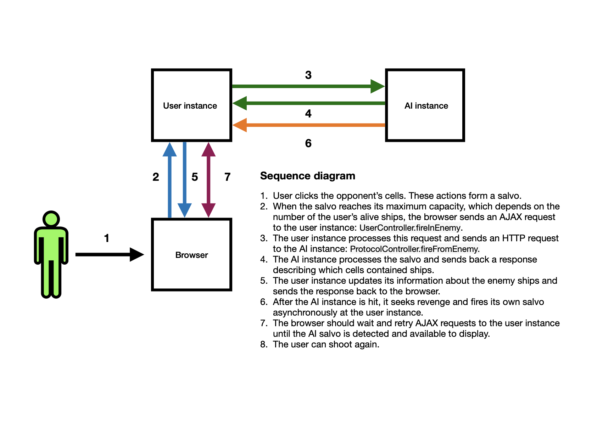
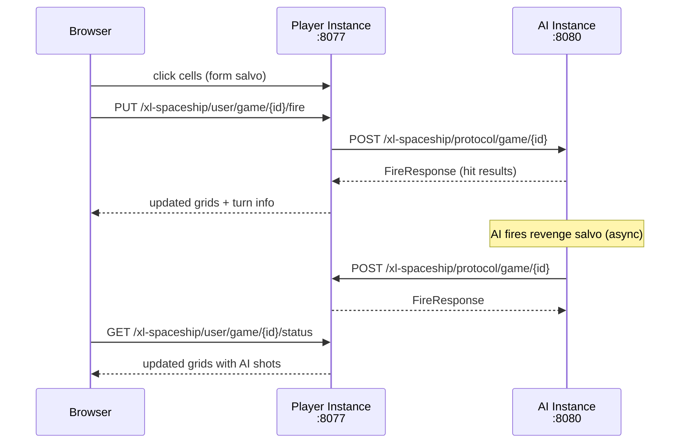

# XL-Spaceship

A battleship-style guessing game where you play against an AI opponent.
Two Spring Boot instances communicate over REST — one for the human player, one for the AI.

**Originally created in 2017.**

**Stack:** Java 25, Spring Boot, Spring MVC, Thymeleaf, JQuery/AJAX, Swagger/OpenAPI

---

**Sub-modules:** [engine](engine/) · [server](server/)

| Sub-module | ArtifactId | Responsibility |
|---|---|---|
| [engine](engine/) | `xlspaceship-engine` | Game logic, board, ships, AI, models — no Spring Web dependency |
| [server](server/) | `xlspaceship-server` | Spring Boot app — controllers, HTTP validation, Thymeleaf views, static JS/CSS |

---

## Contents
1. [How It Works](#1-how-it-works)
2. [Architecture](#2-architecture)
3. [Game Rules](#3-game-rules)
4. [Build and Test](#4-build-and-test)
5. [Run](#5-run)
6. [Swagger UI](#6-swagger-ui)
7. [REST Endpoints](#7-rest-endpoints)

---

## 1. How It Works
<sub>[Back to top](#xl-spaceship)</sub>

The game runs as **two separate JVM instances** on different ports:

- **Player instance** — serves the browser UI, handles human input
- **AI instance** — runs headless, responds to protocol calls and fires back automatically

The browser communicates with the player instance via AJAX.
The player instance communicates with the AI instance via REST (the protocol API).
After the AI is fired upon, it asynchronously fires its revenge salvo back at the player instance.



### Sequence step-by-step

1. User clicks opponent cells in the browser to form a salvo.
2. Browser sends the salvo to the player instance (`UserController.fireInEnemy`).
3. Player instance forwards the salvo to the AI instance (`ProtocolController.fireFromEnemy`).
4. AI instance processes the salvo and returns which cells were hit.
5. Player instance updates opponent board and sends the response to the browser.
6. AI fires its own salvo back asynchronously to the player instance.
7. Browser polls the player instance until the AI salvo is detected and displayed.
8. User shoots again.

---

## 2. Architecture
<sub>[Back to top](#xl-spaceship)</sub>

Detailed architecture: [ARCHITECTURE.md](ARCHITECTURE.md)



---

## 3. Game Rules
<sub>[Back to top](#xl-spaceship)</sub>

- **Grid:** 16x16 using hexadecimal coordinates (`0x0` to `FxF`)
- **Ships:** 5 types with different shapes and health points
  - BClass (10hp), Winger (9hp), SClass (8hp), AClass (8hp), Angle (6hp)
- **Salvo mechanic:** each turn you fire N shots, where N = number of opponent's alive ships
- **Win condition:** destroy all 5 opponent ships
- **Starting player:** randomly selected at game creation

---

## 4. Build and Test
<sub>[Back to top](#xl-spaceship)</sub>

```bash
# build everything
mvn -pl xlspaceship -am clean package

# run engine tests only
mvn -pl xlspaceship/engine test

# run server tests only (includes JS tests via frontend-maven-plugin)
mvn -pl xlspaceship/server test
```

The server module uses `frontend-maven-plugin` to download Node/npm locally and run JavaScript tests during the Maven `test` phase. The first build requires network access.

---

## 5. Run
<sub>[Back to top](#xl-spaceship)</sub>

Start both instances from the `xlspaceship/` directory:

**Player instance** (port 8077, human mode):
```bash
./run.sh
```
```bash
java -jar -Dspring.application.name=xlspaceship-player -Dserver.port=8077 \
  server/target/xl.jar nikilipa "Nikita Lipatov"
```

**AI instance** (port 8080, AI mode):
```bash
./runAI.sh
```
```bash
java -jar -Dspring.application.name=xlspaceship-ai -Dserver.port=8080 \
  server/target/xl.jar
```

When no command-line arguments are provided, the application starts in AI mode automatically.

Open the game in a browser: `http://localhost:8077`

---

## 6. Swagger UI
<sub>[Back to top](#xl-spaceship)</sub>

Available on both instances:

| Instance | URL                                           |
|----------|-----------------------------------------------|
| IDEA     | `http://localhost:8079/swagger-ui/index.html` |
| Player   | `http://localhost:8077/swagger-ui/index.html` |
| AI       | `http://localhost:8080/swagger-ui/index.html` |

Endpoints are sorted alphabetically (`tagsSorter: alpha`, `operationsSorter: alpha`).

---

## 7. REST Endpoints
<sub>[Back to top](#xl-spaceship)</sub>

### User API — browser-facing (`/xl-spaceship/user`)

| Method | Path | Description |
|---|---|---|
| `POST` | `/game/new` | Create a new game against a remote opponent |
| `GET` | `/game/{gameId}` | Get game status by gameId |
| `POST` | `/game/{gameId}/rematch` | Create a rematch against the previous opponent |
| `PUT` | `/game/{gameId}/fire` | Fire a salvo at the opponent |
| `GET` | `/game/{gameId}/status` | Get current game status (board HTML + alive ships) |

### Protocol API — instance-to-instance (`/xl-spaceship/protocol`)

| Method | Path | Description |
|---|---|---|
| `POST` | `/game/new` | Accept a new game request from a remote instance |
| `POST` | `/game/{gameId}` | Accept an incoming salvo from the opponent |

### MVC — Thymeleaf pages (`/`)

| Method | Path | Description |
|---|---|---|
| `GET` | `/` | New game form (index page) |
| `GET` | `/gameId/{gameId}` | Game play page |

### Health (`/health`)

| Method | Path | Description |
|---|---|---|
| `GET` | `/health` | Health check |
