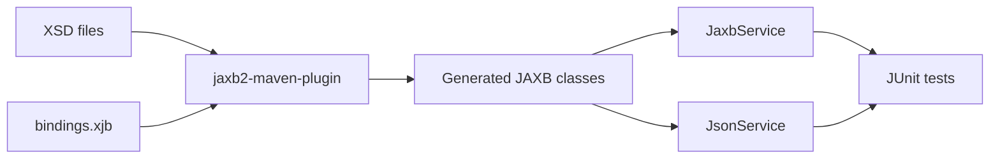

# xsd2model

Demonstrates XSD-to-Java code generation with JAXB and round-trip serialization to both XML and JSON.

**Stack:** Jakarta JAXB, Jackson, jaxb2-maven-plugin, build-helper-maven-plugin

---

## Contents
1. [Quick Start](#1-quick-start)
2. [What It Does](#2-what-it-does)
3. [Module Map](#3-module-map)

---
## 1. Quick Start
<sub>[Back to top](#xsd2model)</sub>

Run the module tests and trigger XSD-to-Java generation with:

```bash
mvn -pl xsd2model -am test
```

Main generated output:

- `target/generated-classes/org/xsd2model/model/`

Reference docs:

- [README.md](README.md)
- [pom.xml](pom.xml)

---

## 2. What It Does
<sub>[Back to top](#xsd2model)</sub>

- Generates Java POJOs from three XSD schema files at build time
- Provides `JaxbService` for type-safe XML marshal/unmarshal
- Provides `JsonService` for JSON serialization via Jackson
- Tests round-trip conversion: Object → XML → Object → XML and Object → JSON → Object → JSON

---

## 3. Module Map
<sub>[Back to top](#xsd2model)</sub>



---
